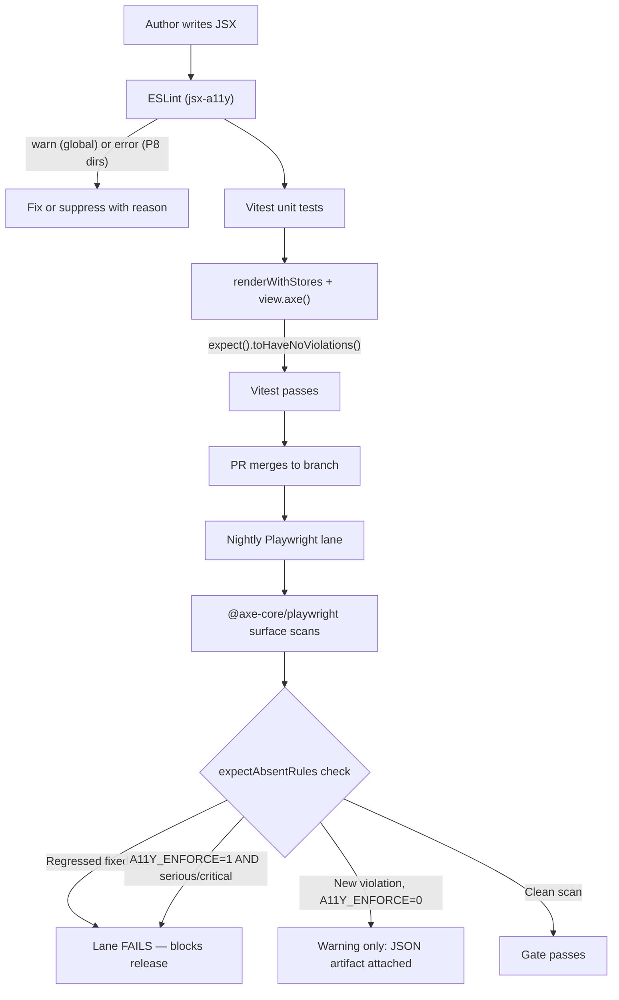
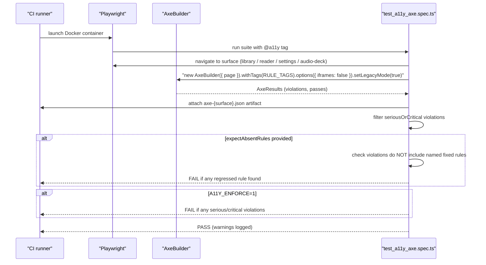
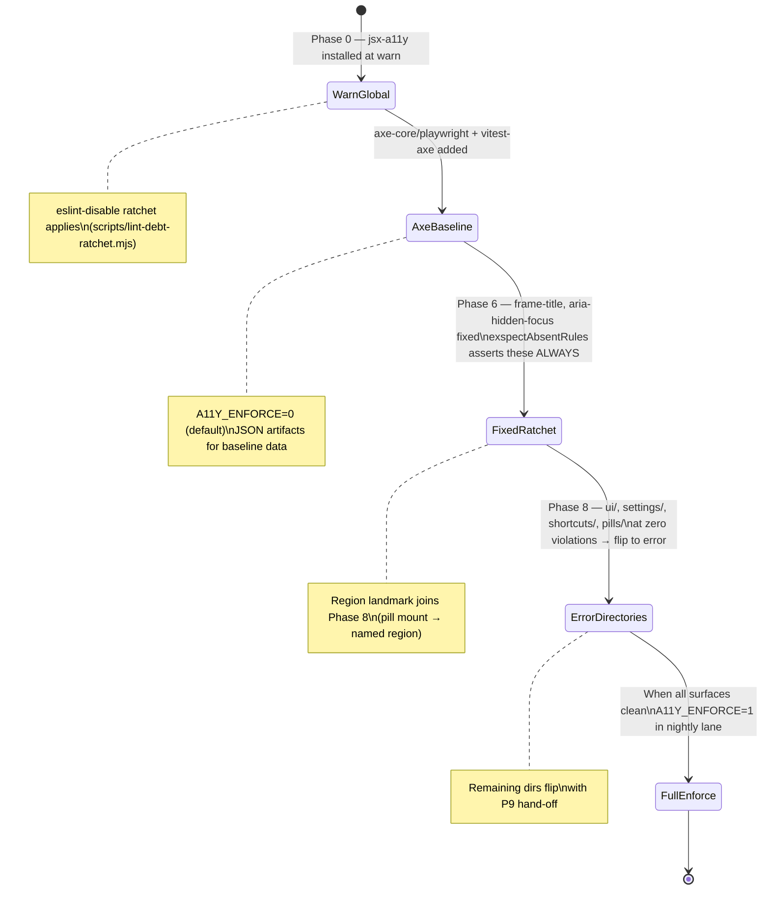

# Accessibility

Versicle's accessibility architecture underwent a comprehensive overhaul across the Phase 0–9 program. The starting state — documented in [plan/overhaul/analysis/gap-accessibility-keyboard-screen-.md](../../plan/overhaul/analysis/gap-accessibility-keyboard-screen-.md) — was characterised as "good per-widget ARIA hygiene but zero app-level accessibility architecture": two conflicting keyboard registries, no live-announcement channel, focusable controls hidden inside `aria-hidden`, a hardcoded `lang="en"` on a Chinese-language reading app, and no automated verification. This document describes the architecture that replaced it.

The guiding principle, articulated in the gap analysis, is: **accessibility as four shared services and contracts baked into primitive APIs, enforced by tooling — not per-component goodwill.** Every section below traces one of those services or contracts from its design motivation through to its concrete implementation and the verification gates that keep it from regressing.

Related documents: [Architecture overview](10-architecture-overview.md), [UI design system](40-ui-design-system.md), [Testing strategy](63-testing-strategy.md), [E2E verification](64-e2e-verification.md), [CI and quality gates](65-ci-and-quality-gates.md), [Internationalization](71-internationalization.md), [Reader UI and overlays](31-reader-ui-and-overlays.md), [Domain: TTS engine](32-domain-audio-tts-engine.md).

---

## Design intent

The gap analysis identified twelve distinct accessibility debts, ranging from a P0-critical keyboard conflict (two independent `window.addEventListener('keydown')` registries fighting over the same key bindings) to medium-severity issues such as an unowned motion layer and fake tab implementations invisible to screen readers. The overhaul's response was to avoid fixing these one at a time and instead build four shared infrastructure pieces that make the correct behaviour the default:

1. **`KeyboardShortcutService`** — a single window keydown listener with a declarative, scope-stacked registration API that makes conflicting registrations structurally impossible and collision a dev-mode error.
2. **`LiveAnnouncer` + `announce()`** — two persistent visually-hidden live regions in `RootLayout`, fed by a non-React pub/sub channel, so stores and services can announce state transitions without touching the DOM directly.
3. **`applyDocumentLanguage()`** — dynamically sets `document.documentElement.lang` from the resolved UI locale at boot, and a `lang=` prop contract on every component that renders book-derived text, sourced from `book.language`.
4. **`useReducedMotion()` + global CSS policy** — a `@media (prefers-reduced-motion: reduce)` override in `index.css` collapses CSS animations; the hook makes the same signal available to JavaScript-driven motion such as the TTS-queue follow-scroll.

These four services are enforced by a three-layer verification stack:

- **Layer 1:** `eslint-plugin-jsx-a11y` in `eslint.config.js` (at `warn` globally, flipped to `error` for the directories rewritten by Phase 8).
- **Layer 2:** `vitest-axe` integrated into the shared test harness, providing an `.axe()` method on every `renderWithStores` result.
- **Layer 3:** `@axe-core/playwright` surface scans of the five core app surfaces in the nightly E2E lane, with a per-rule ratchet that fails CI when any previously-fixed violation reappears.

---

## A11y checkpoint flow

The following diagram shows how a piece of new JSX travels through all three verification layers before it can merge:



---

## Axe-gate pipeline

The Playwright axe pipeline (`verification/test_a11y_axe.spec.ts`) scans five surfaces and applies a two-tier gate:



The `iframes: false` + `setLegacyMode(true)` options are deliberate: epub.js creates and destroys sandboxed blob iframes during section load, and axe's frame injection hangs or throws on them. The `<iframe>` element itself is still audited by the parent-document scan (the `frame-title` rule covers it), but book content accessibility is an explicitly open contract owned by the ReaderShell workstream.

---

## Keyboard shortcut architecture

### The problem that motivated it

Before Phase 8, two independent `window.addEventListener('keydown')` registries ran simultaneously in the reader. `useReaderNavigation` mapped ArrowLeft/ArrowRight to page turns; `ReaderTTSController` mapped the same arrows to TTS sentence jumps when playing, plus Space (play/pause) and Escape (stop). Both were wired to the same `handlePrev`/`handleNext` callbacks in `ReaderView`. The consequences were severe:

- With TTS stopped, one ArrowRight fired `rendition.next()` twice (double page-skip).
- With TTS playing, ArrowRight triggered both a page turn and a sentence jump simultaneously.
- Space would swallow any focused button's own Space activation (`preventDefault` without focus guard).
- Escape stopped TTS even when the user was closing a Radix dialog over the book.
- Arrow keys worked in the iframe (the nav hook also bound the rendition) but Space/Escape silently stopped working there (the TTS controller only bound `window`).

The ESLint ban on `addEventListener('keydown')` outside `src/app/shortcuts/` makes this class of bug structurally impossible: there is one place in the codebase where a keydown listener may be created, and it is not a component file.

### `KeyboardShortcutService`

[src/app/shortcuts/KeyboardShortcutService.ts](../../src/app/shortcuts/KeyboardShortcutService.ts)

The service is a plain TypeScript class (no React, no DOM dependency) instantiated once as the module-scope singleton `keyboardShortcutService`. Its scope stack is:

```
'global' < 'reader' < 'tts-active' < 'overlay'   (top-most wins)
```

Dispatch walks scopes top-down and fires the first registration whose key matches and whose optional `when()` predicate passes. The predicate returning `false` lets lower scopes claim the key; the `tts-active` scope's Arrow registrations have `when: ttsOwnsKeys` which reads `useTTSPlaybackStore.getState().status` — so the TTS sentence-jump owns the arrows exactly while playing or paused, and the reader page-turn gets them back the instant it is not.

```typescript
export interface ShortcutRegistration {
  id: string;                // stable '<owner>.<action>' (diagnostics + help sheet)
  key: string;               // KeyboardEvent.key value
  scope: ShortcutScope;
  when?: () => boolean;      // evaluated at dispatch; false → fall through to lower scope
  handler: (event: KeyboardEvent) => void;
  preventDefault?: boolean;
  descriptionKey?: MessageKey; // omit to hide from the help sheet
}
```

Built-in policies absorbed from the two deleted registries:

| Policy | Implementation |
|---|---|
| No key-repeat spam | `if (event.repeat) return` at the top of `handleKeyEvent` |
| Typing wins over shortcuts | `isTypingTarget()` checks `INPUT`, `TEXTAREA`, `isContentEditable` |
| Space never hijacks a focused button | `event.target.closest('button, a[href], select, summary, [role="button"]')` |
| Escape resolves topmost overlay first | `document.querySelector('[role="dialog"][data-state="open"], …')` before any scope dispatch |
| Dev collision detection | Duplicate `(key, scope)` throws in `import.meta.env.DEV`; logs in production |

### `KeyboardShortcutHost`

[src/app/shortcuts/KeyboardShortcutHost.tsx](../../src/app/shortcuts/KeyboardShortcutHost.tsx)

The component that mounts the single `window.addEventListener('keydown', onKeyDown)` and registers the global `?` shortcut that opens the auto-generated help sheet. Mounted once by `RootLayout`. The ESLint `no-restricted-syntax` rule banning `addEventListener('keydown')` has a carve-out only for `src/app/shortcuts/**` — every other directory is prohibited.

### `useShortcut`

[src/app/shortcuts/useShortcut.ts](../../src/app/shortcuts/useShortcut.ts)

The React binding hook. Registers on mount, unregisters on unmount. Handler and `when` predicate stay fresh via refs, so callers pass inline closures without re-registering (and without triggering the dev collision error) on every render. Re-registers only when the registration identity changes (`id`, `key`, `scope`, `preventDefault`, `descriptionKey`, `hasWhen`).

### Reader shortcut registrants

[src/app/shortcuts/readerShortcuts.ts](../../src/app/shortcuts/readerShortcuts.ts)

Three hooks replace the two deleted window registries:

- **`useReaderPageTurnShortcuts`** — `ArrowLeft`/`ArrowRight` at `scope: 'reader'`, no `when` predicate (they apply whenever the reader is mounted and no higher scope claims them).
- **`useTtsPlaybackShortcuts`** — `ArrowLeft`/`ArrowRight` (sentence jump), `' '` (play/pause), `Escape` (stop), all at `scope: 'tts-active'` with `when: ttsOwnsKeys`. The arrows win over the reader scope while playing or paused; they stand down the moment TTS is stopped or idle.
- **`useReaderEngineKeyBridge`** — forwards the engine's `'keydown'` port event into `keyboardShortcutService.handleKeyEvent()`. This is the single iframe bridge: keys pressed with focus inside the book text flow through exactly the same dispatch path as window keys, so all scope policies apply identically.

### Shortcut help sheet

[src/app/shortcuts/ShortcutHelpSheet.tsx](../../src/app/shortcuts/ShortcutHelpSheet.tsx)

Opened by `?` (`global.help` registration). Uses `useSyncExternalStore` against `keyboardShortcutService.subscribe` to stay current as registrations change. Only shows registrations that carry a `descriptionKey` — registering a shortcut also documents it; there is no second list to get out of sync.

---

## Live-announcement channel

### The problem

Before Phase 8 the app had approximately 30 scattered `aria-live` usages, nearly all hand-rolled `sr-only` spans in individual components. The core interaction — TTS play/pause/stop — had no live region connected to it. `aria-pressed`/`aria-label` swaps on the pill are re-read only while that element holds focus; a blind user who pressed Space to pause had no confirmation that the audio stopped. The `Toast.tsx` at the time mounted its `role="status"` region together with its content — a pattern that assistive technologies commonly miss because the region did not pre-exist in the DOM.

### `announce()` + `subscribeAnnouncements()`

[src/kernel/locale/announcer.ts](../../src/kernel/locale/announcer.ts)

A pure TypeScript pub/sub module — no React, no DOM — so stores, services, and the TTS adapter can call `announce()` from anywhere, including effects and store subscribers. The function accepts either a typed `MessageInput` (from the i18n message catalog) or a plain string for transitional call sites:

```typescript
export function announce(
  content: MessageInput | string,
  opts: { assertive?: boolean } = {},
): void {
  const announcement: Announcement = {
    id: nextId++,          // monotonic — lets the region re-announce identical text
    text: resolveMessage(content),
    assertive: !!opts.assertive,
  };
  for (const listener of listeners) listener(announcement);
}
```

The `id` counter solves the "identical text does not re-announce" problem: the `LiveAnnouncer` clears and re-sets the region text even when the announcement message is the same as the last one.

### `LiveAnnouncer`

[src/components/ui/LiveAnnouncer.tsx](../../src/components/ui/LiveAnnouncer.tsx)

The DOM outlet: two persistently-mounted `sr-only` divs, one `role="status" aria-live="polite"` and one `role="alert" aria-live="assertive"`. The key detail is "persistently mounted" — both divs are always in the DOM, even when empty. Content is injected into a pre-existing region; a region created together with its content is a pattern that screen readers frequently fail to announce.

The re-announcement "nudge" pattern:

1. Clear the region content immediately (`set('')`).
2. In `requestAnimationFrame`, write the new text.
3. After 10 seconds, clear again so stale text is not re-read when the user walks the accessibility tree later.

```typescript
const unsubscribe = subscribeAnnouncements((announcement) => {
  const set = announcement.assertive ? setAssertive : setPolite;
  set('');
  cancelAnimationFrame(raf);
  raf = requestAnimationFrame(() => {
    set(announcement.text);
    clearTimer.current = setTimeout(() => set(''), 10_000);
  });
});
```

### `TtsAnnouncements`

[src/components/TtsAnnouncements.tsx](../../src/components/TtsAnnouncements.tsx)

A headless component mounted once in `RootLayout` that subscribes to `useTTSPlaybackStore` and `useReaderUIStore` and calls `announce()` on state transitions. Critical design constraints:

- **Never per-sentence.** The subscription reads only `status` and `currentSectionTitle`; `currentIndex` and `activeCfi` are deliberately not observed. A per-sentence announcement would be disruptive, overriding the actual TTS audio.
- **Debounced section changes while playing.** Section title changes during playback are debounced by 1000 ms before announcing (to avoid a flurry of announcements during a jump); paused/stopped section changes are silent (the user is navigating visually).
- **Status-transition filtering.** A `stopped` announcement is only emitted when transitioning from `playing` or `paused` — not from `idle` or `loading`, which would produce spurious "Stopped" announcements at boot.

```typescript
if (state.status === 'playing') {
  announce({ key: 'announce.tts.playing', params: { section: sectionLabel() } });
} else if (state.status === 'paused') {
  announce('announce.tts.paused');
} else if (state.status === 'stopped' && (previous === 'playing' || previous === 'paused')) {
  announce('announce.tts.stopped');
}
```

### `ToastHost` live regions

[src/components/ToastHost.tsx](../../src/components/ToastHost.tsx)

The rewritten toast stack (Phase 8 §D) applies the same persistent-region principle. The host renders two persistent containers — `role="status" aria-live="polite"` for info/success toasts and `role="alert" aria-live="assertive"` for errors — and injects toast content into them. The `Toast` component itself carries no live-region semantics; it is purely presentational content injected into the host's pre-existing regions.

The queue model (replacing the single-slot `useToastStore`) means a second `showToast` call no longer overwrites an unread first message — both toasts stack in their respective regions.

Timer behaviour was corrected to respect keyboard users: `Toast.tsx` now pauses its auto-dismiss timer on `onFocus` and resumes only when focus leaves the toast entirely (the `onBlur` / `e.currentTarget.contains(e.relatedTarget)` pattern), matching the existing `onMouseEnter` hover pause.

---

## Language attribution

### The two-locale rule

The gap analysis identified hardcoded `lang="en"` on `<html>` as a high-severity bug. For an app whose headline feature is Chinese-language reading with synthesized speech, English pronunciation rules on all content makes the vocabulary study and reading surface unusable with a screen reader.

The fix in Phase 8 §F is governed by the "two-locale rule" (documented in [docs/adr/0001-i18n-strategy.md](../../docs/adr/0001-i18n-strategy.md)):

- **UI locale** governs chrome: `document.documentElement.lang`, formatter output, collation.
- **Content locale** (`book.language`) governs book-derived text: segment boundaries, TTS voice selection, pinyin/OpenCC, and `lang=` attributes on book-text elements.

The two must not substitute for each other.

### `applyDocumentLanguage()`

[src/kernel/locale/uiLocale.ts](../../src/kernel/locale/uiLocale.ts)

Called once by `registerAppBootTasks()` during the boot sequence. Reads the resolved UI locale (localStorage override → `navigator.language` → `'en'`) and writes it to `document.documentElement.lang`. Subscribes `onUILocaleChange` to keep the attribute current if the locale changes at runtime. The static `lang="en"` in `index.html` remains as a pre-boot default.

### Content `lang=` attributes

The `book.language` field (from `BookMetadata`) is threaded through every component that renders book-derived text. The following surfaces were identified in the gap analysis and fixed in their respective phase workstreams:

| Component | Surface | `lang=` attribute |
|---|---|---|
| [BookCard.tsx](../../src/components/library/BookCard.tsx) | Title `<h3>`, author `<p>` | `lang={book.language}` |
| [BookListItem.tsx](../../src/components/library/BookListItem.tsx) | Title `<h3>`, author `<span>` | `lang={book.language}` |
| [TTSQueueItem.tsx](../../src/components/reader/TTSQueueItem.tsx) | Sentence `<p>` | `lang={contentLang}` (prop from `book.language`) |
| [TOCPanel.tsx](../../src/components/reader/panels/TOCPanel.tsx) | Chapter label `<span>` | `lang={contentLang}` |
| [AnnotationList.tsx](../../src/components/reader/AnnotationList.tsx) | Excerpt `<p>` | `lang={contentLang}` |
| [AnnotationCard.tsx](../../src/components/notes/AnnotationCard.tsx) | Excerpt | `lang={contentLang}` |
| [BookNotesBlock.tsx](../../src/components/notes/BookNotesBlock.tsx) | Block wrapper `<div>` | `lang={book?.language}` |
| [VocabTriageCard.tsx](../../src/components/chinese/VocabTriageCard.tsx) | Character display `<div>` | `lang="zh"` (hardcoded — always Chinese content) |

The enforcement is process-level rather than compile-time: the i18n ADR names book-text-rendering components as a review checklist item, and the `eslint-plugin-jsx-a11y` `lang` rule catches the `<html>` case at the document level. The gap analysis entry "book text never renders without `lang`" is the acceptance criterion for each phase workstream that touches these components.

---

## ARIA landmark architecture

### Reader surface landmarks

The legacy `ReaderView.tsx` had a landmark gap that the axe `region` rule reported: significant reader-surface content lived outside any ARIA landmark. The Phase 6 ReaderShell decomposition fixed this structurally:

```tsx
// ReaderShell.tsx
<main aria-label="Book" className="flex-1 relative overflow-hidden flex justify-center">
  {/* All book-content children */}
</main>
```

The `<header>` element in [ReaderChrome.tsx](../../src/components/reader/shell/ReaderChrome.tsx) provides the `banner` landmark. The CompassPill dissolution (Phase 8 §C) left the pill mount (`ReaderControlBar`) outside the route's two main landmarks; it was given an explicit `role="region" aria-label="Quick actions"` to close the last `region` axe finding on the reader surface:

```tsx
// ReaderControlBar.tsx
<div
  role="region"
  aria-label="Quick actions"
  className="fixed bottom-8 left-0 right-0 z-40 …"
>
```

The axe spec (`test_a11y_axe.spec.ts`) asserts `region` as a fixed rule on the reader surface — any regression fails the nightly lane outright.

### iframe title

[src/domains/reader/engine/EpubJsEngine.ts](../../src/domains/reader/engine/EpubJsEngine.ts)

The gap analysis identified the unnamed epub.js iframe as a high-severity issue: the central reading element had no accessible name. The fix runs inside the epub.js `content` hook (registered via `rendition.hooks.content.register`) at content-render time, after the iframe is constructed but before the first paint:

```typescript
rendition.hooks?.content?.register?.((contents: Contents) => {
  try {
    const iframe = contents.window?.frameElement as HTMLIFrameElement | null;
    if (iframe && !iframe.getAttribute('title')) {
      const title = this.deps.book?.packaging?.metadata?.title;
      iframe.setAttribute('title', typeof title === 'string' && title ? title : 'Book content');
    }
  } catch { /* best effort */ }
  this.emit({ type: 'contentRendered', view: this.toContentView(contents) });
});
```

The `if (!iframe.getAttribute('title'))` guard prevents overwriting a title that was already set (e.g. in a re-render scenario). The fallback `'Book content'` ensures the rule is satisfied even for EPUBs with missing metadata. The axe spec asserts `frame-title` as fixed on the reader surface.

---

## Overlay accessibility contract

### `ReaderOverlay`

[src/domains/reader/ui/ReaderOverlay.tsx](../../src/domains/reader/ui/ReaderOverlay.tsx)

Before Phase 6, the six overlay systems (TTS highlights, color highlights, history highlights, pinyin portal, note-marker portal, debug analysis) had inconsistent accessibility treatment. `PinyinOverlay` was correctly `aria-hidden`, but `AnnotationMarkerOverlay` put focusable `<button>` elements inside a wrapper with `aria-hidden="true"` — an axe `aria-hidden-focus` serious violation. Interactive buttons are unreachable by assistive technology when inside an `aria-hidden` container; the `aria-label` on those buttons was wasted.

`ReaderOverlay` mechanically enforces a binary contract via its `mode` prop:

```typescript
type ReaderOverlayProps =
  | { mode: 'decorative'; label?: undefined; … }
  | { mode: 'interactive'; label: string; … };
```

- **`decorative`**: the container gets `aria-hidden="true"` and `pointer-events: none`. No children may be interactive. `PinyinOverlay` uses this mode — pinyin annotations are visual aids, not focusable controls.
- **`interactive`**: the container gets `role="group" aria-label={label}` and `pointer-events: none` on the container (children opt into `pointer-events: auto`). Focusable children are never inside an `aria-hidden` wrapper. `AnnotationMarkerOverlay` uses this mode.

The TypeScript discriminated union makes it a compile-time error to use `mode="interactive"` without supplying a `label`, and impossible to put interactive children into a `decorative` overlay (by convention enforced by code review and the axe harness).

### Note markers after the fix

```tsx
// AnnotationMarkerOverlay.tsx — interactive mode
<ReaderOverlay mode="interactive" label="Annotation notes" containerNode={containerNode} className="z-10">
  {markers.map(marker => (
    <button
      key={marker.id}
      aria-label={`Note: ${marker.note}`}
      …
    >
```

The outer container is now a named group (`role="group" aria-label="Annotation notes"`), not `aria-hidden`. Each button's `aria-label` is now reachable by assistive technology. The axe spec asserts `aria-hidden-focus` as fixed on the reader surface.

---

## Focus management

### Pill variant morphing

The original `CompassPill` was remounted on every variant change via `key={variant}` in `ReaderControlBar`. This dropped keyboard focus to `<body>` mid-interaction — for example, pressing Tab into the pill to add a note, which morphed the pill to the note editor, would lose focus.

The Phase 8 `ReaderControlBar` rewrite removes the `key` entirely. Variants morph by re-render, not remount. Focus management is event-driven:

```typescript
const pillHadFocusRef = useRef(false);
useEffect(() => {
  if (variant === prevVariantRef.current) return;
  prevVariantRef.current = variant;
  const region = pillRegionRef.current;
  if (pillHadFocusRef.current && region && !region.contains(document.activeElement)) {
    region
      .querySelector<HTMLElement>('button, [role="button"], [tabindex="0"], textarea')
      ?.focus();
  }
}, [variant]);
```

The flag `pillHadFocusRef` is set on the `onFocus` event of the pill region and cleared on `onBlur` only when focus truly leaves the region (relying on `e.relatedTarget` — a `null` relatedTarget means focus was destroyed by an unmount, and the flag is kept so the morph effect can restore it on the next variant render).

### Radix-backed overlays

The gap analysis noted that TOC/annotations/search sidebars were "bare absolutely-positioned divs toggled by a Zustand store — opening moves focus nowhere, Escape doesn't close them." The Phase 8 rewrite integrates these with Radix Sheet (`UnifiedAudioPanel` is already `<Sheet>`) and Popover (visual settings is `<Popover>`), which provide focus trapping, Escape handling, and focus restoration for free. The `useSidebarState` hook drives the sidebars through the Radix `open`/`onOpenChange` prop pair.

### Immersive mode exit

[src/components/reader/shell/ReaderChrome.tsx](../../src/components/reader/shell/ReaderChrome.tsx)

When immersive mode is active, the normal header is unmounted. The replacement is a single `aria-label="Exit Immersive Mode"` button with `data-testid="reader-immersive-exit-button"`. This preserves a keyboard entry point for exiting immersive mode without requiring the user to Tab through all content to find a control.

---

## The jsx-a11y lint gate

### Configuration

[eslint.config.js](../../eslint.config.js)

`eslint-plugin-jsx-a11y` (`^6.10.2`) is installed and active. The global base config registers the plugin and applies its recommended preset at `warn` severity using `downgradeToWarn`:

```javascript
const downgradeToWarn = (rules) =>
  Object.fromEntries(
    Object.entries(rules).map(([name, entry]) => [
      name,
      Array.isArray(entry) ? ['warn', ...entry.slice(1)] : 'warn',
    ]),
  );
// …
rules: {
  // a11y baseline (Phase 0): recommended preset, everything at warn.
  ...downgradeToWarn(jsxA11y.flatConfigs.recommended.rules),
```

The comment explains the rationale: "new rule sets land at `warn` until the repo is clean, then flip to `error`." Warnings generate findings but do not fail CI; they are the ratchet entry point.

### Phase 8 flip to `error`

At the end of Phase 8 — when the redesigned directories were at zero jsx-a11y violations — the rules were flipped to full `error` for those directories:

```javascript
// eslint.config.js (last block)
{
  files: [
    'src/components/ui/**/*.{ts,tsx}',
    'src/app/settings/**/*.{ts,tsx}',
    'src/app/shortcuts/**/*.{ts,tsx}',
    'src/components/reader/pills/**/*.{ts,tsx}',
    'src/components/sync/**/*.{ts,tsx}',
    'src/components/chinese/**/*.{ts,tsx}',
  ],
  ignores: ['src/**/*.test.{ts,tsx}'],
  rules: {
    ...jsxA11y.flatConfigs.recommended.rules,
  },
},
```

These directories had zero warnings at the flip time; the ratchet comment in `plan/overhaul/README.md` §4 rule 3 records this: "jsx-a11y at error only for the P8 directories (rest warn). … Remaining directories flip with P9 (prep §Hand-offs)."

### The keydown lint ban

The accessibility-relevant `no-restricted-syntax` selector for `addEventListener('keydown')`:

```javascript
const keydownListenerSelector = {
  selector:
    "CallExpression[callee.property.name='addEventListener'] > Literal[value='keydown']",
  message:
    "addEventListener('keydown') is banned outside src/app/shortcuts/ " +
    "(Phase 8 §E): register shortcuts on the KeyboardShortcutService via " +
    "useShortcut() — scope stacking replaces ad-hoc cross-listener predicates.",
};
```

This selector fires at `error` level in all production `src/**` files, with a carve-out only for `src/app/shortcuts/**`. Test files are exempt (they use `fireEvent` which drives the real listener, not adds a new one). The native `alert()`/`confirm()`/`prompt()` bans (`no-alert`, `no-restricted-globals`) are also relevant to accessibility — native dialogs are not screen-reader friendly; both are at `error` with zero exceptions.

---

## Vitest axe integration (layer 2)

### `src/test/harness/axe.ts`

[src/test/harness/axe.ts](../../src/test/harness/axe.ts)

The harness integrates `vitest-axe` (`^1.0.0-pre.5`) and registers the `toHaveNoViolations` matcher globally when the module is imported. `color-contrast` and `region` are disabled for component-scoped runs:

```typescript
export const runAxe = configureAxe({
  rules: {
    'color-contrast': { enabled: false }, // needs a canvas/layout engine
    region: { enabled: false },           // PAGE-level rule; covered by Playwright scans
  },
});
```

`color-contrast` requires a rendering engine with a real layout model; jsdom has neither. `region` is a page-level rule ("all content must be inside landmarks") that always fires for a component rendered into a bare test container — the Playwright surface scans cover it at the app level.

### `renderWithStores` `.axe()` method

[src/test/harness/renderWithStores.tsx](../../src/test/harness/renderWithStores.tsx)

Every result returned by `renderWithStores` carries an `.axe()` method:

```typescript
axe: (axeOptions?: RunOptions) => runAxe(result.container, axeOptions),
```

Usage in component tests:

```typescript
const view = renderWithStores(<Toast message="Library imported" type="success" onClose={vi.fn()} duration={0} />);
expect(await view.axe()).toHaveNoViolations();
```

Or without the render helper:

```typescript
const { container } = render(<Progress aria-label="Import progress" value={40} />);
expect(await runAxe(container)).toHaveNoViolations();
```

The smoke test `src/components/ui/axe-smoke.test.tsx` demonstrates both patterns and acts as the minimal proof that the vitest-axe integration runs:

```typescript
describe('axe smoke: ui primitives', () => {
  it('Button (text and icon-with-label variants) has no violations', async () => {
    const view = renderWithStores(
      <div>
        <Button>Save</Button>
        <Button aria-label="Close panel">×</Button>
      </div>,
    );
    expect(await view.axe()).toHaveNoViolations();
  });
  // … Toast, Progress …
});
```

---

## Playwright surface scans (layer 3)

### `verification/test_a11y_axe.spec.ts`

[verification/test_a11y_axe.spec.ts](../../verification/test_a11y_axe.spec.ts)

Four surface scans, each tagged `@a11y` (run with `./run_verification.sh --project=desktop --grep @a11y`):

| Surface | Navigation | `expectAbsentRules` |
|---|---|---|
| library grid | `resetApp` + `ensureLibraryWithBook` | none (baseline mode) |
| reader | open book, wait for iframe render, `waitForLoadState('networkidle')` | `['frame-title', 'aria-hidden-focus', 'region']` |
| global settings dialog | click `header-settings-button`, wait for dialog | none |
| audio deck panel | open book, click `Open Audio Deck`, wait for `tts-panel` | none |

All scans run regardless of `A11Y_ENFORCE`. The `scanSurface` helper always:
1. Runs the axe scan.
2. Attaches the full violation list as a JSON artifact (`axe-{surface}.json`).
3. `console.warn`s a summary so it is visible in suite output.

The `expectAbsentRules` parameter implements the per-rule ratchet: fixed baseline findings that regress fail the scan unconditionally, independently of `A11Y_ENFORCE`. The three rules named for the reader surface were fixed in Phase 6 (iframe title, aria-hidden-focus on note markers) and Phase 8 (region landmark from pill mount).

When `A11Y_ENFORCE=1` is set, the scan additionally fails on any `serious` or `critical` violation across all surfaces. The baseline mode (default) produces warnings only for non-ratcheted violations, allowing the overhaul workstreams to burn down existing violations incrementally without a CI stoppage.

### ARIA labels journey test

[verification/test_journey_aria_labels.spec.ts](../../verification/test_journey_aria_labels.spec.ts)

A focused smoke journey verifying that specific interactive controls carry their expected accessible names — a regression guard for the icon-button labelling discipline identified as "the sound foundation" in the gap analysis. Tests include:

- Font size slider: `getByLabel('Font size percentage')`
- Visual settings: `getByLabel('Decrease line height')`, `getByLabel('Increase line height')`
- Search: `getByLabel('Search query')`, `getByLabel('Close Side Bar')`
- Audio deck settings: `getByRole('slider', { name: 'Speed' })`

The `utils.switchAudioPanelView(page, 'settings')` helper scrolls the sheet footer tab into view before clicking — a detail that catches viewport-clipping issues invisible to visual checks.

### Lexicon accessibility journey

[verification/verify_lexicon_a11y.spec.ts](../../verification/verify_lexicon_a11y.spec.ts)

Verifies that the Lexicon Manager dialog (opened from Dictionary settings) exposes correct accessible names for its action buttons: `Save rule`, `Cancel adding`, `Move rule up`, `Move rule down`, `Delete rule`. Also checks that the dialog carries `role="dialog" name="Pronunciation Lexicon"` (which the Radix `Dialog` primitive provides via `DialogTitle` plumbing).

---

## Reduced-motion policy

### The problem

The gap analysis found that the motion layer was "unowned in both directions": the `tailwindcss-animate` plugin (`animate-in`/`fade-in-0`/`slide-in-from-*` classes used across 11 files) was not installed, so entrance animations were silent no-ops. Meanwhile, real motion (`TTSQueue.tsx`'s smooth-scroll on every sentence, `animate-spin`/`animate-pulse` spinners, body color transitions) ran without honouring `prefers-reduced-motion`. The only `prefers-reduced-motion` query in the entire repo was Vite boilerplate in `App.css`.

### Global CSS override

[src/index.css](../../src/index.css) (lines 295–309)

A single `@media (prefers-reduced-motion: reduce)` block collapses all CSS animations and transitions to near-zero durations, and forces `scroll-behavior: auto`:

```css
@media (prefers-reduced-motion: reduce) {
  *,
  *::before,
  *::after {
    animation-duration: .01ms !important;
    animation-iteration-count: 1 !important;
    transition-duration: .01ms !important;
    scroll-behavior: auto !important;
  }
}
```

The choice of `.01ms` rather than `0` is deliberate: `animationend` and `transitionend` event listeners still fire, preventing JavaScript code that awaits these events from hanging.

### `useReducedMotion()`

[src/hooks/useReducedMotion.ts](../../src/hooks/useReducedMotion.ts)

CSS cannot reach JavaScript-driven motion. The hook makes the `prefers-reduced-motion` media query available to React components:

```typescript
const QUERY = '(prefers-reduced-motion: reduce)';

export function useReducedMotion(): boolean {
  return useSyncExternalStore(subscribe, getSnapshot, () => false);
}
```

The hook re-renders when the OS/browser preference changes (it subscribes to the `MediaQueryList.change` event). The server-side snapshot returns `false` (no motion reduction assumed).

The primary consumer is [TTSQueue.tsx](../../src/components/reader/TTSQueue.tsx):

```typescript
const reducedMotion = useReducedMotion();
// …
element.scrollIntoView({ behavior: reducedMotion ? 'auto' : 'smooth' });
```

This was the vestigial-sensitive use case from the gap analysis: a continuously auto-scrolling queue panel during TTS playback is particularly disruptive for vestibular-sensitive users.

---

## Radix primitives as the foundation

The gap analysis correctly identified the Radix primitive layer as "the sound foundation the rewrite should standardize on, not replace." All of the following ship correct ARIA roles, focus trapping, Escape handling, and `focus-visible:ring` styling via CVA without any accessibility work by the consuming component:

- **`Modal`** / **`Dialog`**: `role="dialog"`, `aria-modal`, focus trap, Escape-to-close.
- **`Sheet`**: `role="dialog"`, slide-in panel, same focus semantics as Modal.
- **`Popover`**: `role="dialog"`, floating, Escape-to-close, focus trap.
- **`Select`**: `role="listbox"`, arrow-key navigation, `aria-selected`.
- **`DropdownMenu`**: `role="menu"`, arrow-key navigation, type-ahead.
- **`Switch`**: `role="switch"`, `aria-checked`.
- **`Checkbox`**: `role="checkbox"`, `aria-checked`.
- **`Tabs`** (`ui/Tabs.tsx`): `role="tablist"/"tab"/"tabpanel"`, arrow-key navigation. Used correctly in `TOCPanel`, `VisualSettings`, and the settings registry (`SettingsShell`).
- **`Slider`**: explicit aria-label/labelledby/valuetext forwarding to the thumb.

The settings registry rewrite (`SettingsShell`, Phase 8 §B) replaced the fake-button 9-tab navigation in `GlobalSettingsDialog` (which had no `tablist/tab/aria-selected/aria-controls` semantics) with vertical Radix `Tabs`. The three competing tab implementations identified in the gap analysis are now consolidated to one.

---

## What remains open

Per `plan/overhaul/README.md` §hand-off item 6:

- **jsx-a11y at `warn` for non-Phase-8 directories.** The P8 directories flipped to `error` at zero violations. The remaining directories (`src/components/reader/`, `src/components/library/`, etc.) are still at `warn`. They flip as each workstream drives their violation count to zero.
- **`A11Y_ENFORCE=1` not the default.** The nightly axe gate currently runs in baseline mode unless the environment variable is set. The `expectAbsentRules` per-rule ratchet is the active enforcement mechanism; the full `ENFORCE` flag is the eventual state once all four surfaces are clean.
- **`lang` for Chinese vocabulary triage content.** `VocabTriageCard` hardcodes `lang="zh"` on its character display, but the `isKnown` state is still conveyed by color and a check icon rather than `aria-pressed` — the gap analysis item 4 partial fix. This is a named P9 hand-off item.
- **`aria-current` on active queue items and TOC chapters.** The gap analysis item 11 (`aria-current` for "where am I" in the queue and TOC) is not yet implemented. The `TTSQueueItem` exposes the active sentence as `data-current` + CSS class only.
- **Docker E2E lane execution.** The 78-journey Playwright suite (including the `@a11y` tag) was never run in an agent environment (no Docker). Running `./run_verification.sh --grep @a11y` against the full suite is the first hand-off item in the overhaul close-out.
- **Manual screen-reader smoke test.** The gap analysis prescribed a VoiceOver/TalkBack smoke: open book, play/pause via keyboard, hear announcement. This is a release-checklist item, not an automated gate.

---

## State diagram: a11y enforcement ratchet



---

## Cross-cutting invariants

The following invariants are maintained by the combination of ESLint rules, TypeScript types, and the axe gate:

| Invariant | Enforcement mechanism |
|---|---|
| One `window.keydown` listener in the app | `no-restricted-syntax` keydown ban; carve-out only for `src/app/shortcuts/` |
| No native `alert()`/`confirm()`/`prompt()` | `no-alert` + `no-restricted-globals` at `error`; zero exceptions |
| Interactive elements never inside `aria-hidden` | `ReaderOverlay` discriminated union; `jsx-a11y/aria-hidden-focus` rule; axe `expectAbsentRules` |
| Every reader iframe has a title | `EpubJsEngine` content hook; axe `frame-title` in `expectAbsentRules` |
| Every book-text surface carries `lang=` | i18n ADR §3 contract; review checklist item |
| Persistent live regions pre-exist before content | `ToastHost` and `LiveAnnouncer` mounted at app boot, above the router gate |
| Reduced-motion honoured for JS-driven scroll | `useReducedMotion()` consumed by `TTSQueue`; CSS policy in `index.css` |
| Pill variant morph does not drop focus | `pillHadFocusRef` + `useEffect` in `ReaderControlBar` |
| `document.documentElement.lang` set from locale | `applyDocumentLanguage()` called in boot tasks |
