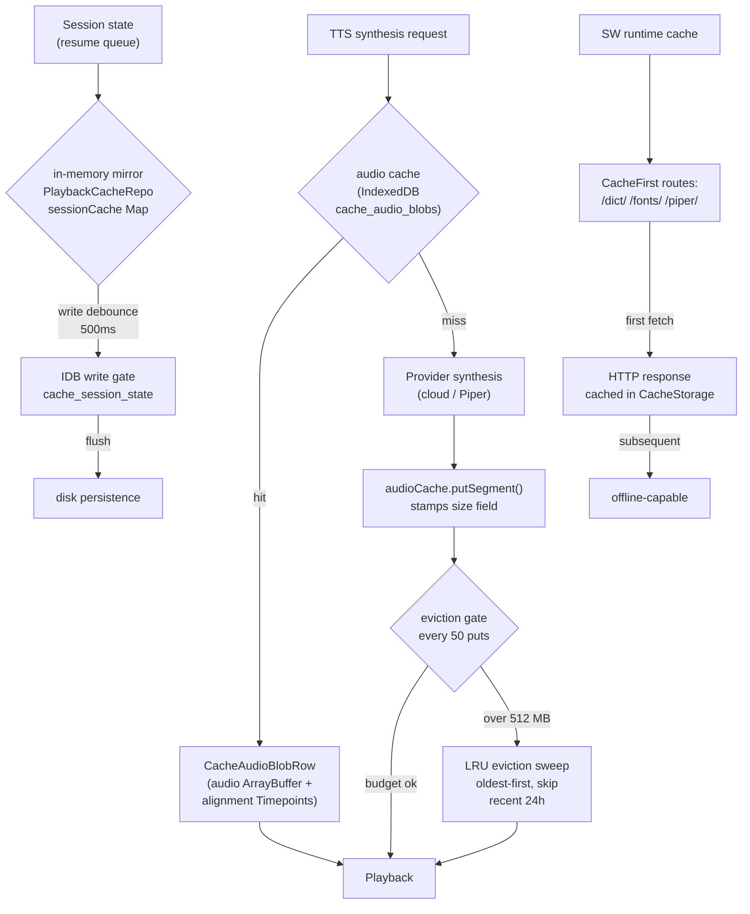
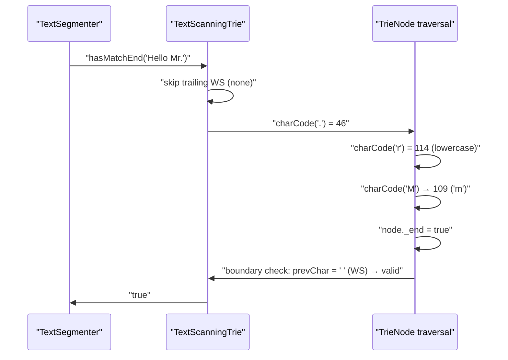
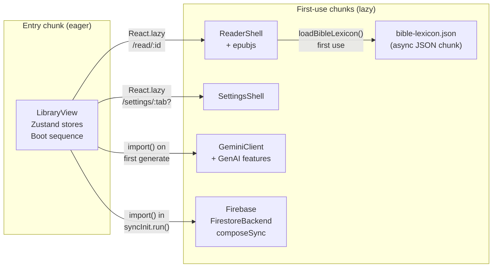
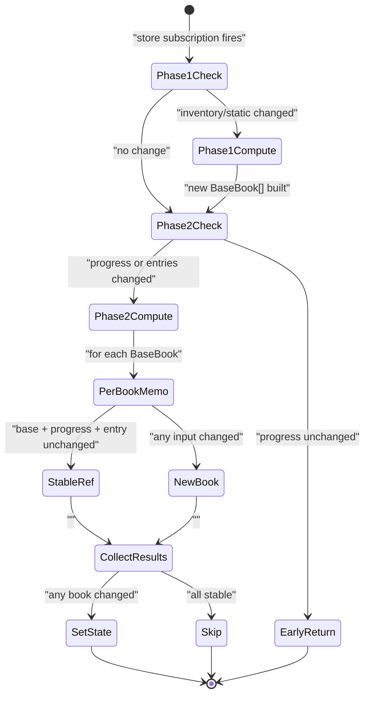
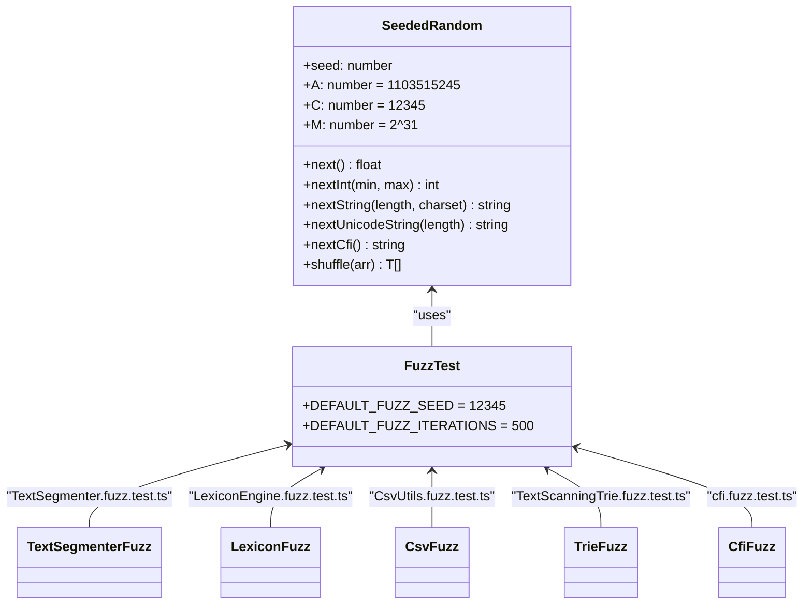
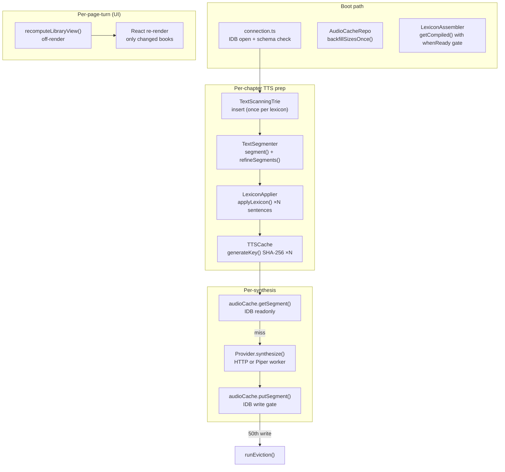

# Performance

Performance in Versicle is not a single concern but a layered set of budgets and strategies, each attacking a different bottleneck. The app must start fast on a low-end mobile device, stay smooth while turning pages in a book that could be several megabytes of parsed DOM, synthesize text-to-speech in real time without blocking the UI, and persist audio and library data to IndexedDB without ever wedging the WebKit browser engine. This document explains the WHY behind each optimization, the HOW at the implementation level, and the quality gates that keep regressions out of the codebase.

For the build and bundling context behind code splitting, see [Build and bundling](60-build-and-bundling.md). For the full caching story at the service worker level, see [PWA and service worker](61-pwa-and-service-worker.md). For the TTS content pipeline that feeds the text-scanning trie, see [TTS content pipeline](34-tts-content-pipeline.md). For how the storage layer is structured, see [Storage gateway](20-storage-gateway.md).

---

## Design intent: where the milliseconds go

A local-first EPUB reader faces a distinctive performance profile. Unlike a typical web app:

- **Boot is library-first**: the user lands on the library view every time. If this view is slow, every session feels slow.
- **Reading is renderer-heavy**: epubjs renders EPUB spine items into an iframe, which is expensive. But this cost is paid per chapter navigation, not per page turn.
- **TTS is latency-sensitive**: the delay between "play" and first audio must be imperceptible. The synthesis pipeline (text segmentation → lexicon application → provider synthesis → cached playback) must be nearly invisible.
- **IndexedDB on WebKit is a minefield**: concurrent readwrite transactions deadlock. A single hung transaction wedges the TTS sequencer for up to 42 seconds (proven empirically in `verification/_idb_probe.js`).
- **The bundle must be lean at entry**: a cold load on a 4G connection with a cached service worker should feel instant. Firebase, epubjs, and the GenAI client must never appear in the entry chunk.

The optimizations documented here address each of these axes.

---

## Caching layers



Versicle has four distinct caching tiers that serve different latency and durability goals:

| Cache tier | Key | Store / API | Budget | Eviction |
|---|---|---|---|---|
| Audio segment cache | SHA-256(`text\|voiceId\|1`) | `cache_audio_blobs` IDB | 512 MB | LRU, every 50 writes |
| Playback session mirror | bookId | in-memory `Map<string, CacheSessionStateRow>` | unbounded | manual invalidation |
| SW runtime cache | URL path | CacheStorage (`versicle-piper-runtime-v1` etc.) | 4–16 entries per route | Workbox `ExpirationPlugin` |
| Lexicon compiled rules | `ReadonlyArray<LexiconRule>` reference | `WeakMap` + secondary `Map<string, CompiledLexiconRule>` | 2000 Map entries before 10% LRU cull | automatic |

### Audio segment cache: design decisions

The audio cache is the most storage-intensive tier. Every synthesized sentence is stored as a raw `ArrayBuffer` plus optional `Timepoint[]` alignment data. The design trades storage space for eliminated synthesis latency on re-reads — a 100-chapter audiobook with thousands of unique sentences is expensive to re-synthesize.

**Key design**: the cache key is deliberately speed-independent. From [`TTSCache.ts`](../../src/lib/tts/TTSCache.ts):

```typescript
async generateKey(text: string, voiceId: string): Promise<string> {
  const data = `${text}|${voiceId}|1`;
  // ...SHA-256...
}
```

The trailing `|1` is a vestige of a retired `pitch` parameter. Removing it from the string would invalidate every cache entry for all users. Keeping it byte-identical means existing entries keep hitting. The `|1` slot documents that audio is always synthesized at playback rate 1.0 and speed is applied at the audio sink — one blob serves every playback speed.

**LRU eviction**: the `AudioCacheRepo` in [`audioCache.ts`](../../src/data/repos/audioCache.ts) triggers an eviction sweep every 50 `putSegment` calls (constant `EVICTION_PUT_INTERVAL = 50`) and also during the boot background phase. The sweep is a two-pass algorithm: pass 1 streams a readonly cursor collecting metadata (`key`, `lastAccessed`, `size`) without reading the audio blobs; pass 2 deletes oldest-first in batches of 50. Rows accessed within the last 24 hours (`EVICTION_RECENT_WINDOW_MS = 24 * 60 * 60 * 1000`) are never evicted so audio cannot vanish during active playback.

The key invariant against reading blobs in pass 1 is documented explicitly in the source:

```typescript
// Pass 1: streaming scan (no getAll — rows hold multi-MB blobs).
const entries: { key: string; lastAccessed: number; size: number }[] = [];
let cursor = await tx.store.openCursor();
while (cursor) {
  const row = cursor.value;
  const size = row.size ?? row.audio?.byteLength ?? 0;
  entries.push({ key: row.key, lastAccessed: row.lastAccessed ?? 0, size });
  totalBytes += size;
  cursor = await cursor.continue();
}
```

The comment `// BOLT OPTIMIZATION` appears throughout `src/data/repos/bookContent.ts` and marks places where `getAll()` was replaced with targeted fetches to avoid serialization out-of-memory errors.

**LRU timestamp debouncing**: bumping `lastAccessed` on every cache hit would cause a readwrite transaction per synthesis segment request. Instead, the bump is debounced: a segment read only schedules a bump if the stored `lastAccessed` is older than one hour (`LAST_ACCESSED_BUMP_INTERVAL_MS = 60 * 60 * 1000`). The bump is fire-and-forget through the write gate so a failed bump never fails the read.

**v25 size backfill**: rows written before `size` was introduced have no `size` field. The `backfillSizesOnce()` method runs once from the boot background phase, streams a readonly cursor to collect keys of rows missing `size`, then re-reads each row outside the write gate (read-modify-write recipe D1) and stamps `size = audio.byteLength` in small batches of 10. Completion is persisted in `app_metadata` under `APP_METADATA_KEYS.audioSizeBackfillV25` so subsequent boots are short-circuit no-ops.

---

## The IDB write gate: serialization for WebKit correctness

The write gate in [`write-gate.ts`](../../src/data/write-gate.ts) is not primarily a performance feature — it is a correctness fix that also has performance implications. WebKit's IndexedDB implementation deadlocks when two readwrite transactions overlap, even on different object stores. The TTS engine runs in a Web Worker, and both the worker and the main thread need to write to IDB. Without coordination, a `cache_session_state` write from the worker can overlap a Yjs `updates` flush from the main thread, producing the proven 42-second hang.

The fix uses the Web Locks API (`navigator.locks`) with a single named lock `versicle-idb-write`:

```typescript
const LOCK_NAME = 'versicle-idb-write';

export function runExclusiveIdbWrite<T>(work: () => Promise<T>, label?: string): Promise<T> {
  const guarded = instrument(work, name);
  const locks = locksApi();
  const run = locks
    ? (locks.request(LOCK_NAME, { mode: 'exclusive' }, guarded) as Promise<T>)
    : (tail.then(guarded, guarded) as Promise<T>);
  tail = run.then(swallow, swallow);
  return run;
}
```

The lock is origin-scoped and FIFO-fair. Every IDB write in the entire app — main thread, TTS worker, other tabs — runs through this gate. The fallback for jsdom (the entire Vitest suite) and Safari pre-15.4 uses a per-context promise chain that preserves the within-context guarantee.

The structural `write()` API (also in `write-gate.ts`) enforces synchronous population. Its `populate` callback **must not return a promise**. If a thenable slips through, the API aborts the transaction and throws:

```typescript
if (typeof (result as PromiseLike<unknown>)?.then === 'function') {
  abortQuietly();
  throw new TypeError(
    'write(): populate must be synchronous — it returned a thenable. ' +
      'Intra-transaction awaits are the WebKit hang trigger this API exists to ban.',
  );
}
```

This makes WebKit hang trigger #2 (intra-transaction awaits) unrepresentable at the type level. A DEV-mode tripwire also logs when a re-entrant `runExclusiveIdbWrite` request is issued while the gate is held in the same context.

**Performance implication**: all writes serialize. The steady state of a playback session has exactly one writer at a time. The watchdog fires a console error if any writer holds the gate for more than 10 seconds (`WATCHDOG_MS = 10_000`), making hung transactions visible without forcing a release.

---

## The TextScanningTrie: zero-allocation text scanning

The [`TextScanningTrie`](../../src/lib/tts/TextScanningTrie.ts) is the hot path for text segmentation decisions: "does this sentence fragment end with an abbreviation?" and "does this fragment start with a known sentence starter?" It is called thousands of times per chapter during TTS preparation.

### Why a trie and not a regex or Set lookup?

- A `Set<string>` would require `text.slice(...)` for every suffix to check — a string allocation per check.
- A regex would require `String.toLowerCase()` calls — more allocations.
- The trie walks character codes directly, using manual case folding for ASCII and a `Map<number, number>` cache for non-ASCII characters above U+007F.

### Data structures

```typescript
interface TrieNode {
    [key: number]: TrieNode | boolean | undefined;
    _end?: boolean;
}
```

Node keys are character codes (integers), not strings. The traversal uses `text.charCodeAt(i)` which avoids string allocation. Static `Uint8Array` lookup tables handle the two most common character classification queries:

- `PUNCTUATION_FLAGS`: 128 bytes for ASCII punctuation (period, comma, brackets, etc.)
- `WHITESPACE_FLAGS`: 256 bytes for ASCII + Latin-1 whitespace

A character classification that would otherwise be a chain of comparisons becomes an array lookup:

```typescript
public static isPunctuation(code: number): boolean {
    if (code < 128) {
        return !!TextScanningTrie.PUNCTUATION_FLAGS[code];
    }
    return (code >= 0x2000 && code <= 0x206F);
}
```

For characters above ASCII, case folding is cached in a `Map<number, number>` (`caseFoldCache`) to avoid repeated `String.fromCharCode(code).toLowerCase()` calls:

```typescript
} else if (code > TextScanningTrie.MAX_ASCII) {
    let lower = TextScanningTrie.caseFoldCache.get(code);
    if (lower === undefined) {
        lower = String.fromCharCode(code).toLowerCase().charCodeAt(0);
        TextScanningTrie.caseFoldCache.set(code, lower);
    }
    code = lower;
}
```

### Methods and their contracts

| Method | Direction | Returns | Early-exit |
|---|---|---|---|
| `matchesEnd(text)` | Backward from end, skip trailing WS | Matching string or `null` (longest match) | No — always scans to find longest |
| `hasMatchEnd(text)` | Backward from end, skip trailing WS | `boolean` | Yes — returns on first match |
| `matchesStart(text)` | Forward from start, skip leading WS | `boolean` | Yes — returns on first match |

`hasMatchEnd` is the fast path when the caller only needs a boolean (abbreviation detection). `matchesEnd` is the slower path that needs the matched string (for merge decisions). The boundary check in all methods ensures that matches are whole-word: the character immediately before a suffix match (or after a prefix match) must be whitespace, punctuation, or a string boundary.



### Performance test assertions

The performance regression test in [`TextSegmenter.perf.test.ts`](../../src/lib/tts/TextSegmenter.perf.test.ts) asserts two specific invariants:

1. **No unnecessary `split` calls**: for 100 sentences, `String.prototype.split` is called fewer than 10 times total.
2. **Zero `trim` calls during refinement**: for 1000 sentence nodes through `refineSegments`, `String.prototype.trim` is called exactly 0 times.

These are regression gates, not benchmarks. A future change that accidentally re-introduces `split`-per-sentence or `trim`-per-word would break these tests immediately.

---

## The LexiconApplier: compiled regex caching

The [`LexiconApplier`](../../src/lib/tts/LexiconApplier.ts) applies user lexicon rules (term substitutions) to TTS text. Rules may be plain-text (word boundary wrapped) or regex. Compiling a `RegExp` is expensive; applying the same rule set to thousands of segments in a chapter would re-compile regexes on every call without caching.

The applier uses a two-level cache:

```typescript
class LexiconApplier {
    // Fast path cache for stable rule arrays (O(1) lookup).
    private compiledRulesCache = new WeakMap<ReadonlyArray<LexiconRule>, CompiledLexiconRule[]>();
    // Secondary cache for individual compiled rules
    private compiledRegexCache = new Map<string, CompiledLexiconRule>();
```

**Level 1 (WeakMap)**: keyed by the `ReadonlyArray<LexiconRule>` reference itself. When the `LexiconAssembler` returns the same frozen array reference (a memo hit), `getCompiledRules()` returns the precompiled list in O(1) without any iteration. The WeakMap entry dies when the rules array is GC'd, so there is no memory leak from stale versions.

**Level 2 (Map)**: keyed by a composite string `rule.id + '\0' + effectiveMatchType + '\0' + rule.original + '\0' + rule.replacement`. This handles the case where the rules array object changes (e.g., after a Zustand store update creates a new array) but individual rules are unchanged. The `\0` delimiter prevents key collisions between adjacent fields.

The Map is bounded at 2000 entries with a 10% oldest-first eviction:

```typescript
if (this.compiledRegexCache.size > 2000) {
    let i = 0;
    for (const key of this.compiledRegexCache.keys()) {
        if (i++ > 200) break;
        this.compiledRegexCache.delete(key);
    }
}
```

The performance test in [`LexiconEngine.perf.test.ts`](../../src/lib/tts/LexiconEngine.perf.test.ts) runs 10,000 iterations of `applyLexicon` on the same text with 51 rules (50 literal + 1 regex) and logs the total time. There is no hard time assertion — the test documents the expected cache-hot behavior and serves as a manual benchmark.

---

## The LexiconAssembler: memoized rule assembly

The [`LexiconAssembler`](../../src/lib/tts/LexiconEngine.ts) assembles the complete ordered rule set for a `(bookId, language)` pair from three sources: user-global rules from the Yjs store, user book-specific rules, and system rules (Bible lexicon). Assembly reads a Zustand store and awaits an async Bible lexicon load — it is not cheap.

The assembler memoizes its output in a `Map<string, { version: number; compiled: CompiledLexicon }>`:

```typescript
async getCompiled(bookId?: string, language?: string): Promise<CompiledLexicon> {
    if (this.deps.whenReady) await this.deps.whenReady();

    const key = `${bookId || 'global'}:${language || 'any'}`;
    const cached = this.cache.get(key);
    if (cached && cached.version === this.version) {
        return cached.compiled;
    }
    // ...
}
```

The `version` counter increments on every store change, global Bible flag change, or explicit invalidation. A version mismatch on a cache lookup forces re-assembly. The assembled `CompiledLexicon.rules` array is frozen with `Object.freeze()`, giving it a stable identity that the `LexiconApplier`'s WeakMap can key on — so a memo hit in the assembler propagates to an O(1) hit in the applier.

The critical invariant from the source comment: "the memo is written before EVERY return path by construction — assembly is a single-exit function." There is no early-return that could skip the cache write and cause a miss on the next call.

**Bible lexicon lazy loading**: the Bible lexicon JSON (~85 KB, containing proper-noun pronunciation rules) is loaded lazily through a dynamic import in [`systemLexicon.ts`](../../src/lib/tts/systemLexicon.ts) and memoized per language:

```typescript
const compiledByLanguage = new Map<string, Promise<ReadonlyArray<LexiconRule>>>();

export const bibleLexiconProvider: SystemLexiconProvider = {
    id: 'bible',
    load(language?: string) {
        const key = language ? language.toLowerCase() : '';
        let promise = compiledByLanguage.get(key);
        if (!promise) {
            promise = compileBibleRules(language);
            compiledByLanguage.set(key, promise);
        }
        return promise;
    },
};
```

The same `Promise` object is returned for repeated calls with the same language. If the Bible lexicon is already compiled, the assembler awaits a resolved promise — effectively synchronous. This collapses the cost of the Bible lexicon from "compile on every chapter" (the pre-Phase 5c behavior) to "compile once per language per process lifetime."

---

## Lazy code-split chunks



The entry bundle is gzip-budgeted at the baseline recorded in [`bundle-baseline.json`](../../bundle-baseline.json):

```json
{
  "entryGzipBytes": 441686
}
```

The budget gate allows 10% headroom (`ENTRY_HEADROOM = 1.1`). If the entry static closure grows beyond `441686 × 1.1 = 485,854` gzip bytes, the `check:worker-chunk` CI script fails.

### How the split is implemented

In [`routes.tsx`](../../src/app/routes.tsx):

```typescript
const ReaderShellLazy = lazy(() =>
  import('@components/reader/ReaderShell').then((m) => ({ default: m.ReaderShell })),
);
const SettingsShellLazy = lazy(() =>
  import('./settings/SettingsShell').then((m) => ({ default: m.SettingsShell })),
);
```

`ReaderShell` pulls in all of epubjs (epub rendering, spine management, view managers). Without the `React.lazy` boundary, every library-view page load would fetch and parse epubjs unnecessarily. The route comment documents the rationale explicitly: "pulls epubjs out of the entry chunk — asserted by check 4 of `scripts/check-worker-chunk.mjs`."

Similarly, in [`extract.ts`](../../src/domains/library/import/extract.ts):

```typescript
const { default: ePub } = await import('epubjs');
// ...
const { extractContentOffscreen } = await import(
    '@domains/reader/engine/offscreen/offscreen-renderer'
);
```

These imports are inside async function bodies, not at module scope. The module rides the `LibraryView` (eager) graph via the import orchestrator, and static imports here would pull epubjs back into the entry chunk. The `check-worker-chunk.mjs` script asserts the emitted artifact to catch regressions.

### Worker purity

The TTS engine runs in an ES-module Web Worker (`tts.worker-*.js`). It must never contain Zustand stores, Yjs documents, or `src/store/` code. A second Y.Doc inside the worker would create a second IndexedDB persistence and corrupt the CRDT state. The script validates this by walking the worker chunk's sourcemap closure and failing if any source matches:

- `node_modules/zustand`
- `node_modules/yjs/`
- `src/store/`
- `packages/zustand-middleware-yjs/`
- `packages/y-idb/`

The ANALYZE mode for spelunking: `ANALYZE=true vite build` emits per-module treemaps to `stats.html` (main bundle) and `stats-worker.html` (TTS worker). The vite config wires this through the `rollup-plugin-visualizer`.

---

## Image compression at ingest

Book covers are compressed at ingest time using the `browser-image-compression` library. The compression happens in [`extract.ts`](../../src/domains/library/import/extract.ts) inside `extractPreamble()`:

```typescript
thumbnailBlob = await imageCompression(coverBlob as File, {
    maxSizeMB: 0.1,
    maxWidthOrHeight: 600,
    useWebWorker: true,
    fileType: 'image/webp',
});
```

The targets are 0.1 MB maximum size and 600px maximum dimension, output as WebP. The `useWebWorker: true` option offloads the canvas compression to a separate worker, keeping the main thread responsive during import. If compression fails, the original cover is used (`thumbnailBlob = coverBlob`) — compression failure never aborts extraction.

The compressed thumbnail serves the cover image URL (`/covers/<bookId>`) via the service worker fetch handler in [`sw.ts`](../../src/sw.ts), which reads the stored `ArrayBuffer` from `static_manifests` and returns it as a `Blob` response. The SW route bypasses network entirely; covers are always local.

---

## Batched IDB reads: the BOLT pattern

A recurring comment in the data layer reads "BOLT OPTIMIZATION" and marks places where `getAll()` across the IDB bridge was replaced with targeted multi-get operations to prevent serialization out-of-memory errors. The canonical example is [`BookContentRepo.getManifestBundleBulk()`](../../src/data/repos/bookContent.ts):

```typescript
async getManifestBundleBulk(ids: string[]): Promise<(ManifestBundle | undefined)[]> {
    const db = await getConnection();
    const tx = db.transaction(['static_manifests', 'static_resources', 'static_structure'], 'readonly');

    const manifestStore = tx.objectStore('static_manifests');
    const resourceStore = tx.objectStore('static_resources');
    const structureStore = tx.objectStore('static_structure');

    // BOLT OPTIMIZATION: Avoid getAll() on large arrays across IDB bridge
    // and use count() instead of getKey() to avoid fetching the key value itself.
    const manifestsPromise = Promise.all(ids.map(id => manifestStore.get(id)));
    const resourceCountPromise = Promise.all(ids.map(id => resourceStore.count(id)));
    const structuresPromise = Promise.all(ids.map(id => structureStore.get(id)));

    const [manifests, resourceCounts, structures] = await Promise.all([
        manifestsPromise, resourceCountPromise, structuresPromise
    ]);
    // ...
}
```

Three optimization decisions are layered here:

1. **Multi-store transaction**: opens a single transaction spanning all three stores, avoiding three sequential connection round-trips.
2. **`Promise.all` fan-out within the transaction**: all get requests are issued concurrently within the transaction. IDB processes them in parallel.
3. **`count()` instead of `getKey()`**: checking whether a book resource exists uses `count(id)` rather than `getKey(id)` because `count` avoids fetching and deserializing the key value across the IDB bridge. The comment notes this explicitly.

A similar pattern appears in `getOffloadedStatus()`:

```typescript
// BOLT OPTIMIZATION: Avoid getAllKeys() across IDB boundary.
// Map to count() promises instead.
const promises = bookIds.map(async (id) => {
    const count = await store.count(id);
    const exists = count > 0;
    result.set(id, !exists);
});
await Promise.all(promises);
```

---

## Playback session: in-memory mirror with debounced persistence

The TTS playback state (queue, pause timestamp) must survive app restarts and be writable during active playback. The naive implementation — write to IDB on every queue update — was the source of the WebKit deadlock scenario: a `cache_session_state` readwrite transaction during playback overlapped a Yjs write and hung.

The [`PlaybackCacheRepo`](../../src/data/repos/playbackCache.ts) solves this with an in-memory mirror:

```typescript
private sessionWriteChain: Promise<void> = Promise.resolve();
private sessionCache = new Map<string, CacheSessionStateRow>();
private sessionDirty = new Set<string>();
private sessionFlushTimer: ReturnType<typeof setTimeout> | null = null;
```

All reads hit the mirror first (`sessionCache.get(bookId)`). Writes update the mirror synchronously and schedule a debounced disk write:

```typescript
private scheduleSessionWrite(bookId: string): void {
    this.sessionDirty.add(bookId);
    if (this.sessionFlushTimer) return;
    this.sessionFlushTimer = setTimeout(() => {
        this.sessionFlushTimer = null;
        const books = [...this.sessionDirty];
        this.sessionDirty.clear();
        for (const id of books) void this.writeSession(id);
    }, 500);
}
```

The 500ms debounce coalesces rapid queue updates into one disk write. The mirror is the source of truth during the session; disk writes only matter for cross-session resume. The dirty set deduplicates multiple updates to the same book within the debounce window.

The `flushPending()` method allows the E2E test API (`window.__versicleTest.flushPersistence()`) to force an immediate flush without sleeping past the 500ms window. `dropPending()` cancels pending writes without flushing — used at teardown to avoid a race against a closing DB connection.

When writing to disk, the writer snapshots the in-memory record before the transaction to prevent a mid-commit mutation from corrupting the stored data:

```typescript
const snapshot = { ...session };
// Then inside the gate: tx.objectStore('cache_session_state').put(snapshot);
```

---

## Library view: off-render derived projection

The library grid can show hundreds of books. Each book display row requires joining five stores: book inventory (Yjs), static manifest metadata, reading state (progress per device), reading list entries, and local history. Doing this join inside a React render on every store subscription update would be O(N) work per render with N books.

The [`libraryViewStore.ts`](../../src/store/libraryViewStore.ts) moves this computation off-render: a derived Zustand store subscribes to the five input stores and runs `recomputeLibraryView()` outside React's render cycle.

The computation is organized in two phases:

**Phase 1** (rare): inventory × static metadata × offloaded status join. Produces `BaseBook[]`. Guarded by triple reference equality:

```typescript
const phase1Changed =
    caches.lastPhase1.books !== books ||
    caches.lastPhase1.staticMetadata !== staticMetadata ||
    caches.lastPhase1.offloadedBookIds !== offloadedBookIds;
```

**Phase 2** (frequent, per page turn): merges progress and reading-list entries into `LibraryBook[]`. Per-book memoization via `Map<string, ResultCacheEntry>` compares the `base`, `rawBookProgress`, and `rawReadingListEntry` references:

```typescript
const prev = caches.resultCache.get(base.id);
if (
    prev &&
    prev.base === base &&
    prev.rawBookProgress === rawBookProgress &&
    prev.rawReadingListEntry === rawReadingListEntry
) {
    nextCache.set(base.id, prev);
    return prev.result; // stable reference — React skips re-render for this book
}
```

Unchanged books return a stable `LibraryBook` object reference. React sees no change for those memo'd components and skips re-rendering them.

The reading-list join uses three maps built once per `entries` change (not once per book per render):

- `fkMap: Map<string, ReadingListEntry>`: bookId FK join (exact match)
- `matchMap: Map<string, ReadingListEntry>`: fuzzy title+author match (pre-computed)
- `entries[base.sourceFilename]`: exact filename match

The performance test in [`libraryViewStore.perf.test.ts`](../../src/store/libraryViewStore.perf.test.ts) asserts that `getDeviceId()` is called exactly once per hook invocation regardless of how many books exist — not once per book.



---

## Service worker caching: runtime routes

Beyond the precache (JavaScript, CSS, HTML assets), the service worker in [`sw.ts`](../../src/sw.ts) registers three `CacheFirst` runtime routes:

```typescript
registerRoute(
    ({ url }) => url.origin === self.location.origin && url.pathname.startsWith('/dict/'),
    new CacheFirst({
        cacheName: 'versicle-dict-assets',
        plugins: [new ExpirationPlugin({ maxEntries: 4 })],
    }),
)

registerRoute(
    ({ url }) => url.origin === self.location.origin && url.pathname.startsWith('/fonts/'),
    new CacheFirst({
        cacheName: 'versicle-fonts-v1',
        plugins: [new ExpirationPlugin({ maxEntries: 12 })],
    }),
)

registerRoute(
    ({ url }) => url.origin === self.location.origin && url.pathname.startsWith('/piper/'),
    new CacheFirst({
        cacheName: 'versicle-piper-runtime-v1',
        plugins: [new ExpirationPlugin({ maxEntries: 16 })],
    }),
)
```

The Piper ONNX runtime blobs are deliberately excluded from the precache (`globIgnores: ['**/piper/onnxruntime/*.wasm']`) because they are ~10 MB each — far beyond the 4 MB precache budget. The runtime cache route fills this gap: after one successful Piper synthesis the runtime is cached and works offline. The Hugging Face voice model downloads are cross-origin and never match the same-origin filter.

The `/dict/` route caches the compiled CC-CEDICT dictionary (~15 MB JSON). After one online lookup the Chinese dictionary works offline, which is critical for the Chinese domain features.

---

## CFI performance: range merge optimization

The EPUB CFI module has its own perf test in [`cfi.perf.test.ts`](../../src/kernel/cfi/cfi.perf.test.ts). The benchmark tests appending to a list of 1000 CFI ranges 100 times and logs the average time per merge. The test asserts correctness of both sequential append and overlapping merge cases but does not enforce a time limit — it documents expected behavior.

---

## The fuzz and perf test suite



### SeededRandom: deterministic fuzzing

The [`SeededRandom`](../../src/test/fuzz-utils.ts) class implements a Linear Congruential Generator (LCG) with glibc parameters (A=1103515245, C=12345, M=2^31). Using a fixed `DEFAULT_FUZZ_SEED = 12345` ensures that fuzz test failures are reproducible: the same seed always produces the same random sequence. When a fuzz test fails, the console logs the seed so the developer can reproduce the exact failure case.

The generator produces:
- `nextString(n)`: ASCII alphanumeric strings
- `nextUnicodeString(n)`: mixed Unicode including emoji, Greek, CJK, accented Latin, and punctuation
- `nextCfi()`: EPUB CFI-like strings for testing CFI parsers
- `nextElement(arr)`: uniform random selection
- `shuffle(arr)`: Fisher-Yates shuffle

The default fuzz iteration count is `DEFAULT_FUZZ_ITERATIONS = 500`. This can be raised for heavier testing or lowered for CI time budgets.

### Fuzz test coverage

| File | Subject | Key invariants tested |
|---|---|---|
| `TextScanningTrie.fuzz.test.ts` | Trie insert + match | No crash on any input; boundary semantics |
| `TextSegmenter.fuzz.test.ts` | Segment + refine | Survives random Unicode; segment coverage; no text loss on merge |
| `LexiconEngine.fuzz.test.ts` | LexiconApplier | No crash on malformed regex; Unicode in rules; very long text |
| `CsvUtils.fuzz.test.ts` | LexiconCSV + SimpleListCSV | Round-trip preservation; random input survival; special CSV chars |
| `cfi.fuzz.test.ts` | CFI parser | No crash on random CFI-like strings |
| `cfi.equivalence.fuzz.test.ts` | CFI comparison | Reference vs. optimized equivalence |
| `search-engine.fuzz.test.ts` | Search engine | No crash on random Unicode queries |
| `features.fuzz.test.ts` | GenAI feature parsing | No crash on random model outputs |

### Performance test coverage

| File | Subject | Key assertions |
|---|---|---|
| `TextSegmenter.perf.test.ts` | Segmenter hot path | `split` < 10 calls / 100 sentences; `trim` = 0 calls / 1000 nodes |
| `LexiconEngine.perf.test.ts` | LexiconApplier cache | 10,000 iterations logged; correctness verified |
| `ingestion-idb.perf.test.ts` | IDB sequential vs. parallel | 200 batches benchmarked; logs comparison |
| `libraryViewStore.perf.test.ts` | Library projection memoization | `getDeviceId` = 1 call per hook render |
| `cfi.perf.test.ts` | CFI range merge | 1000-range append × 100; correctness of sequential + overlapping |

---

## Hotspot map



The hottest code paths are:

1. **`TextScanningTrie` traversal**: called once per abbreviation check per token boundary in the segmenter. The lookup-table character classification and integer-keyed nodes keep this path allocation-free.

2. **`LexiconApplier.getCompiledRules()`**: called once per synthesis request with the compiled rule set. If the WeakMap key hits (stable array reference from the assembler memo), this is O(1).

3. **`SHA-256` via `crypto.subtle.digest()`**: called once per sentence per chapter for audio cache key generation. The browser's native crypto implementation is fast, but with thousands of sentences per chapter this adds up. Each call is async (returns a Promise); they are not parallelized because the TTS pipeline processes sentences in sequence.

4. **IDB `write()`** under the exclusive gate: every audio cache put, session state update, and book data write serializes through the gate. The playback session mirror eliminates most writes during active playback via the 500ms debounce. Audio cache eviction batches 50 deletes per write gate acquisition.

---

## Bundle analyzer workflow

When a CI check fails on entry bundle size or worker purity, the developer can inspect the module graph with:

```
ANALYZE=true vite build
```

This emits:
- `stats.html`: per-module treemap for the main bundle
- `stats-worker.html`: per-module treemap for the TTS worker bundle

The visualizer is wired in `vite.config.ts` via `rollup-plugin-visualizer` and is only active when `ANALYZE=true` — normal builds are unaffected:

```typescript
const analyze = env.ANALYZE === 'true';
// ...
worker: {
    format: 'es',
    plugins: () => (analyze
        ? [visualizer({ filename: 'stats-worker.html', gzipSize: true, brotliSize: true })]
        : []),
},
// ...
...(analyze ? [visualizer({ filename: 'stats.html', gzipSize: true, brotliSize: true })] : []),
```

Both treemaps show gzip and Brotli sizes, which more accurately represent network transfer costs than raw byte counts.

---

## Summary of performance invariants

The following are the hard invariants maintained by the codebase. Each has either a test or a CI gate:

| Invariant | Enforcer |
|---|---|
| Entry gzip ≤ baseline × 1.1 (441,686 bytes × 1.1) | `scripts/check-worker-chunk.mjs` check 4 |
| TTS worker has no Zustand/Yjs/store code | `scripts/check-worker-chunk.mjs` check 1 |
| Bible lexicon JSON is in an async chunk only | `scripts/check-worker-chunk.mjs` check 3 |
| No mock backends in the production bundle | `scripts/check-worker-chunk.mjs` check 2 |
| `split` < 10 calls / 100 sentences in segmenter | `TextSegmenter.perf.test.ts` |
| `trim` = 0 calls in `refineSegments` | `TextSegmenter.perf.test.ts` |
| `getDeviceId` = 1 call per library re-render | `libraryViewStore.perf.test.ts` |
| `write()` populate callback must be synchronous | `write-gate.ts` + `write-gate.test.ts` G.4 |
| Audio eviction skips rows accessed in last 24h | `AudioCacheRepo.runEviction()` |
| LexiconApplier WeakMap O(1) on stable rule reference | `LexiconEngine.perf.test.ts` |

For a broader view of CI quality gates and how these checks integrate with pull-request validation, see [CI and quality gates](65-ci-and-quality-gates.md). For how the TTS worker architecture keeps state out of the worker bundle, see [TTS app integration](51-tts-app-integration.md). For the IndexedDB schema that backs these caches, see [Schema and migrations IDB](21-schema-and-migrations-idb.md).
