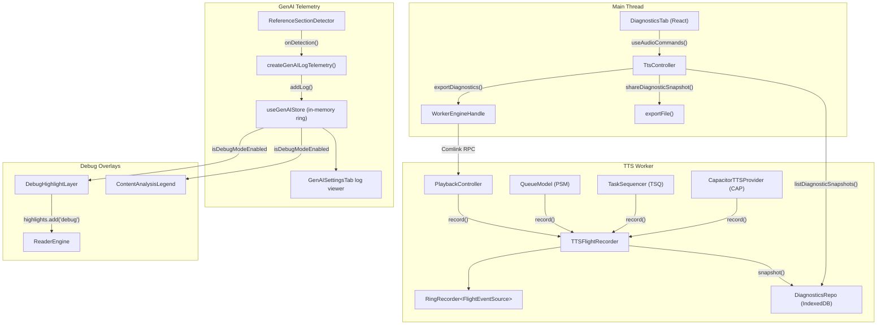
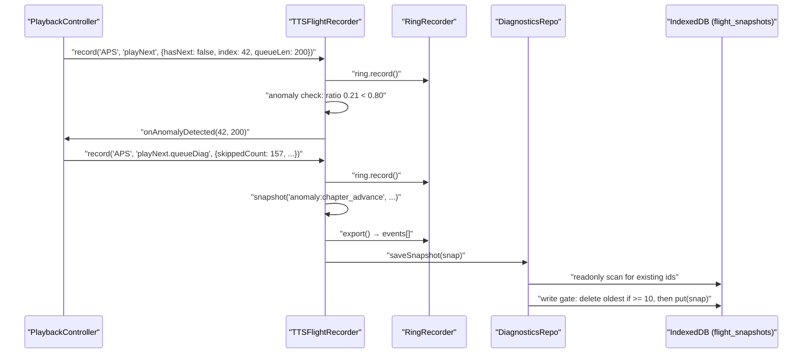
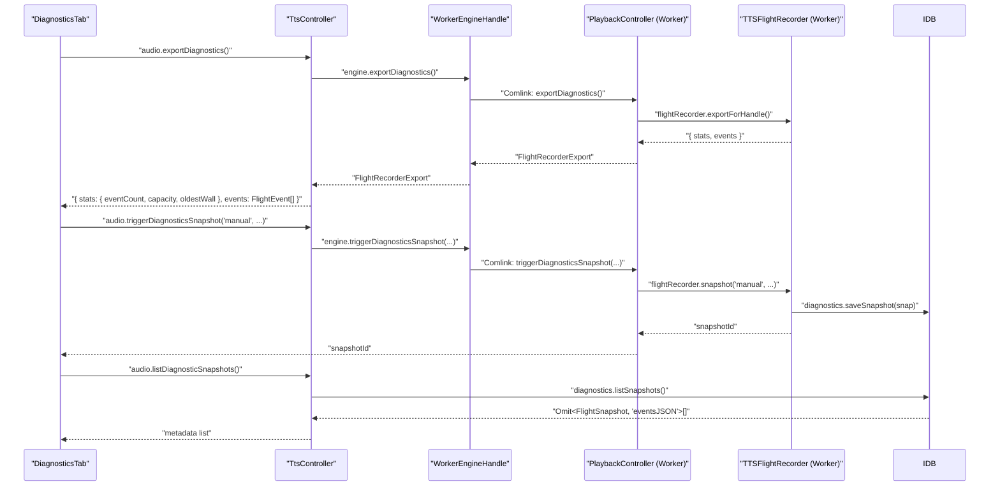
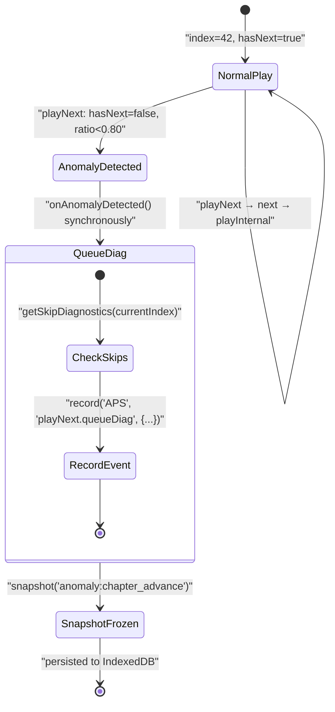
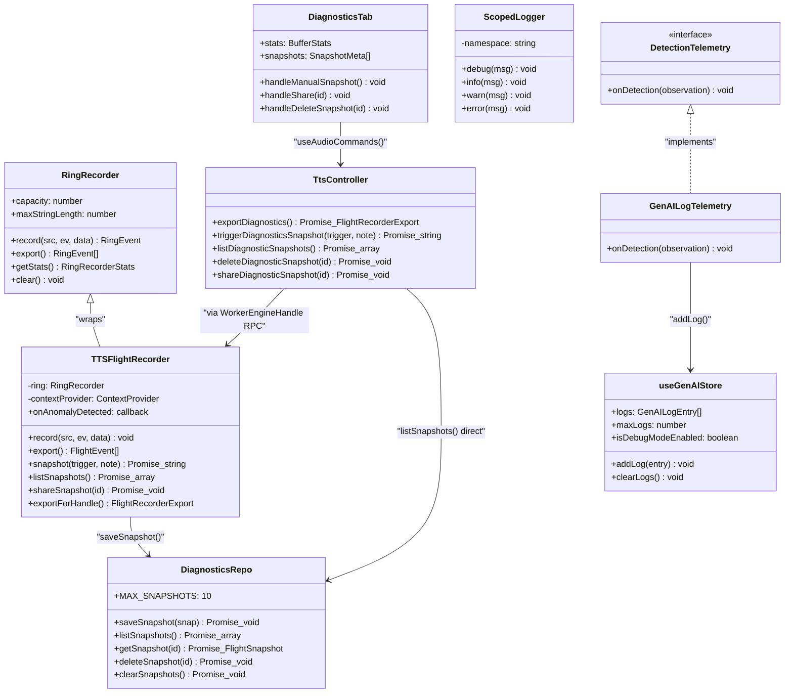

# Observability & Diagnostics

This document covers how Versicle is observed and debugged at runtime: the scoped logger, the TTS flight recorder and its ring-buffer kernel, the detection telemetry pipeline for GenAI reference-section analysis, the GenAI activity log, the Diagnostics settings panel, and the debug overlays that surface content-analysis results in the reader.

Cross-cutting references: [Architecture overview](10-architecture-overview.md), [TTS engine](32-domain-audio-tts-engine.md), [TTS providers](33-tts-providers-and-platform.md), [Settings shell](41-settings-shell.md), [Bootstrap and lifecycle](14-bootstrap-and-lifecycle.md), [Testing strategy](63-testing-strategy.md).

---

## Design Intent

Versicle is a local-first app running across two JS contexts (main thread and TTS Web Worker) on several platforms (PWA, Android Capacitor, iOS). Several of its most important failure modes — premature chapter advances, stale skip flags in queue restore, Smart Handoff race conditions — are intermittent and reproduce only after tens of minutes of continuous playback. Standard console logging is insufficient for post-mortem diagnosis because:

1. The native WebView devtools are unavailable during real-use regressions on device.
2. The TTS engine runs inside a Web Worker, whose console output is inaccessible from the main thread.
3. Events happen at sub-millisecond granularity and the causal chain spans thousands of events before the symptom appears.

The observability stack is therefore designed around three principles:

- **Always-on, bounded-cost recording.** The flight recorder runs on every playback session without being enabled or triggered. It keeps only the last 2,000 events in a ring buffer (default capacity), so memory growth is O(1) regardless of playback duration.
- **Post-mortem persistence.** Snapshots freeze the ring buffer to IndexedDB with a rolling cap of 10 entries, surviving app restarts and eliminating the race between "issue observed" and "logs collected."
- **Separation of instrument and analysis.** The ring buffer kernel (`RingRecorder`) has zero internal dependencies and no domain knowledge. Domain-specific heuristics (anomaly detection, skip-flag diagnostics) live only in the wrapper (`TTSFlightRecorder`) and above. This lets the same buffer primitive be reused for Chinese rendering diagnostics (`TraditionalConverter`) and for planned P6/P7 reader and sync recorders.

---

## System Map



---

## 1. The Scoped Logger (`src/lib/logger.ts`)

### Design

[`src/lib/logger.ts`](../../src/lib/logger.ts) provides a factory `createLogger(namespace)` that returns a `ScopedLogger` instance. This is the only approved way to emit structured log messages outside of the flight recorder. Raw `console.*` calls are used internally but are gated on a level check so they can be suppressed in production.

### Level Hierarchy

The four levels map to numeric thresholds:

```
debug: 0  →  info: 1  →  warn: 2  →  error: 3
```

The configured floor is resolved from the build environment at call time, not at module load:

```typescript
const configuredLevel = (env.VITE_LOG_LEVEL) || (env.DEV ? 'info' : 'warn');
```

This means:
- **Production builds** (`DEV=false`, no `VITE_LOG_LEVEL`): only `warn` and `error` messages appear.
- **Development builds** (`DEV=true`): `info`, `warn`, and `error` appear by default.
- **Custom override**: setting `VITE_LOG_LEVEL=debug` in `.env.local` enables all messages, including verbose debug traces.

The environment is read via a defensive accessor that handles worker contexts and SSR where `import.meta.env` may be absent:

```typescript
const getEnv = (): ImportMetaEnv => {
  return (import.meta as { env?: ImportMetaEnv }).env || { DEV: false };
};
```

### Usage Pattern

```typescript
import { createLogger } from '@lib/logger';
const logger = createLogger('TtsController');

logger.debug('resolving active voice', { profileVoiceId, lang });
logger.info('initialized', { providerId });
logger.warn('AI consent prompt failed; continuing without an answer', e);
logger.error('Failed to start worker TTS engine', e);
```

Each message is prefixed with `[Namespace]`, making it easy to grep in DevTools or filter in `adb logcat`. The namespace is free-form; conventions used across the codebase include module-level names (`'TtsController'`, `'WorkerEngineHandle'`, `'DebugHighlightLayer'`) and the test API (`'TestApi'`).

### Relationship to the Flight Recorder

The logger and the flight recorder serve different audiences. The logger emits to the console (which the developer reads in real time) while the flight recorder writes to an in-memory ring buffer (which is frozen to disk for post-mortem analysis). They are not connected: a `logger.warn` call does not produce a flight event and vice versa. This separation keeps the hot playback path free of I/O and string formatting overhead.

---

## 2. The Ring Buffer Kernel (`src/kernel/diagnostics/ringRecorder.ts`)

### Kernel Admission Rules

[`src/kernel/diagnostics/ringRecorder.ts`](../../src/kernel/diagnostics/ringRecorder.ts) is the sole file in the `src/kernel/diagnostics/` directory. It is governed by the same rules that apply to all `src/kernel/**` modules (master plan §2 rule 1): **it imports nothing internal**. The event shape is a structural generic (`RingEvent<S extends string>`) so domain-level wrappers supply their own source-union types without the kernel knowing about them.

### Data Structures

```typescript
export type RingEventData = Record<string, string | number | boolean | null | undefined>;

export interface RingEvent<S extends string = string> {
    seq: number;     // monotonic integer, never resets until clear()
    ts: number;      // performance.now() in ms — for sub-ms relative timing
    wall: number;    // Date.now() in ms — for human-readable correlation
    src: S;          // domain-supplied source discriminant
    ev: string;      // event name
    d?: RingEventData; // optional truncated payload
}
```

Two timestamps are recorded on every event because they serve different purposes. `ts` (from `performance.now()`) is monotonic and has sub-millisecond resolution, making it suitable for measuring the duration between events with precision. `wall` (from `Date.now()`) is a Unix timestamp, making it suitable for correlating events to real-world time ("I pressed play at 8:42 PM").

### Ring Buffer Mechanics

The buffer is a fixed-capacity circular array managed with a `head` pointer and a `full` flag:

```typescript
private readonly capacity: number;     // default 2000
private buffer: RingEvent<S>[] = [];
private seq = 0;
private head = 0;
private full = false;
```

Before the buffer fills, events are pushed to `buffer` normally. Once `full === true`, new events overwrite the oldest slot at `head`:

```typescript
if (this.full) {
    this.buffer[this.head] = event;
} else {
    this.buffer.push(event);
}
this.head = (this.head + 1) % this.capacity;
if (this.head === 0 && !this.full) this.full = true;
```

Export reconstructs chronological order by splicing from `head`:

```typescript
export(): RingEvent<S>[] {
    if (!this.full) return this.buffer.slice();
    return [
        ...this.buffer.slice(this.head),
        ...this.buffer.slice(0, this.head),
    ];
}
```

### Hot-Path Discipline

`record()` is called on the playback hot path (every utterance, every state transition). Its cost must be bounded and predictable. The implementation:

1. Creates one `RingEvent` object per call (unavoidable allocation).
2. Iterates over `data` keys exactly once, truncating strings longer than `maxStringLength` (default 80 characters) in-place.
3. Performs one ring-write (no reallocation once the buffer is full).
4. Returns the recorded event for callers that want to chain on it.

No async work, no I/O, and no string formatting beyond truncation occur on the hot path. Snapshot persistence is always triggered asynchronously and deferred.

### The `RingRecorder` as a General Primitive

While the TTS flight recorder is the primary consumer, the `RingRecorder` generic is also used independently:

- [`src/domains/chinese/engine/TraditionalConverter.ts`](../../src/domains/chinese/engine/TraditionalConverter.ts) creates `new RingRecorder<'chinese'>({ capacity: 100 })` to record CH-7 guard violations (cases where simplified→traditional conversion would change the code-unit length, corrupting CFI offsets).

The plan anticipates reader and sync recorders in P6/P7 using the same primitive, consistent with the kernel's role as the zero-dependency foundation layer.

---

## 3. The TTS Flight Recorder (`src/lib/tts/TTSFlightRecorder.ts`)

### Role and Context

[`src/lib/tts/TTSFlightRecorder.ts`](../../src/lib/tts/TTSFlightRecorder.ts) is the TTS domain's wrapper over `RingRecorder`. It owns everything TTS-specific: the playback context provider callback, the premature-chapter-advance anomaly heuristic, and snapshot persistence through the `DiagnosticsRepo`.

A critical architectural point: **each JS context has its own module instance**. The production TTS engine runs inside a Web Worker. The `flightRecorder` singleton in the worker sees all engine traffic. The `flightRecorder` singleton on the main thread sits idle — reading the main-thread instance from the Diagnostics UI would always show an empty buffer. The S9 fix addresses this by routing live buffer reads through the engine handle (a Comlink RPC to the worker-side recorder), while persisted snapshots are shared via IndexedDB which both contexts can access.

### Source Codes

The `FlightEventSource` union type in [`src/types/flight-recorder.ts`](../../src/types/flight-recorder.ts) defines the six valid source codes:

| Code | Component | Responsibility |
|------|-----------|----------------|
| `APS` | `PlaybackController` (AudioPlayerService) | Orchestration: play/pause/stop, queue traversal, chapter transitions |
| `PSM` | `QueueModel` (PlaybackStateManager) | Queue state: `setQueue`, `next`, `prev`, `jumpTo`, `seekToTime` |
| `CAP` | `CapacitorTTSProvider` | Native Android TTS: `play.flush`, `play.handoff`, `preload`, `onEnd` |
| `TSQ` | `TaskSequencer` | Serialized async execution: task enqueue, start, done, cancel, watchdog |
| `TTS` | `useTTS` hook | React bridge events (section sync, autoplay decisions) |
| `PLT` | `PlatformIntegration` | Media session and background audio events |

### The Anomaly Heuristic

`TTSFlightRecorder.record()` intercepts every `playNext` event and applies a heuristic to detect premature chapter advances:

```typescript
if (ev === 'playNext') {
    if (data && typeof data.index === 'number' && typeof data.queueLen === 'number' && data.hasNext === false) {
        const ratio = data.index / data.queueLen;
        if (ratio < 0.8) { // Trigger if less than 80% through the chapter
            try {
                this.onAnomalyDetected?.(data.index as number, data.queueLen as number);
            } catch { /* best effort */ }
            this.snapshot('anomaly:chapter_advance', `Auto-detected premature chapter advance at ${Math.round(ratio * 100)}%`).catch(() => {});
        }
    }
}
```

When triggered (a `hasNext: false` event while less than 80% through the queue), the recorder:

1. Synchronously invokes `onAnomalyDetected` — a callback installed by `PlaybackController` during initialization — which records a `playNext.queueDiag` event with the detailed skip-flag diagnostics *before* the snapshot is frozen.
2. Asynchronously persists the ring buffer to IndexedDB as a `trigger: 'anomaly:chapter_advance'` snapshot.

The synchronous callback order is intentional: it ensures the diagnostic events are already in the buffer when `snapshot()` serializes it.

### Context Provider

The snapshot captures not just events but also a point-in-time playback context via an injected callback:

```typescript
type ContextProvider = () => {
    bookId: string | null;
    sectionIndex: number;
    currentIndex: number;
    queueLength: number;
    status: string;
    skippedCount?: number;
    nextItemSkipped?: boolean | undefined;
};
```

`PlaybackController` installs this via `flightRecorder.setContextProvider(...)` during its `connect()` phase. The context walks the live queue to count `isSkipped` items, so the snapshot's `context` object always reflects the queue state at the moment of capture.

### Snapshot Lifecycle



### The `FlightSnapshot` Shape

The persisted row ([`src/types/flight-recorder.ts`](../../src/types/flight-recorder.ts)) carries both metadata (used by the UI list view) and the full event payload (loaded only for export/share):

```typescript
interface FlightSnapshot {
  id: string;             // uuid v4 primary key
  createdAt: number;      // Unix ms — sort order for UI list
  trigger: string;        // 'manual' | 'anomaly:chapter_advance' | 'anomaly:task_watchdog'
  note: string;           // human-readable description
  context: {              // playback state at moment of capture
    bookId: string | null;
    sectionIndex: number;
    currentIndex: number;
    queueLength: number;
    status: string;
    skippedCount?: number;
    nextItemSkipped?: boolean | undefined;
  };
  eventCount: number;     // count for UI display
  timeRange: { first: number; last: number }; // wall-clock range of events
  eventsJSON: string;     // JSON.stringify(events) — NOT loaded during list()
  sizeBytes: number;      // eventsJSON.length * 2 (UTF-16 approximation)
}
```

The `eventsJSON` is stored as a pre-serialized string rather than a nested object. This simplifies IndexedDB interaction and, critically, means the list query can enumerate metadata without materializing the full event payloads.

### Global Debug Handle

The module registers the singleton on `window.__ttsFlightRecorder` when running in a browser context:

```typescript
if (typeof window !== 'undefined') {
    window.__ttsFlightRecorder = flightRecorder;
}
```

This enables direct inspection from DevTools during development: `window.__ttsFlightRecorder.export()`, `window.__ttsFlightRecorder.getStats()`, and `window.__ttsFlightRecorder.snapshot('manual', 'devtools test')` all work from the browser console. Note that in production the worker-side instance is the one that sees real events; the main-thread singleton registered here will have an empty buffer in the worker-enabled production configuration.

---

## 4. What Gets Recorded: Instrumentation Sites

Every stateful transition in the TTS engine emits a flight event. The following table summarizes the instrumentation sites across the four main components:

### `PlaybackController` (source `APS`)

| Event name | When emitted | Key payload fields |
|---|---|---|
| `play` | `play()` called | `status` |
| `playInternal` | About to speak an utterance | `index`, `cfi`, `textPreview` |
| `pause` | `pause()` called | `index` |
| `stop` | `stop()` called | `status` |
| `next` | Skip-next triggered | `hasNext` |
| `prev` | Skip-prev triggered | `hasPrev` |
| `playNext` | Utterance finished, advancing | `index`, `hasNext`, `queueLen`, `skippedCount` |
| `playNext.completed` | Queue exhausted normally | — |
| `playNext.advance` | Chapter transition triggered | `fromSection`, `toSection` |
| `playNext.queueDiag` | Anomaly callback (skip diagnostics) | `skippedCount`, `firstSkipped`, `lastSkipped`, `rawRemaining`, `sample` |
| `status` | Status machine transition | `from`, `to` |
| `loadSectionInternal` | Section load started | `sectionId`, `sectionIndex`, `autoPlay` |
| `loadSectionBySectionId.guard` | Guard clause evaluated | `reason` (`'bail'`/`'proceed'`), `currentSecIdx`, `targetIdx` |
| `restoreQueue` | Queue restored from cache on boot | `queueLen`, `currentIndex`, `sectionIndex`, `skippedCount`, `firstSkipped`, `lastSkipped` |
| `snapshot` | Snapshot being taken | `trigger`, `note` |

### `QueueModel` (source `PSM`)

| Event name | When emitted | Key payload fields |
|---|---|---|
| `reset` | Queue cleared | — |
| `setQueue` | Queue replaced | `len`, `startIndex`, `sectionIndex`, `prevLen`, `prevIndex` |
| `applySkippedMask` | Skip flags applied to queue | `skippedCount`, `total` |
| `applyTableAdaptations` | Table adaptations applied | `count` |
| `next` | Index advanced | `from`, `to` |
| `prev` | Index stepped back | `from`, `to` |
| `jumpTo` | Seek to specific index | `from`, `to` |
| `seekToTime` | Seek to timestamp | `time`, `from`, `to` |
| `jumpToEnd` | Jump to last item | `from`, `to` |

### `CapacitorTTSProvider` (source `CAP`)

| Event name | When emitted | Key payload fields |
|---|---|---|
| `play.flush` | Standard (flushing) play issued | `uttId`, `textLen` |
| `play.handoff` | Smart Handoff: adopted preloaded audio | `uttId`, `textLen`, `promiseSettled` |
| `preload` | Next utterance pre-queued | `uttId`, `textLen` |
| `stop` | Provider stopped | — |
| `pause` | Provider paused | — |
| `start` / `end` / `error` | Native TTS events received | `uttId` (for `onEnd`) |

The `promiseSettled` field on `play.handoff` is particularly important for diagnosing the Smart Handoff race condition (Pattern 3 in the guide): if `true`, the native TTS finished speaking before JS adopted it, causing the `onEnd` to fire immediately upon handoff rather than at the natural end of speech.

### `TaskSequencer` (source `TSQ`)

| Event name | When emitted | Key payload fields |
|---|---|---|
| `enqueue` | Task added to the queue | `label` |
| `task.start` | Task begins executing | `label`, `epoch`, `stale` |
| `task.done` | Task completed successfully | `label` |
| `task.cancelled` | Task was stale and aborted | `label`, `epoch` |
| `task.error` | Task threw an error | `label`, `error` |
| `task.abort` | Task aborted during destroy | `label` |
| `task.watchdog` | Task exceeded 30,000 ms | `label`, `epoch`, `ms` |
| `epoch.bump` | Context-switch command superseded tasks | `reason`, `epoch` |

The watchdog timeout is defined as `WATCHDOG_MS = 30_000`. When a sequenced task exceeds this threshold, the `TaskSequencer` records a `task.watchdog` event and triggers `flightRecorder.snapshot('anomaly:task_watchdog', ...)`. A hung task wedges the entire serialized queue and is a high-severity production issue.

---

## 5. The DiagnosticsRepo (`src/data/repos/diagnostics.ts`)

[`src/data/repos/diagnostics.ts`](../../src/data/repos/diagnostics.ts) is the single owner of `flight_snapshots` IndexedDB CRUD. It is worker-safe (no Zustand or React dependencies) and is called from both the TTS worker (via `TTSFlightRecorder.saveSnapshot`) and the main thread (via `TtsController.listDiagnosticSnapshots`).

### Rolling-Cap Save

`saveSnapshot()` enforces `MAX_SNAPSHOTS = 10` in a two-phase approach:

1. A readonly scan collects `{id, createdAt}` pairs for all existing rows (cursor-based, materializes row objects but only uses their metadata).
2. If `existing.length >= MAX_SNAPSHOTS`, the oldest rows (sorted by `createdAt`) are identified for deletion.
3. A single gated write transaction deletes the excess rows and puts the new snapshot atomically.

```typescript
await write(['flight_snapshots'], (tx) => {
    const store = tx.objectStore('flight_snapshots');
    for (const id of toDelete) store.delete(id);
    store.put(snap);
});
```

The `write` gate (from `src/data/write-gate.ts`) ensures no concurrent write transactions conflict.

### Metadata-Only List

`listSnapshots()` fetches all rows via `db.getAll('flight_snapshots')` then strips `eventsJSON` before returning:

```typescript
return all
    .sort((a, b) => b.createdAt - a.createdAt)
    .map(({ eventsJSON: _unused, ...meta }) => meta);
```

This is a pragmatic trade-off: IndexedDB has no projection query support, so all rows are loaded from disk but the payload is discarded before the array reaches the UI. With a cap of 10 snapshots and payloads on the order of hundreds of KB, total memory pressure from the list query is bounded.

---

## 6. The Cross-Thread Diagnostic Path (S9 Fix)

The most subtle aspect of the diagnostics architecture is the cross-thread routing. The TTS engine runs in a Web Worker with its own module instance of `TTSFlightRecorder`. The `DiagnosticsTab` React component runs on the main thread. Naively reading `flightRecorder.getStats()` on the main thread would always return zeros because the main-thread instance is never written.

The S9 fix routes live buffer reads through the `TtsEngine` interface and `WorkerEngineHandle`:



The key invariant: **live buffer reads go through the engine handle (worker RPC); persisted snapshot reads go directly to IndexedDB (shared between threads)**. The `TtsController.listDiagnosticSnapshots` method reads directly from `diagnostics.listSnapshots()` without going through the engine, because IndexedDB is the single source of truth for persisted snapshots.

---

## 7. The Diagnostics Settings Tab (`src/components/settings/DiagnosticsTab.tsx`)

[`src/components/settings/DiagnosticsTab.tsx`](../../src/components/settings/DiagnosticsTab.tsx) is the user-facing surface. It is a self-contained model panel registered in the settings shell registry ([41-settings-shell.md]).

### Component State

```typescript
const [snapshots, setSnapshots] = useState<Omit<FlightSnapshot, 'eventsJSON'>[]>([]);
const [stats, setStats] = useState<{ eventCount: number; capacity: number; oldestWall: number | null }>(
    { eventCount: 0, capacity: 0, oldestWall: null });
const [isCapturing, setIsCapturing] = useState(false);
const [isRefreshing, setIsRefreshing] = useState(false);
```

The `stats` come from `audio.exportDiagnostics()` (the worker-side live buffer) and the `snapshots` come from `audio.listDiagnosticSnapshots()` (IndexedDB). Both are fetched in a single `Promise.all` on mount and on every explicit refresh.

### UI Sections

**Active Flight Buffer panel**: Displays `{stats.eventCount} / {stats.capacity} events tracked (since {formatTime(stats.oldestWall)})`. This gives the user a real-time indication of how much history is available. The "Capture Snapshot" button calls `audio.triggerDiagnosticsSnapshot('manual', 'User triggered snapshot')` then refreshes.

**Saved Recordings list**: Each saved snapshot renders a card showing:
- A badge: `ANOMALY` (red, with alert icon) for `trigger.startsWith('anomaly')`, or `MANUAL` (primary outline) otherwise.
- Timestamp and file size (`{snap.eventCount} events ({formatBytes(snap.sizeBytes)})`).
- A monospace context grid: `BOOK`, `SEC`, `POS`, `STATUS`.
- Share (export JSON) and Delete buttons.

**How-to footer**: Explains the always-on nature of the ring buffer and instructs users to capture immediately after experiencing an issue.

### Share / Export Flow

`handleShare(id)` calls `audio.shareDiagnosticSnapshot(id)` which in `TtsController`:

1. Loads the full snapshot from `diagnostics.getSnapshot(id)` (including `eventsJSON`).
2. Constructs a filename: `flight_{trigger}_{ISO-timestamp-no-colons}.json`.
3. Calls `exportFile({ filename, data: snapshot.eventsJSON, mimeType: 'application/json' })`.

The `exportFile` utility handles the platform-specific share sheet (native share on Capacitor/Android, file download on web).

---

## 8. Detection Telemetry (`src/lib/tts/detectionTelemetry.ts`)

Reference-section detection ([32-domain-audio-tts-engine.md], [34-tts-content-pipeline.md]) runs the `ReferenceSectionDetector` which, when it completes a GenAI-backed detection, fires an injected `DetectionTelemetry` observer. The default implementation ([`src/lib/tts/detectionTelemetry.ts`](../../src/lib/tts/detectionTelemetry.ts)) translates the raw `DetectionObservation` into a structured `GenAILogEntry` and writes it to the `useGenAIStore` activity log.

### Why an Injected Observer

Separating the telemetry from the detector keeps the detector's tests free of store dependencies. Tests can inject `undefined` (no telemetry) or a recording stub, while production wires `createGenAILogTelemetry(genAI)`. This is the same pattern used by the `EngineContext` ports: the engine core never reads from stores directly.

### Feature Engineering

The `onDetection` callback performs significant offline-analysis payload construction:

**Per-group features** (`perGroup[]`): for each CFI group (a candidate reference section), the function computes:
- `fractionFromEnd`: position relative to the end of all groups (1 = last group, 0 = first).
- `enumeratorType`: `'bracketed'`, `'dotted'`, or `'spaced'` based on `REFERENCE_ENUMERATOR_RE` match.
- `enumeratorValue`: the raw numeric value, if any.
- `markerCount`: how many citation markers were attributed to this group.
- `leadsWithMarker`: whether the group's leading segment has an attributed marker (the `leading` flag from marker attribution).
- `segmentCount`, `startCfi`, `endCfi`: structural bounds.

**Per-marker details** (`markerDetail[]`): every citation marker with its full metadata plus the group index it was attributed to (`-1` for orphaned markers that fell outside all groups).

**Body/tail overlap signal**: the function splits groups into a "body" (first 60%) and "tail" (last 40%), then computes how many normalized numeric markers in the body appear as enumerators at the start of tail groups. High `setOverlapFraction` is strong evidence that the tail is a bibliography that enumerates citations from the body. `longestTailEnumeratorRun` measures the longest consecutive run of enumerator-prefixed groups in the tail, a secondary signal.

```typescript
genAI.addLog({
    id: generateSecureId(),
    timestamp: Date.now(),
    type: 'response',
    method: 'detectReferenceStart',
    payload: {
        bookId, sectionId,
        groupCount: n, markerCount: markers.length,
        orphanMarkerCount: markerGroupIndex.filter(gi => gi === -1).length,
        geminiCfi, detShadowCfi,
        enumeratorCandidateIndex, markerDropoffIndex,
        agreedWithHeuristic, justification,
        setOverlapFraction, longestTailEnumeratorRun,
        bodyMarkerSet: [...bodyMarkerSet],
        tailEnumeratorSet: [...tailEnumeratorSet],
        markerDetail, perGroup,
    },
});
```

### Telemetry Flow

```mermaid
flowchart LR
    A["ReferenceSectionDetector.detect()"] -->|"GenAI call completes"| B["DetectionObservation assembled"]
    B --> C["telemetry.onDetection(observation)"]
    C --> D["createGenAILogTelemetry: feature engineering"]
    D -->|"genAI.addLog(entry)"| E["GenAIPort.addLog()"]
    E --> F["useGenAIStore.addLog()"]
    F -->|"ring: newLogs.slice(-maxLogs)"| G["in-memory logs array (max 500, never persisted)"]
    G --> H["GenAISettingsTab log viewer"]
    H -->|"onDownloadLogs"| I["exportFile(logs.json)"]
```



---

## 9. The GenAI Activity Log (`src/store/useGenAIStore.ts`)

[`src/store/useGenAIStore.ts`](../../src/store/useGenAIStore.ts) doubles as both a settings store (persisted) and an activity log (ephemeral). The log is stored in the `logs: GenAILogEntry[]` field, which is deliberately excluded from the persistence `partialize` allowlist:

```typescript
type PersistedGenAIState = Pick<GenAIState,
  | 'apiKey' | 'model' | 'isEnabled' | 'isModelRotationEnabled'
  | 'isContentAnalysisEnabled' | 'isTableAdaptationEnabled'
  | 'contentFilterSkipTypes' | 'isDebugModeEnabled'
  | 'referenceDetectionStrategy' | 'maxLogs'
>;
```

The `logs` array is an in-memory ring capped at `maxLogs` (default 500):

```typescript
addLog: (log) =>
    set((state) => {
        const newLogs = [...state.logs, log];
        if (newLogs.length > state.maxLogs) {
            newLogs.splice(0, newLogs.length - state.maxLogs);
        }
        return { logs: newLogs };
    }),
```

### Privacy Posture

Log entries are pre-redacted before they enter the store. The `redactPayload` function in [`src/domains/google/genai/logging.ts`](../../src/domains/google/genai/logging.ts) deep-copies every `inlineData: { data: "<base64>", mimeType }` node and replaces it with `{ byteCount, hash, mimeType }` — where `hash` is an FNV-1a hex of the base64 content. This prevents full-resolution table screenshot bytes (sent to Gemini for table adaptation) from ever landing in localStorage, even transiently during a crash.

Because the store's persistence version is 1, older localStorage blobs containing `logs` or `usageStats` are stripped on rehydrate (the migration is documented as strip-only, making it tolerated by older code that reads a smaller blob).

### GenAI Settings Tab Log Viewer

[`src/components/settings/GenAISettingsTab.tsx`](../../src/components/settings/GenAISettingsTab.tsx) receives the `logs` array as a prop and renders them in a scrollable list. Each entry shows its timestamp, type (`request`/`response`/`error`), method name, and a JSON-expanded payload view. A "Download Logs" button exports the entire log array as a JSON file via `onDownloadLogs`. This surface is the primary tool for verifying that the GenAI content-analysis pipeline is receiving and processing book sections correctly.

---

## 10. Debug Overlays in the Reader

When `isDebugModeEnabled` is set to `true` in `useGenAIStore`, two components activate to visualize content-analysis results directly in the reader.

### `DebugHighlightLayer` (`src/components/reader/shell/DebugHighlightLayer.tsx`)

This is a render-effect-only component (returns `null`) that manages the `'debug'` highlight layer on the `ReaderEngine`. It reacts to changes in `isDebugModeEnabled`, `currentSectionId`, and theme:

```typescript
const isDebugModeEnabled = useGenAIStore(state => state.isDebugModeEnabled);

useEffect(() => {
    if (!engine || !highlights || !isReady) return;
    if (!isDebugModeEnabled) {
        highlights.clear('debug');
        return;
    }
    const applyHighlights = async () => {
        const analysis = contentAnalysisRepository.getContentAnalysis(bookId!, section.href);
        if (!analysis?.referenceStartCfi) return;

        highlights.add('debug', analysis.referenceStartCfi, {
            onClick: null,
            styles: {
                fill: TYPE_COLORS['reference'],
                backgroundColor: TYPE_COLORS['reference'],
                fillOpacity: '1',
                mixBlendMode: currentTheme === 'dark' ? 'screen' : 'multiply'
            },
        });
    };
    applyHighlights();
}, [engine, highlights, isReady, isDebugModeEnabled, bookId, currentSectionId, currentTheme]);
```

The `'debug'` highlight layer is defined in [`src/domains/reader/engine/highlightStyles.ts`](../../src/domains/reader/engine/highlightStyles.ts) with `defaultClassName: 'debug-analysis-highlight'` and an orange fill at `rgba(255,165,0,0.3)`. The reference start CFI marks exactly where the GenAI detector determined the reference section begins; in the reader this renders as a visible highlight at that position.

### `ContentAnalysisLegend` (`src/components/reader/ContentAnalysisLegend.tsx`)

This floating panel renders only when `isDebugModeEnabled` is true. It shows:
- Per-section content-analysis results from `useContentAnalysisStore`
- Table images carousel with associated base64 data and adaptation text
- A CFI input for manual highlight testing
- A "Reprocess" button to re-run content analysis for the current book
- Storage usage breakdown for cached content analysis

The legend is the primary developer tool for characterizing the content-analysis pipeline output without exporting logs.

### Debug Mode in the E2E Test API

`window.__versicleTest.genai.setDebugMode(enabled)` (installed only in DEV and `VITE_E2E=true` builds) drives the same `useGenAIStore.setDebugModeEnabled` action the settings UI uses. The Playwright suite uses this to activate debug highlights and assert their presence via `window.__versicleTest.reader.highlightCount('debug')`. This is the P6 overlay characterization seam.

---

## 11. The `window.__versicleTest` API

[`src/test-api.ts`](../../src/test-api.ts) installs a typed API at `window.__versicleTest` in DEV and `VITE_E2E` builds. While primarily a testing seam, it is also a diagnostic surface for developers:

```typescript
export interface VersicleTestApi {
    flushPersistence(): Promise<void>;    // drain debounced IDB writes
    resetApp(): Promise<void>;            // wipe all local data
    disconnectYjs(): Promise<void>;       // release y-idb locks
    closeDb(): Promise<void>;             // release EpubLibraryDB locks
    genai: {
        setMock(fixture: MockGenAIFixture): void;  // inject mock GenAI client
        setDebugMode(enabled: boolean): void;       // toggle debug overlays
    };
    seedContentAnalysis(...): void;       // inject content analysis result
    tts: { play(): void; pause(): void }; // drive playback commands
    reader: {
        isReady(): boolean;
        currentCfi(): string | null;
        highlightCount(layer: HighlightLayerId): number;
        // ...
    };
}
```

This is the authoritative surface for E2E tests instead of scattered `window.__*` globals. The `flushPersistence()` function is particularly useful for ensuring IndexedDB state is durable before running assertions: it drains both the 500ms playback-cache debounce and the 200ms y-idb write debounce, with a 10-second hard deadline that fails tests loudly on a hung IDB transaction.

---

## 12. Worker Smoke Tests

Two additional debug hooks are installed on `window` in main.tsx for verifying the worker-backed engine in headless environments:

**`window.__ttsWorkerSmokeTest()`**: Boots a fresh `WorkerEngineClient`, sets a 2-item queue, runs a full play cycle by manually dispatching `{type:'start'}` and `{type:'end'}` backend events, and waits for the `'playing'` → `'completed'` status sequence. Returns `{ok, queueLength, status, statuses, maxIndex}`. The 30-second deadline accounts for WebKit's slower Comlink round-trip.

**`window.__ttsWorkerHandleTest()`**: Resolves the production `getAudioPlayer()` handle (which is always the `WorkerEngineHandle` in production), waits for `whenReady()`, and calls `getVoices()`. Returns `{engineName, voicesIsArray, ready}` to prove the handle is worker-backed and that cross-thread voice fetching works.

These exist primarily for the CI verification suite but are also useful for manual confirmation that the worker engine is functional after refactoring.

---

## 13. Flight Recorder Event Anatomy and Diagnostic Patterns

The `FlightEvent` shape is defined in [`src/types/flight-recorder.ts`](../../src/types/flight-recorder.ts) and is structurally compatible with `RingEvent<FlightEventSource>`:

```typescript
interface FlightEvent {
  seq: number;
  ts: number;    // performance.now()
  wall: number;  // Date.now()
  src: FlightEventSource;
  ev: string;
  d?: Record<string, string | number | boolean | null | undefined>;
}
```

### Normal Playback Cycle

A single utterance at queue index 42 produces this event pattern:

```
seq  ts       src  ev                key data
───  ───────  ───  ─────────────────  ─────────────────────────────────────
100  5000.0   APS  playInternal       index=42, textPreview="He walked..."
101  5001.2   CAP  play.flush         uttId=15, textLen=38
102  5001.5   CAP  preload            uttId=16, textLen=22
103  6842.3   CAP  onEnd              uttId=15       ← 1841ms of speech
104  6842.5   APS  playNext           index=42, hasNext=true, queueLen=200
105  6842.6   PSM  next               from=42, to=43
106  6842.8   APS  playInternal       index=43, textPreview="She turned..."
107  6843.0   CAP  play.handoff       uttId=16, promiseSettled=false  ← gapless
108  6843.2   CAP  preload            uttId=17, textLen=45
```

The gap between `play.flush` (seq 101) and `onEnd` (seq 103) is approximately 1841ms — the duration the native TTS took to speak the sentence. The `play.handoff` at seq 107 with `promiseSettled: false` confirms that gapless handoff worked correctly (the next utterance was already in the native buffer and still playing when adopted).

### Diagnosing Premature Chapter Advances



The `playNext.queueDiag` event is the definitive diagnostic for premature chapter advances. Its `skippedCount` field directly answers whether skip flags are responsible:
- `skippedCount > 0`: skip flags are blocking `hasNext()`. Check `firstSkipped`/`lastSkipped` for the range.
- `skippedCount === 0`: skip flags are not the cause. Look for queue truncation, sparse array issues, or guard clause failures.
- The `sample` field provides a JSON dump of 5-6 queue items around the anomaly boundary, showing each item's `idx`, `isSkipped`, and `textLen`.

A stale `restoreQueue` event (seen earlier in the buffer with `skippedCount > 0`) confirms that skip flags from a prior session with the content filter enabled were persisted in the queue cache and not cleared on restore.

### Diagnosing the Smart Handoff Race (Double `onEnd`)

Two `CAP:onEnd` events fewer than 50ms apart, combined with `play.handoff` having `promiseSettled: true`, indicates the race condition. The preloaded utterance finished before JS got to it, so when `play.handoff` ran, the native TTS promise was already settled and fired `onEnd` immediately, causing the engine to advance two positions at once.

### `jq` Queries for Snapshot Analysis

The `docs/flight-recorder-guide.md` documents several `jq` pipelines for analyzing exported snapshots:

```bash
# Show the high-level story
cat snapshot.json | jq '[.[] | select(.ev | test("playInternal|playNext|setQueue|status|advance|restoreQueue|loadSection|guard|snapshot|queueDiag"))]'

# Find all chapter advances and their 10 preceding events
cat snapshot.json | jq '
  to_entries
  | map(select(.value.ev == "playNext.advance"))
  | .[].key as $k
  | [to_entries[] | select(.key >= ($k - 10) and .key <= $k)]
  | .[].value
' snapshot.json

# Extract skip diagnostics from anomaly snapshots
cat snapshot.json | jq '[.[] | select(.ev == "playNext.queueDiag" or .ev == "restoreQueue")]'

# Find rapid-fire onEnd events (Smart Handoff race)
cat snapshot.json | jq '
  [.[] | select(.ev == "onEnd")]
  | [range(1; length) as $i | {gap: (.[$i].ts - .[$i-1].ts), a: .[$i-1], b: .[$i]}]
  | [.[] | select(.gap < 50)]
'
```

---

## 14. Configuration and Extension

### Adjusting Log Verbosity

Set `VITE_LOG_LEVEL` in `.env.local` to override the default:

```
VITE_LOG_LEVEL=debug   # all messages
VITE_LOG_LEVEL=info    # info + warn + error (default in DEV)
VITE_LOG_LEVEL=warn    # warn + error (default in PROD)
VITE_LOG_LEVEL=error   # errors only
```

### Changing Ring Buffer Capacity

Pass `capacity` to the `RingRecorder` constructor. The `TTSFlightRecorder` uses the default (2000 events), which the `docs/flight-recorder-guide.md` estimates covers "roughly 30–60 minutes of playback" at normal speaking rates. To increase the historical window, pass `{ capacity: 5000 }` to the `RingRecorder` call inside `TTSFlightRecorder`.

### Adding a New Flight Recorder Source

1. Add the new code to the `FlightEventSource` union in [`src/types/flight-recorder.ts`](../../src/types/flight-recorder.ts).
2. Import `flightRecorder` from `@lib/tts/TTSFlightRecorder` in the new component.
3. Call `flightRecorder.record('NEW', 'eventName', { ...data })` at each instrumentation site.

For a domain with substantially different anomaly heuristics or persistence needs (e.g., a reader flight recorder), create a new wrapper that instantiates its own `RingRecorder` from `@kernel/diagnostics/ringRecorder` and defines its own source union type parameter.

### Adding a New GenAI Telemetry Observer

Implement the `DetectionTelemetry` interface from [`src/lib/tts/ReferenceSectionDetector.ts`](../../src/lib/tts/ReferenceSectionDetector.ts):

```typescript
interface DetectionTelemetry {
    onDetection(observation: DetectionObservation): void;
}
```

Pass your implementation as the second argument to `new ReferenceSectionDetector(ports, telemetry)` in the engine composition root. Tests can pass `undefined` to opt out entirely.

---

## 15. Diagnostic Surface Map



---

## Summary of Observability Surfaces

| Surface | Location | Always On? | Persisted? | Primary Use |
|---|---|---|---|---|
| Scoped logger | `src/lib/logger.ts` | Yes | No | Developer console output; filtered by `VITE_LOG_LEVEL` |
| TTS ring buffer | `TTSFlightRecorder` / `RingRecorder` | Yes | No (ring) | Hot-path event recording; last 2,000 events |
| Flight recorder snapshot | `DiagnosticsRepo` / `flight_snapshots` IDB | No (triggered) | Yes (10 max) | Post-mortem debugging; survives app restarts |
| TaskSequencer watchdog | `TaskSequencer` | Yes | Via snapshot | Alerts on hung async tasks (>30s) |
| Detection telemetry | `detectionTelemetry.ts` → `useGenAIStore` | When GenAI enabled | No (in-memory) | Reference-section detection audit trail |
| GenAI activity log | `useGenAIStore.logs` | When GenAI enabled | No | Model call inspection; downloadable |
| Debug highlight layer | `DebugHighlightLayer` | When debug mode on | No | Visual overlay of `referenceStartCfi` in reader |
| Content analysis legend | `ContentAnalysisLegend` | When debug mode on | No | Developer panel for GenAI analysis output |
| `window.__ttsFlightRecorder` | `TTSFlightRecorder` module | In browser | No | DevTools inspection of main-thread recorder |
| `window.__versicleTest` | `src/test-api.ts` | DEV/E2E builds only | No | E2E automation and developer seams |
| `window.__ttsWorkerSmokeTest` | `src/main.tsx` | DEV/E2E builds only | No | Worker engine integration verification |
