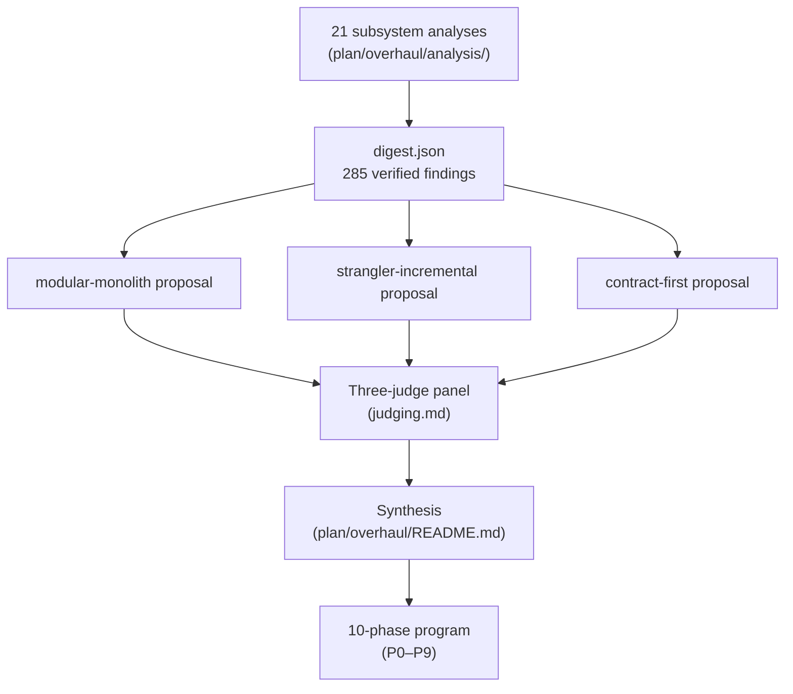
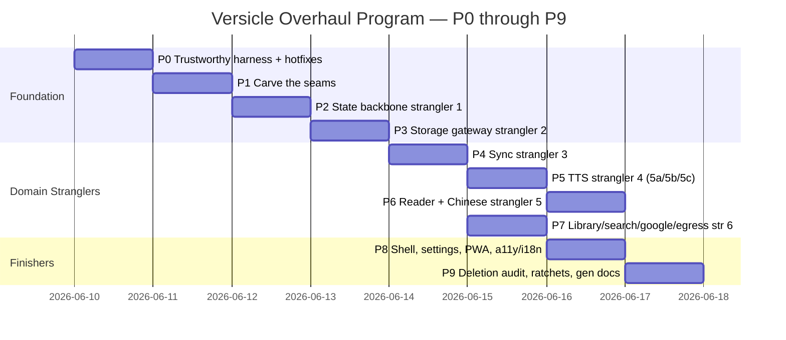
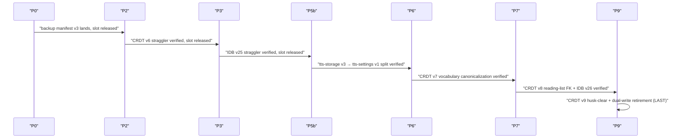
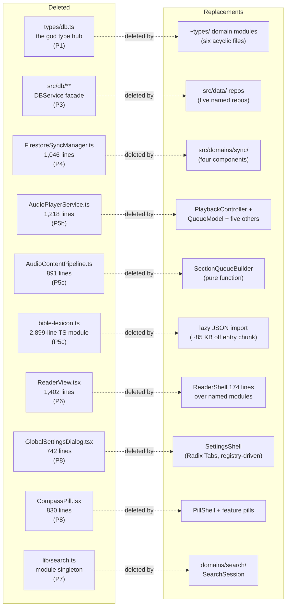
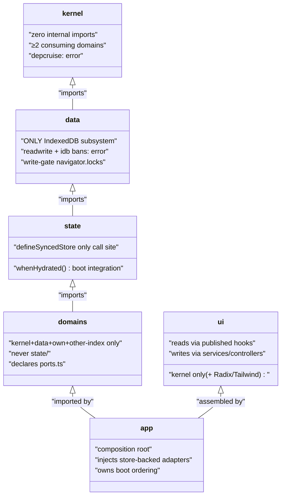

# The Overhaul: History & Rationale

This document is the meta-history a new maintainer should read first. It tells you **why** the
codebase looks the way it does, **what** was wrong before, and **how** 182 commits across ten
phases (P0–P9) transformed ~46k lines of accrued technical debt into the modular-monolith
destination you see today. Read this alongside [Architecture overview](10-architecture-overview.md)
for the end-state and [Contract-first registry](12-contract-first-registry.md) for the governance
model that now enforces the boundaries.

---

## 1. Where the Debt Came From

Versicle was built almost entirely by AI coding agents over 3,600+ commits. That development
model produces good code exactly where contracts exist that the agent cannot violate without a red
CI, and accumulates debt wherever contracts are missing. The codebase had almost none.

The overhaul was initiated at commit `3b0cfcff`. A multi-agent deep analysis ran against that
working tree: 21 subsystem analysts, adversarial verification of every critical and high-severity
finding, three competing architecture proposals, and a three-persona judge panel. The output was
285 verified debt findings in [digest.json](../../plan/overhaul/digest.json), a 2,556-line
machine-readable inventory with severity, category, suggested fix, and adversarial-verification
verdict for every item.

The verdict across all 21 reports was consistent: **quality is highest exactly where explicit
boundaries already existed** — the EngineContext/PlaybackBackend/AudioSink hexagonal ports,
`replicationSpec.ts`, the three-domain IDB taxonomy — **and debt sediment accumulated wherever
boundaries were missing**.

### The Five Debt Clusters

The 26 confirmed critical findings group into five classes:

| Class | Representative criticals |
|---|---|
| **Data loss / destructive-before-validate** | "Clear All Data" never cleared the Yjs IndexedDB (`versicle-yjs` survived a full wipe); backup restore wiped local data *before* validating the replacement; workspace switching had a data-loss window with a rollback that could silently fail; batch import silently dropped failures |
| **Cloud security** | `firestore.rules` contained invalid syntax and a catch-all that neutered tombstone protection; Cloud Storage held workspace snapshots with no rules or deploy story; `deleteWorkspace` left remote data behind |
| **Schema-evolution hazard** | Inbound Yjs hydration deleted state keys absent from the Y.Map, so *no field could be safely added to any synced store*; the migration runner raced its own version bumps behind nested dynamic imports with swallowed errors; ephemeral popover UI state was synced through the CRDT to other devices |
| **Concurrency without ownership** | TTS provider-event and gesture paths bypassed the TaskSequencer; cloud-provider fallback double-fired; playback speed was applied at both synthesis and playback; library import/restore/offload were race-prone multi-store sagas (five separate race-regression test files were the fossil record); NFKD normalization after offset bookkeeping corrupted CFIs for every non-ASCII book |
| **Unsequenced boot and unenforceable boundaries** | Importing modules booted Yjs persistence, Google auth, and window globals (229 of 266 modules executed eagerly); App.tsx boot depended on implicit cross-effect ordering; no network egress boundary existed, and the CSP was decorative; two overlapping global keyboard registries caused destructive conflicts |

The **meta-cause** was structural: the development process that produced the debt had no
mechanical guard against repeating it. The overhaul's primary objective was not to fix each bug
individually but to make the same class of failure **impossible to re-introduce without a red CI**.

### The Keeper List

Not everything needed fixing. The analysis explicitly confirmed these architectural decisions as
correct and worth building on:

- The EngineContext/PlaybackBackend/AudioSink hexagonal ports and the parity-scenario test pattern
- The three-domain IDB taxonomy (STATIC / CACHE / APP)
- Per-device progress modeling (`bookId → deviceId → UserProgress`)
- The WebKit IDB-hang engineering (`DBService`'s synchronous-callback write API)
- Sanitize-at-serialize XSS boundary
- Checkpoint-before-danger discipline
- `handleDbError` boundary mapping
- Geometry-overlay portals
- The hermetic Dockerized E2E runner
- Seeded fuzz infrastructure
- GPL-3.0-or-later licensing posture

---

## 2. Three Proposals, One Synthesis

Three competing architecture proposals were independently produced from the same verified digest
and then evaluated by three judge personas. The full record is in
[judging.md](../../plan/overhaul/judging.md).



### The Scores

| Judge | modular-monolith | strangler-incremental | contract-first | Winner |
|---|---|---|---|---|
| Pragmatic staff engineer | 31 | **35** | 33 | strangler-incremental |
| Domain architect (end-state quality) | 33 | **35** | 30 | modular-monolith¹ |
| Release/data-safety engineer | 32 | **35** | 34 | strangler-incremental |

¹ Judge 2 scored strangler highest in aggregate but chose modular-monolith as winner on their
persona's criterion: end-state quality dominates, and strangler's destination was "today's
taxonomy, disciplined" rather than vertical domain modules.

### What Each Proposal Got Right (and Wrong)

**Strangler-incremental** won the journey. Its key insight: "the only plan whose sequencing is
organized around never leaving user data half-migrated." Phase 0 hardened every recovery path
*before* any schema change. The "why state first" argument for Phase 2 was called "the sharpest
sequencing insight in any proposal" by all three judges: until merge-over-defaults hydration
landed in the forked `zustand-middleware-yjs`, adding any field to a synced store wiped it for
existing users — so fork surgery had to gate everything else.

Its weakness: the end state kept the horizontal layer geometry that let 285 debts accumulate.

**Modular-monolith** had the best end state. Vertical domain modules with `ports.ts` + `index.ts`
public APIs generalized the codebase's one proven boundary (EngineContext). Co-locating each
domain's UI inside its module "kills the CompassPill/ReaderView regrowth habitat structurally,
not by convention." TypeScript project references made dependency direction a compile-time
property.

Its weakness as a journey: "the highest-churn path — moves essentially every file." Its Phase 1
"hotfix" bundle ran a CRDT schema change on the *current* broken migration runner, and v6 was
then completed by a *different* runner in Phase 3 — "two partial schema migrations through two
mechanisms means more mixed-fleet states than either competitor."

**Contract-first** had the best governance. "The C1–C12 contract inventory table is the single
best artifact across all three proposals." The contract-version-bump-requires-suite-change-in-same-PR
CI rule was called "the single best guard for the agent-maintained future of this codebase."

Its weakness: a dedicated freeze phase authoring all contracts with consumers still on old code is
"a classic stall point — interfaces designed before migration pressure are speculative." Confirmed
criticals waited behind contract authoring (NFKD CFI corruption until Phase 4, rules rewrite
until Phase 3, composition root until Phase 6).

### The Synthesis

The program takes each proposal at its best:

- The **strangler's order of operations** (shippable after every phase, data never half-migrated)
- Replacement code landing directly at **modular-monolith addresses** (no double moves)
- Under **contract-first governance** authored just-in-time at the phase that carves each seam

The grafted additions to the strangler's base plan are documented in detail in
[judging.md](../../plan/overhaul/judging.md) §Grafts.

---

## 3. The Ten Program Rules (The Constitution)

Before examining the phases, understand the rules that governed every phase. A phase was not
"done" while any rule was red.

| # | Rule | Why it exists |
|---|---|---|
| 1 | **Shippable after every phase** — full unit + E2E suite green, app usable | Prevents the "half-split" pattern that created most of the debt |
| 2 | **A strangler completes by deleting its legacy path** — exit criteria name the artifact that must be gone | Prevents abandoned half-splits from accumulating again |
| 3 | **Per-phase warn→error boundary flips** — each boundary rule becomes CI-blocking in the phase that establishes it; ratchet counters never regress | Makes the CI the enforcement mechanism, not code review |
| 4 | **At most one in-flight user-data format change at any time** | Bounds the blast radius of any migration failure to one recoverable format |
| 5 | **N+1 release staging for schema relocation** — new schema surface ships its *write* one full release before any client depends on *reading* it | Keeps three fleet generations interoperable during rollout |
| 6 | **Two-client upgrade E2E before every schema phase ships** — old-version doc snapshot vs new client, quarantine asserted | Elevated from a one-time v6 test to a standing rule |
| 7 | **Characterization before change** — behavior-pinning suite must be green before internals are touched | Entry gates for every strangler (parity suite green, overlay E2E green) |
| 8 | **Test-absorption ledger** — a per-bug test file is deleted only in the same PR that lands its assertions in the owning suite | Keeps the "one-off regression file" fossil record from growing back |
| 9 | **Boot tasks register into the bootstrap registry** — `app/bootstrap.ts` owns ordering, not imports-of-everything | Prevents `bootstrap.ts` from becoming the next god file |
| 10 | **Agent-loop verification** — AGENTS.md is generated from registries; before a phase closes, a live agent runs the documented workflow to prove the docs match reality | Closes the loop that generated most of this debt |

---

## 4. The Phase Timeline



The dependency structure from [README.md](../../plan/overhaul/README.md):

```
P0 → P1 → P2 (state backbone) → P3 (data/) → P4 (sync)
                                                │
                        ┌───────────────────────┼────────────────────────┐
                        ▼                       ▼                        ▼
              Track A: P5 audio        Track B: P7 library/     P6 reader+chinese
              (5a→5b→5c)               search/google/egress      (gated on 5c's
                                                                  CFI kernel)
                        └───────────────► P6 reader + chinese ◄──┘
                                                  │
                                        P8 shell/settings/PWA → P9 deletion audit,
                                                                  ratchets, generated docs
```

Tracks A and B are independent after P4. The program ran serially (one stream) in the order
P5 → P6 → P7, as Track A's 5c CFI kernel gates P6.

---

## 5. Phase-by-Phase Narrative

### P0 — Trustworthy Harness + Stop-the-Bleeding (2026-06-10)

**Why first:** the test suite could not be trusted, and several bugs were actively destroying user
data. No structural change is safe without a trustworthy CI.

**What landed:** Eleven hotfix PRs in the same phase as the harness work:

- `wipeAllData()` — fixed to delete *both* `EpubLibraryDB` and `versicle-yjs`
- `firestore.rules` + `storage.rules` rewrite — fixed invalid syntax, tombstone protection,
  Cloud Storage deploy story; BYO-Firebase rules-lockout mitigation (in-app permission-denied
  detection)
- Backup validate-before-destroy + manifest v3 + pre-restore checkpoint + cover repair — the
  only format change in this phase (backup manifest v3 = the program's first in-flight token)
- Popover state moved out of the CRDT
- Migration-checkpoint pinning
- TTS speed policy (synthesize at 1.0, rate at sink, cache-key fix)
- NFKD fix-forward (NFKD normalization after offset bookkeeping was corrupting CFIs for
  non-ASCII books)
- `preprocessTableRoots` deletion (escaped-template-literal bug)
- Batch-import per-file error surfacing
- Keyboard-arrow gating on TTS status
- `alignmentData` unification

**Harness work:** Single vitest config; typechecked tests; CI with `npm ci` + pinned Node;
dependency-cruiser ruleset in warn mode with frozen baselines; worker-chunk assertion;
emulator suite skeleton; typed test doubles and `flushPersistence` test API; a11y lint/axe
baseline; license gate; `TESTING.md`/`AGENTS.md` rewrite; `docs/adr/0001-i18n-strategy.md`.

**Metrics at close:** P0 baseline: 1,805 vitest tests. Coverage floor: lines 65.30 /
stmts 64.04 / funcs 58.65 / branches 56.08.

### P1 — Carve the Seams (2026-06-10)

Split into two sub-phases to separate pure code motion from behavior-affecting changes:

**1a: Pure code motion.** `types/db.ts` (the god type hub) dissolved into six acyclic domain
modules behind a re-export shim (shim deletion deadline: P9). Host adapters and repositories
relocated to `src/app/`. Dead code knip-deleted (~2,350 LOC + assets across 45 files + binary
assets verified in [phase1-deletions.md](../../plan/overhaul/prep/phase1-deletions.md)). Path aliases
codemodded repo-wide (1,069 import sites; lint-enforced).

**1b: Boot sequencing.** Behavior-affecting by design: Yjs persistence construction left module
scope for `app/bootstrap.ts` (the C11 boot-task registry). One `installTestApi()`. `App.tsx`
shrunk from 375 to 90 lines. Boot integration tests gate this: post-wipe boot, migration-interrupt
boot.

**God files hit in P1:** `types/db.ts` (dissolved).

**Notable deleted items (from [phase1-deletions.md](../../plan/overhaul/prep/phase1-deletions.md)):**
The `use-local-storage.ts` hook + 8 test files (~421 LOC, zero production consumers);
`AudioReaderHUD` + `SatelliteFAB` (dead UI components); `SyncEngine.ts` (105 lines, only
consumers were no-ops); `CostEstimator`/`useCostStore` (write-only telemetry, nothing read it);
`src/lib/sync/validators.ts` + its fuzz suite (442 LOC, only tests consumed it).

**Ratchet progress:** lib→store 54→36; full-graph cycles 117→66. Runtime cycles (33) deliberately
untouched — pure code motion preserves cycles; they fall with the domain stranglers.

### P2 — Strangler #1: The State Backbone (2026-06-10)

**The most blocking prerequisite.** Until merge-over-defaults hydration landed, adding any field
to a synced store silently wiped it for existing users on the receiving device. This gated
everything.

**Fork surgery on `zustand-middleware-yjs`** (vendored as `packages/zustand-middleware-yjs`):
Four additive changes to the 705-line `yjs.mjs`:

1. `syncedKeys` whitelist — only declared keys replicate, preventing unknown keys from
   overwriting store state on hydration
2. `hydration: 'merge-defaults'` — initial hydration merges over declared defaults rather than
   replacing the entire store (closing the "no field can be safely added" critical)
3. `scopedDiff` — per-key diffing enables the new store registry to report what actually changed
4. `api.yjs` handle + `scope` — exposes `whenHydrated()` promise per store, enabling the boot
   sequencer to await actual hydration rather than polling

**CRDT v6 migration** (the phase's one format change): popover key deleted from the CRDT;
`meta` Y.Map introduced with N+1 dual-write staging (writes land one release before reads depend
on them, per rule 5); preferences folded to one keyed map. Real v1/v2/v4/v5 Y.Doc fixtures
captured as regression anchors; two-client quarantine tests pin the convergence.

**Three-tier store registry** at [`src/store/registry.ts`](../../src/store/registry.ts):
every store declared as `synced | local-persisted | ephemeral`. Nine synced stores flipped to
merge-defaults + scopedDiff in a specific safe order (contentAnalysis → vocabulary → devices →
lexicon → reading-list → preferences → annotations → books → progress). All defensive `|| {}`
top-level hydration fallbacks deleted (five per-book progress guards stayed — those guard a
legitimately absent book entry, not hydration deletion).

**`defineSyncedStore`** became the only call site for the `yjs()` middleware — the raw middleware
import banned elsewhere by lint.

### P3 — Strangler #2: The Storage Gateway (2026-06-10)

**`src/data/` is now the only IndexedDB subsystem.** Everything that previously touched IDB
directly was replaced with repository calls.

Key deliverables:

- **`navigator.locks` write-gate** — spans tabs AND the TTS worker, closing the
  live worker/main readwrite-overlap hazard that could corrupt the audio cache
- **Hardened connection** — blocked/blocking/terminated event handling, retry-with-reset,
  `storage.persist()` call
- **Zod `rows/`** — every IDB row type defined as a zod schema; the two validator modules
  (previously in `src/lib/sync/validators.ts` and `src/db/validators.ts`) absorbed
- **Five repositories** carved from the now-deleted `DBService` façade: bookContent,
  playbackCache, audioCache, diagnostics, checkpoints. `src/db/**` deleted
- **`packages/y-idb`** — the y-idb fork vendored with `flush()`/`writeSnapshot()`/durable-`synced`
  surgery behind contract tests; the raw `indexedDB.open('versicle-yjs')` re-implementation
  + 1000 ms sleep + temp-provider dance in BackupService deleted
- **`YjsSnapshotService`** — unified the three previously separate snapshot mechanisms
- Audio-cache LRU eviction; shared `coverUrl()`
- Wipe inverted behind a hook registry (enabling post-P4 domains to register cleanup)

**IDB v25** (the phase's one format change): straggler guard (snapshot-before-delete into
`app_metadata['legacy-recovery-v25']`); `schemaHistory` envelope; `by_lastAccessed` index with
idle size backfill; v18/v24 fixture upgrades + multi-tab upgrade pinned in
`src/data/migrations.test.ts`.

**Boundary enforcement:** readwrite/`idb`-import bans flipped to error at phase exit, zero
exceptions. `db-not-to-store` retired at 0.

### P4 — Strangler #3: Sync (2026-06-11)

`FirestoreSyncManager.ts` (1,046 lines) decomposed and deleted. Replaced by `src/domains/sync/`
with four components over injected ports:

- `AuthSession` — authentication lifecycle
- `ProviderConnection` — Firestore connection management + quarantine enforcement
- `WorkspaceService` — workspace CRUD + honest `deleteWorkspace` (tombstone-first → full purge
  of updates/history/maintenance/metadata + Cloud Storage blobs, conditional sever)
- `SyncOrchestrator` — coordinating the above with a typed `SyncEvent` bus

**Three-layer doc-level quarantine** on the `meta` Y.Map: pre-attach probe, pre-apply scratch
check, live observer + heartbeat stop + metadata stamp.

**Crash-resumable staged workspace swap:**
Download → verify → durable `versicle-yjs-staging` DB → `STAGED` state → idempotent boot-time
apply under the cross-tab swap lock. Kill-mid-switch pinned at every pause point in vitest +
a permanent Playwright journey. Boot-time rollback hard-path fix + `previousWorkspaceId` revert.

**Mock code** (`MockBackend`, `MockFireProvider`) moved entirely out of the production bundle,
chunk-content-checked.

**`app/sync/wireSyncEvents.ts`** — the single presentation subscriber to the SyncEvent bus.
Toast-import ban at error prevents domain modules from importing UI concerns directly.

**Deferred:** y-cinder vendoring, `saved` fork delta, redirect-flow deletion, DataRecoveryView
retarget, android-backup ADR.

### P5 — Strangler #4: TTS (2026-06-11)

The most complex phase, split into three sequential sub-phases behind a 23-scenario × 2-transport
parity gate (zero `it.fails` riders).

**Entry gate:** `engineParityScenarios` expanded and green on both transports (in-process AND
worker-over-Comlink) before any engine internals touched.

**5a: Providers.** `ProviderDescriptor` registry with narrowed `ITTSProvider` interface (reject-only
`play`, `dispose`/unsubscribe). Single failure path: the manager rethrows typed
`ProviderPlaybackError`; the double-fire died. `describeProviderContract` ×6. Piper vendored
into `third-party/piper/` with `PROVENANCE.md` + `PiperRuntime` (postinstall string-patching
deleted). IDs unified (`'local'` alias retired to named providers).

**5b: Engine.** `AudioPlayerService` (1,218 lines) decomposed and **deleted**:
- `PlaybackController` — the FSM + sequencer, with epoch-based cancellation
- Immutable `QueueModel` — copy-on-write queue state (the in-place mutation critical died)
- `AnalysisApplier` — absorbs the three `loadSection` call sites
- `MediaMetadataPublisher` — lock-screen metadata
- `DragnetGesture` — capture path, now properly sequenced
- `SessionStore` / `BookContentPort` — injected ports; `vi.mock` allowlist in the engine
  directory dropped to ∅

Single `PlaybackSnapshot{seq}` channel replacing the dual notification paths. Sequencer epochs +
the "only sequenced tasks mutate" dev-assert.

`tts-storage` v3 → `tts-settings` v1 split (the phase's two format changes — this was the
one allowed per-phase exception since they are a single logical split with no fleet gap).
Captured-blob regression fixture pins voice-profile and API-key survival across the split.

Replication echo dead by construction. Flight-recorder ring core extracted to
`src/kernel/diagnostics/`.

**5c: Content.** Canonical CFI kernel at `src/kernel/cfi/`:
- Parsed-component oracle
- `cfiContains`/`stripCfiWrapper` with the definitive separator set (`/`, `!`, `:`, `[`, `,`)
- The `ACP ['/', '!', ':']` mis-grouping bug (which made CFIs wrong for any EPUB with tables)
  died here
- Seeded property-equivalence suites >10k cases
- `epubcfi` import quarantined to one kernel shim

`AudioContentPipeline` deleted — replaced by pure `SectionQueueBuilder({queue,title}` — HOST
writes readerUI). `ReferenceSectionDetector` strategy (deterministic | GenAI via existing
service surface, injected telemetry). `{sentences, citationMarkers}` travel together.

`LexiconEngine` with `CompiledLexicon` keyed by (bookId, language, store version),
store-subscription invalidation including a worker `lexicon` replication ping, mid-playback
edits live.

The 2,899-line `bible-lexicon.ts` TS module → lazy JSON (entry-chunk effect asserted in the
build check).

Extractor relocated to `lib/ingestion/` with raw-at-rest extraction v3; old rows retained until
CFI-alignment self-check passes.

**Absorption ledger FULLY closed** (rows 1–19 ✅, row 20 keeper — documented in
[phase5-absorption-ledger.md](../../plan/overhaul/prep/phase5-absorption-ledger.md)).

### P6 — Strangler #5: Reader + Chinese (2026-06-12)

**Entry gate:** six-overlay + session-recording characterization E2E green.

**Reader engine port** (`src/domains/reader/engine/`):
- `EpubJsEngine` = sole runtime epubjs importer (lint rule at error; the acceptance test is that
  swapping to foliate-js is a one-module change)
- `FakeReaderEngine` + conformance suite prove renderer-agnosticism
- `epubjs.d.ts` ambient shadow retired; `cfi-utils.ts` shim deleted (kernel/cfi adopted)

**`epubSecurity`** — ONE sanitize/sandbox module; prod bypass closed.

**`HighlightLayerManager`** + ONE styles registry + `ReaderOverlay` — six overlay systems
consolidated; orphan-sweep implemented once.

**Serialized `ReadingSessionRecorder`** — D6 out-of-order writes died.

**`ReaderCommands` context + registry** — window CustomEvents + callbacks-in-store died.

**`ReaderView` (1,402 lines) → `ReaderShell` at 174 lines** over named modules.

**`domains/chinese/`** as a self-contained feature module:
- Code-point-safe `PinyinGeometryEngine` (astral/surrogate fixture green)
- Section-keyed `ChineseContentProcessor` on the engine's content seam with per-section
  cancellation
- App-layer registration via `getBookBaseLanguage` (exact-match bug died)
- IDB `DictionaryService` on separate `versicle-dict` DB with import status surface +
  SW CacheFirst `/dict/*` (the 80 MB in-memory map + any-CJK-selection fetch died)
- `cedict.json` removed from git (pinned + checksum-verified CI build, provenance sidecar,
  mock fallback deleted — licensing gap D5 closed)

**CRDT v7** — vocabulary simplified-key canonicalization (committed trad→simp table inverting
the display mapping; min-timestamp merge; v6-vs-v7 two-client quarantine pinned).

### P7 — Strangler #6: Library, Search, Google, Egress (2026-06-12)

Run as two parallel sub-tracks on separate worktrees, merged at phase close.

**`domains/library/`:**
- One `extractBook()` — the triplication died
- `ImportOrchestrator` job queue
- SHA-256 `contentHash` identity
- `LibraryService` cutover with per-book keyed mutex (the five race-regression test files
  ported to service invariants *before* cutover, then deleted via the absorption ledger)
- `libraryViewStore` — projection port for UI read

**`domains/search/`:**
- `SearchSession` + persisted `searchText` repo + per-occurrence CFIs
- `lib/search.ts` module singleton died

**`domains/google/`:**
- `GoogleAuthClient` with per-service tokens
- `GenAIClient` with per-feature zod modules + redacted ring-buffer logs + per-book AI consent
- `@google/generative-ai` SDK removed; all calls route through NetworkGateway

**`kernel/net/`:**
- Egress destination registry + `NetworkGateway`
- Raw-fetch lint ban at error (zero production exceptions outside `src/kernel/net/`)
- Generated CSP + the registry==CSP test as a permanent invariant

**CRDT v8** — reading-list `bookId` FK linker (the one-time migration joins existing entries
to the inventory via exact filename then fuzzy title+author match).

IDB v26 — additive `cache_search_text` store creation (the phase's second format token, through
P3's versioned migration registry).

### P8 — Shell, Settings, a11y/i18n, PWA (2026-06-12)

The shell and cross-cutting concerns that could only safely land after all module-scope side
effects were gone.

**Routes:** `/`, `/notes`, lazy `/read/:id`, `/settings/:tab?` with first-use dynamic imports
(Firebase, GenAI, epubjs out of the entry chunk). Check-4 content assertion + gzip ratchet in
`bundle-baseline.json`.

**Settings registry + `SettingsShell`** over Radix Tabs. `GlobalSettingsDialog.tsx` (742 lines)
**DELETED**. `CompassPill.tsx` (830 lines) dissolved into `PillShell` + feature pills.

**Interaction model:**
- Queue-based toast store + `ToastHost`/`ConfirmHost`/`SWUpdatePrompt` ABOVE the router gate
  (boot-time toasts no longer dropped)
- `LiveAnnouncer` + `useConfirm` (native `confirm`/`alert`/`prompt` banned at ERROR)
- `KeyboardShortcutService` (both window `keydown` registries + the P0 interim predicate
  deleted; `keydown` lint ban)

**`kernel/locale/`:** typed `MessageKey` catalog, cached-Intl formatters, `documentElement.lang`,
`toLocale*` ban, `lang` attribution on book-text surfaces.

**Reduced-motion policy:** global CSS override + `useReducedMotion`.

**PWA finishers:**
- Single manifest verified + installability fields
- Prompt-style SW update replacing the fielded `skipWaiting` flow: SKIP_WAITING handshake,
  persistent Reload toast, one-way-safe handoff
- CacheFirst runtime caching for `/fonts`, `/dict`, `/piper`
- Honest soft SW boot gate — the dead Critical Error screen deleted; one-shot degraded notice

**CSP strict flip:** the legacy `https:` wildcard gone from `connect-src` AND `img-src` — the
egress registry is now ENFORCED. The sanitizer strips remote EPUB resources (killing tracking
pixels).

**Font rename off OFL Reserved Names** (`Versicle Sans Narrow` via committed
`scripts/build-pinyin-font.py`; read-time `fontFamily` normalization — NO persisted migration:
the P8 format-change slot was **released**). P8 ships zero user-data format changes.

`jsx-a11y` recommended at ERROR for `ui/`, `app/settings/`, `app/shortcuts/`, and the pill
feature directories.

### P9 — Deletion Audit, Ratchet Completion, Generated Docs (2026-06-12)

The program's close-out and the rule-10 payoff. Full record:
[phase9-close.md](../../plan/overhaul/prep/phase9-close.md).

**knip sweep:** `npm run knip` as a CI gate (zero findings at flip). ~270 dead export/type
specifiers swept; nine dead test-seam helpers; dead error classes; five dependency husks;
five missing honest devDeps.

**Lint-debt ratchet to the justified floor:**

| Counter | Phase 0 baseline | P9 exit |
|---|---|---|
| `as any` + `: any` sites | 138 | **20** |
| `eslint-disable` directives | 245 | **25** |

Mechanism: `scripts/lint-debt-ratchet.mjs` (`npm run lintdebt:check`, CI quality job). Exact-match
ratchet: counts above the entry fail (regression), below fail too until `--update` locks the
decrease in. New entries need hand-written justification. The irreducible rest lives in
`lint-debt-allowlist.json`.

**Boundary rule end-state:** every rule from the master plan §2 audited. Four rules flipped to
error with zero exceptions at this close: `types-imports-nothing`, `no-circular`,
`no-circular-runtime`, `lib-not-to-components`. The last full-graph cycle (PlaybackBackend ⇄
TTSProviderManager, type-only) killed by moving `TTSProviderEvents` to its consumer side.

**P1/P3/P5 shims deleted** at their named deadlines: `types/db.ts` re-export shim (P9),
`idb-write-lock` shim (P3-implied), dual-write retirement (CRDT v7 `library.__schemaVersion`,
retired in the v9 migration).

**CRDT v9** (the program's terminal format change): preferences husk-clearing,
`library.__schemaVersion` dual-write retirement (`meta` becomes the sole version authority;
`library` frozen at 8 as a pre-meta poison-pill tripwire), `activeContext` Y.Map husk pruning.

**Registry-generated docs:** `src/app/docs/registryDocs.ts` renders `architecture.md`,
`AGENTS.md`, and the kernel/data/domains READMEs from the LIVE registries.
`src/app/docs/docs.test.ts` is the drift gate inside `npm test`: authored module maps must
equal the filesystem, every C1–C12 and boundary-rule file pointer must exist, generated files
must byte-equal the rendering. `npm run docs:generate` regenerates.

**Agent-loop verification (rule 10):** in a fresh `env -i` shell (HOME + node PATH only),
eleven documented gate commands from the regenerated AGENTS.md were executed in order:
`npm run lint`, `npx tsc -b`, `npm test`, `npm run build`, `npm run depcruise:check`,
`npm run lintdebt:check`, `npm run knip`, `npm run check:worker-chunk`,
`npm run check:single-instance`, `npm run licenses:check`, `npm run coverage` — all eleven
exit 0.

---

## 6. The Format-Change Chain

Program rule 4 was enforced throughout: **at most one in-flight user-data format change at any
time.** The full chain:



| Format change | Phase | What it does |
|---|---|---|
| Backup manifest v3 | P0 | Added `coverBlobBase64`, validate-before-destroy, v2 reader kept forever |
| CRDT v6 | P2 | Popover key deleted, `meta` map dual-write (N+1 staged), preferences folded |
| IDB v25 | P3 | Straggler guard, `schemaHistory` envelope, LRU index |
| `tts-storage` v3 → `tts-settings` v1 | P5b | Settings/playback store split with captured-blob regression fixture |
| CRDT v7 | P6 | Vocabulary simplified-key canonicalization (trad→simp table, min-timestamp merge) |
| CRDT v8 + IDB v26 | P7 | Reading-list `bookId` FK linker; `cache_search_text` store creation |
| CRDT v9 | P9 | Preferences husk-clearing, dual-write retirement, `activeContext` husk pruning |

**P8 format-change slot was released.** The font preference rename was a read-time normalization
via `fontFamily` mapping in the preferences store — no persisted migration needed. P8 ships zero
user-data format changes.

---

## 7. The God Files Deleted

The overhaul eliminated every god file. The strangler pattern was used in each case: the
replacement was written first at its final modular address, the god file was deleted only when
the strangler was complete, and the phase exit criteria named the deletion as a hard requirement.



One partial decomposition worth noting: `useEpubReader.ts` (1,006 lines) was not deleted but
shrunk to 479 lines by extracting named modules for each concern — the strangler pattern applied
within a single file.

---

## 8. The Scoreboard

The full scoreboard from start (`3b0cfcff`) to close:

| Metric | Start | Close |
|---|---|---|
| Phases landed | — | 10/10 (P0–P9) |
| Program commits | — | 182 |
| Verified criticals retired | 0/26 | **26/26** |
| Vitest | 1,805 tests | **3,103 tests / 307 files** |
| dependency-cruiser violations | 207 | **35** (`lib-not-to-store` 19 + `worker-no-state-typegraph` 16) |
| Import cycles (full graph / runtime) | 117 / 33 | **0 / 0** (both rules at error) |
| Production `as any`/`: any` | 138 | **20** (justified per file in `lint-debt-allowlist.json`) |
| `eslint-disable` directives | 245 | **25** (same allowlist) |
| Coverage (lines/stmts/funcs/branches) | 65.30 / 64.04 / 58.65 / 56.08 | **75.49 / 74.29 / 69.89 / 65.50** |
| Playwright journeys | — | 78 spec files |

### Why the Test Count Grew Instead of Shrinking

The master plan estimated "~110 vitest files (from 246)." The final count is 307 files.
This is not a failure of the absorption ledger — the ledger discipline holds. Growth since
the consolidation is exclusively sanctioned categories:

- The **contract tier** (fork suites B/C/D/E + Y.1–Y.11 + F.1–F.7, `describeProviderContract`
  ×6, SyncBackend contract on mock + emulator, repo contracts, CRDT-contract store flips,
  ReaderEngine conformance, engine parity ×2 transports)
- **Captured-fixture suites** (v1–v9 Y.Doc eras, tts-storage blobs, IDB v18/v24, era-8)
- **Seeded fuzz/perf/property companions** (`*.fuzz`/`*.perf`/`.trace`)
- **Per-module unit suites** born from the strangler decompositions

The ~110 number assumed consolidation without the contract tier's growth. The COUNT was never a
CI-enforced ratchet — the enforced rules (ledger discipline, no new one-off files) all hold.

### Coverage Delta Per Phase

Every phase's work increased coverage by approximately 1 point per dimension. The floor was
re-pinned at close: lines 75.49 (+10.19 from baseline), statements 74.29 (+10.25), functions
69.89 (+11.24), branches 65.50 (+9.42). The floor never decreased at any phase.

---

## 9. The Boundary Rules at Close

Ten boundary rules govern the modular-monolith end state, each enforced mechanically:



| # | Rule | Enforcement | Level | Residuals |
|---|---|---|---|---|
| 1 | `kernel/` imports nothing internal | `kernel-imports-nothing` depcruise | error | `~types` sanctioned dep |
| 2 | All IDB via `data/` repos; `readwrite` + `idb` banned elsewhere | eslint import bans + `readwrite`-literal syntactic ban | error | none |
| 3 | Domain services: kernel+data+own+other-domains' index only, never `state/` | `domains-no-store` depcruise | error | ONE carve-out: `store/yjs-provider.ts` for CheckpointService live Y.Doc handles |
| 4 | Domain `ui/` reads via published hooks; writes via services/controllers | store registry README + projection-port pattern | process | no mechanical lint (false-positive risk) |
| 5 | `getState()` outside `state/+app/` is a lint error | structural: `domains-no-store` error + `lib-not-to-store` ratchet | error (domains) / ratchet (lib) | 19 baseline-frozen `lib/` edges |
| 6 | Worker import closure free of zustand/yjs/state | `check:worker-chunk` emitted-chunk content assertion | error | `worker-no-state-typegraph` stays ratchet at 16 type-only edges |
| 7 | All egress via `NetworkGateway.egress()`; CSP generated from the registry | fetch/XHR syntactic bans; registry==CSP test | error | ONE carve-out: `src/kernel/net/**` itself |
| 8 | epubjs only in reader engine; synthesis SDKs only in providers | epubjs runtime ban | error | three named epubjs carve-outs (engine dir, kernel shim, extractor) |
| 9 | Mock seams reachable only from composition root | `check:worker-chunk` emitted-artifact assertion | error | none |
| 10 | TS project references per layer + all test code typechecked | `tsc -b` solution build | partial | per-LAYER composite references conflict with bundler `noEmit` + `allowImportingTsExtensions`; depcruise enforces direction instead |

---

## 10. The Honest Not-Done List

The program closed with a clearly documented hand-off checklist. These items are not failures of
the program — they are known, bounded, and owned:

1. **Docker E2E lane:** the 78-journey Playwright suite was never executed in agent environments
   (no Docker). Run `./run_verification.sh` (desktop+mobile), then `--project=webkit`, then
   `--grep @a11y`. Priority journeys: P6 chinese/pinyin characterization specs, kill-mid-switch,
   six-overlay, deep-link.

2. **On-device QA pass (P5 exit checklist):** Android + iOS Safari — lock screen, background
   keep-alive, cloud→local fallback, dragnet gesture, gapless Capacitor handoff.

3. **BYO-Firebase manual checks:** deploy the rewritten `firestore.rules`/`storage.rules` to a
   real project and verify the version-gated rules-lockout prompt. (The emulator-gated suites
   were re-verified live at close — 37 passed + 1 todo.)

4. **Release-engineering windows (rule 4 aftercare):** verify CRDT v9's straggler path in the
   wild; decide `app_metadata['legacy-recovery-v25']` retention; retire the legacy
   `tts-storage` localStorage key + the accepted `'local'` provider alias once fleet telemetry
   is silent; `sync_log` (dead store, schema frozen ▲16) and the SW legacy-`books` cover
   fallback ride the NEXT IDB bump (v27).

5. **Known flakes:** the fork-contract "two-doc concurrent merges" `scopedDiff`-tripwire
   microtask flush (pre-existing, spun-off task owns root cause; the repro likes a cold
   vitest cache); `SettingsShell` replace-navigation can exceed `findByText`'s default timeout
   under heavy parallel load (passes in isolation).

6. **Residual ratchets** (floors, only decrease): `lib-not-to-store` 19, `worker-no-state-typegraph`
   16, lint-debt 20/25, `jsx-a11y` at error only for P8 directories (rest warn).

7. **Never built (from the end-state sketch):** visual goldens (~10); sanitization-ON remains
   per-spec opt-in in E2E.

8. **Unowned stretch items:** VocabularyVault surface (CH-10), ChineseReadingSettings extraction,
   zh locale-aware sentence-snap flip (recorder passes 'en' until Docker chinese journeys run),
   `MaintenanceService` all-store orphan coverage, `TableAdaptationProcessor`'s inline TOC
   lookup → `findTocItem`, audio-domain relocation to `domains/audio/` (pure motion, documented
   in `src/domains/README.md`).

---

## 11. Lessons: What the Overhaul Proved

### On Agent-Built Codebases

The meta-cause of the debt is accurately stated in [README.md](../../plan/overhaul/README.md): agents
(and humans) write good code against contracts they cannot violate without a red CI. The overhaul
spent its budget making boundaries **explicit, runtime-validated, versioned, and CI-enforced**.
The same development process that produced the debt cannot reproduce it:

- You cannot add a field to a synced store and silently wipe it for users: `merge-defaults`
  hydration + `syncedKeys` whitelist is an admission gate, not a code review note
- You cannot accidentally include zustand in the TTS worker: the chunk-content assertion kills
  the PR
- You cannot write new network egress outside the gateway: the syntactic fetch ban kills the PR
- You cannot add an IDB transaction outside `data/`: the `readwrite` literal ban kills the PR
- You cannot let the generated docs drift from the registries: `docs.test.ts` kills `npm test`

### On Sequencing

The "why state first" insight — that merge-over-defaults hydration must land before ANY new
synced-store field — is the single most important sequencing decision in the program. Getting this
wrong by even one phase would have required a multi-phase rollback or a production data loss
incident.

The "at most one in-flight format change" rule has a less obvious consequence: it forced the team
to think clearly about what is ACTUALLY a migration versus what can be done as read-time
normalization. The P8 font rename — which initially appeared to require a persisted migration —
was ultimately a read-time `fontFamily` mapping. Releasing the format-change slot made the
timeline shorter and the risk smaller.

### On Documentation Drift

The agent-loop verification (rule 10) found that at P9, every piece of documentation that was NOT
generated from a registry had drifted. `AGENTS.md` named a deleted file as the schema home and
referenced an outdated database version. `TESTING.md` claimed all depcruise rules were warn
(eight were at error). The E2E spec site `tsconfig.e2e.json` was missing three aliases that
`tsconfig.app.json` had. This is the natural state of hand-authored documentation in a
fast-moving codebase.

The solution is structural: the documents that agents and humans use to navigate the codebase are
now *rendered from the live registries*. They cannot drift. If the document says a store is
ephemeral, the store's declaration in [`src/store/registry.ts`](../../src/store/registry.ts) is what
the document rendered from. The document and the code are the same artifact.

### On the Strangler Pattern

The strangler pattern has one critical discipline that the program made explicit as rule 2:
**a strangler completes by deleting its legacy path.** Without this discipline, you get the
"abandoned half-split" — two live paths, neither fully trusted, creating maintenance overhead
instead of eliminating it. The program's five dedicated phase-close deletions (P1's batch
deletion audit, P3's `src/db/**` removal, P4's `FirestoreSyncManager` deletion, P5's
`AudioPlayerService` deletion, P9's shim audit) were as important as the additions.

---

## Cross-Reference Map

| Topic | Where to look |
|---|---|
| End-state architecture | [Architecture overview](10-architecture-overview.md) |
| Layering rules and boundary enforcement | [Layering and boundaries](11-layering-and-boundaries.md) |
| C1–C12 contract registry | [Contract-first registry](12-contract-first-registry.md) |
| CRDT and synced stores | [State management and CRDT](13-state-management-crdt.md) |
| CRDT migration coordinator and version history | [CRDT format and migrations](22-crdt-format-and-migrations.md) |
| Bootstrap sequencer and boot contract | [Bootstrap and lifecycle](14-bootstrap-and-lifecycle.md) |
| IDB schema, migration registry, storage gateway | [Storage gateway](20-storage-gateway.md), [Schema and migrations IDB](21-schema-and-migrations-idb.md) |
| TTS engine decomposition | [TTS engine](32-domain-audio-tts-engine.md), [TTS providers](33-tts-providers-and-platform.md) |
| Reader engine port and ReaderShell | [Reader engine](30-domain-reader-engine.md), [Reader UI](31-reader-ui-and-overlays.md) |
| Chinese feature module | [Chinese domain](35-domain-chinese.md) |
| Sync domain decomposition | [Sync domain](36-domain-sync.md) |
| Library, search, Google, egress | [Library domain](37-domain-library.md), [Search domain](38-domain-search.md), [Google domain](39-domain-google.md) |
| Testing strategy and absorption ledger | [Testing strategy](63-testing-strategy.md) |
| PWA and service worker | [PWA and service worker](61-pwa-and-service-worker.md) |
| Build and bundling (chunk assertions) | [Build and bundling](60-build-and-bundling.md) |
| Primary source | [plan/overhaul/README.md](../../plan/overhaul/README.md) |
| Judge record | [plan/overhaul/judging.md](../../plan/overhaul/judging.md) |
| Phase 9 close audit | [plan/overhaul/prep/phase9-close.md](../../plan/overhaul/prep/phase9-close.md) |
| Phase 1 deletion audit | [plan/overhaul/prep/phase1-deletions.md](../../plan/overhaul/prep/phase1-deletions.md) |
