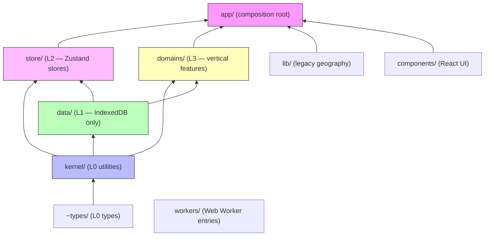
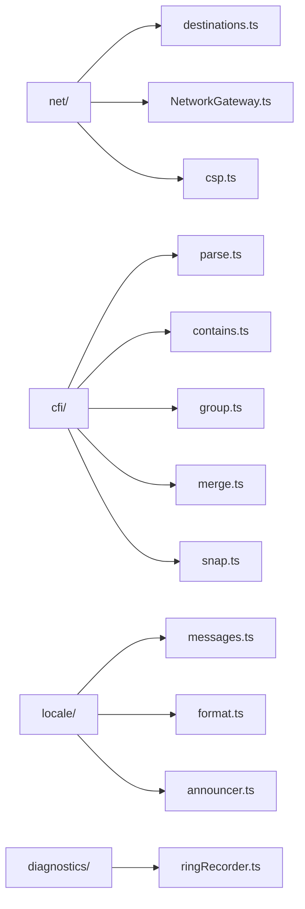
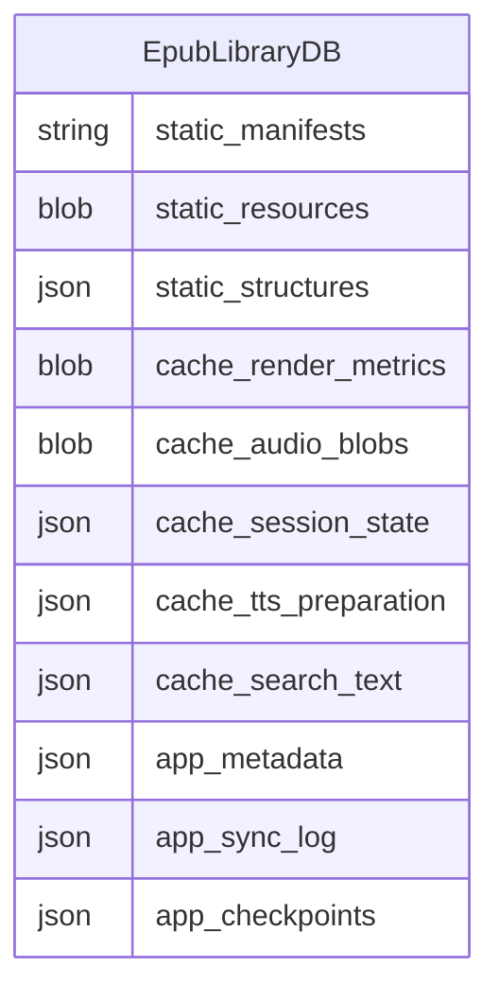
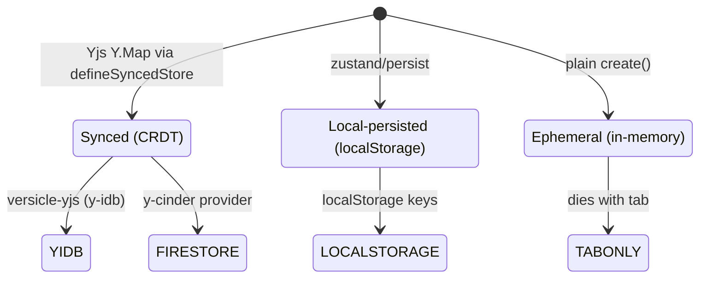
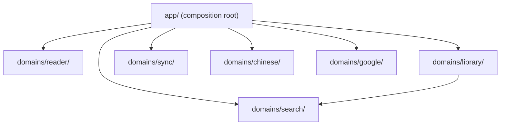
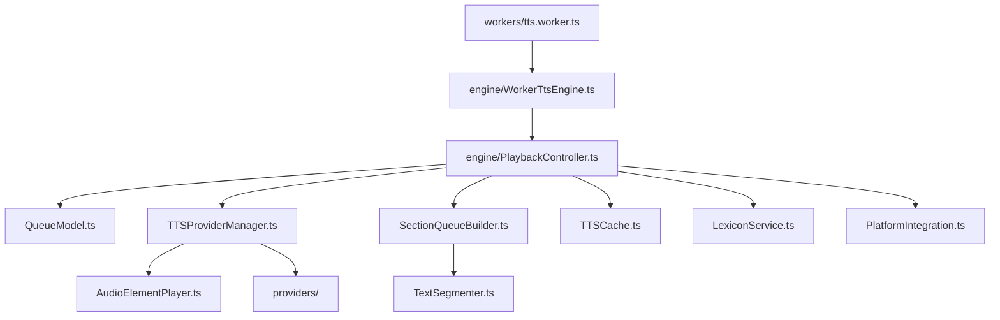
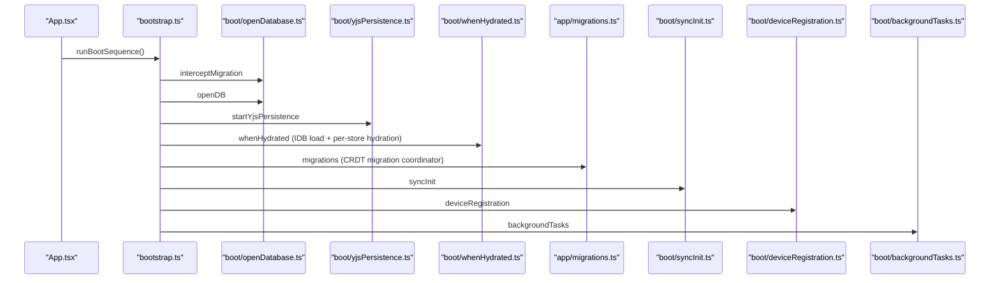
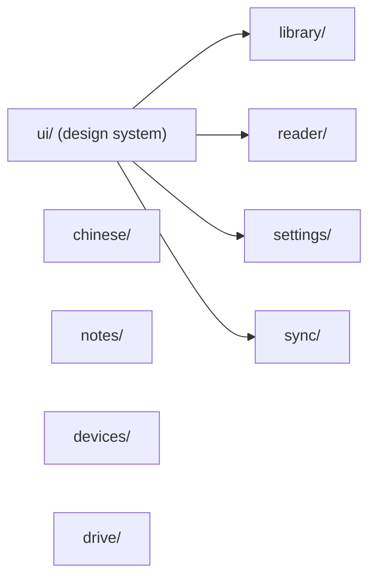
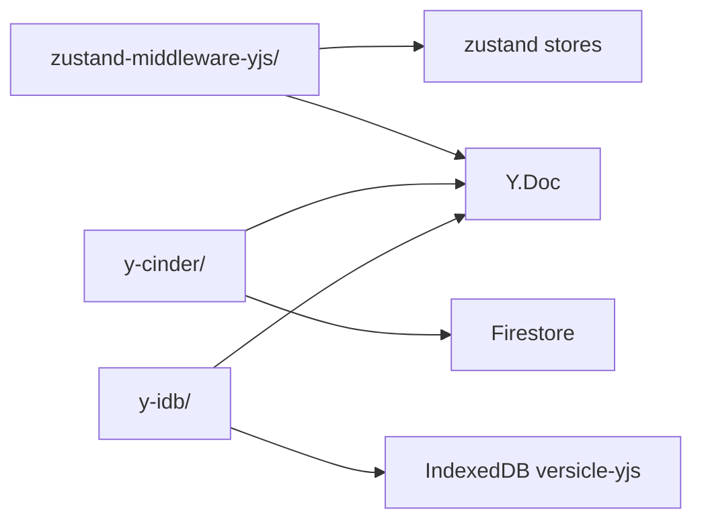

# Annotated Directory Map

This document is the orientation reference for new engineers joining the Versicle codebase. It maps every top-level entry in the repository and drills into every `src/` subdirectory with its purpose, key files, and the design decisions that shaped it. Read this alongside [Architecture overview](10-architecture-overview.md) and [Layering and boundaries](11-layering-and-boundaries.md) for the full picture.

## Why a directory map matters here

Versicle is almost entirely AI-agent–maintained. The canonical sources of truth (registries, generated READMEs, ratchet baselines) exist precisely so agents can re-orient themselves quickly without having to mine scattered comments. This document captures the physical geography, while [Architecture overview](10-architecture-overview.md) captures the logical boundaries and [Contract-first registry](12-contract-first-registry.md) captures the named contracts. Those three together answer: "Where is the code, what layer does it belong to, and what are its non-negotiable invariants?"

---

## Repository root overview

```mermaid
graph TD
    ROOT["versicle/"]
    SRC["src/"]
    PKG["packages/"]
    PLAN["plan/"]
    VERIF["verification/"]
    SCRIPTS["scripts/"]
    THIRDPARTY["third-party/"]
    ANDROID["android/"]
    PUBLIC["public/"]
    DOCS["docs/"]
    GITHUB[".github/"]

    ROOT --> SRC
    ROOT --> PKG
    ROOT --> PLAN
    ROOT --> VERIF
    ROOT --> SCRIPTS
    ROOT --> THIRDPARTY
    ROOT --> ANDROID
    ROOT --> PUBLIC
    ROOT --> DOCS
    ROOT --> GITHUB

    SRC --> KERNEL["kernel/ (L0)"]
    SRC --> DATA["data/ (L1)"]
    SRC --> STORE["store/ (L2)"]
    SRC --> DOMAINS["domains/ (L3)"]
    SRC --> APP["app/ (composition)"]
    SRC --> LIB["lib/ (legacy geography)"]
    SRC --> COMP["components/"]
    SRC --> TYPES["types/"]
    SRC --> HOOKS["hooks/"]
    SRC --> WORKERS["workers/"]
    SRC --> TEST["test/"]

    PKG --> YCINDER["y-cinder/"]
    PKG --> YIDB["y-idb/"]
    PKG --> ZMYJS["zustand-middleware-yjs/"]
```



The table below is the quick-reference index for the root:

| Entry | What it is |
|---|---|
| `src/` | All application TypeScript and React source code. The layered architecture lives here. |
| `packages/` | Three in-tree vendored forks consumed as TypeScript workspace packages. |
| `plan/` | Development planning documents (overhaul master plan, feature PRDs, phase prep). The `plan/overhaul/README.md` §4 program rules remain binding. |
| `verification/` | 74 Playwright E2E specs (`*.spec.ts`), test EPUBs, screenshots, and E2E infrastructure. |
| `scripts/` | Build, lint, code-generation, and maintenance scripts (no application code). |
| `third-party/` | The vendored Piper WASM TTS runtime (`piper/`) and license tracking files. |
| `android/` | Capacitor Android project (Gradle files, google-services.json). Created and managed by `@capacitor/cli`. |
| `public/` | Static assets served verbatim: PWA icons, app fonts, the compiled Chinese dictionary, and test EPUBs. |
| `docs/` | This comprehensive documentation set plus docs generated by `npm run docs:generate`. |
| `.github/` | GitHub Actions workflows: `ci.yml`, `e2e-verification.yml`, `android.yml`, `deploy.yml`, `docker-publish.yml`. |
| `AGENTS.md` | **Generated** working agreement for AI agents. Source: `src/app/docs/registryDocs.ts` + `TESTING.md`. Never hand-edit. |
| `architecture.md` | **Generated** from the live registries. Module map, C1–C12 contract inventory, boundary rules. |
| `TESTING.md` | The ONE authoritative testing document. All test commands, the gate table, E2E/emulator flows, program rules. |
| `README.md` | Project overview. Every update must include the Jules/Antigravity provenance preamble (AGENTS.md rule). |
| `THIRD-PARTY-NOTICES.md` | **Generated** by `npm run licenses:generate` from `third-party/inventory.json` + the npm tree. |
| `index.html` | Single-page app shell. The build injects a CSP `<meta>` tag from the egress registry at build time. |
| `vite.config.ts` | Vite + VitePWA + mkcert + rollup-visualizer configuration. Includes the `cspMetaPlugin` and `piperVendorPlugin`. |
| `vitest.config.ts` | Single vitest config (AGENTS.md rule 3: one config only). |
| `playwright.config.ts` | Playwright E2E config: desktop, mobile, webkit projects. |
| `tsconfig.app.json` | App TypeScript config with the ten path aliases (see `paths` section). References the two composite packages. |
| `tsconfig.test.json` | Extends `tsconfig.app.json`; includes test files and repeats composite references. |
| `tsconfig.e2e.json` | Separate tsconfig for Playwright specs (`verification/`). |
| `tsconfig.node.json` | For `vite.config.ts` and the scripts (Node environment). |
| `capacitor.config.ts` | Capacitor app configuration (app id, webDir, native plugin settings). |
| `eslint.config.js` | ESLint flat config. Includes path-alias enforcement (`no-restricted-imports`), `vi.mock` bans in engine/provider/data dirs, and the lint-debt ratchet. |
| `.dependency-cruiser.cjs` | Dependency-cruiser rules. Layer rules (`kernel-imports-nothing`, `domains-no-store`, etc.) are at **error/0**. |
| `.dependency-cruiser-baseline.json` | Frozen violation counts. Never regress. `npm run depcruise:check` enforces this. |
| `coverage-baseline.json` | Coverage floor. `npm run coverage` must meet or exceed it. |
| `bundle-baseline.json` | Worker-chunk size floor. `npm run check:worker-chunk` enforces this. |
| `lint-debt-allowlist.json` | Frozen lint warning counts per rule. `npm run lintdebt:check` enforces this. |
| `knip.jsonc` | Knip dead-code configuration. `npm run knip` finds unused exports/imports. |
| `firestore.rules` / `storage.rules` | Firebase security rules. Changes trigger the emulator-gated rule suite. |
| `firebase.json` | Firebase CLI config (hosting, emulator ports). |
| `nginx.conf` | Nginx config for the Docker preview/deploy container. Injects the CSP header. |
| `Dockerfile` | Production web container (nginx). |
| `Dockerfile.android` | Android build container. |
| `Dockerfile.verification` | E2E verification container (Playwright in Chromium). |
| `patches/` | `patch-package` patches applied at `postinstall`. |
| `assets/` | Root-level asset directory (distinct from `src/assets/`; holds icons used by the build). |
| `capacitor.config.ts` | Capacitor app id (`ai.versicle.epub`), webDir (`dist`), per-plugin config. |
| `.nvmrc` | Node version pin (Node 25). |
| `.env.local.example` | Template for the required Firebase environment variables. |

---

## Path aliases

Every cross-root import in `src/` uses a TypeScript path alias enforced by `no-restricted-imports` at ESLint error severity. The alias map (from [tsconfig.app.json](../../tsconfig.app.json)):

| Alias | Physical path | Layer |
|---|---|---|
| `@kernel/*` | `src/kernel/*` | L0 — utilities |
| `@data/*` | `src/data/*` | L1 — IndexedDB |
| `@store/*` | `src/store/*` | L2 — Zustand stores |
| `@domains/*` | `src/domains/*` | L3 — vertical domains |
| `@app/*` | `src/app/*` | Composition root |
| `@lib/*` | `src/lib/*` | Legacy geography |
| `@components/*` | `src/components/*` | React UI |
| `~types/*` | `src/types/*` | L0 types (tilde because TypeScript rejects `@types/` — TS error TS6137) |
| `@hooks/*` | `src/hooks/*` | React hooks |
| `@workers/*` | `src/workers/*` | Worker entry points |
| `@test/*` | `src/test/*` | Test harness |

Same-directory and within-subtree imports remain relative. Violations are automatically fixable with `node scripts/codemod-aliases.mjs`.

---

## src/ — the layered source tree

The `src/` directory implements a strict four-layer + composition-root architecture. The layer boundaries are enforced by dependency-cruiser at error severity with zero exceptions:



### Root files in src/

| File | Purpose |
|---|---|
| [`main.tsx`](../../src/main.tsx) | Entry point. Installs `window.__versicleTest` seams in DEV/E2E builds and mounts `<App/>`. |
| [`App.tsx`](../../src/App.tsx) | Boot-state rendering + router gate over `app/routes.tsx`. The boot sequence is `app/bootstrap.ts` (C11 contract). |
| [`sw.ts`](../../src/sw.ts) | Service worker: Workbox precache, runtime caching strategies, SKIP_WAITING handshake. |
| [`test-api.ts`](../../src/test-api.ts) | `window.__versicleTest` page-side E2E seams (`flushPersistence`, `resetApp`, etc.). All page-side seams go here — never new `window.__*` globals. |
| [`test-flags.ts`](../../src/test-flags.ts) | Compile-time test flags (e.g., `VITE_E2E`). |
| [`index.css`](../../src/index.css) | Global styles: Tailwind `@layer` directives and CSS custom property (theme variable) declarations. |
| [`vite-env.d.ts`](../../src/vite-env.d.ts) | Vite client-side type declarations (`import.meta.env`). |
| [`integration.test.ts`](../../src/integration.test.ts) | Cross-store integration tests. |
| [`App_Boot.test.tsx`](../../src/App_Boot.test.tsx) | C11 boot sequence test suite. |
| [`App_Capacitor.test.tsx`](../../src/App_Capacitor.test.tsx) | Capacitor-specific boot path tests. |
| [`App_MigrationFailure.test.tsx`](../../src/App_MigrationFailure.test.tsx) | Migration failure → `CriticalMigrationFailureView` gate tests. |
| [`App_SW_Wait.test.tsx`](../../src/App_SW_Wait.test.tsx) | Service worker waiting gate tests. |

---

## src/kernel/ — L0 utilities

**The absolute bottom layer.** The dependency-cruiser `kernel-imports-nothing` rule enforces that kernel modules import nothing internal except `~types/`. Admission to this layer also requires at least two consuming domains (the anti-junk-drawer rule, C12).



### src/kernel/cfi/

The canonical CFI (EPUB Canonical Fragment Identifier) algebra. Every CFI operation in the app — parsing, contains-check, grouping annotations by passage, merging adjacent ranges, snapping to sentence boundaries — routes through these modules. The `group.ts` module is consumed by the TTS `SectionQueueBuilder` to group sentences into reading queue items.

| File | Purpose |
|---|---|
| [`parse.ts`](../../src/kernel/cfi/parse.ts) | Tokenizer + parser. Returns a structured CFI object from an EPUB CFI string. |
| [`contains.ts`](../../src/kernel/cfi/contains.ts) | Range containment predicate (`cfiContains`). |
| [`group.ts`](../../src/kernel/cfi/group.ts) | Groups a flat list of CFI-keyed items into ordered passage groups. Used by the TTS content pipeline. |
| [`merge.ts`](../../src/kernel/cfi/merge.ts) | Merges adjacent/overlapping CFI ranges (annotation dedup). |
| [`snap.ts`](../../src/kernel/cfi/snap.ts) | Locale-aware sentence snap: given a CFI inside a word, expands to the nearest sentence boundary using `Intl.Segmenter`. |
| [`generate.ts`](../../src/kernel/cfi/generate.ts) | CFI generation from DOM positions. |
| [`epubcfiShim.ts`](../../src/kernel/cfi/epubcfiShim.ts) | Thin shim over the epubjs `EpubCFI` class for parts of the algebra that delegate to epubjs. |
| [`index.ts`](../../src/kernel/cfi/index.ts) | Public barrel. |

Tests include equivalence fuzz (`cfi.equivalence.fuzz.test.ts`), a fast-merge suite, the boundary tests, and a performance suite.

### src/kernel/diagnostics/

A namespaced ring-buffer for diagnostics. The `ringRecorder.ts` module maintains in-memory circular buffers keyed by subsystem name (e.g., `'tts'`, `'sync'`). The TTS flight recorder (`lib/tts/TTSFlightRecorder.ts`) writes into it; the Settings diagnostics tab reads it out.

### src/kernel/locale/

Internationalization kernel. No React dependency — used in both the main thread and the TTS worker.

| File | Purpose |
|---|---|
| [`messages.ts`](../../src/kernel/locale/messages.ts) | Typed `MessageKey` catalog. All user-facing strings pass through here. |
| [`format.ts`](../../src/kernel/locale/format.ts) | Cached `Intl.NumberFormat`, `Intl.DateTimeFormat`, `Intl.RelativeTimeFormat` instances. |
| [`announcer.ts`](../../src/kernel/locale/announcer.ts) | `LiveAnnouncer` — queues screen-reader announcements into the `aria-live` region rendered by `components/ui/LiveAnnouncer.tsx`. |
| [`uiLocale.ts`](../../src/kernel/locale/uiLocale.ts) | `uiLocale()` — derives the display locale from `navigator.language`. |
| [`segmenterCache.ts`](../../src/kernel/locale/segmenterCache.ts) | Cached `Intl.Segmenter` instances (sentence and word granularity) used by `snap.ts` and `TextSegmenter.ts`. |

### src/kernel/net/

The network egress gateway and the egress destination registry (C9 contract).

| File | Purpose |
|---|---|
| [`destinations.ts`](../../src/kernel/net/destinations.ts) | The single source of truth for all external hosts the app may contact. Nine destination ids with hosts, timeout, offline policy, purpose string, and consent requirement. Raw `fetch` is lint-banned everywhere else. |
| [`NetworkGateway.ts`](../../src/kernel/net/NetworkGateway.ts) | `NetworkGateway.egress(destinationId, url, init)` — the ONLY permitted production fetch path. Checks every outbound request against the registry. |
| [`csp.ts`](../../src/kernel/net/csp.ts) | `renderCsp()` — generates a Content-Security-Policy string from `destinations.ts`. Used by `vite.config.ts` (build-time meta tag), `nginx.conf`, and the CSP test. |
| [`index.ts`](../../src/kernel/net/index.ts) | Public barrel. |
| [`local.ts`](../../src/kernel/net/local.ts) | Local (same-origin) fetch helper not subject to egress registry. |
| [`errors.ts`](../../src/kernel/net/errors.ts) | Network-specific error types. |

The CSP test (`csp.test.ts`) pins `renderCsp()` output against the registry so the two cannot drift. The registry is the source; `generate-csp.mjs` writes the nginx header at deploy time.

---

## src/types/ — L0 type definitions

The L0 types layer. The `types-imports-nothing` dependency-cruiser rule (baseline 0) enforces that these modules import nothing internal except other `src/types/` modules, and that the import graph stays acyclic.

The former god type `db.ts` was dissolved by domain in Phase 1a (plan/overhaul) and deleted in Phase 9. Its re-export shim is gone; import from the owning module.

| File | Domain |
|---|---|
| [`book.ts`](../../src/types/book.ts) | Static (immutable, file-derived) book rows: `StaticBookManifest`, `StaticResource`, `StaticStructure`, `NavigationItem`, `PerceptualPalette`, legacy v17 rows, `SectionMetadata`, AI analysis types. |
| [`user-data.ts`](../../src/types/user-data.ts) | Mutable user-authored rows synced via Yjs: `UserInventoryItem`, `UserProgress`, `UserAnnotation`, `UserOverrides`, reading sessions, `ReadingListEntry`. |
| [`tts.ts`](../../src/types/tts.ts) | `TTSQueueItem`, `Timepoint`, persisted `TTSState`/`TTSPosition`/`TTSContent`. |
| [`cache.ts`](../../src/types/cache.ts) | Transient cache rows: `CacheRenderMetrics`, `CacheAudioBlob`, `CacheSessionState`, `CacheTtsPreparation`, `CitationMarker`. |
| [`flight-recorder.ts`](../../src/types/flight-recorder.ts) | TTS diagnostics: `FlightEvent`, `FlightEventSource`, `FlightSnapshot`. |
| [`sync.ts`](../../src/types/sync.ts) | Sync wire/recovery shapes: `SyncManifest`, `SyncCheckpoint`, `SyncLogEntry`. |
| [`content-analysis.ts`](../../src/types/content-analysis.ts) | `AnalysisStatus`, `ContentTypeResult` (AI content-analysis primitives). |
| [`errors.ts`](../../src/types/errors.ts) | Application error taxonomy (C10 contract). |
| [`device.ts`](../../src/types/device.ts) | Device identity types. |
| [`search.ts`](../../src/types/search.ts) | Search types (`SearchMatch`, `SearchOptions`). |
| [`workspace.ts`](../../src/types/workspace.ts) | Sync workspace shape. |
| [`assets.d.ts`](../../src/types/assets.d.ts) | Module declaration for static asset imports (SVG, EPUB, audio). |
| [`epubjs-epubcfi.d.ts`](../../src/types/epubjs-epubcfi.d.ts) | Custom augmentation of the epubjs types: missing `Rendition` hooks, `Book` properties. |
| [`opencc-js.d.ts`](../../src/types/opencc-js.d.ts) | Type declarations for the `opencc-js` Chinese conversion library. |
| [`vendor.d.ts`](../../src/types/vendor.d.ts) | Ambient declarations for vendored assets without types. |

---

## src/data/ — L1, the only IndexedDB subsystem

The storage gateway layer. **All** IndexedDB access in the entire app must go through this directory's repos. The `idb` import and `'readwrite'` transaction literals are lint-banned everywhere else (production and tests). Additionally every write passes through the `write-gate.ts` navigator.locks gate, whose synchronous-callback API makes an `await` inside a transaction unrepresentable — the WebKit hang discipline is structural, not documented.

The primary database is `EpubLibraryDB` at **v26** (schema.ts). A separate `versicle-yjs` database is owned by the vendored `y-idb` package; a third `versicle-dict` database holds the Chinese dictionary. See [Storage gateway](20-storage-gateway.md) and [Schema and migrations](21-schema-and-migrations-idb.md) for full detail.



### src/data/ top-level files

| File | Purpose |
|---|---|
| [`schema.ts`](../../src/data/schema.ts) | Store map, `DB_VERSION = 26`, the append-only versioned migration registry (C1 contract). The v25 step added straggler guard, `app_metadata` envelope, and the LRU index. |
| [`connection.ts`](../../src/data/connection.ts) | Hardened `openWithRetry()`: blocked/blocking/terminated handlers, retry-with-reset, `storage.persist()` call. |
| [`covers.ts`](../../src/data/covers.ts) | Shared `coverUrl()` for the service-worker–served cover endpoint. |
| [`errors.ts`](../../src/data/errors.ts) | `handleDbError()` — maps IDB errors onto the C10 error taxonomy. |
| [`write-gate.ts`](../../src/data/write-gate.ts) | `navigator.locks` write gate spanning tabs and the TTS worker. Synchronous-callback API. |
| [`wipe.ts`](../../src/data/wipe.ts) | `wipeAllData()` behind a writer-stop hook registry. Sync and Yjs register stop hooks at boot. |
| [`sw-contract.ts`](../../src/data/sw-contract.ts) | Service-worker read contract for cover serving + legacy pre-v18 fallback path. |

### src/data/repos/

The repository surface — the only place transactions are opened.

| Repo | IndexedDB store | Purpose |
|---|---|---|
| [`audioCache.ts`](../../src/data/repos/audioCache.ts) | `cache_audio_blobs` | TTS audio cache rows + LRU eviction via `by_lastAccessed` index. |
| [`bookContent.ts`](../../src/data/repos/bookContent.ts) | `static_manifests`, `static_resources`, `static_structures` | Static book content + derived content replacement (ingest path). |
| [`checkpoints.ts`](../../src/data/repos/checkpoints.ts) | `app_checkpoints` | Pre-danger Y.Doc checkpoints (backup/restore/migrations). |
| [`diagnostics.ts`](../../src/data/repos/diagnostics.ts) | `app_metadata` | Flight-recorder persistence. |
| [`dictionary.ts`](../../src/data/repos/dictionary.ts) | `versicle-dict` DB | Separate Chinese dictionary database. |
| [`playbackCache.ts`](../../src/data/repos/playbackCache.ts) | `cache_session_state` | Session/playback cache (WebKit-safe write pattern preserved verbatim). |
| [`searchText.ts`](../../src/data/repos/searchText.ts) | `cache_search_text` | Persisted search corpus consumed by the search worker. |

### src/data/rows/

Zod row schemas per domain (app, backup, cache, static). These are the persisted-format anchors — drift-guarded by the migration tests.

### src/data/snapshot/

`YjsSnapshotService` — the one snapshot/export/import surface over the `versicle-yjs` database (owned by `packages/y-idb`).

### src/data/__fixtures__/

Captured v18 and v24 schema fixtures plus builders for the migration test suite.

---

## src/store/ — L2, Zustand store layer

Every Zustand store in the app is declared in `src/store/registry.ts` (the three-tier registry, documented in the generated [src/store/README.md](../../src/store/README.md)). **Stores must never import the registry module** — the TTS worker's type closure reaches store modules, and any import of the registry regresses the `worker-no-state-typegraph` depcruise ratchet.

### Three tiers



**Synced stores** (nine total) are created exclusively through `defineSyncedStore` (a lint-enforced wrapper in `yjs-provider.ts`). They are replicated through the Yjs CRDT middleware into the shared Y.Doc, which is persisted by `y-idb` and synced to Firestore by `y-cinder`. All nine use `merge-defaults` hydration so new fields survive hydration from older docs.

| Store | Y.Map | Domain |
|---|---|---|
| `useBookStore` | `library` | library |
| `useReadingStateStore` | `progress` | reader |
| `useAnnotationStore` | `annotations` | reader |
| `usePreferencesStore` | `preferences.<deviceId>` | shell |
| `useReadingListStore` | `reading-list` | library |
| `useVocabularyStore` | `vocabulary` | chinese |
| `useLexiconStore` | `lexicon` | audio |
| `useContentAnalysisStore` | `contentAnalysis` | audio |
| `useDeviceStore` | `devices` | sync |

**Local-persisted stores** (six) use `zustand/persist` into `localStorage`. They hold device-local settings: TTS provider config, Firebase config, Drive folder link, GenAI key.

**Ephemeral stores** (seven) are plain in-memory stores that die with the tab. They include the library metadata projection (`useLibraryStore`), reader UI state, toast queue, and the TTS playback mirror (`useTTSPlaybackStore`).

### Key non-file artifacts

| File | Purpose |
|---|---|
| [`registry.ts`](../../src/store/registry.ts) | Aggregates all store defs. Source for `src/store/README.md` generation. |
| [`yjs-provider.ts`](../../src/store/yjs-provider.ts) | `defineSyncedStore` — the ONLY permitted way to create a synced store. Also exports `SyncedStoreDef`. |
| [`__tests__/`](../../src/store/__tests__/) | Registry completeness test + per-store hydration tests. |
| [`__fixtures__/`](../../src/store/__fixtures__/) | Captured Y.Doc binary fixtures for hydration regression tests. |
| [`libraryViewStore.ts`](../../src/store/libraryViewStore.ts) | Derived library view (sort/filter projection over `useLibraryStore`). |

---

## src/domains/ — L3, vertical feature modules

Each domain is a self-contained vertical slice that owns its business logic, ports, and tests. The core import discipline: a domain may import `kernel/`, `data/`, its own sub-modules, and other domains' published `index.ts` — **never** `store/`. Domains declare `ports.ts` where they need state; `app/` injects store-backed adapters (the EngineContext pattern generalized). See [Layering and boundaries](11-layering-and-boundaries.md) for the depcruise rule map.

The `domains-no-store` dependency-cruiser rule runs at **error/0**.



### src/domains/reader/

The EPUB reader domain. Has no barrel (`index.ts`) — only `app/` composes it (the composition root's privilege), and no other domain imports it directly.

| Subdirectory | Contents |
|---|---|
| `engine/` | `ReaderEngine` port + `EpubJsEngine` (the sole epubjs importer) |
| `session/` | `SessionRecorder` — reading session tracking |
| `ui/` | Reader overlay abstractions (selection model, annotation creation) |

### src/domains/library/

EPUB import, inventory management, and the re-ingest driver.

| File | Purpose |
|---|---|
| [`LibraryService.ts`](../../src/domains/library/LibraryService.ts) | Top-level orchestrator: per-book keyed mutex, import deduplication, delete flow. |
| [`ports.ts`](../../src/domains/library/ports.ts) | `InventoryPort`, `ReadingListPort`, `StaticContentPort` — the store seams injected by `app/library/createLibrary.ts`. |
| [`mutex.ts`](../../src/domains/library/mutex.ts) | Per-key async mutex (one concurrent operation per book). |
| [`reingest.ts`](../../src/domains/library/reingest.ts) | Reprocesses existing books (re-extracts sentences after format upgrades). |
| `import/` | `ImportOrchestrator` job queue + extraction helpers. |
| [`index.ts`](../../src/domains/library/index.ts) | Public barrel (cross-domain door). |

### src/domains/sync/

Firestore synchronization with the SyncBackend port (C3 contract), `SyncOrchestrator`, workspace management, and the typed `SyncEvent` bus. The SyncBackend port has two implementations: the Firestore real backend (in `backend/`) and the mock (in `lib/sync/syncBackendContract.mock.test.ts`).

| Subdirectory | Contents |
|---|---|
| `backend/` | Firestore `SyncBackend` implementation |
| `checkpoints/` | Pre-sync Y.Doc checkpoint management |
| `core/` | `SyncOrchestrator` |
| `workspaces/` | Workspace entity management |
| [`events.ts`](../../src/domains/sync/events.ts) | Typed `SyncEvent` discriminated union bus |
| [`index.ts`](../../src/domains/sync/index.ts) | Public barrel (zero cross-domain consumers at overhaul close) |

### src/domains/chinese/

The Chinese language support domain. Owns the pinyin geometry engine, the CC-CEDICT dictionary (via a separate `versicle-dict` IDB database), and vocabulary tracking.

| Subdirectory | Contents |
|---|---|
| `engine/` | Pinyin rendering geometry (`PinyinEngine`) — positions ruby text over characters |
| `dictionary/` | `DictionaryService` over `data/repos/dictionary.ts` |
| `vocabulary/` | Vocabulary tracking (known characters, learned-at timestamps in `useVocabularyStore`) |
| [`index.ts`](../../src/domains/chinese/index.ts) | Public barrel |
| [`types.ts`](../../src/domains/chinese/types.ts) | Domain-local types |

### src/domains/google/

Google integrations: OAuth, Drive, and GenAI (Gemini).

| Subdirectory | Contents |
|---|---|
| `auth/` | `GoogleAuthClient` — per-service OAuth token management |
| `drive/` | `DriveClient` — file listing, download, folder management |
| `genai/` | `GenAIClient` — Gemini API calls with per-book consent gating |
| [`index.ts`](../../src/domains/google/index.ts) | Public barrel |

### src/domains/search/

Full-text search session over the search worker.

| File | Purpose |
|---|---|
| [`SearchSession.ts`](../../src/domains/search/SearchSession.ts) | Manages search worker lifecycle + result streaming. |
| [`workerFactory.ts`](../../src/domains/search/workerFactory.ts) | Creates the Comlink-wrapped `SearchEngine` worker. |
| [`offsetRange.ts`](../../src/domains/search/offsetRange.ts) | Offset-range arithmetic for hit highlighting. |
| [`index.ts`](../../src/domains/search/index.ts) | Public barrel. |

---

## src/lib/ — the honest legacy-geography residual

Business logic that predates the overhaul's vertical-domain geography and was rebuilt **in place** rather than relocated. Moving it would be pure motion with no behavioral payoff (explicitly noted in `plan/overhaul/README.md`). Every boundary rule still applies here by path-specific lint and depcruise rules. The `lib-not-to-store` ratchet (19 frozen edges) is this directory's debt meter.

The audio domain is here: `lib/tts/` contains the complete TTS architecture because it was rebuilt during Phase 5 in place. See [Domain: audio / TTS engine](32-domain-audio-tts-engine.md) for full detail.

### src/lib/tts/ — the TTS engine (the audio domain)



The TTS engine runs in a Web Worker in production (verified end-to-end via `verification/test_tts_worker.spec.ts`). The `WorkerTtsEngine` in the worker communicates with the main thread through Comlink. The `PlaybackController` is the orchestration brain; it reaches the outside world only through three injected ports: `EngineContext`, `PlaybackBackend`, and `AudioSink`.

#### src/lib/tts/engine/

The isolation boundary. Engine core modules must not import anything non-worker-safe (Zustand stores, Capacitor native bridge). Every `vi.mock` in this directory is a lint error; tests inject in-memory fakes.

| File | Purpose |
|---|---|
| [`EngineContext.ts`](../../src/lib/tts/engine/EngineContext.ts) | Host-state interface: `config`, `genAI`, `readingState`, `contentAnalysis`, `book`, `annotations`, `notifications`, `readerUI`, `platform` ports. |
| [`PlaybackController.ts`](../../src/lib/tts/engine/PlaybackController.ts) | The orchestration brain: queue management, playback FSM, provider routing, section navigation, restore, media-session updates. |
| [`QueueModel.ts`](../../src/lib/tts/QueueModel.ts) | Immutable queue + index state. |
| [`WorkerTtsEngine.ts`](../../src/lib/tts/engine/WorkerTtsEngine.ts) | Worker-side host: constructs `PlaybackController` with proxy backend + platform + `WorkerEngineContext`. |
| [`WorkerEngineContext.ts`](../../src/lib/tts/engine/WorkerEngineContext.ts) | Replicated-state `EngineContext` for the worker. Solves the sync-getter-over-async problem via a pushed state cache. |
| [`FakeEngineContext.ts`](../../src/lib/tts/engine/FakeEngineContext.ts) | Deterministic in-memory `EngineContext` for tests. |
| [`PlaybackBackend.ts`](../../src/lib/tts/engine/PlaybackBackend.ts) | `PlaybackBackend` interface; implemented by `TTSProviderManager`, faked by `FakePlaybackBackend`. |
| [`AudioSink.ts`](../../src/lib/tts/engine/AudioSink.ts) | Audio-output device interface; implemented by `AudioElementPlayer`. |
| [`AnalysisApplier.ts`](../../src/lib/tts/engine/AnalysisApplier.ts) | Applies GenAI content-analysis masks and table adaptations to the queue. |
| [`MediaMetadataPublisher.ts`](../../src/lib/tts/engine/MediaMetadataPublisher.ts) | Unified media-session metadata builder + deadbanded position pushes. |
| [`DragnetGesture.ts`](../../src/lib/tts/engine/DragnetGesture.ts) | Pause→play audio-bookmark capture with section-change invalidation. |
| [`repoPorts.ts`](../../src/lib/tts/engine/repoPorts.ts) | Production `BookContentPort`/`SessionStore` over `src/data` repos (both threads). |
| [`engineParityScenarios.ts`](../../src/lib/tts/engine/engineParityScenarios.ts) | 23 behavioral scenarios run over BOTH transports (in-process and worker). |
| [`PORTING-TO-WORKER.md`](../../src/lib/tts/engine/PORTING-TO-WORKER.md) | Completion guide for the worker-flip. |

#### src/lib/tts/providers/

The TTS provider registry and six implementations. All main-thread code (speech APIs, audio elements, fetch). The worker-resident engine routes provider IDs as plain strings.

| File | Purpose |
|---|---|
| [`registry.ts`](../../src/lib/tts/providers/registry.ts) | `PROVIDERS` — the `ProviderDescriptor` registry (single source of truth for IDs, capabilities, and construction). |
| [`types.ts`](../../src/lib/tts/providers/types.ts) | `ITTSProvider`, `TTSVoice`, `TTSOptions`, `ProviderPlaybackError`. |
| [`describeProviderContract.ts`](../../src/lib/tts/providers/describeProviderContract.ts) | Cross-provider 7-case behavioral contract run against all six providers. |
| [`WebSpeechProvider.ts`](../../src/lib/tts/providers/WebSpeechProvider.ts) | Browser `speechSynthesis` (device provider, id `'local'` on web). |
| [`CapacitorTTSProvider.ts`](../../src/lib/tts/providers/CapacitorTTSProvider.ts) | Native speech via Capacitor plugin (id `'local'` on native) with gapless Smart-Handoff preload. |
| [`BaseCloudProvider.ts`](../../src/lib/tts/providers/BaseCloudProvider.ts) | Abstract base: speed-free caching, request dedup, abort/timeout threading. |
| [`GoogleTTSProvider.ts`](../../src/lib/tts/providers/GoogleTTSProvider.ts) | Google Cloud TTS REST API. |
| [`OpenAIProvider.ts`](../../src/lib/tts/providers/OpenAIProvider.ts) | OpenAI TTS REST API. |
| [`LemonFoxProvider.ts`](../../src/lib/tts/providers/LemonFoxProvider.ts) | LemonFox TTS REST API. |
| [`PiperProvider.ts`](../../src/lib/tts/providers/PiperProvider.ts) | Local WASM synthesis over `PiperRuntime.ts` + vendored `third-party/piper/`. |
| [`MockCloudProvider.ts`](../../src/lib/tts/providers/MockCloudProvider.ts) | Dummy provider for tests. |

#### src/lib/tts/processors/

Text processing before synthesis.

| File | Purpose |
|---|---|
| [`RegexPatterns.ts`](../../src/lib/tts/processors/RegexPatterns.ts) | Centralized regex catalog (URLs, abbreviations, whitespace, citations). |
| [`Sanitizer.ts`](../../src/lib/tts/processors/Sanitizer.ts) | Filters non-speakable artifacts (citation numbers, page numbers, long URLs → domain). |

#### Other lib/tts/ files (flat)

| File | Purpose |
|---|---|
| [`TTSProviderManager.ts`](../../src/lib/tts/TTSProviderManager.ts) | `PlaybackBackend` implementation: dumb provider holder, detach/dispose on swap, single shared `AudioSink`, interruption-filtering normalization. |
| [`TaskSequencer.ts`](../../src/lib/tts/TaskSequencer.ts) | Serializes engine commands. |
| [`SectionQueueBuilder.ts`](../../src/lib/tts/SectionQueueBuilder.ts) | Pure `{queue, title}` builder from content + CFI groups. |
| [`SectionAnalysisDriver.ts`](../../src/lib/tts/SectionAnalysisDriver.ts) | Strategy: deterministic or GenAI with deterministic shadow. |
| [`ReferenceSectionDetector.ts`](../../src/lib/tts/ReferenceSectionDetector.ts) | Heuristic + GenAI detection of reference/bibliography sections. |
| [`TTSCache.ts`](../../src/lib/tts/TTSCache.ts) | Synthesized-audio cache over `@data/repos/audioCache`. SHA-256 key of `text|voiceId`. Speed-free (P0 policy). |
| [`LexiconEngine.ts`](../../src/lib/tts/LexiconEngine.ts) | Compiles `CompiledLexicon` value objects. Trie-based. |
| [`LexiconService.ts`](../../src/lib/tts/LexiconService.ts) | Main-thread CRUD facade over `LexiconEngine`. |
| [`LexiconApplier.ts`](../../src/lib/tts/LexiconApplier.ts) | Worker-safe text substitution (no Yjs/store imports). |
| [`systemLexicon.ts`](../../src/lib/tts/systemLexicon.ts) | `SystemLexiconProvider` — lazy-loads Bible rules from `bible-lexicon.json`. |
| [`TextSegmenter.ts`](../../src/lib/tts/TextSegmenter.ts) | Splits paragraph text into speakable sentences (abbreviations, URLs, CJK, configurable merge rules). |
| [`AudioElementPlayer.ts`](../../src/lib/tts/AudioElementPlayer.ts) | Production `AudioSink` (HTML5 `Audio` + Web Audio earcon ducking). One instance shared across provider swaps. |
| [`MediaSessionManager.ts`](../../src/lib/tts/MediaSessionManager.ts) | Lock-screen metadata integration. |
| [`PlatformIntegration.ts`](../../src/lib/tts/PlatformIntegration.ts) | Hardware key handling, background keep-alive (main-thread side). |
| [`BackgroundAudio.ts`](../../src/lib/tts/BackgroundAudio.ts) | Background audio keep-alive (silence.ogg loop). |
| [`TTSFlightRecorder.ts`](../../src/lib/tts/TTSFlightRecorder.ts) | Ring-buffer diagnostics wrapper over `kernel/diagnostics/`. |
| [`TableAdaptationProcessor.ts`](../../src/lib/tts/TableAdaptationProcessor.ts) | Converts HTML tables to speakable narration. |
| [`CsvUtils.ts`](../../src/lib/tts/CsvUtils.ts) | Lexicon CSV import/export. |
| [`earcons.ts`](../../src/lib/tts/earcons.ts) | Oscillator-based UI earcons. |

### Other src/lib/ entries

| Entry | Purpose |
|---|---|
| [`BackupService.ts`](../../src/lib/BackupService.ts) | Manifest-v3 backups: validate-before-destroy, pre-restore checkpoint. |
| [`MaintenanceService.ts`](../../src/lib/MaintenanceService.ts) | Orphan scan/repair over data repos. |
| [`ingestion.ts`](../../src/lib/ingestion.ts) + `ingestion/` | EPUB import parsing + C8 sentence-extraction artifact (`ingestion/sentence-extraction.ts`, extraction v3, raw-at-rest). |
| [`sanitizer.ts`](../../src/lib/sanitizer.ts) | Sanitize-at-serialize XSS boundary: strips remote EPUB resources. CSP is the second layer. |
| [`search-engine.ts`](../../src/lib/search-engine.ts) | Escaped-literal linear scan engine hosted by `workers/search.worker.ts`. |
| `sync/` | Firebase config/presence helpers + the C3 SyncBackend contract suites. |
| `genai/` | Text-matching helpers for GenAI features. |
| `reader/` | Title-resolution helpers. |
| [`utils.ts`](../../src/lib/utils.ts) | `cn()` Tailwind merge helper + miscellaneous utilities. |
| [`crypto.ts`](../../src/lib/crypto.ts) | SHA-256 (book identity hashing). |
| [`csv.ts`](../../src/lib/csv.ts) | CSV parse/serialize. |
| [`device-id.ts`](../../src/lib/device-id.ts) | Persistent device ID (localStorage + UUID). |
| [`language-utils.ts`](../../src/lib/language-utils.ts) | Language detection + CJK character utilities. |
| [`logger.ts`](../../src/lib/logger.ts) | Structured logger (wraps `console`, includes subsystem tagging). |
| [`cover-palette.ts`](../../src/lib/cover-palette.ts) | `PerceptualPalette` extraction from cover images. |
| [`entity-resolution.ts`](../../src/lib/entity-resolution.ts) | Book entity deduplication (filename matching). |
| [`json-diff.ts`](../../src/lib/json-diff.ts) | JSON structural diff for the checkpoint diff viewer. |
| [`cancellable-task-runner.ts`](../../src/lib/cancellable-task-runner.ts) | Promise-based task runner with cancellation. |
| [`export.ts`](../../src/lib/export.ts) / [`export-notes.ts`](../../src/lib/export-notes.ts) | Export book annotations as JSON/Markdown. |
| [`serviceWorkerUtils.ts`](../../src/lib/serviceWorkerUtils.ts) | SW registration + SKIP_WAITING handshake. |
| [`constants.ts`](../../src/lib/constants.ts) | App-wide constants. |

---

## src/app/ — the composition root

The `app/` directory is the only layer permitted to wire domains to stores. It is the EngineContext pattern generalized: `app/*/create*.ts` files build store-backed adapters and inject them into domains via `ports.ts` interfaces.

The boot sequence is `app/bootstrap.ts` (C11 contract). It is ONLY the registry and sequencer — it imports no subsystem. Boot tasks live under `app/boot/` and are registered in `app/boot/registerBootTasks.ts`.

### Boot phases (in order)



### src/app/boot/

| File | Phase | Purpose |
|---|---|---|
| [`migrationInterceptor.ts`](../../src/app/boot/migrationInterceptor.ts) | `interceptMigration` | Detects staged workspace migrations; halts boot for user confirmation. |
| [`openDatabase.ts`](../../src/app/boot/openDatabase.ts) | `openDB` | Opens `EpubLibraryDB` via `data/connection.ts`. |
| [`yjsPersistence.ts`](../../src/app/boot/yjsPersistence.ts) | `startYjsPersistence` | Attaches `y-idb` provider to the Y.Doc; wires `wipeAllData` hook. |
| [`whenHydrated.ts`](../../src/app/boot/whenHydrated.ts) | `whenHydrated` | Composes IDB load wait with per-store `markHydrated` from the forked middleware. |
| [`crdtMigrations.ts`](../../src/app/boot/crdtMigrations.ts) | `migrations` | CRDT migration coordinator helper. |
| [`syncInit.ts`](../../src/app/boot/syncInit.ts) | `syncInit` | Initializes Firestore sync if configured and `syncAllowed`. |
| [`deviceRegistration.ts`](../../src/app/boot/deviceRegistration.ts) | `deviceRegistration` | Writes/updates this device's entry in `useDeviceStore`. |
| [`backgroundTasks.ts`](../../src/app/boot/backgroundTasks.ts) | `backgroundTasks` | Schedules post-boot idle work (maintenance, audio cache LRU). |
| [`globalErrorHandlers.ts`](../../src/app/boot/globalErrorHandlers.ts) | (setup) | Registers `window.onerror` / `unhandledrejection` handlers. |
| [`useBootSequence.ts`](../../src/app/boot/useBootSequence.ts) | (React hook) | React hook that drives `bootstrap.ts` and exposes boot state to `App.tsx`. |
| [`useServiceWorkerGate.ts`](../../src/app/boot/useServiceWorkerGate.ts) | (React hook) | Waits for the active service worker before rendering (PWA update flow). |
| [`socialLogin.ts`](../../src/app/boot/socialLogin.ts) | (setup) | Capacitor social login initialization. |

### Other src/app/ subdirectories

| Subdirectory | Purpose |
|---|---|
| `docs/` | `registryDocs.ts` — renders `AGENTS.md`, `architecture.md`, and domain/kernel/data/store READMEs from live registries. `docs.test.ts` drift-gates all generated files. |
| `errors/` | `presentError.ts` — maps C10 errors to user-facing messages. |
| `google/` | `wireGoogle.ts` (composition root for Google domain), `aiConsent.ts`/`aiConsentPrompt.ts` (per-book AI consent gating). |
| `library/` | `createLibrary.ts` (composition root: wires store-backed ports into `LibraryService`), `useImportController.ts`. |
| `reader/` | `useReaderController.ts` (composition root for the reader), `searchNavigation.ts`. |
| `repositories/` | `BookRepository.ts`, `ContentAnalysisRepository.ts` — app-layer repos that bridge stores and domain logic. |
| `settings/` | `SettingsShell.tsx` (the `/settings/:tab` route overlay), `registry.ts` (panel registry), `panels/` (lazy-loaded setting panels). |
| `shortcuts/` | `KeyboardShortcutService.ts`, `KeyboardShortcutHost.tsx`, `readerShortcuts.ts`, `useShortcut.ts`, `ShortcutHelpSheet.tsx`. |
| `sync/` | `createSync.ts`, `composeSync.ts`, `wireSyncEvents.ts` (composition roots and event wiring for sync). |
| `tts/` | TTS app-side adapters (see below). |
| [`migrations.ts`](../../src/app/migrations.ts) | CRDT migration coordinator: sequential awaited doc transforms, atomic version bumps. |
| [`routes.tsx`](../../src/app/routes.tsx) | React Router router: `/` → `LibraryView` (eager), `/read/:id` → `ReaderShell` (lazy), `/settings/:tab?` → `SettingsShell` (lazy). |
| [`bootstrap.ts`](../../src/app/bootstrap.ts) | C11 boot registry + sequencer. |

### src/app/tts/ — TTS composition root

The composition layer between the TTS engine (worker) and the Zustand stores. This is where the main-thread–safe code that is banned inside `lib/tts/engine/` lives.

| File | Purpose |
|---|---|
| [`createWorkerEngineClient.ts`](../../src/app/tts/createWorkerEngineClient.ts) | Main-thread bridge: creates the Worker, hosts the real backend + platform, replicates store state in, applies write commands out. |
| [`WorkerEngineHandle.ts`](../../src/app/tts/WorkerEngineHandle.ts) | Bridges sync↔async gap: queues fire-and-forget calls on the boot promise; `getQueue()` stays synchronous. |
| [`TtsController.ts`](../../src/app/tts/TtsController.ts) | Top-level TTS controller connecting the engine to the app stores. |
| [`createZustandEngineContext.ts`](../../src/app/tts/createZustandEngineContext.ts) | Production `EngineContext` wiring (store reads + Capacitor detection). |
| [`mainThreadAudioPlayer.ts`](../../src/app/tts/mainThreadAudioPlayer.ts) | In-process engine builder (used in jsdom unit tests + when `Worker` is unavailable). |
| [`genaiPort.ts`](../../src/app/tts/genaiPort.ts) | `GenAI` port implementation (routes to `domains/google/genai/`). |
| [`providerBuildContext.ts`](../../src/app/tts/providerBuildContext.ts) | Builds `ProviderBuildContext` from stores (API keys, language). |
| [`replication.test.ts`](../../src/app/tts/replication.test.ts) | State-replication spec (declarative): asserts all store fields reach `WorkerEngineContext`. |
| [`replicationSpec.ts`](../../src/app/tts/replicationSpec.ts) | The declarative replication spec table. |
| [`useAudioCommands.ts`](../../src/app/tts/useAudioCommands.ts) | React hook exposing engine commands to UI. |

---

## src/components/ — React UI

Pure presentational layer. Components read from stores and call `app/` hooks; they do not own business logic.



### src/components/ui/

The design system. Radix UI primitives styled with Tailwind CSS. The `ui-imports-kernel-only` depcruise boundary restricts this directory to kernel-level dependencies (no stores, no domains).

Core primitives: `Button`, `Dialog`, `Input`, `Label`, `Modal`, `Popover`, `Select`, `Sheet`, `Slider`, `Switch`, `Tabs`, `Toast`, `Badge`, `Checkbox`, `DropdownMenu`, `ScrollArea`, `Progress`, `PasswordInput`, `LiveAnnouncer`, `PillShell`, `ConfirmDialog`.

### src/components/library/

Library view components: `LibraryView`, `BookCard`, `BookListItem`, `BookCover`, `FileUploader`, `ImportProgressUI`, `ImportSourceDialog`, `DeleteBookDialog`, `OffloadBookDialog`, `ReplaceBookDialog`, `ReprocessingInterstitial`, `EmptyLibrary`, `LibrarySearchBar`, `ResumeBadge`, `BookActionMenu`, `RemoteSessionsSubMenu`, `ContentMissingDialog`.

### src/components/reader/

Reader view components: `ReaderShell`, `ReaderControlBar`, `AnnotationList`, `AnnotationMarkerOverlay`, `PinyinOverlay`, `HistoryHighlighter`, `LexiconManager`, `TTSQueue`, `TTSQueueItem`, `UnifiedAudioPanel`, `ReaderTTSController`, `VisualSettings`, `SyncStatusPanel`, `ReadingHistoryPanel`, `TTSAbbreviationSettings`, `ContentAnalysisReport`.

Sub-directories: `panels/` (TOC, annotations, search, audio panels), `pills/` (sync, annotation, audio status pills), `shell/` (reader shell architecture), `tests/` (reader component tests).

### src/components/settings/

Settings panel components: `DataManagementTab`, `DataRecoveryView`, `DiagnosticsTab`, `GenAISettingsTab`, `GeneralSettingsTab`, `RecoverySettingsTab`, `StorageUsageSummary`, `SyncSettingsTab`, `TTSSettingsTab`, `JsonDiffViewer`, `CheckpointDiffView`.

### Other component subdirectories

| Directory | Contents |
|---|---|
| `sync/` | `CriticalMigrationFailureView`, `SyncAlertPill`, `SyncPulseIndicator`, `SyncToastPropagator`, `WorkspaceMigrationConfirmModal` |
| `chinese/` | `VocabTriageCard` |
| `notes/` | `AnnotationCard`, `BookNotesBlock`, `GlobalNotesView`, `NotesSearchBar`, `ReassignBookDialog` |
| `devices/` | `DeviceIcon`, `DeviceList`, `DeviceManager` |
| `drive/` | `DriveFolderPicker`, `DriveImportDialog`, `useDriveBrowser` |

### Shared (root-level) components

| File | Purpose |
|---|---|
| [`BackNavigationManager.tsx`](../../src/components/BackNavigationManager.tsx) | Renders nothing; installs hardware/browser back handler registry. |
| [`ErrorBoundary.tsx`](../../src/components/ErrorBoundary.tsx) | React error boundary: catches render errors, shows recovery UI. |
| [`ThemeSynchronizer.tsx`](../../src/components/ThemeSynchronizer.tsx) | Renders nothing; subscribes to `usePreferencesStore` and updates `<html>` class list for theme. |
| [`ThemeSelector.tsx`](../../src/components/ThemeSelector.tsx) | Theme picker UI. |
| [`SWUpdatePrompt.tsx`](../../src/components/SWUpdatePrompt.tsx) | Service worker update available toast + skip-waiting trigger. |
| [`ToastHost.tsx`](../../src/components/ToastHost.tsx) | Renders `useToastStore` as positioned toasts. |
| [`TtsAnnouncements.tsx`](../../src/components/TtsAnnouncements.tsx) | Screen-reader announcements for TTS state changes. |
| [`ReadingListDialog.tsx`](../../src/components/ReadingListDialog.tsx) | The reading list overlay. |
| [`SmartLinkDialog.tsx`](../../src/components/SmartLinkDialog.tsx) | Cross-book navigation dialog. |
| [`ObsoleteLockView.tsx`](../../src/components/ObsoleteLockView.tsx) | "Client is outdated" full-screen lock (schema version poison pill). |
| [`SafeModeView.tsx`](../../src/components/SafeModeView.tsx) | Boot failure recovery UI. |

---

## src/hooks/

Custom React hooks that integrate app services with the UI.

| File | Purpose |
|---|---|
| [`useTTS.ts`](../../src/hooks/useTTS.ts) | Primary TTS/UI integration: exposes `play`/`pause`/`next`/`prev`, `isPlaying`, `currentSentence`; subscribes to engine events. |
| [`useEpubReader.ts`](../../src/hooks/useEpubReader.ts) | Core reader hook: manages the EpubJsEngine lifecycle, CFI navigation, selection, annotations. |
| [`useCfiCoordinates.ts`](../../src/hooks/useCfiCoordinates.ts) | Converts CFIs to viewport coordinates (for annotation marker positioning). |
| [`useDebounce.ts`](../../src/hooks/useDebounce.ts) | Generic debounce hook. |
| [`useFirestoreSync.ts`](../../src/hooks/useFirestoreSync.ts) | Starts/stops the y-cinder Firestore provider. |
| [`useGroupedAnnotations.ts`](../../src/hooks/useGroupedAnnotations.ts) | Groups annotation store entries by CFI passage for display. |
| [`useNavigationGuard.ts`](../../src/hooks/useNavigationGuard.ts) | Prompts before route change if there are unsaved changes. |
| [`useReaderNavigation.ts`](../../src/hooks/useReaderNavigation.ts) | Reader prev/next page navigation. |
| [`useReducedMotion.ts`](../../src/hooks/useReducedMotion.ts) | `prefers-reduced-motion` query. |
| [`useRemoteProgress.ts`](../../src/hooks/useRemoteProgress.ts) | Shows remote reading sessions' progress in the reader. |
| [`useSectionDuration.ts`](../../src/hooks/useSectionDuration.ts) | Estimates TTS reading time for a section. |
| [`useSidebarState.ts`](../../src/hooks/useSidebarState.ts) | Controls which reader side panel is open. |
| [`useSmartTOC.ts`](../../src/hooks/useSmartTOC.ts) | Derives the "smart TOC" (flattened, with progress indicators). |
| [`useSyncToasts.ts`](../../src/hooks/useSyncToasts.ts) | Translates `SyncEvent` bus events into toast notifications. |

---

## src/workers/ — Web Worker entry points

Two worker entry points. Both use Comlink for typed RPC.

| File | Purpose |
|---|---|
| [`tts.worker.ts`](../../src/workers/tts.worker.ts) | TTS worker entry: `Comlink.expose(new WorkerTtsEngine())`. The `check:worker-chunk` script asserts this chunk imports no Zustand/Yjs/`src/store/` code. |
| [`search.worker.ts`](../../src/workers/search.worker.ts) | Search worker entry: Comlink-exposes `SearchEngine` (the escaped-literal linear scan). Lifecycle managed by `domains/search/SearchSession`. |

---

## src/test/ — test infrastructure

Not application code. The test harness, fixtures, and global setup.

| Entry | Purpose |
|---|---|
| [`setup.ts`](../../src/test/setup.ts) | Global Vitest setup: configures JSDOM, mocks missing browser APIs (`Blob` methods, `localStorage`, `matchMedia`, `ResizeObserver`, `speechSynthesis`, media elements), installs `fake-indexeddb`. |
| `harness/` | **The shared test harness**: typed service doubles, real-store seed/reset helpers, toast capture, `ITTSProvider` double, domain fixtures, and `renderWithStores`. New tests must consume these instead of hand-rolling `vi.mock` blocks for repos/stores. |
| `fixtures/` | Static binary test data (sample `.epub` files). |
| [`fuzz-utils.ts`](../../src/test/fuzz-utils.ts) | Seeded PRNG infrastructure for `*.fuzz.test.ts` suites. |
| [`pinyin-font.test.ts`](../../src/test/pinyin-font.test.ts) | Verifies that the pinyin font asset is present and loadable. |

---

## src/verification/

Unit-level E2E verification helpers that run inside Vitest (distinct from the full Playwright suite in `verification/`).

| File | Purpose |
|---|---|
| [`test_background_crash.test.ts`](../../src/verification/test_background_crash.test.ts) | Verifies background crash recovery behavior. |
| [`test_drive_sync.test.ts`](../../src/verification/test_drive_sync.test.ts) | Drive sync integration smoke test. |

---

## src/layouts/

| File | Purpose |
|---|---|
| [`RootLayout.tsx`](../../src/layouts/RootLayout.tsx) | The root route element: wraps `<Outlet/>` with `ThemeSynchronizer`, `ToastHost`, `BackNavigationManager`, `TtsAnnouncements`, `SWUpdatePrompt`. |

---

## src/assets/

Static assets imported directly into TypeScript code.

| File | Purpose |
|---|---|
| `react.svg` | React logo (template artifact). |
| `silence.ogg` | Silent audio loop used by `BackgroundAudio.ts` for iOS background-audio keep-alive. |
| `10s_8k_sub_bass_vbr_off.webm` | Low-frequency keep-alive audio (alternative for Android). |

---

## packages/ — in-tree vendored forks

Three workspace packages consumed as TypeScript source with `file:` specifiers. All three carry `PROVENANCE.md` documenting the upstream fork, modification rationale, and licensing. See [Vendored forks](66-vendored-forks.md) for detailed attribution.



### packages/zustand-middleware-yjs/

A Zustand middleware that turns a store into a CRDT by syncing its state to a Y.Map. The fork adds `defineSyncedStore` semantics, the `schemaVersion` poison-pill guard, `merge-defaults` hydration, `whenHydrated`/`markHydrated` per-store sync handles, and scoped-diff optimization. Contains a thorough spec suite with fuzz, concurrency, and schema-migration tests co-located with source.

### packages/y-cinder/

A Firestore provider for Yjs (fork of `y-fire` by podraven). Pure Firestore (no WebRTC). Implements a tiered storage architecture: Snapshots (Tier 1), History Segments (Tier 2), Updates (Tier 3). Includes auto-compaction, distributed locking, and debounced writes. Versicle's fork adds the `versicle-yjs` path convention and various hardening patches. Has contract and unit test suites.

### packages/y-idb/

A Yjs IndexedDB persistence provider (fork of the `y-indexeddb` package). Persists Y.Doc updates into the separate `versicle-yjs` database. `YjsSnapshotService` in `src/data/snapshot/` is the one read/write/export surface over it. Has a contract test suite.

---

## third-party/ — vendored WASM assets

The Piper local TTS WASM runtime, committed as source.

| Entry | Purpose |
|---|---|
| `piper/piper_worker.js` | Patched Piper Web Worker script. |
| `piper/piper_phonemize.js` | Piper phonemizer JS module. |
| `piper/piper_phonemize.wasm` | Piper phonemizer WASM. |
| `piper/piper_phonemize.data` | Phoneme data file. |
| `piper/onnxruntime/` | ONNX Runtime WASM for model inference. |
| `piper/PROVENANCE.md` | GPL §6 provenance record: upstream attribution, patch log, licensing. |
| `inventory.json` | Per-entry inventory for `generate-third-party-notices.mjs`. |
| `license-allowlist.json` | Permitted license identifiers for the license gate. |

The `vite.config.ts` `piperVendorPlugin` serves `/piper/**` from this directory in dev/preview and copies it to `dist/piper/` at build. The URL layout (`/piper/piper_worker.js`, etc.) is stable so existing user download caches survive updates.

---

## verification/ — Playwright E2E suite

74 TypeScript specs (`*.spec.ts`) that drive the built app as user journeys. Runs in Docker via `./run_verification.sh`. The canonical testing document is [TESTING.md](../../TESTING.md).

```
verification/
├── test_journey_*.spec.ts     # User journey tests (library, reading, audio, sync, backup, …)
├── test_a11y_axe.spec.ts      # @axe-core/playwright accessibility scans
├── test_bug_*.spec.ts         # Older single-concern regression tests (no new ones: fold into journeys)
├── verify_*.spec.ts           # Feature verification specs
├── utils.ts                   # Shared fixture + helpers (resetApp, flushPersistence, captureScreenshot)
├── tts-polyfill.js            # Main-thread Web Speech API mock with word timing
├── _idb_probe.js              # Optional IndexedDB/event-loop hang instrumentation
├── docker_entrypoint.sh       # Container entrypoint: start preview, wait, run playwright
├── screenshots/               # Key-step screenshots captured by specs (runtime, not golden)
├── alice.epub                 # Standard test fixture
├── frankenstein.epub          # Additional test EPUB
├── jane-eyre.epub             # Additional test EPUB
├── pride-and-prejudice.epub   # Additional test EPUB
├── room-with-a-view.epub      # Additional test EPUB
└── create_test_chinese_epub.cjs  # Generates the Chinese-content test fixture
```

Test conventions enforced by AGENTS.md:
- New coverage → extend a journey or add a focused new spec; never a per-bug one-off file.
- Use `captureScreenshot` for key steps.
- Use `window.__versicleTest.flushPersistence()` for persistence waits; never `waitForTimeout` sleeps.
- `test_maintenance.spec.ts` and `test_journey_reprocessing.spec.ts` open `EpubLibraryDB` with a hardcoded version — update them when `src/data/schema.ts` bumps `DB_VERSION`.

---

## public/ — static assets

Files served verbatim with no transformation.

| Entry | Purpose |
|---|---|
| `pwa-192x192.png`, `pwa-512x512.png`, `pwa-32x32.png` | PWA manifest icons. |
| `apple-touch-icon.png` | iOS home screen icon. |
| `favicon.ico` | Browser tab icon. |
| `fonts/VersicleSansNarrow-*.ttf` | Custom app UI font (Bold + Regular weights). |
| `dict/cedict.json` | Compiled CC-CEDICT Chinese dictionary (generated by `scripts/compile-dict.cjs`). |
| `dict/cedict.meta.json` | Dictionary metadata (version, entry count). |
| `books/alice.epub` | Test EPUB served for development (Alice in Wonderland). |
| `books/Book of Citations - Gemini.epub` | Citation-heavy test EPUB for GenAI/TTS tests. |
| `logo_drive_2020q4_color_2x_web_64dp.png` | Google Drive logo (used in Drive connection UI). |

---

## scripts/ — build and maintenance scripts

All scripts have header-comment documentation; see [scripts/README.md](../../scripts/README.md) for the index.

| Script | `npm run` command | Purpose |
|---|---|---|
| `check-worker-chunk.mjs` | `check:worker-chunk` | Asserts the TTS worker chunk imports no Zustand/Yjs/store code (C12 worker-purity). |
| `depcruise-baseline.mjs` | `depcruise:baseline` / `depcruise:check` | Freezes/checks depcruise violation counts. |
| `generate-csp.mjs` | `generate:csp` | Renders the CSP string from `destinations.ts` into `nginx.conf`. |
| `generate-third-party-notices.mjs` | `licenses:generate` | Regenerates `THIRD-PARTY-NOTICES.md`. |
| `license-gate.mjs` | `licenses:check` | CI gate: production deps must be GPL-compatible. |
| `lint-debt-ratchet.mjs` | `lintdebt:check` | Checks lint warning counts against `lint-debt-allowlist.json`. |
| `assert-single-instance.cjs` | `check:single-instance` | Asserts one physical copy each of `yjs`, `zustand`, and `idb` in the bundle. |
| `compile-dict.cjs` | `compile-dict` | Downloads CC-CEDICT + compiles `public/dict/cedict.json`. |
| `codemod-aliases.mjs` | (manual) | Bulk-fixes `../` chain imports to use path aliases. |
| `codemod-types-db.mjs` | (archived) | Migrated `db.ts` re-export shim consumers (Phase 9). |
| `capture-ydoc-fixture.ts` | (manual) | Captures a live Y.Doc as a binary fixture for migration tests. |
| `depcruise-baseline.mjs` | `depcruise:baseline` | Updates `.dependency-cruiser-baseline.json`. |
| `build-pinyin-font.py` | (manual) | Builds the pinyin font subset. |
| `generate-trad2simp.mjs` | `generate-trad2simp` | Generates the Traditional→Simplified Chinese mapping. |
| `install_android_sdk.sh` | (manual) | Installs Android SDK for non-Docker builds. |

---

## plan/ — development planning

| Entry | Status |
|---|---|
| `overhaul/README.md` | The 2026 overhaul master plan (PROGRAM COMPLETE). §4 "Program rules" remain binding for every change. |
| `overhaul/analysis/` | Pre-overhaul analysis documents. |
| `overhaul/proposals/` | Contract-first proposals (C1–C12). |
| `overhaul/prep/` | Phase preparation documents (phase5-tts-strangler.md, phase3-storage-gateway.md, etc.). |
| `archive/` | Completed and deprecated plans. |
| `gdrive-phase-1.md`, `gdrive-phase-2.md` | Google Drive integration plans. |
| `global-notes-prd.md` | Global notes feature PRD. |
| `tts_v2_plan01_audio_graph.md` | TTS v2 audio graph design. |

---

## android/ — Capacitor Android project

Standard Capacitor Android project structure. Created and managed by `@capacitor/cli`; do not hand-edit Gradle files generated by Capacitor.

| Entry | Purpose |
|---|---|
| `app/build.gradle` | App-level Gradle build (dependencies, signingConfigs). |
| `app/google-services.json` | Firebase configuration for Android. |
| `app/src/` | Java/Kotlin source, AndroidManifest.xml, resources. |
| `build.gradle` | Project-level Gradle build. |
| `variables.gradle` | Version variables used by Capacitor plugins. |

---

## .github/ — GitHub Actions

| Workflow | Trigger | Purpose |
|---|---|---|
| `ci.yml` | Push / PR | Lint → typecheck → test → build → depcruise → knip → worker-chunk check → single-instance → license gate → coverage. |
| `e2e-verification.yml` | Push / PR | Playwright suite in the verification Docker container. |
| `android.yml` | Push / PR | Android build in `Dockerfile.android`. |
| `deploy.yml` | Main branch push | Firebase Hosting deployment. |
| `docker-publish.yml` | Release tag | Publishes the verification container image. |

---

## Key invariants to remember

Every change to the codebase must preserve these invariants or be rejected by the gate:

1. **Layer boundaries are enforced at error/0.** Kernel imports nothing internal. `data/` is the only place transactions open. Domains never import `store/`. The composition root (`app/`) is the only wiring layer.

2. **Generated files are never hand-edited.** `AGENTS.md`, `architecture.md`, `src/kernel/README.md`, `src/data/README.md`, `src/store/README.md`, `src/domains/README.md` are rendered from registries. Change the source and run `npm run docs:generate`.

3. **Ratchets never regress.** `.dependency-cruiser-baseline.json`, `lint-debt-allowlist.json`, `coverage-baseline.json`, and `bundle-baseline.json` counts only move in the good direction.

4. **Cross-root imports use path aliases.** `@app/*`, `@kernel/*`, `@data/*`, `@domains/*`, `@store/*`, `@lib/*`, `@components/*`, `~types/*`, `@hooks/*`, `@workers/*`, `@test/*`. Raw `../` chains across roots are a lint error.

5. **The TTS worker chunk must stay clean.** `check:worker-chunk` asserts no Zustand/Yjs/store code in the worker's import closure. The three ports (`EngineContext`, `PlaybackBackend`, `AudioSink`) are what make this possible.

6. **IDB schema changes are append-only.** Add a migration step to `src/data/schema.ts`; never edit a released step. Extend `src/data/migrations.test.ts` with a captured-fixture upgrade test.

---

*Cross-references: [Architecture overview](10-architecture-overview.md) | [Layering and boundaries](11-layering-and-boundaries.md) | [Contract-first registry](12-contract-first-registry.md) | [State management](13-state-management-crdt.md) | [Bootstrap and lifecycle](14-bootstrap-and-lifecycle.md) | [Storage gateway](20-storage-gateway.md) | [Domain: audio / TTS engine](32-domain-audio-tts-engine.md) | [Vendored forks](66-vendored-forks.md) | [Overhaul history](80-overhaul-history.md)*
