# End-to-End Flows

This document traces six critical cross-cutting user journeys through every layer of the Versicle codebase — from the UI gesture down to the IndexedDB transaction and back up to the rendered screen. Each journey is covered as a detailed sequence diagram followed by a prose walkthrough of the key implementation decisions, data shapes, and failure modes.

The six journeys are:

1. **Import a book** — file → extraction pipeline → IDB persistence → CRDT inventory write → library UI
2. **Open, read, and annotate** — book tap → epub.js lifecycle → location recording → annotation CRDT write
3. **Start TTS playback** — TTS button → TtsController → worker engine → audio output → progress write-back
4. **Cross-device sync** — local edit on Device A → Yjs CRDT → Firestore → Device B store patch
5. **Backup and restore** — snapshot capture → IDB checkpoint → validate-before-destroy → reload
6. **Staged workspace switch** — switch gesture → download → durable staging → boot-time apply → confirmation

Before reading this document, familiarise yourself with the module boundaries in [Layering and boundaries](11-layering-and-boundaries.md), the CRDT store model in [State management](13-state-management-crdt.md), and the bootstrap sequence in [Bootstrap and lifecycle](14-bootstrap-and-lifecycle.md).

---

## 1. Application Boot Context

Every journey in this document happens inside an already-booted application. The boot sequence
([Bootstrap and lifecycle](14-bootstrap-and-lifecycle.md)) runs once at startup and must complete before any journey can begin. The relevant
phases, drawn from [`src/app/bootstrap.ts`](../../src/app/bootstrap.ts) and
[`src/app/boot/registerBootTasks.ts`](../../src/app/boot/registerBootTasks.ts), are:

```
interceptMigration → openDB → startYjsPersistence → whenHydrated →
migrations → syncInit → deviceRegistration → backgroundTasks
```

After `whenHydrated` all Zustand stores backed by `defineSyncedStore` (the Yjs middleware) have
been patched from their IndexedDB snapshot.  After `migrations` the CRDT schema version in the
live doc matches `CURRENT_SCHEMA_VERSION` (currently **9**).  After `deviceRegistration` the
`TtsController` has replayed persisted settings into the TTS engine and the engine reports
`engineReady: true` into `useTTSPlaybackStore`.

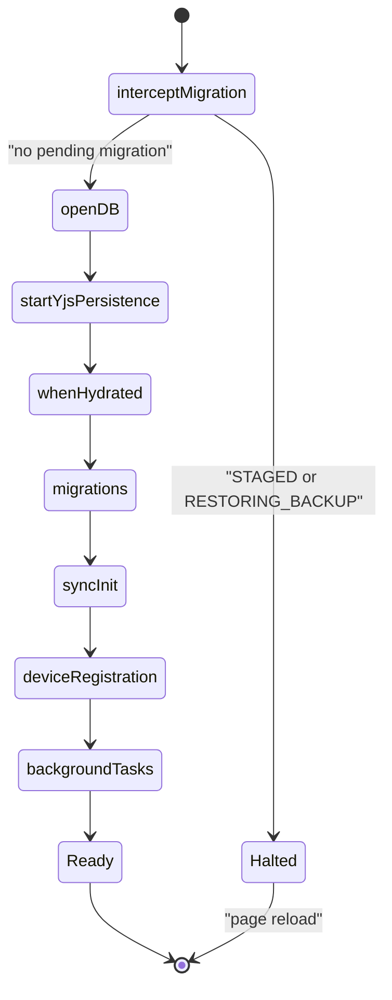

---

## 2. Journey 1 — Import a Book

### 2.1 Design Intent

Importing an EPUB must be idempotent at the content level (same bytes → same `bookId`), must never
corrupt existing reading progress on a "replace" import, and must handle duplicate detection both
by filename (synchronous, no DB round trip) and by ghost-matching (an inventory entry that has no
binary yet — a synced book from another device). The entire pipeline runs inside a FIFO queue so
a simultaneous user drop and a background re-ingest wave cannot interleave writes to the same
book.

### 2.2 Architecture

The import pipeline lives in the **library domain** ([Domain library](37-domain-library.md)):

```
UI (LibraryView / FileUploader)
  └─ ImportOrchestrator         src/domains/library/import/ImportOrchestrator.ts
       ├─ extractBook()         src/domains/library/import/extract.ts
       ├─ LibraryPersistence    src/domains/library/import/persist.ts
       │   └─ bookContent repo  src/data/repos/bookContent.ts
       └─ KeyedMutex            src/domains/library/mutex.ts
```

The `ImportOrchestrator` is the **single entry point** for all import variants (user drop,
settings-page upload, Drive sync, ContentMissing restore, re-ingest wave). It owns a two-priority
FIFO queue (`normalQueue` / `idleQueue`): normal user-initiated jobs always preempt background
re-ingest jobs. Every per-book mutation runs inside a `KeyedMutex` so `delete(X)/restore(X)`
races are impossible by construction.

### 2.3 Sequence Diagram

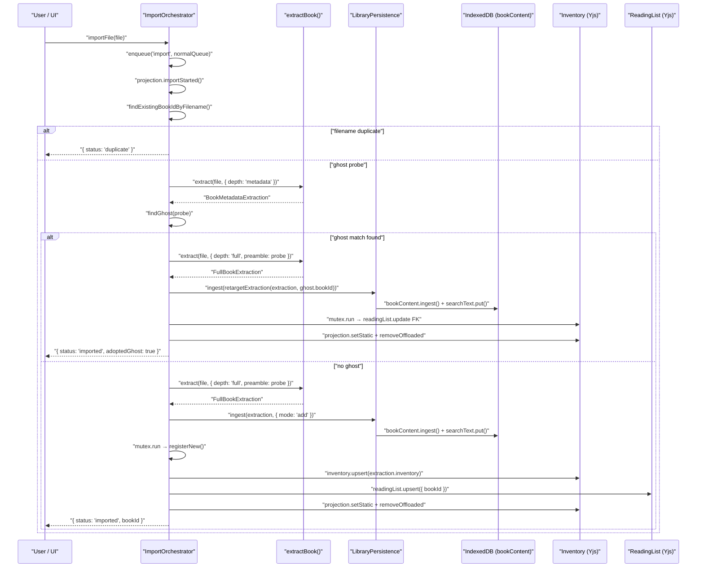

### 2.4 Step-by-Step Implementation

**Step 1 — enqueue.** `importFile()` wraps its work in `this.enqueue('import', run, 'normal')`,
returning a `Promise<ImportJobResult>`. The internal pump is single-threaded (one `pumping` flag
guard): idle jobs only run when `normalQueue` is empty.

**Step 2 — filename duplicate check.** `findExistingBookIdByFilename()` scans
`inventory.all()` synchronously (O(n) over CRDT map keys), then falls back to
`persistence.getBookIdByFilename()` for pre-import DB records. If `onDuplicate === 'ask'`
(single import default) the call returns `{ status: 'duplicate', existingBookId }` so the UI can
surface a Replace dialog. Batch import defaults to `'skip'`.

**Step 3 — ghost probe.** A "ghost" is an inventory entry (known to the CRDT from a remote
device) that has no local static metadata (no IDB manifest row). The orchestrator detects ghosts
by calling `extract(file, { depth: 'metadata' })` — a fast epubjs open that reads only the OPF
metadata without walking spine chapters — then comparing `probe.title.trim()` and
`probe.author.trim()` against the inventory. `findGhost()` additionally requires that the
matching inventory entry has no entry in `projection.staticIds()` (the set of books with a local
manifest).

**Step 4 — full extraction.** `extractBook()` in [`src/domains/library/import/extract.ts`](../../src/domains/library/import/extract.ts)
is the single extraction implementation replacing three legacy duplicates. A full extraction:

- Opens the EPUB with epubjs (possibly reusing the metadata probe as `preamble`).
- Compresses the cover image and extracts its color palette (`coverPalette`, `perceptualPalette`).
- Computes a `contentHash` (SHA-256 of raw bytes) and a legacy `fileHash` (filename-independent tail).
- Walks all spine chapters through the offscreen renderer to produce TTS preparation batches,
  table image batches, section metadata, and a search text corpus.
- Produces a `FullBookExtraction` with a new UUID `bookId` (unless ghost/replace retargets it).

**Step 5 — persist.** `LibraryPersistence.ingest()` in [`src/domains/library/import/persist.ts`](../../src/domains/library/import/persist.ts)
calls `bookContent.ingest()` in one gated transaction
(the cross-context write gate — see [Storage gateway](20-storage-gateway.md)), then writes the search corpus via
`searchTextRepo.put()`. The search corpus write is non-fatal (failure is logged; the row is
rebuildable on first search).

**Step 6 — register (under mutex).** `registerNew()` runs inside `mutex.run(extraction.bookId, ...)`,
ensuring atomicity with any concurrent delete or restore on the same book. Inside the mutex:

- `inventory.upsert(extraction.inventory)` writes to the Yjs Y.Map `books` — this is the
  CRDT write that fans out to all synced devices.
- `readingList.upsert({ ...extraction.readingListEntry, bookId: extraction.bookId })` creates
  the reading-list entry WITH the `bookId` FK (Phase 7 §D).
- `projection.setStatic(bookId, metadata)` and `projection.removeOffloaded(bookId)` update
  the non-synced in-process projection store.

**Ghost adopt.** Ghost adoption takes the same path but calls `retargetExtraction(extraction, ghost.bookId)` before persisting — every `bookId`-bearing row in the extraction (manifest, resource, structure, spine ids, TTS prep ids, table ids, inventory, progress, overrides) is rewritten consistently to the existing `bookId`. This is implemented in [`src/domains/library/import/persist.ts`](../../src/domains/library/import/persist.ts#L33)
`retargetExtraction()`.

### 2.5 Key Invariants

Five invariants are enforced by `LibraryService` (documented in
[`src/domains/library/LibraryService.ts`](../../src/domains/library/LibraryService.ts#L1)):

| Invariant | Description |
|-----------|-------------|
| I-1 | Hydration is a per-key merge; a book written after the hydration read snapshot is never clobbered. |
| I-2 | Hydration never resurrects; keys absent from inventory at write time are dropped. |
| I-3 | Restore re-validates existence inside the mutexed register step. |
| I-4 | Failure paths restore the CAPTURED prior offload state. |
| I-5 | The offloaded set is updated per-key only (no wholesale setter). |

### 2.6 Failure Modes

- **StorageFullError** — caught in `runImport()`, surfaces as `"Device storage full."` error on the projection, returns `{ status: 'failed' }`.
- **Extraction failure** — any epubjs parse error propagates as a failed `ImportJobResult`; the queue continues with the next file.
- **Zombie guard** — `registerNew()` checks `inventory.get(bookId)` inside the mutex; if a concurrent `remove()` already landed, registration is silently skipped (no resurrection).
- **Search corpus failure** — non-fatal; the `searchText` row rebuilds lazily on the first search query.

---

## 3. Journey 2 — Open, Read, and Annotate

### 3.1 Design Intent

Opening a book must not block on the location registry (CFI ↔ percentage map), which can take
many seconds to generate for long books. Reading progress must be recorded in arrival order
(FIFO, never backwards), and a page-close / navigation away must save the current position
synchronously even if the async snapping pipeline is mid-flight. Annotation creation must be
instantly reflected in the CRDT so any synced device sees it within the next Firestore flush.

### 3.2 Architecture

```
ReaderView (React)
  └─ useEpubReader()          src/hooks/useEpubReader.ts
       ├─ EpubJsEngine         src/domains/reader/engine/EpubJsEngine.ts
       ├─ selectionBridge      src/domains/reader/engine/selectionBridge.ts
       ├─ ReadingSessionRecorder  src/domains/reader/session/ReadingSessionRecorder.ts
       │   └─ useReadingStateStore  (Yjs-backed)
       └─ useAnnotationStore   (Yjs-backed)
```

### 3.3 Sequence Diagram — Open and Read

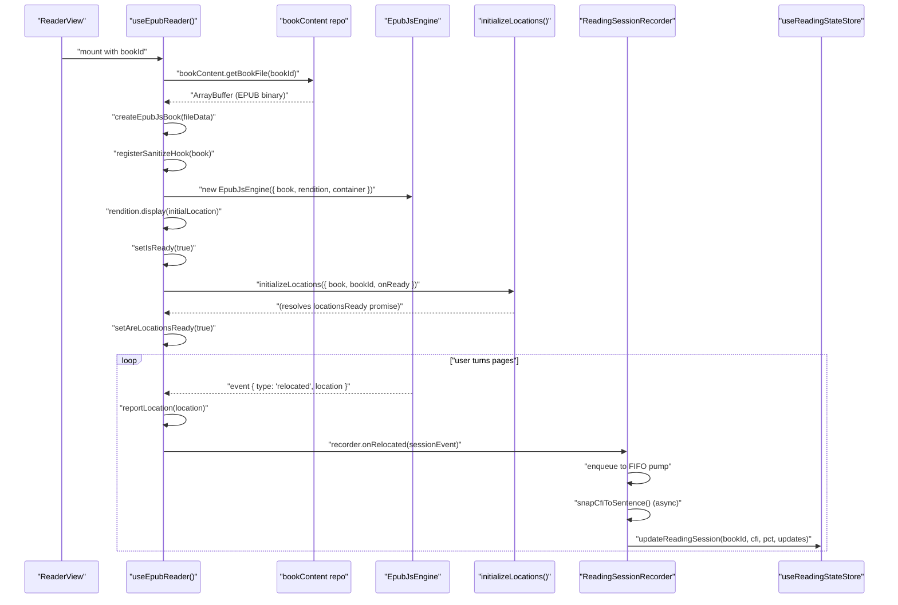

### 3.4 The epub.js Lifecycle

`useEpubReader()` in [`src/hooks/useEpubReader.ts`](../../src/hooks/useEpubReader.ts) implements the
lifecycle as a **cancellable generator** (`runCancellable(loadBookGenerator(bookId), cleanup)`).
The generator yields on each async step; on cancellation the cleanup callback destroys the
engine, the epub.js `Book`, the rendition, and the sandbox MutationObserver. This prevents the
common React 18 strict-mode double-mount from leaving a dangling epub.js instance.

Key steps inside the generator:

1. `bookContent.getBookFile(currentBookId)` — fetches the raw EPUB `ArrayBuffer` from IDB.
2. `createEpubJsBook(fileData)` — constructs an epub.js `Book` from the buffer.
3. `registerSanitizeHook(newBook, { allowTestBypass: true })` — installs the `serialize-at-sanitize` DOMParser hook (shared with the offscreen ingestion renderer so there is exactly one sanitization implementation).
4. `newBook.renderTo(viewerRef.current, { flow, manager: 'default' })` — constructs the epub.js `Rendition`.
5. `observeAndPatchSandbox(viewerRef.current)` — a MutationObserver that patches `<iframe sandbox>` to include `allow-scripts` immediately after epub.js creates each iframe (WebKit requires this for event handling).
6. `new EpubJsEngine({ book, rendition, container, locationsReady })` — the contract-C7 `ReaderEngine` port wrapping the raw epub.js objects. Set as the process-wide active engine via `setActiveReaderEngine(newEngine)`.
7. `rendition.display(startLocation)` — renders the first section. `startLocation` is `options.initialLocation ?? meta?.currentCfi`.
8. `initializeLocations({ book, bookId, isCurrent, onReady })` — loads a previously cached CFI registry or generates it in the background. When ready it calls `resolveLocationsReady()`, which resolves the `locationsReadyPromise` the engine holds, and sets `areLocationsReady: true` in React state.

### 3.5 The Selection Pipeline

Text selection uses the `selectionBridge` module rather than epub.js's own `'selected'` event. The reason (documented in [`src/hooks/useEpubReader.ts`](../../src/hooks/useEpubReader.ts#L317)): the epub.js `selected` event and the `mouseup`-based bridge both fired for one gesture in the legacy hook; the `mouseup` pipeline is more reliable on WebKit. `attachSelectionBridge(contents, onSelection)` is registered as a `rendition.hooks.content` hook and also run manually on already-loaded content (first section, which was loaded before hooks could be registered).

When the user selects text and lifts the mouse/finger, `selectionBridge` fires `onSelection(cfiRange, range, contents)`, which routes up to the `ReaderView`'s annotation popover state (in the non-synced `useReaderUIStore`). The user then confirms the highlight or note, which calls `useAnnotationStore.getState().add(annotation)` — a write to the Yjs-backed `annotations` Y.Map, immediately CRDT-replicated.

### 3.6 Reading Progress Recording

The `ReadingSessionRecorder` in [`src/domains/reader/session/ReadingSessionRecorder.ts`](../../src/domains/reader/session/ReadingSessionRecorder.ts)
serializes all location-change recordings on a per-book FIFO with a monotonic sequence number.
The critical fix (D6 from the overhaul plan) is that the **legacy code launched one async pass per relocation**, so a slow `snapCfiToSentence` for relocation N could commit AFTER N+1, leaving `currentCfi` pointing backwards. The new design:

- Captures all data (previous segment, dwell time, title, resolver) **at event time** before the first `await`.
- Queues the recording as a plain data object.
- The FIFO pump (`pump()`) processes exactly one item at a time, `await`ing the sentence snap, then committing in sequence.
- A `commit()` guard drops any recording whose `seq` is already covered by a prior commit.

**Panic save / `flushSync()`:** On unmount (navigation away, page close), the `ReaderView` calls `recorder.flushSync()` before `recorder.dispose()`. `flushSync` drains the pending queue synchronously (no sentence snapping — raw CFI ranges), commits the in-flight item if it hadn't committed yet (the async snap may still be in flight but its result will be dropped by the seq guard), and then writes the legacy final-segment panic save if the last-known segment exceeded 2 seconds of dwell.

### 3.7 Annotation CRDT Write

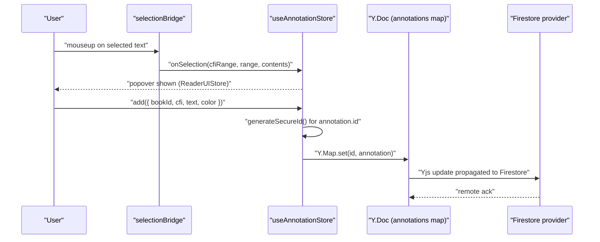

The annotation `add` action in `useAnnotationStore` uses `generateSecureId()` (a `crypto.randomUUID()` wrapper) so IDs are stable across devices. The Yjs middleware intercepts the `annotations` record setter and writes to `yDoc.getMap('annotations')`, which the live Firestore provider picks up and flushes to the cloud within the configured `maxWaitFirestoreTime` debounce window (default 2 000 ms).

---

## 4. Journey 3 — Start TTS Playback

### 4.1 Design Intent

The TTS engine lives in a Web Worker (via Comlink) in the worker-engine configuration, or in-process in the main-thread fallback. The `TtsController` is the single command facade: UI components never import the engine directly. Settings changes push to the engine (store → engine direction); engine events mirror into the ephemeral playback store (engine → store direction). These two directions are structurally separate stores so an engine broadcast cannot echo back as a command (the S6 echo-loop elimination described in [`src/app/tts/TtsController.ts`](../../src/app/tts/TtsController.ts#L29)).

### 4.2 Architecture

```
ReaderCommands (UI)
  └─ useAudioCommands()         src/app/tts/useAudioCommands.ts
       └─ TtsController          src/app/tts/TtsController.ts
            ├─ TtsEngine          (in-process or Comlink proxy)
            │   └─ worker          src/workers/tts.worker.ts
            ├─ useTTSSettingsStore  (persisted, Yjs-synced)
            └─ useTTSPlaybackStore  (ephemeral, never synced)
```

### 4.3 Sequence Diagram

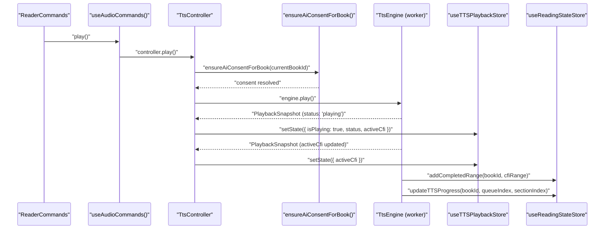

### 4.4 The Boot Wiring

`TtsController.initialize()` runs as the `tts/initialize` boot task (inside the `deviceRegistration` phase). It:

1. Reads `useTTSSettingsStore.getState()` and replays all persisted settings into the engine (`setBackgroundAudioMode`, `setBackgroundVolume`, `setPrerollEnabled`, `setSpeed`, `setVoice`).
2. Subscribes `this.engine.subscribe(snap => ...)` — the engine's PlaybackSnapshot stream. Every snapshot is written into `useTTSPlaybackStore`, including the derived `isAudiblePlayback(snap.status)` flag.
3. Subscribes `useTTSSettingsStore.subscribe((s, prev) => ...)` — pushes settings changes to the engine on change (rate, voice, language, preroll, background audio mode, provider switch).

The double-subscription design means the two data flows are completely orthogonal:
- Settings store → engine: push on diff.
- Engine → playback store: push every snapshot.
- Playback store has NO subscription inside `TtsController`: no echo loop.

### 4.5 Section Loading

When the reader navigates to a new section and audio is not playing, `useTTS()` (in [`src/hooks/useTTS.ts`](../../src/hooks/useTTS.ts)) calls `loadSectionBySectionId(currentSectionId, false, currentSectionTitle)` — load without autoplay, so the Play button starts from the current visual location. When the user presses Play, `controller.play()` runs the `withAiConsent()` gate before forwarding to the engine.

### 4.6 The AI Consent Gate

`ensureAiConsentForBook()` is called once per book per session (gated by `currentBookId`) before any play command reaches the engine. It resolves a UI dialog if the user has not yet consented to AI-assisted TTS for this book. The gate is at the egress boundary: **playback itself never blocks on the dialog outcome** — the dialog resolves before the engine is called.

### 4.7 Worker Write-Back (main-thread engine context)

In the worker-engine configuration, the engine runs inside a `tts.worker.ts` Web Worker. Write commands that affect Zustand stores flow back to the main thread via the `EngineHostCommand` typed channel. [`src/app/tts/createWorkerEngineClient.ts`](../../src/app/tts/createWorkerEngineClient.ts) defines `applyHostCommand()`:

```typescript
case 'updateTTSProgress':
  useReadingStateStore.getState().updateTTSProgress(command.bookId, command.queueIndex, command.sectionIndex);
  break;
case 'addCompletedRange':
  useReadingStateStore.getState().addCompletedRange(command.bookId, command.cfiRange, command.type);
  break;
case 'updatePlaybackPosition':
  useReadingStateStore.getState().updatePlaybackPosition(command.bookId, command.lastPlayedCfi);
  break;
```

These writes land in the Yjs-backed `useReadingStateStore`, which propagates them to Firestore and all synced devices.

### 4.8 Settings Sync (Store → Engine)

When the user changes playback speed in the settings UI, the Zustand subscription in `TtsController.initialize()` fires:

```typescript
const rate = selectActiveRate(s);
if (rate !== selectActiveRate(prev)) {
  void this.engine.setSpeed(rate);
}
```

The `selectActiveRate` selector reads the rate from the currently active profile (the persisted `useTTSSettingsStore` supports multiple per-language profiles). The voice-fallback algorithm in `resolveActiveVoice()` picks: saved profile voice for the active language → first voice matching the language → first available voice in any language.

---

## 5. Journey 4 — Cross-Device Sync (Edit on Device A, See on Device B)

### 5.1 Design Intent

All user state (reading progress, annotations, library inventory, reading list, preferences) is stored in a single shared Yjs document (`versicle-yjs` IDB database). The Firestore sync provider acts as a cloud transport for Yjs updates. When Device A makes an edit, the Yjs CRDT merges it and the Firestore provider pushes the encoded update. Device B's provider receives the update, the Yjs doc applies it, and the Zustand stores' Yjs middleware patches the React state automatically. The whole path is CRDT-safe: concurrent edits from both devices resolve without conflicts or data loss.

### 5.2 Architecture

```
Device A: Zustand store setter → Yjs Y.Map.set() → y-idb persistence
                                                  → Firestore provider → cloud

Device B: Firestore provider ← cloud
          → Yjs Y.Doc.applyUpdate() → Zustand middleware patch → React re-render
```

### 5.3 Sequence Diagram

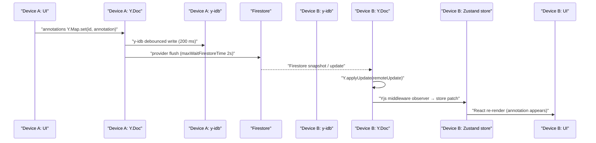

### 5.4 The Yjs Provider and y-idb

The shared `Y.Doc` is constructed lazily in [`src/store/yjs-provider.ts`](../../src/store/yjs-provider.ts#L42)
via `getYDoc()`. During the `startYjsPersistence` boot phase, `startYjsPersistence()` creates an
`IndexeddbPersistence('versicle-yjs', getYDoc(), { writeDebounceMs: 200, transactionRunner: runExclusiveIdbWrite })`.
The `transactionRunner` injection is a vendored fork addition ([Vendored forks](66-vendored-forks.md)): it routes all y-idb writes through the cross-context write gate so the TTS worker cannot overlap an active Yjs persistence write.

### 5.5 Sync Initialization

`syncInitTask` in [`src/app/boot/syncInit.ts`](../../src/app/boot/syncInit.ts) runs in the `syncInit` boot phase. It calls `getSyncOrchestratorAsync().then(o => o.start())` — NOT awaited, so network latency never delays the boot sequence.

`SyncOrchestrator.start()` in [`src/domains/sync/core/SyncOrchestrator.ts`](../../src/domains/sync/core/SyncOrchestrator.ts#L117) runs the Firebase auth listener. On sign-in it calls `this.connect(user.uid)`, which:

1. Checks the target workspace is not tombstoned.
2. Runs the quarantine layer 1 pre-attach probe (schema version check via workspace metadata).
3. Creates an automatic `pre-sync` checkpoint (at most once per 24 hours).
4. Awaits `whenLocalSynced()` (waits for the y-idb `synced` event — local data is canonical).
5. Stamps the workspace metadata with the current doc schema version (quarantine layer 3).
6. Checks if the client is a "clean client" (empty doc): if so, runs `performCleanSync` (downloads the remote state, merges into the local doc, then attaches the live provider); otherwise attaches the live provider directly.

### 5.6 ProviderConnection and Event Bus

`ProviderConnection.attach()` in [`src/domains/sync/core/ProviderConnection.ts`](../../src/domains/sync/core/ProviderConnection.ts#L48)
calls `backend.connect(doc, workspaceId, opts)` — this is the `SyncConnection` that holds the Firestore listener. Transport events (`connection-error`, `sync-failure`, `save-rejected`, `synced`, `flushed`) are translated into typed `SyncEvent` bus emissions. The bus's single subscriber (`wireSyncEvents` in `src/app/sync/wireSyncEvents.ts`) owns the UX side effects: toast notifications, sync status stamps in `useSyncStore`, heartbeat start/stop.

### 5.7 Schema Quarantine (Multi-Device Safety)

If Device B runs a newer schema version and Device A connects after being offline:

- **Quarantine layer 1** (pre-attach probe): the orchestrator reads `workspaceMeta.schemaVersion` from the Firestore workspace metadata doc. If `incomingVersion > currentSchemaVersion`, `onObsolete(incomingVersion)` fires — this locks the UI (the `ObsoleteLockView` shown in `App.tsx`) and stops the device heartbeat so the stale client stops announcing itself.
- **Quarantine layer 2** (live observer on `meta` map): `ProviderConnection` installs a `meta` Y.Map observer. If Device B stamps the doc's schema version during a migration, Device A sees the version bump on the live `meta` map and locks itself.
- **Quarantine layer 3** (maintenance stamp): after connecting, the orchestrator stamps the Firestore workspace metadata with the local doc's schema version so layer 1 stays accurate for future connects.

---

## 6. Journey 5 — Backup and Restore

### 6.1 Design Intent

A checkpoint is a binary snapshot of the entire Yjs document state. Checkpoints are created at two trigger points: automatically before each Firestore sync session (at most once per 24 hours) and as a protected pre-migration backup before a workspace switch. The restore operation is destructive — it wipes the live Yjs database and replaces it — but it is always preceded by a `validateSnapshot()` dry-run, so a corrupted checkpoint can never wipe live data (the "validate-before-destroy" discipline).

### 6.2 Architecture

```
CheckpointService        src/domains/sync/checkpoints/CheckpointService.ts
  ├─ captureDoc()        src/data/snapshot/YjsSnapshotService.ts
  ├─ validateSnapshot()  src/data/snapshot/YjsSnapshotService.ts
  ├─ applySnapshot()     src/data/snapshot/YjsSnapshotService.ts (vendored y-idb writeSnapshot)
  └─ checkpoints repo    src/data/repos/checkpoints.ts
```

### 6.3 Sequence Diagram — Create Checkpoint

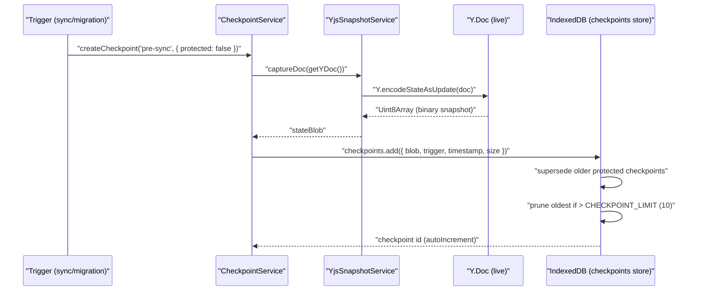

### 6.4 Sequence Diagram — Restore Checkpoint

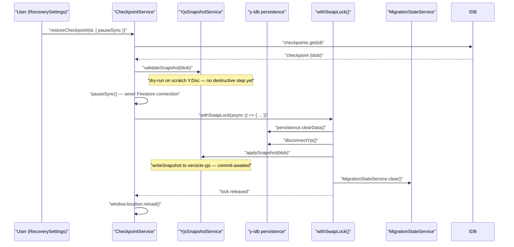

### 6.5 Key Implementation Details

**`captureDoc()`** calls `Y.encodeStateAsUpdate(doc)` — a single binary update representing the full document state as of the call moment. No async steps.

**`validateSnapshot()`** is a dry-run: it constructs a scratch `Y.Doc`, calls `Y.applyUpdate(scratch, update)`, and destroys the scratch doc. Any parse error throws an `AppError` with code `BACKUP_SNAPSHOT_INVALID`. This check runs **before** any destructive step. Its being a separate exported function means it can also be called from the workspace switch path (quarantine on the incoming remote blob).

**`applySnapshot()`** calls the vendored y-idb fork's `writeSnapshot()` primitive, which opens the `versicle-yjs` IDB database directly (not through a live `IndexeddbPersistence` binding) and writes the snapshot in a committed transaction. The promise resolves only after the transaction has committed — providing durability guarantees the old temp-doc approach (which relied on `IDBDatabase.close()` draining in-flight transactions) could not guarantee.

**The cross-tab swap lock** (`withSwapLock`) prevents two tabs from interleaving destructive applies. It uses `navigator.locks.request('versicle-yjs-swap', { mode: 'exclusive' }, work)` where available, with a sequential `fallbackTail` promise chain in jsdom. The lock is also used by the staged workspace swap (Journey 6).

**Protected checkpoints.** The `protected` flag on a checkpoint prevents it from being pruned by the rolling `CHECKPOINT_LIMIT` (10) eviction. Only one protected checkpoint exists at a time: `checkpoints.add()` with `{ protected: true }` supersedes (unprotects) any earlier protected row inside the same transaction before inserting the new one.

**Boot-time restore path.** If `MigrationStateService.getState()` shows `RESTORING_BACKUP` at boot, the `migrationInterceptorTask` calls `CheckpointService.restoreCheckpoint()` before the y-idb persistence binding is created. In this case `getYjsPersistence()` returns `null` so the code falls into the "boot path" branch: `deleteYjsDatabase()` (plain IDB deletion, not a persistence `.clearData()`) then `applySnapshot()`. The result is identical to the runtime path but avoids any live binding.

### 6.6 Failure Modes

| Failure | Behavior |
|---------|----------|
| Corrupted checkpoint (validation fails) | `validateSnapshot()` throws `BACKUP_SNAPSHOT_INVALID` before destructive step — live data untouched. |
| Crash during wipe (after `clearData`, before `applySnapshot`) | y-idb database is empty; next boot re-enters `RESTORING_BACKUP` and retries from staging. |
| Crash after `applySnapshot`, before `MigrationStateService.clear()` | Next boot re-enters `RESTORING_BACKUP`, re-runs the whole restore (idempotent since the snapshot is reapplied cleanly). |

---

## 7. Journey 6 — Staged Workspace Switch

### 7.1 Design Intent

Switching workspace is inherently dangerous: the operation must wipe the current Yjs database and replace it with downloaded remote state. The "staged swap" design (Phase 4 §D4) solves two problems:
1. A crash at any point must leave the user able to resume on next boot, not stuck in a broken state.
2. No destructive step should run before the downloaded remote state has been verified to be a valid Yjs update.

The solution is a three-database dance: staging DB (write verified remote state) → state machine commit → boot-time apply (wipe main + copy from staging) → confirm modal → clear staging.

### 7.2 Architecture

```
WorkspaceService.switch()       src/domains/sync/workspaces/WorkspaceService.ts
  ├─ downloadWorkspaceState()   src/domains/sync/core/downloadWorkspaceState.ts
  ├─ stageWorkspaceState()      src/domains/sync/workspaces/stagedSwap.ts
  ├─ MigrationStateService      src/domains/sync/workspaces/MigrationStateService.ts
  └─ window.location.reload()

Boot interceptor
  └─ applyStagedSwap()          src/domains/sync/workspaces/stagedSwap.ts
       ├─ readSnapshot()        src/data/snapshot/YjsSnapshotService.ts
       ├─ deleteYjsDatabase()   src/data/snapshot/YjsSnapshotService.ts
       ├─ applySnapshot()       src/data/snapshot/YjsSnapshotService.ts
       └─ MigrationStateService.setAwaitingConfirmation()
```

### 7.3 Sequence Diagram — Switch Phase

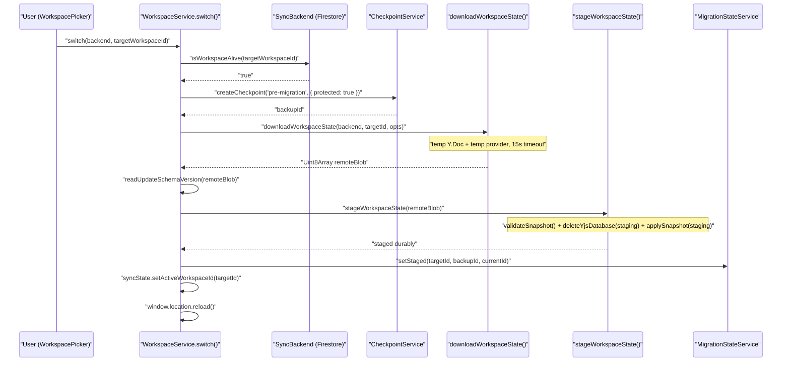

### 7.4 Sequence Diagram — Boot Apply Phase

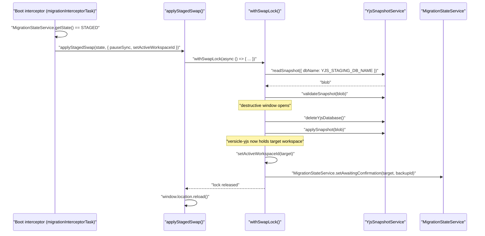

### 7.5 State Machine

The `MigrationStateService` persists state in `localStorage` (so it survives a page kill). The states and transitions:

```mermaid
stateDiagram-v2
    [*] --> STAGED : "WorkspaceService.switch() commits"
    STAGED --> STAGED : "crash during apply; same state on next boot"
    STAGED --> AWAITING_CONFIRMATION : "applyStagedSwap() completes"
    STAGED --> RESTORING_BACKUP : "applyStagedSwap() throws"
    AWAITING_CONFIRMATION --> [*] : "user confirms (clearStagedState)"
    AWAITING_CONFIRMATION --> RESTORING_BACKUP : "user cancels"
    RESTORING_BACKUP --> [*] : "restoreCheckpoint() completes"
```

### 7.6 Download and Temporary Provider

`downloadWorkspaceState()` in [`src/domains/sync/core/downloadWorkspaceState.ts`](../../src/domains/sync/core/downloadWorkspaceState.ts)
creates a **temporary** `Y.Doc` and a temporary Firestore provider attached to the target workspace. It resolves:
- On the provider's `'synced'` event (the initial handshake has landed): returns `Y.encodeStateAsUpdate(tempDoc)`.
- On a 15-second timeout: resolves with whatever synced so far (an unreachable or empty remote yields an empty update — legacy behavior pinned by the characterization suite).
- On a synchronous connection error (`onAttachError: 'reject'` for the switch path): rejects.

The temp doc and temp provider are **always destroyed** in the `finally` block, regardless of outcome.

### 7.7 Crash Safety Table

The failure table from [`src/domains/sync/workspaces/stagedSwap.ts`](../../src/domains/sync/workspaces/stagedSwap.ts#L21):

| Crash moment | State machine | Recovery |
|-------------|---------------|----------|
| During download/verify/stage | None (no commit) | Old workspace boots untouched; staging junk cleared by next switch. |
| After `setStaged`, before/during apply | STAGED | Apply re-runs from staging on next boot; switch completes. |
| After apply, before user confirms | AWAITING_CONFIRMATION | Existing confirm modal (unchanged P0 semantics). |
| User rolls back / apply throws | RESTORING_BACKUP | Existing pinned-checkpoint restore flow. |

### 7.8 Kill-Mid-Switch Harness

`pauseIfArmed(point)` in `stagedSwap.ts` implements a test-only pause: when the Playwright E2E suite sets `window.__VERSICLE_SWAP_PAUSE__` to a specific `SwapPausePoint` (`'swap:staged'`, `'swap:before-apply'`, `'swap:mid-apply'`), the function parks the async flow forever at that point. The Playwright test then calls `page.close()`, simulating a process kill at exactly that crash boundary. In production the flag is never set so the function is a no-op.

---

## 8. Cross-Cutting Architecture Observations

### 8.1 The Three-Layer Write Pattern

All journeys follow the same three-layer write pattern, which enforces the layering invariants ([Layering and boundaries](11-layering-and-boundaries.md)):

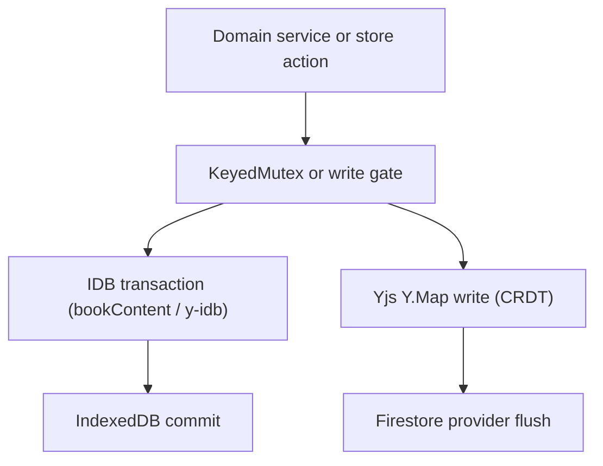

1. **Mutual exclusion** — per-book operations run under `KeyedMutex`; IDB writers use `runExclusiveIdbWrite`; staged swap and restore use `withSwapLock`.
2. **Validate before destroy** — every snapshot or import write that replaces existing data validates the incoming bytes on a scratch object first.
3. **Domain isolation** — domain modules never import stores. Store handles (inventory port, reading state port, etc.) are injected by the composition root (`src/app/library/createLibrary.ts`, `src/app/sync/createSync.ts`).

### 8.2 The FIFO Queue Pattern

Two FIFO queues appear in the codebase:
- `ImportOrchestrator` normal/idle queue: serializes import, restore, reprocess, and reingest jobs globally with two priority classes.
- `ReadingSessionRecorder` per-book FIFO: serializes recording commits so location updates are always applied in event order.

Both use the same `pumping` flag guard pattern: a single boolean ensures only one async pump is in flight at a time.

### 8.3 Yjs as the Sync Backbone

All journeys that produce user-visible state changes write through Yjs:
- Import → `inventory.upsert()` → Y.Map → Firestore → Device B
- Annotation → `useAnnotationStore.add()` → Y.Map → Firestore → Device B
- TTS progress → `updateTTSProgress()` → Y.Map → Firestore → Device B
- Workspace switch (target data) → `applySnapshot(blob)` → y-idb → Device B reads on boot

The one exception is static book content (EPUB binary, extracted TTS prep, search corpus) which lives only in `EpubLibraryDB` (IndexedDB) and is never replicated through Yjs or Firestore. This is intentional: binary content is too large for a CRDT document.

### 8.4 Ephemeral vs. Persisted vs. Synced State

| State | Store | Synced | Persisted |
|-------|-------|--------|-----------|
| Annotations | `useAnnotationStore` | Yes (Yjs) | Yes (y-idb) |
| Reading progress | `useReadingStateStore` | Yes (Yjs) | Yes (y-idb) |
| Library inventory | `useLibraryStore` | Yes (Yjs) | Yes (y-idb) |
| TTS settings (rate, voice) | `useTTSSettingsStore` | Yes (Yjs) | Yes (y-idb) |
| TTS playback status | `useTTSPlaybackStore` | No | No (ephemeral) |
| Reader UI state | `useReaderUIStore` | No | No (ephemeral) |
| Static book metadata | `libraryViewStore` projection | No | No (IDB only, non-CRDT) |
| Sync connection status | `useSyncStore` (partial) | Partial | Yes (Yjs, some fields) |

---

## 9. Related Documents

For deeper coverage of individual subsystems touched by these journeys:

- [Bootstrap and lifecycle](14-bootstrap-and-lifecycle.md) — the boot sequence all journeys assume.
- [State management](13-state-management-crdt.md) — the Yjs CRDT model, store definitions, and hydration.
- [Storage gateway](20-storage-gateway.md) — IDB connection lifecycle, write gate, and the data layer.
- [Domain library](37-domain-library.md) — the full import/offload/restore domain.
- [Reader engine](30-domain-reader-engine.md) — epub.js engine, location system, and selection bridge.
- [TTS engine](32-domain-audio-tts-engine.md) — the TTS engine, worker bridge, and provider model.
- [TTS app integration](51-tts-app-integration.md) — `TtsController`, `useAudioCommands`, boot wiring.
- [Domain sync](36-domain-sync.md) — `SyncOrchestrator`, `WorkspaceService`, quarantine layers.
- [Backup and restore](23-backup-and-restore.md) — checkpoint format, pruning, and recovery flows.
- [Error handling and recovery](15-error-handling-and-recovery.md) — failure modes, `SafeModeView`, migration failure view.
- [E2E verification](64-e2e-verification.md) — the Playwright test harness for the workspace switch crash-safety matrix.
