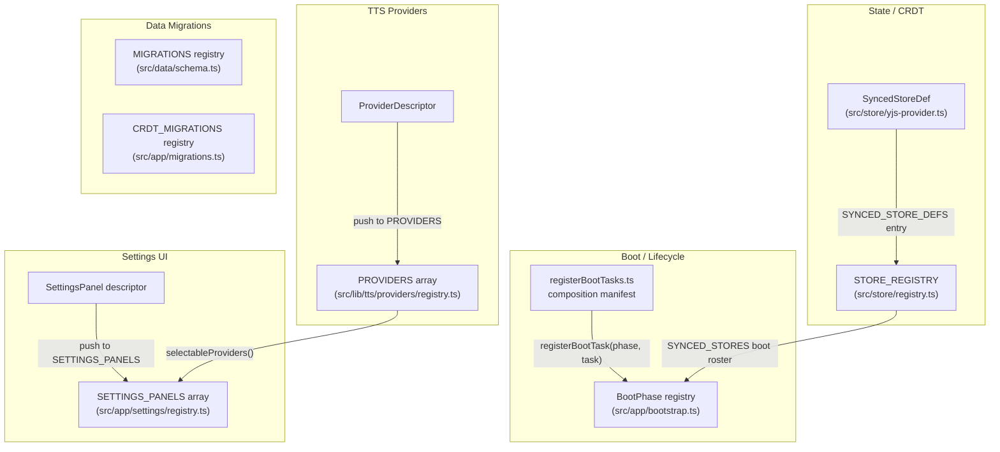
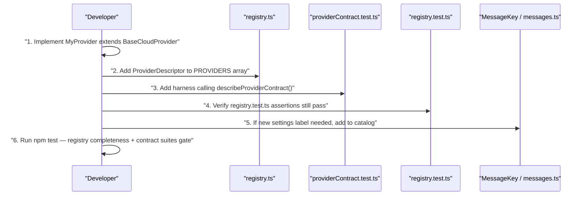
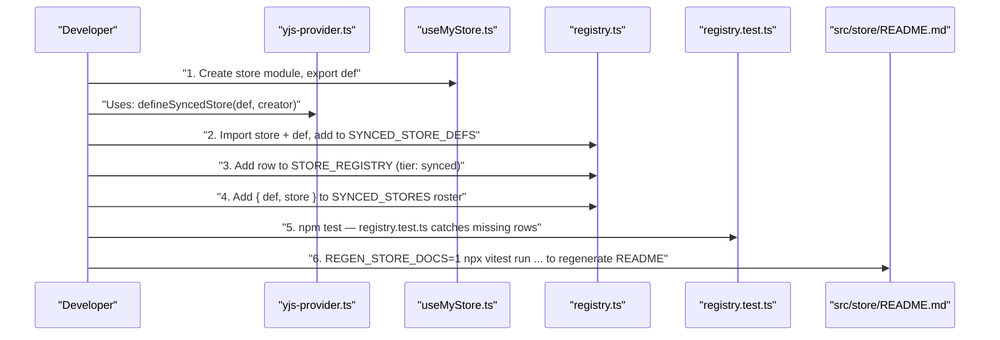
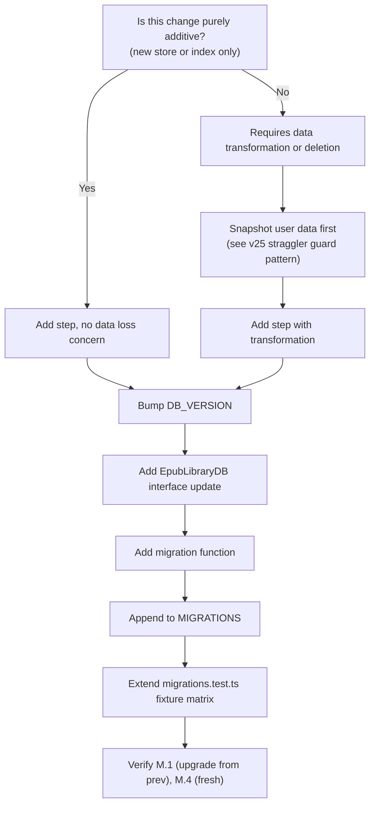
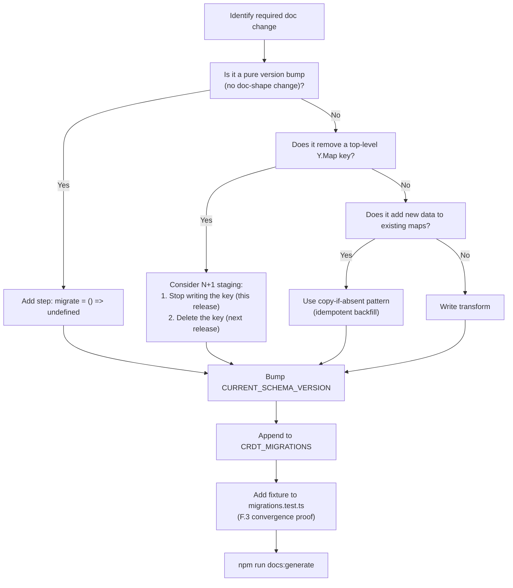
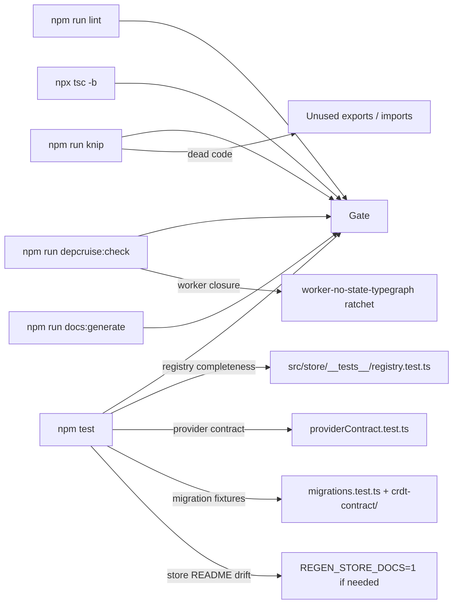

# Extending the System (Developer Cookbook)

This document is a practical cookbook for engineers adding new capabilities to Versicle. Each section targets one extension point — a TTS provider, a synced store, a settings panel, a boot task, an IDB migration, or a CRDT migration — and walks through the exact registry seam to touch, the contract that governs your contribution, and the test that gates the PR.

Every statement here is grounded in code you can read. File links are relative to the repository root. Where a rule is enforced by tooling rather than convention, the enforcement mechanism is named.

---

## Overview: The Extension-Point Map

Versicle is built around **declarative registries** rather than switch statements or discovery-at-runtime. Every extension point is a row in one of these registries. There are no glob-collected modules, no dependency-injection containers at runtime, and no reflection. The pattern is consistent: the registry is the single source of truth; the test that gates the PR diffs the registry against reality.



The five registries — boot tasks, store tiers, TTS providers, settings panels, IDB migrations, and CRDT migrations — are the only surfaces you need to touch for most extensions. Each one has a completeness test; a missing registration is caught before CI, not at runtime.

For cross-references: [Architecture overview](10-architecture-overview.md), [Contract-first registry](12-contract-first-registry.md), [State management](13-state-management-crdt.md), [Bootstrap and lifecycle](14-bootstrap-and-lifecycle.md), [TTS providers](33-tts-providers-and-platform.md), [Settings shell](41-settings-shell.md).

---

## Adding a TTS Provider

### Design intent

The TTS subsystem is designed so that adding a new speech engine touches **one registry entry** and produces **one new class** that passes the shared behavioral contract. No switch statement elsewhere changes. The settings UI derives its option list from `selectableProviders()` which reads the same registry. The manager uses `resolveDescriptor()` to build a provider from its id. Zero other files know about provider identity.

### Architecture

The registry lives in [src/lib/tts/providers/registry.ts](../../src/lib/tts/providers/registry.ts). It exports `PROVIDERS`, an array of `ProviderDescriptor` objects declared as `as const satisfies readonly ProviderDescriptor[]` — the TypeScript satisfies check catches a missing required field at compile time. There are currently six descriptors: `webspeech`, `capacitor`, `piper`, `google`, `openai`, `lemonfox`.

A `ProviderDescriptor` carries:

```typescript
export interface ProviderDescriptor {
    readonly id: string;
    readonly displayName: string;
    readonly kind: ProviderKind;          // 'device' | 'wasm' | 'cloud'
    readonly requiresApiKey: boolean;
    readonly apiKeyLabel?: string;         // required when requiresApiKey is true
    readonly platforms?: ReadonlyArray<'web' | 'native'>;  // absent = both
    readonly capabilities: {
        downloadableVoices: boolean;       // gates asVoiceDownloadable()
        localeAware: boolean;              // gates asLocaleAware()
    };
    build(ctx: ProviderBuildContext): ITTSProvider;
}
```

Notice what is deliberately absent: there is **no speed or pitch capability**. The P0 speed policy — synthesize at 1.0, apply playback rate at the audio sink — is the law of the tree. No provider may opt out. The tests in `describeProviderContract` pin this.

The `ProviderBuildContext` your `build()` function receives contains everything the provider needs without store reach-ins:

```typescript
export interface ProviderBuildContext {
    apiKey?: string;      // populated for requiresApiKey providers
    language: string;     // normalized active language, e.g. 'en', 'zh'
    sink?: AudioSink;     // shared AudioSink injected by the manager
}
```

### The ITTSProvider contract

Every provider must implement [src/lib/tts/providers/types.ts](../../src/lib/tts/providers/types.ts)'s `ITTSProvider`:

```typescript
export interface ITTSProvider {
    id: string;
    init(): Promise<void>;
    getVoices(): Promise<TTSVoice[]>;
    play(text: string, options: TTSOptions): Promise<void>;
    preload(text: string, options: TTSOptions): Promise<void>;
    pause(): void;
    stop(): void;
    dispose(): void;
    on(callback: (event: TTSEvent) => void): Unsubscribe;
    playEarcon?(type: 'bookmark_captured' | 'bookmark_failed'): void;
}
```

The contract rules on `play()` are strict:

1. Resolves when **audible playback has started** — not when synthesis completes, not at scheduling time.
2. **Rejects exactly once** on a start failure. It must never also emit an `error` event for the same failure (single-shot signaling).
3. `error` events are reserved for **mid-playback failures** after `play()` has already resolved.
4. Speed lives in `options.speed` but is **playback-time only** — a cloud provider must never include the speed in a synthesis request body, must never use it as part of a cache key. The audio sink applies it via `setRate()` after loading the blob.

Capacitor is the sole exception: because `TextToSpeech.speak()` only settles on completion (not on start), its `play()` resolves optimistically (`failureMode: 'event'`) and start failures arrive as a single `error` event instead.

### Cloud provider: extend BaseCloudProvider

For any HTTP-based synthesis API, extend [src/lib/tts/providers/BaseCloudProvider.ts](../../src/lib/tts/providers/BaseCloudProvider.ts). The base class handles:

- Speed-free caching via `TTSCache` (SHA-256 key = `hash(text|voiceId)`)
- Request deduplication via `requestRegistry`
- Per-request abort signal combining a provider-level controller (from `stop()`/`dispose()`) and a 30-second synthesis timeout
- Single-shot play contract: `playBlob()` → `setRate()` → emit `start`
- `dispose()` hygiene: detaches listeners, aborts in-flight requests, never destroys an injected shared sink
- Egress routing through `fetchAudio(destinationId, url, body, headers, signal)` which calls `egress()` from `@kernel/net`

Your subclass implements only `fetchAudioData`:

```typescript
protected abstract fetchAudioData(
    text: string,
    options: TTSOptions,
    signal?: AbortSignal
): Promise<SpeechSegment>;
```

`SpeechSegment` is `{ audio?: Blob; alignment?: Timepoint[] }`. The `signal` **must** be threaded to every network fetch — it carries both the user-stop abort (which becomes `isPlaybackInterruption()` = true and must never trigger the fallback) and the 30-second timeout (which is a provider failure and may trigger fallback).

Look at [src/lib/tts/providers/OpenAIProvider.ts](../../src/lib/tts/providers/OpenAIProvider.ts) as the minimal reference:

```typescript
export class OpenAIProvider extends BaseCloudProvider {
    id = 'openai';
    private apiKey: string | null = null;

    constructor(apiKey?: string, audioSink?: AudioSink, cache?: TTSCache) {
        super(audioSink, cache);
        if (apiKey) this.apiKey = apiKey;
        this.voices = [
            { id: 'alloy', name: 'Alloy', lang: 'en', provider: 'openai' },
            // … more voices …
        ];
    }

    async init(): Promise<void> { /* voices are static */ }

    protected async fetchAudioData(
        text: string, options: TTSOptions, signal?: AbortSignal
    ): Promise<SpeechSegment> {
        if (!this.apiKey) throw new Error('OpenAI API Key missing');
        const blob = await this.fetchAudio(
            'openai-tts',          // destination id registered in kernel/net
            'https://api.openai.com/v1/audio/speech',
            { model: 'tts-1', input: text, voice: options.voiceId, response_format: 'mp3' },
            { 'Authorization': `Bearer ${this.apiKey}` },
            signal,
        );
        return { audio: blob, alignment: undefined };
    }
}
```

Notice that `options.speed` never appears in the request body — it is never passed to OpenAI. Speed is a sink-time concern only.

### Step-by-step: adding a new cloud provider



**Step 1: Implement the class**

```typescript
// src/lib/tts/providers/MyProvider.ts
import { BaseCloudProvider } from './BaseCloudProvider';
import type { TTSOptions, SpeechSegment } from './types';
import type { AudioSink } from '../engine/AudioSink';
import type { TTSCache } from '../TTSCache';

export class MyProvider extends BaseCloudProvider {
    id = 'myprovider';

    constructor(apiKey?: string, audioSink?: AudioSink, cache?: TTSCache) {
        super(audioSink, cache);
        this.apiKey = apiKey ?? null;
        this.voices = [
            { id: 'voice-a', name: 'Voice A', lang: 'en', provider: 'myprovider' },
        ];
    }

    async init(): Promise<void> { /* fetch dynamic voice list if needed */ }

    protected async fetchAudioData(
        text: string, options: TTSOptions, signal?: AbortSignal
    ): Promise<SpeechSegment> {
        if (!this.apiKey) throw new Error('MyProvider API key missing');
        const blob = await this.fetchAudio(
            'myprovider',           // register this destination in kernel/net first
            'https://api.myprovider.ai/v1/synthesize',
            { text, voice: options.voiceId },
            { 'X-API-Key': this.apiKey },
            signal,
        );
        return { audio: blob };
    }
}
```

**Step 2: Add the descriptor**

In [src/lib/tts/providers/registry.ts](../../src/lib/tts/providers/registry.ts), append to the `PROVIDERS` array:

```typescript
{
    id: 'myprovider',
    displayName: 'My Provider',
    kind: 'cloud',
    requiresApiKey: true,
    apiKeyLabel: 'My Provider API Key',
    capabilities: { downloadableVoices: false, localeAware: false },
    build: (ctx) => new MyProvider(ctx.apiKey, ctx.sink),
},
```

This is the **only file** that needs to know about `MyProvider` outside of `myprovider.ts` itself. The `TTSProviderId` union is derived automatically:

```typescript
type RegisteredProviderId = (typeof PROVIDERS)[number]['id'];
export type TTSProviderId = RegisteredProviderId;
```

**Step 3: Write the contract harness**

Add a `describeProviderContract` call to [src/lib/tts/providers/providerContract.test.ts](../../src/lib/tts/providers/providerContract.test.ts):

```typescript
describeProviderContract('myprovider', async () => {
    const sink = new FakeAudioSink();
    const cache = new InMemoryTTSCache();
    const script = stubFetch(async (s) => {
        return makeAudioResponse(); // or use the existing cloud provider pattern
    });
    const provider = new MyProvider('test-key', sink, cache);
    await provider.init();
    return {
        provider,
        voiceId: 'voice-a',
        failureMode: 'reject',
        armPlayFailure: () => { script.failNext = true; },
        synthesisBodies: () => script.bodies,
        liveSpeakRates: () => [],
        sink,
    } satisfies ProviderContractHarness;
});
```

The `describeProviderContract` suite from [src/lib/tts/providers/describeProviderContract.ts](../../src/lib/tts/providers/describeProviderContract.ts) runs **seven cases** against your harness:

| Case | What it pins |
|---|---|
| `play()` resolves and emits exactly one `start` | Basic play/start contract |
| `preload()` never starts playback or emits | Preload silence |
| Failure through exactly one channel | Single-shot signaling |
| `on()` returns a working unsubscribe | Listener lifecycle |
| `dispose()` detaches and emits nothing after | Dispose hygiene |
| Non-1.0 speed stays out of the synthesis request | P0 speed policy |
| Same text at different speed = zero new synthesis | Speed-free cache key |

`vi.mock` is banned in `providers/` by ESLint — the only escape hatch is the one `vi.mock` for the Capacitor native plugin which has no injection seam. Use injected fakes (`FakeAudioSink`, `InMemoryTTSCache`) and stub globals (`vi.stubGlobal('fetch', …)`).

**Step 4: Update the registry test assertion**

[src/lib/tts/providers/registry.test.ts](../../src/lib/tts/providers/registry.test.ts) asserts the exact set of registered ids:

```typescript
expect([...PROVIDER_IDS].sort()).toEqual(
    ['capacitor', 'google', 'lemonfox', 'myprovider', 'openai', 'piper', 'webspeech'],
);
```

Update this list. The test also checks that every `requiresApiKey` descriptor carries an `apiKeyLabel`, that no speed/pitch capability exists, and that `selectableProviders()` produces the expected stable order on both platforms.

**Step 5: Add network destination**

Register the egress destination in the kernel/net registry so `BaseCloudProvider.fetchAudio()` can route to it. Consult [src/kernel/net](../../src/kernel/net) for the `DestinationId` union and the allowed-host policy.

**Step 6: Settings UI**

The `selectableProviders()` function already includes your provider in its list (derived from `PROVIDERS`). The `TTSPanel` reads this list. If your provider needs an API key, the panel already renders an API key input field for any descriptor where `requiresApiKey: true`. You only need to ensure `useTTSSettingsStore` persists and exposes the key for your id.

---

## Adding a Synced Store

### Design intent

Every piece of user data that replicates across devices lives in a **synced store** — a Zustand store wrapped with the `zustand-middleware-yjs` middleware via the `defineSyncedStore` seam. The three-tier registry in [src/store/registry.ts](../../src/store/registry.ts) is the single declaration surface; adding a store means adding a row and a def export, then regenerating the docs.

The import graph has a critical constraint: **stores must never import the registry**. The TTS worker's type-closure reaches the store modules, and any new import from `src/store` would regress the `worker-no-state-typegraph` depcruise ratchet. The `SyncedStoreDef` type and `defineSyncedStore` live in [src/store/yjs-provider.ts](../../src/store/yjs-provider.ts), which is already in that closure; the registry imports stores (for the boot roster), not the other way around.

### SyncedStoreDef anatomy

```typescript
export interface SyncedStoreDef<K extends string = string> {
    readonly name: string;        // Y.Map name — FROZEN user-data format surface
    readonly syncedKeys: readonly K[];    // top-level keys that replicate
    readonly hydration: 'replace' | 'merge-defaults';
    readonly scopedDiff: boolean;  // per-key diffing (D13 write-amp fix)
    readonly scope?: { readonly key: string };  // nested binding for scoped stores
}
```

The `name` field is the Y.Doc's top-level map name. **Renaming it is a schema migration**, not a refactor. The `syncedKeys` whitelist means you can keep ephemeral keys in the same store without replicating them — only listed keys enter the CRDT. `hydration: 'merge-defaults'` suppresses top-level key deletion during hydration, so new fields survive merge from older documents; `'replace'` wipes local state on inbound patch (the legacy behavior, now only used during explicit migrations).

### Step-by-step: adding a synced store



**Step 1: Create the store module**

```typescript
// src/store/useMyStore.ts
import { create } from 'zustand';
import { defineSyncedStore, type SyncedStoreDef } from './yjs-provider';

export const MY_STORE_DEF: SyncedStoreDef<'myData'> = {
    name: 'my-store',        // stable Y.Map name — choose carefully, never rename
    syncedKeys: ['myData'],
    hydration: 'merge-defaults',
    scopedDiff: true,
};

interface MyState {
    myData: Record<string, string>;
    setMyData(data: Record<string, string>): void;
}

export const useMyStore = create<MyState>()(
    defineSyncedStore(MY_STORE_DEF, (set) => ({
        myData: {},
        setMyData: (myData) => set({ myData }),
    })),
);
```

The type parameter `SyncedStoreDef<'myData'>` and the `create<MyState>()` call together prove at compile time that every key in `syncedKeys` exists on the state type. The middleware additionally fails loudly in dev mode on a mismatch.

**Step 2: Register in the registry**

In [src/store/registry.ts](../../src/store/registry.ts), add three things:

```typescript
// 1. Import the store and def
import { useMyStore, MY_STORE_DEF } from './useMyStore';

// 2. Add to SYNCED_STORE_DEFS (keyed constant for lookup)
export const SYNCED_STORE_DEFS = {
    // … existing entries …
    myStore: MY_STORE_DEF,
} as const;

// 3. Add to SYNCED_STORES (boot roster)
export const SYNCED_STORES: readonly SyncedStoreEntry[] = [
    // … existing entries …
    { def: SYNCED_STORE_DEFS.myStore, store: useMyStore },
];

// 4. Add to STORE_REGISTRY (docs + completeness)
export const STORE_REGISTRY: readonly StoreRegistryEntry[] = [
    // … existing synced rows …
    {
        module: 'useMyStore',
        tier: 'synced',
        persistence: 'my-store',    // must match def.name (no scope key here)
        owner: 'my-domain',
        summary: 'My data description.',
        def: SYNCED_STORE_DEFS.myStore,
    },
    // … rest …
];
```

**Step 3: Regenerate the README**

```bash
REGEN_STORE_DOCS=1 npx vitest run src/store/__tests__/registry.test.ts
```

The registry test runs `renderStoreRegistryDocs()` and diffs the output against the checked-in `src/store/README.md`. Under `REGEN_STORE_DOCS=1` it rewrites the file; without the flag, a drift fails CI. This is the "generated docs are never hand-edited" rule from AGENTS.md.

**Step 4: The registry completeness test**

[src/store/__tests__/registry.test.ts](../../src/store/__tests__/registry.test.ts) asserts:

- Every `use*.ts` file under `src/store/` is declared in `STORE_REGISTRY`, and nothing extra is declared
- Every synced row carries a `def`, non-synced rows do not
- Every `SyncedStoreDef` in `SYNCED_STORE_DEFS` appears exactly once in the roster
- The runtime roster has a live Yjs handle (`api.yjs`) on every store
- `local-persisted` rows' `persistence` keys match the actual `zustand/persist` store name (loaded dynamically and checked at test time)
- Ephemeral rows declare `persistence: null`

### Local-persisted stores

For device-local settings that do NOT replicate (like `useTTSSettingsStore`, `useSyncStore`):

```typescript
// src/store/useMyLocalStore.ts
import { create } from 'zustand';
import { persist } from 'zustand/middleware';

export const useMyLocalStore = create(
    persist(
        (set) => ({ myPref: false, toggle: () => set((s) => ({ myPref: !s.myPref })) }),
        { name: 'my-local-storage-key' },   // must match registry persistence field
    ),
);
```

Then add to `STORE_REGISTRY` with `tier: 'local-persisted'` and `persistence: 'my-local-storage-key'`. The registry test dynamically imports the module and calls `store.persist.getOptions().name` to verify the key matches. You also need to add the module to the `persistedImports` literal map in the test file itself — it serves as a second completeness check (adding a persisted store must touch both registry and that map).

### Scoped stores

The `usePreferencesStore` is a **scoped store**: its `SyncedStoreDef` carries `scope: { key: deviceId }`, binding it to `getMap('preferences').get(deviceId)` rather than the top-level `preferences` map. This is how per-device data lives inside a shared Y.Map while still replicating to all peers (each device sees other devices' scoped subtrees). The `persistence` label in the registry uses the placeholder: `'preferences.<deviceId>'`.

If you need per-device data, follow this pattern — do not create separate top-level maps per device.

### Hydration note on nested fields

`merge-defaults` preserves top-level keys absent from the inbound doc. But it is **shallow**: if a synced key is present in the doc but missing a nested sub-field your code added, the hydration path does NOT inject the sub-field's default. New nested fields inside an existing synced container still require a CRDT migration backfill. See the v4→v5 `fontProfiles` pattern in [src/app/migrations.ts](../../src/app/migrations.ts) (`backfillFontProfiles`).

---

## Adding a Settings Panel

### Design intent

The settings shell is a registry-driven route overlay at `/settings/:tab`. Every tab is a lazy-loaded React component with no container props — it owns its own store access, state, and handlers. The registry in [src/app/settings/registry.ts](../../src/app/settings/registry.ts) drives the sidebar tab list, the route resolution, and the lazy-loading.

### Registry shape

```typescript
export interface SettingsPanel {
    id: SettingsTabId;          // route param and Radix Tabs value
    labelKey: MessageKey;       // i18n catalog key (ADR §2)
    icon: LucideIcon;
    load: () => Promise<{ default: ComponentType }>;   // React.lazy source
    order: number;              // ascending sidebar position
    danger?: boolean;           // destructive-area styling
}
```

The `id` must be added to the `SettingsTabId` union:

```typescript
export type SettingsTabId =
    | 'general' | 'tts' | 'genai' | 'sync'
    | 'devices' | 'dictionary' | 'recovery'
    | 'diagnostics' | 'data'
    | 'my-panel';    // ← add your id here
```

The `labelKey` must be a key in the typed message catalog (`MessageKey`). The [src/kernel/locale/messages.ts](../../src/kernel/locale/messages.ts) catalog is the contract — adding a panel requires adding its label key:

```typescript
// In messages.ts
'settings.tab.my-panel': 'My Panel Title',
```

The `MessageKey` union is derived from the `messages` object's keys via `keyof typeof messages`, so a missing entry is a compile error in the registry file.

### Step-by-step: adding a settings panel

**Step 1: Create the panel component**

```typescript
// src/app/settings/panels/MyPanel.tsx
import React from 'react';
import { useMyStore } from '@store/useMyStore';

// Panels are self-contained: no container props, direct store access.
function MyPanel() {
    const { myData, setMyData } = useMyStore();
    return (
        <div>
            {/* Panel content */}
        </div>
    );
}

export default MyPanel;
```

The `DiagnosticsPanel.tsx` is the canonical example of the minimal panel adapter:

```typescript
// src/app/settings/panels/DiagnosticsPanel.tsx
import { DiagnosticsTab } from '@components/settings';
export default DiagnosticsTab;
```

**Step 2: Add the label key**

In [src/kernel/locale/messages.ts](../../src/kernel/locale/messages.ts), under the settings shell section:

```typescript
'settings.tab.my-panel': 'My Panel',
```

**Step 3: Add to SettingsTabId and SETTINGS_PANELS**

In [src/app/settings/registry.ts](../../src/app/settings/registry.ts):

```typescript
import { Activity, MyIcon } from 'lucide-react';

export type SettingsTabId =
    | 'general' | 'tts' | 'genai' | 'sync' | 'devices'
    | 'dictionary' | 'recovery' | 'diagnostics' | 'data'
    | 'my-panel';

export const SETTINGS_PANELS: readonly SettingsPanel[] = [
    // … existing panels in order …
    {
        id: 'my-panel',
        labelKey: 'settings.tab.my-panel',
        icon: MyIcon,
        load: () => import('./panels/MyPanel'),
        order: 85,           // between diagnostics (80) and data (90)
    },
];
```

**Step 4: Route deep-linking**

`resolveSettingsTab(param)` already handles your id because it checks `PANEL_IDS.has(param)` — `PANEL_IDS` is built from `SETTINGS_PANELS` at module init. The route `/settings/my-panel` is immediately deep-linkable with no routing changes.

**Step 5: The shell integration**

[src/app/settings/SettingsShell.tsx](../../src/app/settings/SettingsShell.tsx) reads `SETTINGS_PANELS` at module init to build `LAZY_PANELS` (one `React.lazy` per descriptor). Your panel loads on first tab activation and is mounted in its own `ErrorBoundary + Suspense`. There is no shell code to change.

### Tab ordering and danger flag

`order` is ascending. The current order: general (10), tts (20), genai (30), sync (40), devices (50), dictionary (60), recovery (70), diagnostics (80), data (90). The `data` tab carries `danger: true` for destructive-area styling. If your panel includes irreversible operations, set `danger: true`.

---

## Adding a Boot Task

### Design intent

The boot sequence is a staged, awaited pipeline of tasks registered into **phases**. The sequencer (`src/app/bootstrap.ts`) never imports subsystems — it is pure registry + runner. The composition manifest (`registerBootTasks.ts`) is the one module allowed to import subsystem boot functions and wire them in. Subsystem code lives under `src/app/boot/` as `BootTask` objects.

### The boot phases

```typescript
export const BOOT_PHASES = [
    'interceptMigration',    // migration interceptor / backup restore halts
    'openDB',                // IndexedDB open + upgrade
    'startYjsPersistence',   // y-idb binding to the shared Y.Doc
    'whenHydrated',          // IDB load complete + store hydration
    'migrations',            // CRDT migration coordinator
    'syncInit',              // Firebase / Firestore connection
    'deviceRegistration',    // TTS init + device self-registration
    'backgroundTasks',       // heartbeat, Drive scan, cache eviction, reingest
] as const;
```

Within a phase, tasks run **sequentially** in registration order. A task that throws causes the boot promise to reject and routes the app to `SafeModeView`. A task that calls `ctx.halt()` stops the sequence after the current phase (used by the migration interceptor).

### BootTask contract

```typescript
export interface BootTask {
    name: string;   // stable diagnostic name, '<subsystem>/<action>'
    run(ctx: BootContext): void | Promise<void>;
}

interface BootContext {
    setStatusMessage(message: string): void;
    syncAllowed: boolean;
    pendingMigration: PendingWorkspaceMigration | null;
    halt(reason: BootHaltReason): void;
    addCleanup(cleanup: () => void): void;  // runs on unmount
}
```

`ctx.addCleanup()` is important for long-lived resources: intervals, listeners, etc. The boot handle's `dispose()` runs all cleanups. If the owner is already disposed when a task calls `addCleanup`, the cleanup runs immediately. See `deviceHeartbeatTask` for the canonical pattern:

```typescript
export const deviceHeartbeatTask: BootTask = {
    name: 'device/heartbeat',
    run: (ctx) => {
        startDeviceHeartbeat();
        ctx.addCleanup(stopDeviceHeartbeat);
    },
};
```

For fire-and-forget background work that must not block boot, do NOT await the work:

```typescript
export const audioCacheEvictionTask: BootTask = {
    name: 'data/audio-cache-eviction',
    run: () => {
        void audioCache.backfillSizesOnce()
            .catch((err) => logger.warn('backfill failed:', err))
            .then(() => audioCache.runEviction())
            .catch((err) => logger.warn('eviction failed:', err));
    },
};
```

### Step-by-step: adding a boot task

**Step 1: Create the task module**

```typescript
// src/app/boot/myTask.ts
import type { BootTask } from '../bootstrap';
import { createLogger } from '@lib/logger';

const logger = createLogger('Boot');

export const myBootTask: BootTask = {
    name: 'my-domain/my-action',
    run: async (ctx) => {
        ctx.setStatusMessage('Initializing my subsystem...');
        await doMyInitialization();
        ctx.addCleanup(() => teardownMySubsystem());
    },
};
```

**Step 2: Register in the manifest**

In [src/app/boot/registerBootTasks.ts](../../src/app/boot/registerBootTasks.ts), import and register in the appropriate phase:

```typescript
import { myBootTask } from './myTask';

// Inside registerAppBootTasks():
registerBootTask('backgroundTasks', myBootTask);
```

`registerBootTask` throws on a duplicate name within a phase, so `name` must be stable and unique.

**Step 3: Phase selection**

Choose the phase based on dependencies:

| Phase | Run after | Use when |
|---|---|---|
| `interceptMigration` | — | Must gate sync (rare) |
| `openDB` | — | Needs IDB open |
| `startYjsPersistence` | IDB open | Needs y-idb running |
| `whenHydrated` | Persistence + hydration | Needs store state |
| `migrations` | Hydration | Needs migrated CRDT |
| `syncInit` | Migrations | Needs sync connection |
| `deviceRegistration` | Sync ready | Needs device id resolved |
| `backgroundTasks` | Device registered | Low-priority, fire-and-forget |

**Step 4: Idempotency and wipe hooks**

If your task starts a writer (anything that writes to IDB or the Y.Doc), you must register a wipe hook so `wipeAllData` can stop your writer before deleting storage. Follow the pattern in `registerAppBootTasks`:

```typescript
import { registerWipeHook } from '@data/wipe';

registerWipeHook({
    name: 'my-domain/stop-writer',
    stop: async () => {
        const { stopMyWriter } = await import('./myWriter');  // dynamic import
        stopMyWriter();
    },
});
```

Wipe hooks use dynamic imports to keep the firebase/other dependency trees out of this module's static graph.

### Duplicate name guard

The `registerBootTask` function throws synchronously if you try to register two tasks with the same name in the same phase:

```typescript
export function registerBootTask(phase: BootPhase, task: BootTask): void {
    const tasks = registry.get(phase) ?? [];
    if (tasks.some((t) => t.name === task.name)) {
        throw new Error(`[bootstrap] duplicate boot task '${task.name}' in phase '${phase}'`);
    }
    // …
}
```

The `registered` guard in `registerAppBootTasks` (the `let registered = false; if (registered) return;` pattern) is for multi-mount safety, not idempotency of tasks — tasks within a phase are registered once.

---

## Adding an IDB Migration

### Design intent

The IndexedDB schema and its versioned migration registry live in [src/data/schema.ts](../../src/data/schema.ts). The current version is `DB_VERSION = 26`. Adding a store, an index, or any structural change to the database requires a migration step. The one-in-flight rule (master plan §4 rule 4) means only one IDB version bump may exist in a given release window.

IDB versions are **monotonic**: a client that opens a `v26` database cannot be downgraded to `v25`. This is why the straggler guard (v25, capturing legacy user data before deletion) was treated as a data-safety feature, not just an upgrade step.

### IdbMigration interface

```typescript
export interface IdbMigration {
    readonly toVersion: number;
    migrate(
        db: IDBPDatabase<EpubLibraryDB>,
        tx: UpgradeTransaction,
        oldVersion: number,
    ): Promise<void> | void;
}
```

The `migrate` function runs inside the `versionchange` transaction. You may only `await` operations on `tx` — awaiting anything else lets the transaction auto-commit underneath you, which is a silent data-loss bug.

The registry is append-only:

```typescript
export const MIGRATIONS: readonly IdbMigration[] = [
    { toVersion: 25, migrate: migrateToV25 },
    { toVersion: 26, migrate: migrateToV26 },
    // ← append new steps here; NEVER edit released steps
];
```

### Step-by-step: adding an IDB migration



**Step 1: Update the schema interface**

Add your new store to `EpubLibraryDB` in [src/data/schema.ts](../../src/data/schema.ts):

```typescript
export interface EpubLibraryDB extends DBSchema {
    // … existing stores …
    cache_my_new_store: {
        key: string;
        value: MyCacheRow;
        indexes: {
            by_bookId: string;
        };
    };
}
```

**Step 2: Write the migration function**

```typescript
async function migrateToV27(
    db: IDBPDatabase<EpubLibraryDB>,
    tx: UpgradeTransaction,
    _oldVersion: number,
): Promise<void> {
    // Create the new store if not present (additive — safe)
    if (!db.objectStoreNames.contains('cache_my_new_store')) {
        const store = db.createObjectStore('cache_my_new_store', { keyPath: 'id' });
        store.createIndex('by_bookId', 'bookId');
    }
}
```

**Step 3: Bump DB_VERSION and append the step**

```typescript
export const DB_VERSION = 27;

export const MIGRATIONS: readonly IdbMigration[] = [
    { toVersion: 25, migrate: migrateToV25 },
    { toVersion: 26, migrate: migrateToV26 },
    { toVersion: 27, migrate: migrateToV27 },   // ← append
];
```

**Step 4: Extend the test fixture matrix**

[src/data/migrations.test.ts](../../src/data/migrations.test.ts) covers six requirements (M.1–M.6). You must extend it:

```typescript
// M.1: v26 → v27 upgrade zero data loss
it('M.1 v26→v27 upgrade: new store created, previous stores untouched', async () => {
    const db = await buildV26Fixture(); // add a builder if not present
    const upgraded = await getConnection(); // opens v27
    expect(upgraded.objectStoreNames).toContain('cache_my_new_store');
    // verify existing rows are intact
});
```

The E2E specs open `EpubLibraryDB` without an explicit version (they use `getConnection()` from `src/data/connection.ts`), so you do not need to update any hardcoded version numbers in verification specs.

### The v26 additive-only pattern

v26 is the canonical minimal migration:

```typescript
async function migrateToV26(
    db: IDBPDatabase<EpubLibraryDB>,
    _tx: UpgradeTransaction,
    _oldVersion: number,
): Promise<void> {
    if (!db.objectStoreNames.contains('cache_search_text')) {
        db.createObjectStore('cache_search_text', { keyPath: 'bookId' });
    }
}
```

It only creates an empty cache store — no data is touched, absence on older builds means the search re-extracts. This is the ideal IDB migration: zero data loss risk, fast, and reversible in effect (rebuilds are idempotent).

### When to use the straggler guard

If you are deleting a store that may contain user data (not purely regenerable cache), implement the v25 straggler pattern: serialize the rows into `app_metadata` under a recovery key before deletion, with binary fields elided and a size cap. See the `LEGACY_RECOVERY_SIZE_CAP_BYTES = 8 * 1024 * 1024` constant and the `serializeLegacyRow` function in schema.ts for reference.

---

## Adding a CRDT Migration

### Design intent

CRDT migrations transform the shared Y.Doc to keep the on-disk format in sync with the application's expectations. They run in the `migrations` boot phase via the coordinator in [src/app/migrations.ts](../../src/app/migrations.ts). The schema version authority is `CURRENT_SCHEMA_VERSION` in [src/store/yjs-provider.ts](../../src/store/yjs-provider.ts) (currently `9`).

The coordinator's operating rules eliminate the seven hazards of the old per-store `onLoaded` runner:

1. **Static imports, single call site** — one invocation per boot, module-level re-entry guard.
2. **Reads the doc, not store state** — `readDocSchemaVersion` takes `max(meta.schemaVersion, library.__schemaVersion)`.
3. **One transaction per step** — transform + version bump are atomic. Other clients, y-idb, and remote peers never see transformed-but-unversioned data.
4. **Doc transforms, not store setState** — steps mutate Y types directly; the middleware picks them up as ordinary inbound traffic.
5. **Loud failure** — any throw surfaces a `MigrationError` carrying the pre-migration checkpoint id to `CriticalMigrationFailureView`.
6. **Pre-migration checkpoint** — a protected checkpoint is created before the first transform. Checkpoint failure aborts the migration.
7. **Cross-client safety** — transforms are deterministic and idempotent, so concurrent migrations by two clients converge to the same terminal state.

### CrdtMigration interface

```typescript
export interface CrdtMigration {
    from: number;   // runs when the doc version === from
    to: number;
    migrate(doc: Y.Doc): void;  // synchronous; no store access
}
```

The `migrate` function must be:

- **Synchronous** — no async; the coordinator wraps it in `doc.transact()`
- **Deterministic** — same input doc → same output; iterate sorted keys
- **Idempotent** — deleting an absent key, copying if present, are no-ops
- **Store-free** — only mutate Y types; the middleware picks up changes as inbound traffic

The complete registry (current state):

```typescript
export const CRDT_MIGRATIONS: readonly CrdtMigration[] = [
    { from: 1, to: 2, migrate: pruneInvalidReadingSessions },
    { from: 2, to: 4, migrate: () => undefined },  // pure bump
    { from: 3, to: 4, migrate: () => undefined },  // pure bump (v3 was itself pure)
    { from: 4, to: 5, migrate: backfillFontProfiles },
    { from: 5, to: 6, migrate: migrateV5toV6 },
    { from: 6, to: 7, migrate: canonicalizeVocabularyKeys },
    { from: 7, to: 8, migrate: linkReadingListEntries },
    { from: 8, to: 9, migrate: clearHusksAndRetireDualWrite },
];
```

### Step-by-step: adding a CRDT migration



**Step 1: Write the migration function**

```typescript
/**
 * v9 → v10: add 'lastReadAt' field to every book entry where absent.
 */
const backfillLastReadAt = (doc: Y.Doc): void => {
    const books = doc.getMap('library').get('books');
    if (!(books instanceof Y.Map)) return;

    // Sorted iteration for determinism across clients
    for (const key of [...books.keys()].sort()) {
        const book = books.get(key);
        if (!(book instanceof Y.Map)) continue;
        if (!book.has('lastReadAt')) {
            book.set('lastReadAt', 0);    // plain scalar (disableYText)
        }
    }
};
```

For nested JSON objects, use the `plainToY` helper (exported from migrations.ts as an internal function but its pattern is replicable):

```typescript
const plainToY = (value: unknown): unknown => {
    if (Array.isArray(value)) {
        const arr = new Y.Array();
        arr.push(value.map(plainToY));
        return arr;
    }
    if (value !== null && typeof value === 'object') {
        const map = new Y.Map();
        for (const [key, child] of Object.entries(value as Record<string, unknown>)) {
            map.set(key, plainToY(child));
        }
        return map;
    }
    return value;
};
```

**Step 2: Bump CURRENT_SCHEMA_VERSION**

In [src/store/yjs-provider.ts](../../src/store/yjs-provider.ts):

```typescript
export const CURRENT_SCHEMA_VERSION = 10;  // was 9
```

**Step 3: Append to CRDT_MIGRATIONS**

In [src/app/migrations.ts](../../src/app/migrations.ts):

```typescript
export const CRDT_MIGRATIONS: readonly CrdtMigration[] = [
    // … existing steps …
    { from: 9, to: 10, migrate: backfillLastReadAt },
];
```

**Step 4: The dual-write rule**

The current schema (as of v9) has retired the `library.__schemaVersion` dual-write. New steps only write to `meta.schemaVersion`. The coordinator handles this:

```typescript
doc.transact(() => {
    step.migrate(doc);
    doc.getMap('meta').set('schemaVersion', step.to);
    if (step.to <= LAST_DUAL_WRITTEN_SCHEMA_VERSION) {  // LAST = 8
        doc.getMap('library').set('__schemaVersion', step.to);
    }
}, MIGRATION_ORIGIN);
```

For `to: 10`, only `meta.schemaVersion` is written. Do not dual-write.

**Step 5: Add the fixture matrix coverage**

[src/store/__tests__/crdt-contract/migrations.test.ts](../../src/store/__tests__/crdt-contract/migrations.test.ts) contains the F.3 convergence tests. For each step, you must prove:

- A fresh doc at the old version migrates to the new version with correct data
- The transform is idempotent (running it twice produces the same result)
- Two clients migrating concurrently converge to the same terminal state (LWW)

The fixture matrix uses `runCrdtMigrationsOnDoc` with a `createCheckpoint` stub:

```typescript
it('v9→v10 backfills lastReadAt on existing books', async () => {
    const doc = new Y.Doc();
    // populate doc with v9 data
    const books = new Y.Map();
    books.set('book-1', plainToY({ title: 'Test' }));
    doc.getMap('library').set('books', books);
    doc.getMap('meta').set('schemaVersion', 9);

    await runCrdtMigrationsOnDoc(doc, {
        targetVersion: 10,
        createCheckpoint: async () => 42,
    });

    const migratedBook = (doc.getMap('library').get('books') as Y.Map).get('book-1') as Y.Map;
    expect(migratedBook.get('lastReadAt')).toBe(0);
});
```

**Step 6: The N+1 staging rule for key removal**

If your migration deletes a key that a still-live older client writes, you need N+1 staging. The v6 preferences fold is the canonical example:

- v6 COPY-WITHOUT-CLEAR: the legacy `preferences/<deviceId>` maps were copied to the new nested format but not deleted, because v5 clients were still writing them from behind the lock screen
- v9 cleared the husks: by v9, every still-live client was at least v8-era (carrying the P4 meta quarantine layers), so the legacy maps were safe to empty

The rule: never DELETE a key in the same version that stops WRITING it. Gap them by at least one version bump.

---

## The Gate: What Must Pass Before Merging

AGENTS.md's gate list is authoritative. The checks most likely to fail when extending the system are:



**Store registry changes** require running `REGEN_STORE_DOCS=1 npx vitest run src/store/__tests__/registry.test.ts` to regenerate `src/store/README.md` before committing. A plain `npm test` fails on drift.

**Provider registry changes** require updating the `expect([...PROVIDER_IDS].sort()).toEqual([…])` assertion in [src/lib/tts/providers/registry.test.ts](../../src/lib/tts/providers/registry.test.ts).

**CRDT migrations** require the fixture matrix in `src/store/__tests__/crdt-contract/migrations.test.ts`.

**IDB migrations** require the M-suite additions in [src/data/migrations.test.ts](../../src/data/migrations.test.ts).

**Any new cross-root import** must use a path alias (`@store/`, `@lib/`, `@data/`, etc.), not `../` chains, or `npm run depcruise:check` will count a new violation.

**The worker closure boundary** is enforced by the `worker-no-state-typegraph` depcruise rule. The TTS worker's type-closure reaches store modules but must never reach `src/store/registry.ts`. This is why stores import `SyncedStoreDef` from `yjs-provider.ts` rather than the registry.

**Registries, TESTING.md, and generated docs affected** → run `npm run docs:generate` and commit the result.

---

## Patterns, Invariants, and Failure Modes

### The "never vi.mock in providers/" invariant

The ESLint config bans `vi.mock` across the providers directory (with the single exception of the Capacitor native plugin). The enforcement existed from Phase 5a and is the reason every provider test uses injected fakes. If you reach for `vi.mock` to stub a module while writing a provider test, you are working against the design — inject a fake through the constructor or build context instead.

### The "one sink, manager-owned" invariant

`BaseCloudProvider` receives an optional `AudioSink` in its constructor. When the manager builds a provider via `descriptor.build(ctx)` it always passes `ctx.sink` — the shared `AudioElementPlayer` instance. Provider swaps reuse the same `HTMLAudioElement` rather than leaking one per provider. Your provider's `dispose()` must NOT destroy an injected sink (`this.ownsSink` tracks this). This is pinned by the contract test's `expect(h.sink.destroyed).toBe(false)`.

### The "one failure, one channel" invariant

Every failure in `play()` surfaces through exactly one channel: either a rejection OR an `error` event, never both. This is the single-shot signaling contract. The double-signal (the pre-v5a `emit+rethrow` pattern) caused duplicate error handling in the engine and is now structurally prevented by the contract test.

### The "no store reach-in from providers/" invariant

The `ProviderBuildContext` carries everything the provider needs. Providers must never import from `@store/` — the worker boundary keeps that clean, and depcruise enforces it. If you need runtime configuration (API key, language), it is injected at construction time by the app layer in `src/app/tts/providerBuildContext.ts`.

### CRDT migration idempotency

If two clients race to apply the same migration concurrently, both apply the same deterministic transform to the same Y.Doc. Because Yjs is a CRDT, the operations commute and the resulting state is identical. The convergence tests in the F.3 fixture matrix prove this. Idempotency is the reason migrations use patterns like "copy if absent" and "delete if present" rather than appending or incrementing.

### IDB versionchange transaction discipline

Never `await` a non-IDB promise inside a versionchange transaction. The browser auto-commits the transaction the moment the microtask queue goes idle without an active IDB operation. This is a silent failure mode — the schema upgrade partially applies and future boots see unexpected shapes. Keep every migration step inside the IDB transaction's synchronous callback or only `await` IDB cursor/put/get operations on `tx`.

### Boot task sequencing

Tasks within a phase are sequentially awaited in registration order. A task that is unexpectedly slow delays every task after it in the same phase. Fire-and-forget tasks should return immediately (not `await` the work) and use `ctx.addCleanup` for teardown. The `audioCacheEvictionTask` and `driveAutoScanTask` are good examples.

### Settings panel: no container props

Panels are self-contained. If your panel needs data, it reads from stores directly (`useMyStore()`). The shell passes no props beyond what React Router provides via params. This keeps the registry descriptor completely flat (no runtime coupling to the shell) and lets panels be lazy-loaded in isolation.

---

## Quick-Reference Table

| What you're adding | Files to touch | Test that gates it |
|---|---|---|
| New cloud TTS provider | `providers/MyProvider.ts`, `registry.ts` | `registry.test.ts`, `providerContract.test.ts` |
| New device/WASM TTS provider | As above + capability interface | As above |
| New synced store | `useMyStore.ts`, `registry.ts`, `src/store/README.md` | `registry.test.ts` (completeness + README drift) |
| New local-persisted store | `useMyStore.ts`, `registry.ts`, registry test's `persistedImports` | `registry.test.ts` |
| New ephemeral store | `useMyStore.ts`, `registry.ts` | `registry.test.ts` |
| New settings panel | `panels/MyPanel.tsx`, `registry.ts`, `messages.ts` | `tsc -b` (MessageKey union) |
| New boot task | `boot/myTask.ts`, `registerBootTasks.ts` | `npm test` (bootstrap.test.ts duplicate-name guard) |
| New IDB store/index | `schema.ts` (interface + migration + MIGRATIONS) | `migrations.test.ts` M.1, M.4 |
| New CRDT migration | `migrations.ts` + `yjs-provider.ts` | `crdt-contract/migrations.test.ts` F.3 |
| New message key | `messages.ts` | `tsc -b` (mapped type coverage) |
| New egress destination | `kernel/net` destination registry | `depcruise:check` + lint |

---

## See Also

- [Architecture overview](10-architecture-overview.md) — the C1–C12 contract inventory
- [Contract-first registry](12-contract-first-registry.md) — the registry pattern in depth
- [State management and CRDT](13-state-management-crdt.md) — Yjs middleware, hydration modes, scoped stores
- [Bootstrap and lifecycle](14-bootstrap-and-lifecycle.md) — the C11 boot contract in full
- [TTS providers and platform](33-tts-providers-and-platform.md) — provider manager, AudioSink, worker boundary
- [Settings shell](41-settings-shell.md) — SettingsShell routing and panel lifecycle
- [Schema and IDB migrations](21-schema-and-migrations-idb.md) — IDB schema in depth
- [CRDT format and migrations](22-crdt-format-and-migrations.md) — Y.Doc encoding, migration coordinator
- [End-to-end flows](82-end-to-end-flows.md) — how the extension points compose at runtime
