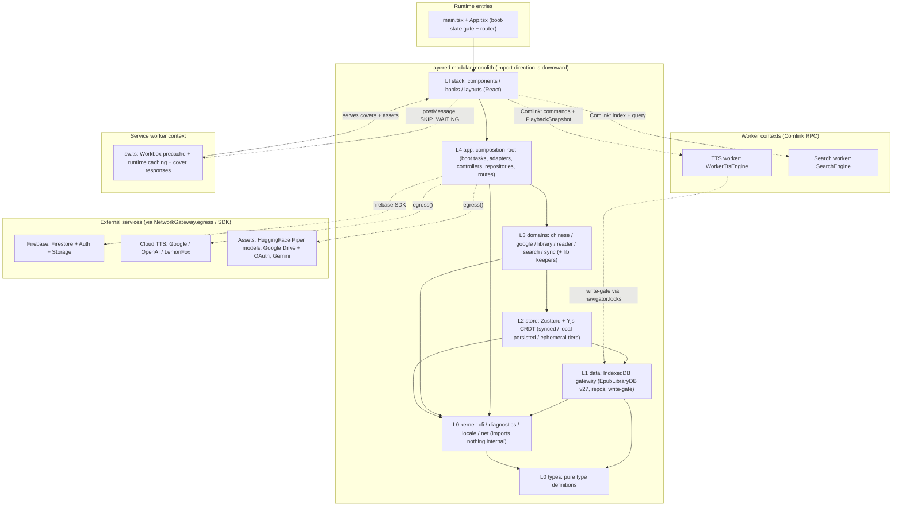
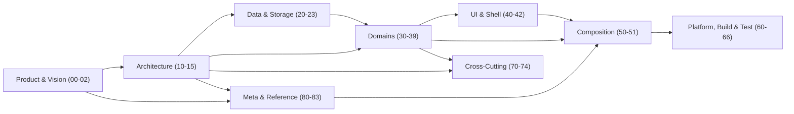

# Versicle — Comprehensive Documentation

Versicle is a **local-first EPUB reader and TTS audiobook player**, delivered as a Progressive
Web App with Capacitor bindings for Android and iOS. Your library, reading position,
annotations, and vocabulary live on-device in IndexedDB and a Yjs CRDT, and sync across your
devices through a Firebase project *you* own (BYO-Firebase) — no first-party server, privacy as
a hard constraint, full offline operation. Optional, BYO-keyed AI features extend this: **semantic
search** embeds book text with Gemini and fuses it with the regex engine; a **cross-provider quota
governor** paces every GenAI call against the per-project free-tier ceiling; and a **shared
AI-cache** mirrors expensive embedding blobs into your own Cloud Storage so a book embedded once
on one device costs zero Gemini quota on the others — all default-off and consent-gated. The
codebase is a **contract-first modular monolith**: vertical domain modules stacked in
strictly-ordered layers (kernel → data → store → domains → app → UI), with every cross-module
seam frozen as a versioned, runtime-validated contract and every boundary mechanically enforced
by CI. This documentation set is the deep, narrative companion to the machine-generated
[`architecture.md`](../../architecture.md): 44 documents (~2.0 MB) that explain *what* the system
is, *why* it is shaped this way, and *how* every part fits together — from governing design
principles down to file-level implementation detail.

> **Source of truth.** [`architecture.md`](../../architecture.md) at the repo root is generated
> from the live code registries and drift-gated by `npm test`. Where these prose documents and
> `architecture.md` disagree, `architecture.md` wins.

---

## Recommended reading order

You do not need to read all 44 documents. Pick a path:

**New to Versicle (start here).**
1. [00 — Introduction & Product Vision](00-introduction.md) — what the app is and who it serves.
2. [10 — Architecture Overview](10-architecture-overview.md) — the one-page mental model.
3. [02 — Glossary & Domain Model](02-glossary-and-domain-model.md) — the vocabulary everything else assumes.
4. [11 — Layering & Boundaries](11-layering-and-boundaries.md) — the five-layer rule that governs every import.
5. [81 — Annotated Directory Map](81-directory-map.md) — where every file lives.

**Understanding the "why".** [01 — Product Design Decisions](01-product-design-decisions.md) →
[80 — Overhaul History](80-overhaul-history.md) → [12 — Contract-First Registries](12-contract-first-registry.md).

**Following the data.** [13 — State Management (CRDT)](13-state-management-crdt.md) →
[20 — Storage Gateway](20-storage-gateway.md) → [22 — CRDT Format & Migrations](22-crdt-format-and-migrations.md) →
[36 — Sync Domain](36-domain-sync.md).

**Building a feature.** [82 — End-to-End Flows](82-end-to-end-flows.md) →
[50 — Composition Root](50-composition-root.md) → [83 — Extending the System](83-extending-the-system.md).

---

## The whole set, by section

### Product & Vision

| Document | What it covers |
|---|---|
| [00 — Introduction & Product Vision](00-introduction.md) | What Versicle is, who it is for, system context. |
| [01 — Product Design Decisions](01-product-design-decisions.md) | Local-first, privacy-centric, BYO-Firebase — and the alternatives rejected. |
| [02 — Glossary & Domain Model](02-glossary-and-domain-model.md) | The formal domain vocabulary; `Book` and the top-level domain map. |

### Architecture

| Document | What it covers |
|---|---|
| [10 — Architecture Overview](10-architecture-overview.md) | The entry-point mental model: C4 containers, the layered module map. |
| [11 — Layering & Boundaries](11-layering-and-boundaries.md) | The five-layer dependency stack and the forbidden-edge enforcement matrix. |
| [12 — Contract-First Registries](12-contract-first-registry.md) | The registry pattern and the C1–C12 contract inventory. |
| [13 — State Management: Zustand + Yjs CRDT](13-state-management-crdt.md) | The three-tier store registry and the shared `Y.Doc` singleton. |
| [14 — Bootstrap & Application Lifecycle](14-bootstrap-and-lifecycle.md) | `BOOT_PHASES`, `BootTask`, and the boot contract. |
| [15 — Error Handling & Recovery](15-error-handling-and-recovery.md) | The `AppError` taxonomy and recovery paths. |

### Data & Storage

| Document | What it covers |
|---|---|
| [20 — Storage Gateway](20-storage-gateway.md) | `src/data/` as the only IndexedDB subsystem; `EpubLibraryDB` at v27. |
| [21 — IndexedDB Schema & Migrations](21-schema-and-migrations-idb.md) | The schema, the row type system, and IDB migrations through `migrateToV27` (the additive `cache_embeddings`/`cache_embed_jobs` stores). |
| [22 — CRDT Format & Migrations](22-crdt-format-and-migrations.md) | The versioned CRDT document structure and its migration timeline. |
| [23 — Backup & Restore](23-backup-and-restore.md) | Manifest-versioned export/import of the full local dataset. |

### Domains

| Document | What it covers |
|---|---|
| [30 — Reader Domain: Rendering Engine](30-domain-reader-engine.md) | The `ReaderEngine` port (contract C7) and the rendering module map. |
| [31 — Reader UI & Overlays](31-reader-ui-and-overlays.md) | `ReaderShell`, the component tree, and overlay composition. |
| [32 — Audio Domain: TTS Engine Core](32-domain-audio-tts-engine.md) | The `TtsEngine` interface where commands are ACKs. |
| [33 — TTS Providers & Platform](33-tts-providers-and-platform.md) | The provider abstraction and registry (Piper, Google, OpenAI, LemonFox). |
| [34 — TTS Content Pipeline](34-tts-content-pipeline.md) | How book text becomes the utterance stream the engine speaks. |
| [35 — Chinese Domain](35-domain-chinese.md) | Lexicon, pinyin, and vocabulary subsystem. |
| [36 — Sync Domain](36-domain-sync.md) | Firestore multi-device sync and the `SyncBackend` seam (C3), incl. the five Artifact-Lane methods that mirror AI-cache blobs to BYO Cloud Storage. |
| [37 — Library Domain](37-domain-library.md) | EPUB import and library management. |
| [38 — Search Domain](38-domain-search.md) | The search worker and query data shapes; regex full-text plus int8 semantic ranking fused by reciprocal-rank fusion. |
| [39 — Google Services](39-domain-google.md) | Auth, Drive, and GenAI (Gemini + the embedding client) integration. |

### UI & Shell

| Document | What it covers |
|---|---|
| [40 — UI Design System](40-ui-design-system.md) | The design system, technology stack, and UI boundaries. |
| [41 — Settings Shell & Panels](41-settings-shell.md) | The settings shell architecture and panel registry; the GenAI panel hosts the per-lane quota limits, pause-all switch, live used-vs-limit meters, and the default-off AI opt-ins. |
| [42 — App Shell & Routing](42-app-shell-and-routing.md) | The two render layers, the boot state machine, and routing. |

### Composition

| Document | What it covers |
|---|---|
| [50 — Composition Root](50-composition-root.md) | `src/app/` wiring: boot tasks (incl. embedding backfill, the Artifact-Lane publisher/sweeper), adapters (the quota store and artifact-consult), controllers, repositories. |
| [51 — TTS Application Integration](51-tts-app-integration.md) | How the TTS engine is composed into the running application. |

### Platform, Build & Test

| Document | What it covers |
|---|---|
| [60 — Build & Bundling](60-build-and-bundling.md) | The Vite build pipeline and TypeScript project references. |
| [61 — PWA & Service Worker](61-pwa-and-service-worker.md) | `vite-plugin-pwa` (`injectManifest`) and `src/sw.ts`. |
| [62 — Capacitor Native](62-capacitor-native.md) | The Android/iOS project layout and native integration. |
| [63 — Testing Strategy](63-testing-strategy.md) | The test pyramid and Vitest configuration. |
| [64 — End-to-End Verification](64-e2e-verification.md) | The Dockerized Playwright verification suite. |
| [65 — CI & Quality Gates](65-ci-and-quality-gates.md) | The ratchet model, parallel CI jobs, and boundary bans. |
| [66 — Vendored Forks](66-vendored-forks.md) | The `packages/` workspaces: zustand-yjs, y-idb, y-cinder. |

### Cross-Cutting

| Document | What it covers |
|---|---|
| [70 — Security & Privacy](70-security-and-privacy.md) | The threat model, four-layer security model, Firestore/Storage rules, and the app-layer consent gate the Artifact-Lane download shares with the embed it replaces. |
| [71 — Internationalization](71-internationalization.md) | The "i18n-ready, English-only" posture and the locale kernel. |
| [72 — Accessibility](72-accessibility.md) | The a11y checkpoint flow and the axe gate. |
| [73 — Performance](73-performance.md) | Caching layers and the IndexedDB write gate. |
| [74 — Observability & Diagnostics](74-observability-and-diagnostics.md) | The scoped logger and the flight-recorder diagnostics. |

### Meta & Reference

| Document | What it covers |
|---|---|
| [80 — The Overhaul: History & Rationale](80-overhaul-history.md) | Where the debt came from and the ten program rules. |
| [81 — Annotated Directory Map](81-directory-map.md) | A path-by-path tour of the repository and its aliases. |
| [82 — End-to-End Flows](82-end-to-end-flows.md) | Boot, import, and read/annotate journeys traced through the stack. |
| [83 — Extending the System (Cookbook)](83-extending-the-system.md) | Recipes: adding a TTS provider, a synced store, and more. |

---

## Master architecture diagram

The layered modular monolith and its runtime contexts. Higher layers may import only lower
layers; the worker, service-worker, and external boundaries are crossed only through declared
seams.

## Documentation map

How the 44 documents relate. Read top-to-bottom for the "new engineer" path; branch into a
section when you need depth.

---

## How this was generated

This index was assembled by an editor pass over the `docs/comprehensive/` set: every `.md`
file was measured with `wc -c`, and each document's `#`/`##` headings were extracted to confirm
its scope before placement. The two diagrams above are distilled from the layer map in
[10 — Architecture Overview](10-architecture-overview.md) and the dependency stack in
[11 — Layering & Boundaries](11-layering-and-boundaries.md); they are simplified for orientation,
not authoritative. For the canonical, drift-gated architecture, defer to
[`architecture.md`](../../architecture.md) at the repository root. The other 44 documents were
not modified — only this `README.md` was created.
