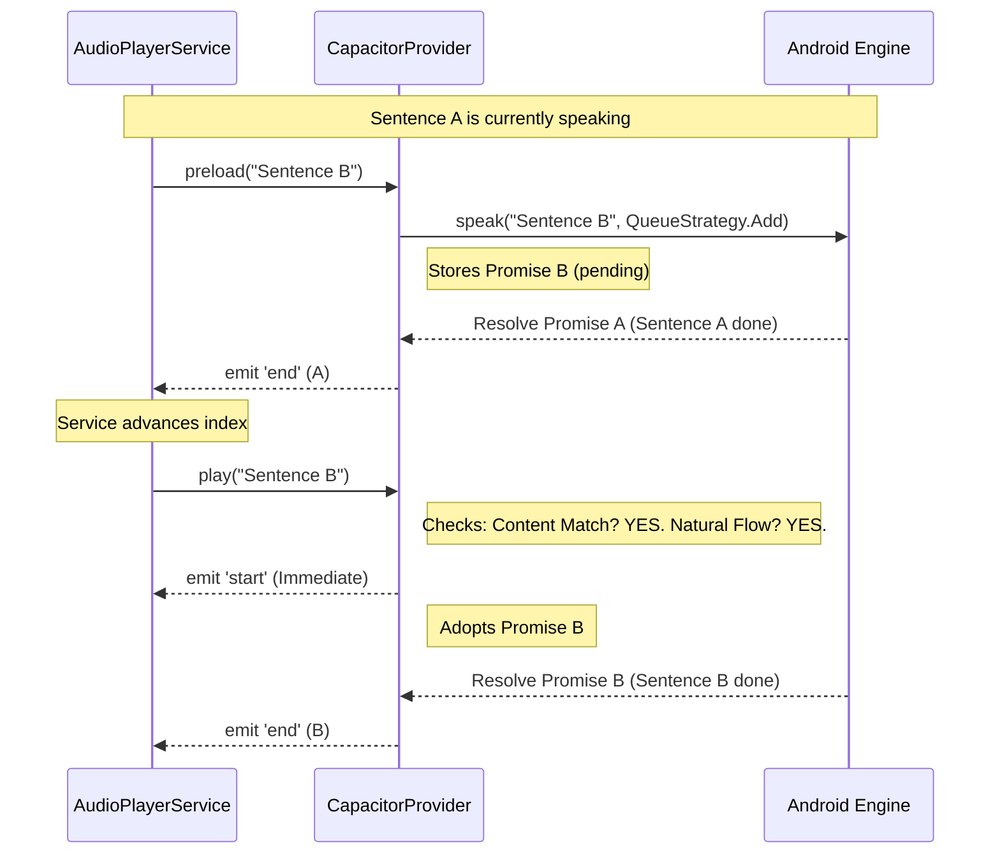
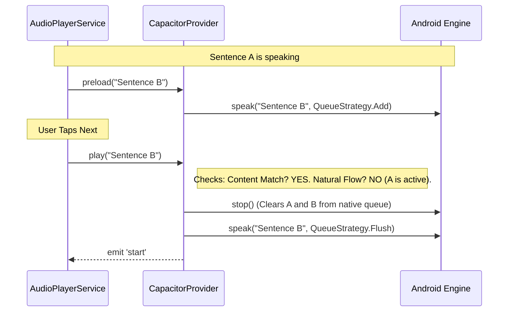

# Technical Design Doc: Android TTS Smart Handoff

## 1. Objective

To achieve seamless, gapless playback of segmented text-to-speech content on Android devices. The goal is to eliminate the audio silence and engine re-initialization artifacts that occur between sentences, creating an immersive listening experience comparable to audiobook playback.

## 2. Background & Problem

The current architecture in `AudioPlayerService` treats every sentence as a discrete event:

1. Play Sentence A.
2. Wait for Sentence A to finish.
3. **Stop** the provider.
4. **Play** Sentence B.

On the local Android `TextToSpeech` engine, calling `stop()` flushes the audio buffer and spins down the synthesis engine. Restarting it for the next sentence introduces a latency gap (200-500ms) and often an audible "pop" or "click." This breaks the immersion, especially for short sentences or dialogue.

## 3. High-Level Concept: "Pre-fill and Handoff"

To solve this without rewriting the complex orchestration logic in `AudioPlayerService`, we will implement intelligence within the `CapacitorTTSProvider`.

The concept relies on two native queuing strategies:

* **Flush (0):** "Stop everything and say this immediately." (Used for jumps, seeks, and interruptions).
* **Add (1):** "Wait for the current audio to finish, then say this." (Used for natural flow).

### The "Smart Handoff" Workflow

1. **Pre-fill:** While Sentence A is speaking, the Service sends Sentence B to the Provider via `preload()`. The Provider silently sends this to the native Android layer using **QueueStrategy.Add**. The native engine buffers Sentence B immediately after Sentence A.
2. **Handoff:** When Sentence A finishes, the Service naturally calls `play(Sentence B)`. The Provider recognizes that Sentence B is already queued and playing natively. It skips the `stop()` command and simply "adopts" the running process, synchronizing the JavaScript state with the native audio already in progress.

---

## 4. Detailed Design

### 4.1. State Management

The Provider must track the "on-deck" content and the state of the current playback to distinguish between a natural transition and a user interruption.

We require the following state variables in `CapacitorTTSProvider`:

* **`nextText`**: Stores the content of the preloaded sentence.
* **`nextUtterancePromise`**: Holds the native Promise returned by the plugin when we queued the next sentence. This allows us to attach event listeners later.
* **`currentUtteranceFinished`**: A boolean flag that tracks if the *previous* sentence completed naturally.
* If `true`: We are in a natural flow (eligible for Handoff).
* If `false`: The user interrupted the audio (Must Flush).


### 4.2. Logic Flow: The Preload Phase

**Where:** `CapacitorTTSProvider.preload()`

This method changes from a no-op to an active command. When called:

1. It verifies that audio is currently playing (we only buffer if the engine is busy).
2. It calls the native `TextToSpeech.speak` method using **QueueStrategy.Add**.
3. **Crucially**, it does *not* await the result. It stores the resulting Promise in `nextUtterancePromise`. This keeps the native queue full without blocking the JS thread.

### 4.3. Logic Flow: The Play Phase (The Decision Engine)

**Where:** `CapacitorTTSProvider.play()`

When `play()` is called, the Provider acts as a decision engine to determine the correct Native Strategy.

#### The Decision Matrix

| Condition | Logic Check | Action | Strategy |
| --- | --- | --- | --- |
| **Natural Transition** | Content matches `nextText` **AND** Previous finished naturally. | **Handoff** | **None** (Adopt existing) |
| **User Skip/Jump** | Content matches `nextText` **BUT** Previous is still playing. | **Reset** | **Flush** (Kill queue) |
| **Seek/New Chapter** | Content does *not* match `nextText`. | **Reset** | **Flush** (Kill queue) |

#### Code Implementation Strategy

The `play` method implements the matrix above:

```typescript
// Conceptual Implementation
async play(text: string, options: TTSOptions) {
  // 1. Check for Handoff eligibility
  const contentMatch = (text === this.nextText);
  const isNaturalFlow = this.currentUtteranceFinished;

  if (contentMatch && isNaturalFlow) {
     // --- SMART HANDOFF ---
     // 1. Emit 'start' immediately (Native audio is already playing/buffered)
     // 2. Attach 'end'/'error' listeners to the PRE-EXISTING promise (nextUtterancePromise)
     // 3. Clear preload state
  } else {
     // --- STANDARD FLUSH ---
     // 1. Call native stop() to clear buffer
     // 2. Emit 'start'
     // 3. Call native speak() with QueueStrategy.Flush (0)
     // 4. Attach listeners to this NEW promise
  }
}

```

### 4.4. Event Synchronization

The `AudioPlayerService` relies on events (`start`, `end`, `boundary`) to update the UI (highlighting text, progress bars).

* **Start Event:** In the Handoff scenario, we emit `start` immediately upon receiving the `play()` call. Since the native buffer is gapless, the audio transition happens almost exactly when the JS call occurs, keeping the UI highlight in sync with the voice.
* **End Event:** We must ensure we attach the resolution handler to the *correct* promise. If we perform a Handoff, we attach to `nextUtterancePromise`. If we perform a Flush, we attach to the new promise generated by the speak command.

### 4.5. Cleanup and Resource Management

To ensure stability, we must handle interruptions and listener lifecycles strictly.

1. **Stop/Pause:** If `stop()` or `pause()` is called, we must clear all preload variables (`nextText`, `nextUtterancePromise`). We then issue a native `stop()` command, which clears the entire native queue (current + buffered).
2. **Listener Leaks:** The `init()` method must check if a listener handle already exists before adding a new one. This prevents duplicate events after multiple `init()` calls (e.g., after error recovery).

---

## 5. Sequence Diagrams

### Scenario A: Natural Playback (Gapless)

The user listens to a paragraph. Sentence A transitions to Sentence B automatically.



### Scenario B: User Interruption (Skip)

The user gets bored of Sentence A and taps "Next".



---

## 6. Verification Plan

### 6.1. Audio Tests

1. **Gapless Check:** Play a paragraph with short sentences. Listen for the "pop" or silence between them. It should sound like a continuous stream.
2. **Long Sentence Handover:** Ensure `preload` works even if the current sentence is long. (The promise should sit pending until the first one finishes).

### 6.2. Interaction Tests

1. **Rapid Skipping:** Mash the "Next" button. The audio should cut instantly and start the new sentence (Flush strategy) without getting stuck on queued content.
2. **Pause/Resume:** Pause in the middle of a sentence. Resume. It should restart the *current* sentence, not jump to the *preloaded* one.

### 6.3. Edge Case Tests

1. **Duplicate Content:** Create a text with "Hello. Hello." verifying that the transition logic handles identical consecutive strings correctly.
2. **Provider Switching:** Disconnect internet to force a fallback from Cloud to Local. Verify `init()` cleans up listeners and doesn't cause double-event firing.

---

## 7. Implementation Status (Updated)

**Date:** 2024-05-22
**Status:** Implemented

### Actions Taken:
1.  **Refactored `CapacitorTTSProvider.ts`:**
    *   Added state variables: `nextText`, `nextUtterancePromise`, `currentUtteranceFinished`, `listenerHandle`.
    *   Implemented `preload()` to use `queueStrategy: 1` (Add) and store the promise.
    *   Implemented `play()` with Smart Handoff logic (adopt promise if eligible, else flush).
    *   Updated `init()` to handle listener cleanup.
    *   Updated `stop()` and `pause()` to clear preload state.

2.  **Updated Tests:**
    *   Expanded `CapacitorTTSProvider.test.ts` to cover:
        *   Smart Handoff scenario (mocked `speak` not called on `play`).
        *   Fallback to Flush when content mismatches.
        *   Fallback to Flush when interruption occurs (previous not finished).
        *   Verify `preload` uses `queueStrategy: 1`.
        *   Verify listener cleanup in `init`.

### Deviations:
*   The original plan mentioned checking if "audio is currently playing" in `preload()`. In implementation, we unconditionally buffer if `preload()` is called, as the Service usually only calls it during playback. The `play()` logic correctly handles the "Natural Flow" check via `currentUtteranceFinished` flag.
*   Added `listenerHandle` property to properly track and remove the listener returned by the Capacitor plugin.

### Verification Results:
*   **Unit Tests:** All tests in `CapacitorTTSProvider.test.ts` passed.
*   **Integration:** Ran `verification/test_mock_tts.py` to ensure no regression in general TTS infrastructure.
