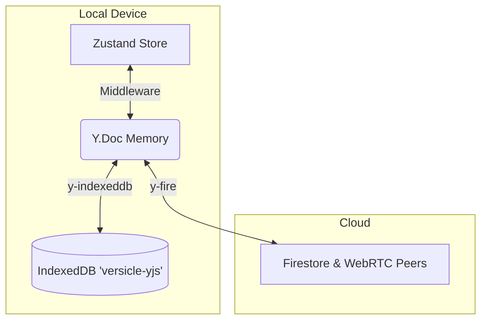

# Design Document: Cloud Sync via Firestore (y-fire)

**Status:** Draft
**Objective:** Enable cross-device synchronization of user data (progress, annotations, library metadata) using Firestore as a relay and persistence layer, while maintaining `IndexedDB` as the primary local-first storage.

## 1. Architecture: Dual Provider Strategy

Versicles is a **Local-First** application. The primary source of truth for the application session is the `Y.Doc` in memory, persisted locally by `y-indexeddb`.

We will introduce `y-fire` as a **Secondary Provider** that acts as a "Cloud Overlay".



### Roles
*   **y-indexeddb:** Always active. Loads data on startup. Saves data offline. Ensures the app works without internet.
*   **y-fire:** Active **only** when authenticated and online. Syncs local `Y.Doc` changes to Firestore and other connected peers.

## 2. Authentication & Security

Since `y-fire` writes to a shared database, we must authenticate users to partition data securely.

### Strategy
*   **Provider:** Firebase Auth.
*   **Method:** Google Sign-In (Primary).
*   **Anonymous Auth:** Not recommended for sync (user identity is needed across devices), but useful for "Guest" modes if we ever support temporary sharing.

### Data Partitioning
We will store user data in a private path keyed by their User ID (UID).

*   **Path Pattern:** `users/${uid}/versicle/sync_root`
*   **Firestore Rules:**
    ```javascript
    rules_version = '2';
    service cloud.firestore {
      match /databases/{database}/documents {
        match /users/{userId}/{document=**} {
          allow read, write: if request.auth != null && request.auth.uid == userId;
        }
      }
    }
    ```

## 3. The "Ghost Book" Reality

**Crucial Constraint:** Yjs is optimized for JSON-like metadata (CRDTs). It is **not** suitable for syncing large binaries like EPUB files (1MB - 100MB+).

### Sync Scope
| Synced via Yjs (y-fire) | NOT Synced (Local IDB Only) |
| :--- | :--- |
| **User Inventory:** Title, Author, Tags, Rating | **Static Resources:** The `.epub` binary blob |
| **Progress:** CFI, Percentage | **Generated Assets:** Covers, Table Images |
| **Annotations:** Highlights, Notes | |
| **Preferences:** Theme, Fonts | |

### User Experience
When a user adds a book on Device A:
1.  Device A writes Metadata + Blob to IDB.
2.  Device A syncs Metadata to Firestore.
3.  Device B receives Metadata.
4.  Device B shows a **"Ghost Book"** (Metadata visible, but "Download" or "Missing" icon).
5.  **Resolution:** User must manually add the same `.epub` file to Device B. The system detects the matching Hash/ID and "hydrates" the ghost book, unlocking the synced progress and annotations.

## 4. Implementation Plan

### Step 1: Dependencies
Add required packages:
```bash
npm install firebase y-fire
```

### Step 2: Firebase Initialization
Create `src/lib/sync/firebase-config.ts`.
*   Initialize `FirebaseApp`.
*   Export `auth` and `firestore` instances.

### Step 3: Sync Manager Service
Create `src/lib/sync/SyncManager.ts`. This service orchestrates the `y-fire` connection.

**Responsibilities:**
1.  Listen to Firebase Auth state changes.
2.  **On Login:**
    *   Initialize `FireProvider` with `yDoc` (from `yjs-provider.ts`).
    *   Path: `users/${user.uid}/versicle/main`.
    *   Wait for `onReady`.
3.  **On Logout:**
    *   Call `provider.destroy()`.
    *   Clear local Yjs state? **Decision:** No. Keep local data. Merging handles conflicts if a different user logs in (though single-user device is assumed).

**Code Sketch:**
```typescript
import { FireProvider } from 'y-fire';
import { yDoc } from '../../store/yjs-provider';
import { auth, app } from './firebase-config';

let fireProvider: FireProvider | null = null;

export const initSync = () => {
    auth.onAuthStateChanged((user) => {
        if (user) {
            connectFireProvider(user);
        } else {
            disconnectFireProvider();
        }
    });
};

const connectFireProvider = (user: User) => {
    if (fireProvider) return;

    fireProvider = new FireProvider({
        firebaseApp: app,
        ydoc: yDoc,
        path: `users/${user.uid}/versicle/main`,
        maxWaitFirestoreTime: 2000 // Debounce writes
    });

    fireProvider.on('synced', () => console.log('☁️ Cloud Synced'));
};

const disconnectFireProvider = () => {
    if (fireProvider) {
        fireProvider.destroy();
        fireProvider = null;
    }
};
```

### Step 4: UI Components
*   **`SyncSettings.tsx`**: A panel in the Settings menu.
    *   Status: "Synced" / "Offline" / "Not Signed In".
    *   Action: "Sign in with Google".
    *   Debug: "Force Sync".

## 5. Cost & Performance Optimization

`y-fire` uses Firestore writes. To avoid high costs:
1.  **Debounce:** Configure `maxWaitFirestoreTime` to batch updates (e.g., 2000ms).
2.  **Peer-to-Peer:** `y-fire` attempts WebRTC peer connections first. Firestore is used for signaling and persistence. This offloads bandwidth from the database.
3.  **Connection Lifecycle:** Only connect `FireProvider` when the app is foregrounded?
    *   *Decision:* Keep connected while app is open to ensure realtime collaboration/sync. Disconnect on `unload`.

## 6. Migration & Compatibility

*   **Existing Local Data:** When `y-fire` connects, it merges local data with cloud data.
    *   If Cloud is empty: Local data uploads.
    *   If Cloud has data: Merges (Union).
*   **Version Control:** Ensure schema compatibility. If schema changes (e.g., `UserProgress` shape), we might need version names in the path: `users/${uid}/versicle_v1/main`.

## 7. Risks & Mitigations

| Risk | Mitigation |
| :--- | :--- |
| **Data overwrite (LWW)** | Yjs handles merging, but clock skew can cause LWW anomalies. Acceptable for Phase 4. |
| **High Firestore Bill** | Monitor usage. Use `y-fire` clustering settings. |
| **Auth Complexity** | Abstract Auth logic into `useAuthStore`. |
| **Ghost Book Confusion** | Clear UI messaging: "File missing. Please add [Filename.epub] to read." |

## 8. Development Roadmap

1.  **Setup:** Create Firebase Project, get config.
2.  **Integration:** Implement `SyncManager`.
3.  **UI:** Add Sign-In button.
4.  **Verification:** Test sync between two simulator windows (or devices).
