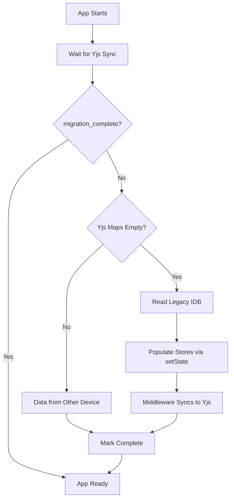

# Phase 3: Simplified Migration to Yjs

**Goal:** Migrate existing user data from Legacy IndexedDB (`EpubLibraryDB`) to Yjs (`versicle-yjs`) using **store actions** instead of manual Y.Map manipulation. The middleware handles all sync automatically.

## Overview: Migration as Store Initialization

**Key Insight:** The middleware automatically syncs Zustand state to Yjs. Therefore, migration becomes:
1. Check if Yjs is empty (first device)
2. If empty, read from legacy IDB and use **Zustand `setState()`** to populate
3. Middleware automatically writes to Yjs
4. Mark complete

**Merge Strategy:** If Yjs already has data (synced from another device), skip migration. Yjs data takes precedence.

## 1. Migration Service Architecture

### Migration Flow



## 2. Implementation: Migration Service

**File:** `src/lib/migration/YjsMigration.ts`

```typescript
import { yDoc, waitForYjsSync } from '../../store/yjs-provider';
import { dbService } from '../../db/DBService';
import { useLibraryStore } from '../../store/useLibraryStore';
import { useAnnotationStore } from '../../store/useAnnotationStore';
import { usePreferencesStore } from '../../store/usePreferencesStore';
import { useReadingStateStore } from '../../store/useReadingStateStore';
import type { 
  UserInventoryItem, 
  UserAnnotation, 
  UserProgress,
  BookMetadata 
} from '../../types/db';

/**
 * Checks if migration from legacy IDB to Yjs is needed and executes it.
 * Should be called once on app startup, after Yjs has synced.
 */
export async function migrateToYjs(): Promise<void> {
  console.log('[Migration] Starting Yjs migration check...');
  
  // 1. Wait for Yjs to load from IndexedDB (may already have data from sync)
  await waitForYjsSync(10000);
  
  // 2. Check migration status from preferences map
  const preferencesMap = yDoc.getMap('preferences');
  const migrationComplete = preferencesMap.get('migration_complete');
  
  if (migrationComplete === true) {
    console.log('[Migration] ✅ Migration already complete. Skipping.');
    return;
  }
  
  // 3. Check if Yjs already has data (from another device)
  const libraryMap = yDoc.getMap('library');
  const hasExistingData = libraryMap.size > 0;
  
  if (hasExistingData) {
    console.log('[Migration] 📦 Yjs has existing data from sync. Skipping legacy migration.');
    preferencesMap.set('migration_complete', true);
    return;
  }
  
  // 4. Yjs is empty - migrate from legacy IDB
  console.log('[Migration] 🔄 Migrating from legacy IndexedDB...');
  
  try {
    await migrateLegacyData();
    
    // Mark complete
    preferencesMap.set('migration_complete', true);
    preferencesMap.set('migration_timestamp', Date.now());
    
    console.log('[Migration] ✅ Migration complete!');
  } catch (error) {
    console.error('[Migration] ❌ Migration failed:', error);
    // Don't mark complete - will retry on next startup
    throw error;
  }
}

/**
 * Reads legacy IDB data and populates Zustand stores.
 * The middleware automatically syncs to Yjs.
 */
async function migrateLegacyData(): Promise<void> {
  const db = await dbService.getDB();
  
  // Read all legacy stores
  const [
    legacyBooks,
    legacyAnnotations,
    legacyJourney
  ] = await Promise.all([
    getLegacyLibrary(),
    db.getAll('user_annotations'),
    db.getAll('user_journey')
  ]);
  
  console.log(`[Migration] Found ${legacyBooks.length} books, ${legacyAnnotations.length} annotations`);
  
  // Use a single Yjs transaction for atomic migration
  yDoc.transact(() => {
    // Migrate Library (Inventory + Progress)
    migrateBooksAndProgress(legacyBooks);
    
    // Migrate Annotations
    migrateAnnotations(legacyAnnotations);
    
    // Migrate Journey (limited to recent 500 for performance)
    // Note: Full journal stays in IDB for now
    migrateJourney(legacyJourney);
  });
  
  console.log('[Migration] All data migrated to Yjs');
}

/**
 * Migrates books from legacy IDB to useLibraryStore and useReadingStateStore
 */
function migrateBooksAndProgress(legacyBooks: BookMetadata[]): void {
  const libraryState = useLibraryStore.getState();
  const progressState = useReadingStateStore.getState();
  
  const books: Record<string, UserInventoryItem> = {};
  const progress: Record<string, UserProgress> = {};
  
  for (const book of legacyBooks) {
    // Create inventory item with Ghost Book metadata
    books[book.id] = {
      bookId: book.id,
      title: book.title,        // Ghost Book snapshot
      author: book.author,      // Ghost Book snapshot
      addedAt: book.addedAt || Date.now(),
      lastInteraction: book.lastRead || book.addedAt || Date.now(),
      sourceFilename: book.filename || 'unknown',
      status: determineReadingStatus(book.progress),
      tags: book.tags || [],
      rating: book.rating || 0
    };
    
    // Create progress item
    if (book.currentCfi || book.progress > 0) {
      progress[book.id] = {
        bookId: book.id,
        currentCfi: book.currentCfi || null,
        percentage: book.progress || 0,
        lastRead: book.lastRead || Date.now(),
        lastPlayedCfi: book.lastPlayedCfi || null,
        completedRanges: []  // Can be enhanced later
      };
    }
  }
  
  // Batch update stores (middleware syncs to Yjs)
  libraryState.setState({ books });
  progressState.setState({ progress });
  
  console.log(`[Migration] Migrated ${Object.keys(books).length} books and ${Object.keys(progress).length} progress entries`);
}

/**
 * Migrates annotations to useAnnotationStore
 */
function migrateAnnotations(legacyAnnotations: UserAnnotation[]): void {
  const annotationState = useAnnotationStore.getState();
  
  const annotations: Record<string, UserAnnotation> = {};
  
  for (const ann of legacyAnnotations) {
    // Ensure annotation has required fields
    annotations[ann.id] = {
      ...ann,
      createdAt: ann.createdAt || Date.now(),
      updatedAt: ann.updatedAt || ann.createdAt || Date.now()
    };
  }
  
  // Batch update (middleware syncs to Yjs)
  annotationState.setState({ annotations });
  
  console.log(`[Migration] Migrated ${Object.keys(annotations).length} annotations`);
}

/**
 * Migrates reading journey (limited to recent entries for performance)
 */
function migrateJourney(legacyJourney: any[]): void {
  // For Phase 3, we'll keep journey in legacy IDB
  // In Phase 4 (optimization), implement rolling window strategy
  
  console.log(`[Migration] Journey migration deferred to Phase 4 (${legacyJourney.length} entries in legacy)`);
}

/**
 * Helper: Determine reading status from progress percentage
 */
function determineReadingStatus(progress: number = 0): 'unread' | 'reading' | 'completed' {
  if (progress >= 0.98) return 'completed';
  if (progress > 0) return 'reading';
  return 'unread';
}

/**
 * Helper: Get legacy library with fallback for missing fields
 */
async function getLegacyLibrary(): Promise<BookMetadata[]> {
  try {
    const books = await dbService.getLibrary();
    return books;
  } catch (error) {
    console.error('[Migration] Failed to fetch legacy library:', error);
    return [];
  }
}
```

## 3. Integration: App Entrypoint

**File:** `src/main.tsx` or `src/App.tsx`

```typescript
import React, { useEffect, useState } from 'react';
import { migrateToYjs } from './lib/migration/YjsMigration';
import { useLibraryStore } from './store/useLibraryStore';

function App() {
  const [isMigrating, setIsMigrating] = useState(true);
  const [migrationError, setMigrationError] = useState<string | null>(null);
  
  useEffect(() => {
    const initializeApp = async () => {
      try {
        // 1. Run migration (checks if needed)
        await migrateToYjs();
        
        // 2. Hydrate static metadata (covers, etc.) from IDB
        await useLibraryStore.getState().hydrateStaticMetadata();
        
        setIsMigrating(false);
      } catch (error) {
        console.error('App initialization failed:', error);
        setMigrationError(error instanceof Error ? error.message : 'Unknown error');
        setIsMigrating(false);
      }
    };
    
    initializeApp();
  }, []);
  
  if (isMigrating) {
    return (
      <div className="loading-screen">
        <div className="spinner" />
        <p>Upgrading database...</p>
      </div>
    );
  }
  
  if (migrationError) {
    return (
      <div className="error-screen">
        <h1>Migration Failed</h1>
        <p>{migrationError}</p>
        <button onClick={() => window.location.reload()}>
          Retry
        </button>
      </div>
    );
  }
  
  return (
    <>
      {/* Your app components */}
    </>
  );
}

export default App;
```

## 4. Merge Strategy: Handling Multi-Device Scenarios

### Scenario 1: First Device Migration
- Yjs maps are empty
- Read from legacy IDB → Populate stores → Middleware syncs to Yjs
- Result: Device A has both legacy IDB + Yjs copies

### Scenario 2: Second Device (Sync Before Migration)
- Device B opens app
- Yjs syncs from Device A's IndexedDB via network provider (future) or manual export (Phase 3)
- Migration check sees `libraryMap.size > 0`
- **Skip legacy migration**, use Yjs data
- Result: Device B uses synced data, ignores its legacy IDB

### Scenario 3: Offline Migration Conflict
- Device A migrates offline: Book X has progress 50%
- Device B migrates offline: Book X has progress 70%
- Devices come online
- **Yjs LWW**: Whichever device synced last wins
- **Improvement (Phase 4):** Implement "Max Progress Wins" custom observer

## 5. Data Validation During Migration

Use Zod schemas from Phase 1 to validate data before storing.

### Enhanced `migrateBooksAndProgress`

```typescript
import { UserInventoryItemSchema, UserProgressSchema } from '../sync/validators';

function migrateBooksAndProgress(legacyBooks: BookMetadata[]): void {
  const libraryState = useLibraryStore.getState();
  const progressState = useReadingStateStore.getState();
  
  const books: Record<string, UserInventoryItem> = {};
  const progress: Record<string, UserProgress> = {};
  
  let skippedBooks = 0;
  
  for (const book of legacyBooks) {
    try {
      const inventoryItem = {
        bookId: book.id,
        title: book.title,
        author: book.author,
        addedAt: book.addedAt || Date.now(),
        lastInteraction: book.lastRead || book.addedAt || Date.now(),
        sourceFilename: book.filename || 'unknown',
        status: determineReadingStatus(book.progress),
        tags: book.tags || [],
        rating: book.rating || 0
      };
      
      // Validate
      const validatedItem = UserInventoryItemSchema.parse(inventoryItem);
      books[book.id] = validatedItem;
      
      if (book.currentCfi || book.progress > 0) {
        const progressItem = {
          bookId: book.id,
          currentCfi: book.currentCfi || null,
          percentage: book.progress || 0,
          lastRead: book.lastRead || Date.now(),
          lastPlayedCfi: book.lastPlayedCfi || null,
          completedRanges: []
        };
        
        const validatedProgress = UserProgressSchema.parse(progressItem);
        progress[book.id] = validatedProgress;
      }
    } catch (error) {
      console.error(`[Migration] Skipping invalid book ${book.id}:`, error);
      skippedBooks++;
    }
  }
  
  libraryState.setState({ books });
  progressState.setState({ progress });
  
  if (skippedBooks > 0) {
    console.warn(`[Migration] Skipped ${skippedBooks} invalid books`);
  }
}
```

## 6. Verification: Multi-Device Test Plan

### Test 1: Fresh Migration
1. Clear all data (reset browser)
2. Add 3 books with annotations
3. Open DevTools → IndexedDB → `versicle-yjs`
4. Verify maps: `library`, `annotations`, `preferences`, `progress`
5. Verify `preferences.migration_complete = true`

### Test 2: Subsequent Launch
1. Restart app
2. Verify migration skipped (logs show "already complete")
3. Verify data persists from Yjs

### Test 3: Simulated Sync (Manual)
1. **Device A:** Migrate as above
2. Export Yjs data: `yDoc.encodeStateAsUpdate()` → Save to file
3. **Device B (fresh):** Import update: `Y.applyUpdate(yDoc, update)`
4. Restart Device B
5. Verify:
   - Migration skipped (Yjs has data)
   - Books appear (with Ghost Book metadata)
   - Covers missing (static blobs not synced)

### Test 4: Offline Conflict
1. **Device A offline:** Add annotation X
2. **Device B offline:** Add annotation Y (different UUID)
3. Both online: Sync Yjs updates
4. Verify: Both annotations present (CRDT set merge)

## 7. Rollback Strategy

If migration causes issues, implement a "Reset Yjs" function:

**File:** `src/lib/migration/YjsReset.ts`

```typescript
import { yDoc } from '../../store/yjs-provider';

/**
 * DANGER: Clears all Yjs data and resets migration flag.
 * Use only for recovery.
 */
export async function resetYjsData(): Promise<void> {
  if (!confirm('⚠️ Reset all synced data? This cannot be undone!')) {
    return;
  }
  
  // Clear all maps
  const maps = ['library', 'annotations', 'preferences', 'progress'];
  maps.forEach(name => {
    const map = yDoc.getMap(name);
    map.clear();
  });
  
  // Reset migration flag
  const prefsMap = yDoc.getMap('preferences');
  prefsMap.delete('migration_complete');
  
  console.log('[Reset] Yjs data cleared. Reload to re-migrate.');
  
  // Force page reload
  setTimeout(() => window.location.reload(), 1000);
}
```

Add to debug menu: `<button onClick={resetYjsData}>Reset Yjs (Dev Only)</button>`

## 8. Legacy Cleanup (Phase 3.5 - Deferred)

**Do NOT delete legacy stores immediately.** Wait for 2-3 release cycles to ensure Yjs migration is stable.

### Future Cleanup (v23+ IDB Schema)

**File:** `src/db/db.ts`

```typescript
// In IDB upgrade callback
if (oldVersion < 23 && newVersion >= 23) {
  // Only delete if migration confirmed complete
  const stores = [
    'user_inventory',
    'user_reading_list',
    'user_progress',
    'user_annotations',
    'user_overrides',
    'user_journey'
  ];
  
  stores.forEach(storeName => {
    if (db.objectStoreNames.contains(storeName)) {
      db.deleteObjectStore(storeName);
      console.log(`[Cleanup] Deleted legacy store: ${storeName}`);
    }
  });
}
```

## 9. Risks & Mitigations

| Risk | Mitigation |
| :--- | :--- |
| **Migration fails mid-process** | Wrap in `yDoc.transact()` for atomicity. Don't mark complete on error. |
| **Data loss** | Keep legacy stores intact until Phase 3.5. Migration is additive, not destructive. |
| **Yjs size bloat** | Defer `user_journey` migration (Phase 4). Validate object sizes. |
| **Clock skew causes bad LWW** | Phase 4: Implement "Max Progress Wins" for critical fields. |
| **Circular refs in legacy data** | Validate with Zod schemas. Skip invalid entries. |

## 10. Phase 3 Success Criteria

- [ ] Migration service detects and populates Yjs from legacy IDB
- [ ] Migration is idempotent (safe to run multiple times)
- [ ] Multi-device scenario: Second device uses synced Yjs data
- [ ] Data validation prevents corrupt entries
- [ ] `migration_complete` flag prevents re-runs
- [ ] All books display with Ghost Book metadata
- [ ] Progress syncs across devices
- [ ] Annotations sync across devices
- [ ] Legacy stores remain intact (non-destructive)

## 11. Next Steps: Phase 4 Preview

Phase 4 will focus on:
- **Network Sync:** WebRTC or WebSocket provider for real-time sync
- **Conflict Resolution:** "Max Progress Wins" observer for reading position
- **Journey Optimization:** Rolling window for `user_journey` (keep recent 500)
- **Garbage Collection:** Clean up orphaned static blobs
- **Export/Import:** Manual sync for devices without network connectivity
