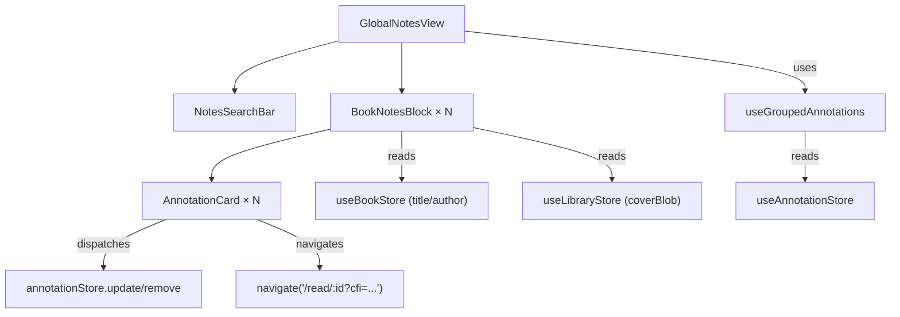

# Global Notes & Annotations — Technical Design Document

## 1. System Overview

The Global Notes View is a **purely client-side, derived-state interface**. It consumes existing Zustand stores (`useAnnotationStore`, `useBookStore`, `useLibraryStore`) with zero new persistence layers. The Yjs CRDT sync middleware already handles cross-device annotation synchronization.

### Validated Assumptions (from codebase audit)

| Claim in Whitepaper | Actual Codebase | Status |
|---|---|---|
| `useAnnotationStore` holds `Record<string, UserAnnotation>` | ✅ Confirmed — [useAnnotationStore.ts](file:///Users/btsai/antigravity/versicle/versicle/src/store/useAnnotationStore.ts#L33-L34) | Valid |
| `UserAnnotation` has `bookId`, `text`, `note?`, `color`, `cfiRange`, `created` | ✅ Confirmed — [db.ts](file:///Users/btsai/antigravity/versicle/versicle/src/types/db.ts#L160-L177) | Valid |
| Book metadata from `useBookStore`/`useLibraryStore` | ✅ `useBookStore` has Yjs-synced `books: Record<string, UserInventoryItem>` with `title`, `author`, `coverPalette` | Valid |
| Cover image from `coverBlob` or `coverPalette` | ✅ `StaticBookManifest.coverBlob` (local) + `UserInventoryItem.coverPalette` (synced) | Valid |
| `ReaderView` reads `initialLocation` from `useReadingStateStore` | ✅ Confirmed — [ReaderView.tsx:127-129](file:///Users/btsai/antigravity/versicle/versicle/src/components/reader/ReaderView.tsx#L127-L129) | Valid |
| Option A (URL Param) for deep-linking | ⚠️ `ReaderView` currently uses `useParams` only, not `useSearchParams` — **modification required** | Feasible |
| Option B (Store Injection) via `jumpToLocation` | ✅ `useReaderUIStore` already has `jumpToLocation` callback, registered in [ReaderView:362-377](file:///Users/btsai/antigravity/versicle/versicle/src/components/reader/ReaderView.tsx#L362-L377) | Valid (but race-prone) |

> [!IMPORTANT]
> **Decision: Use Option A (URL Param `?cfi=`)**. The `jumpToLocation` store callback (Option B) is only registered *after* the rendition is ready, creating a race condition for initial navigation. The URL param approach lets `initialLocation` be resolved synchronously during the `useMemo` on mount.

---

## 2. State Management & Data Pipeline

### 2.1 The `useGroupedAnnotations` Hook

This is the **core derived-state hook** powering the entire view.

```typescript
// src/hooks/useGroupedAnnotations.ts

import { useMemo } from 'react';
import { useAnnotationStore } from '../store/useAnnotationStore';
import type { UserAnnotation } from '../types/db';

export interface BookAnnotationGroup {
  bookId: string;
  annotations: UserAnnotation[];
  latestActivity: number;
}

export const useGroupedAnnotations = (searchQuery: string): BookAnnotationGroup[] => {
  const annotations = useAnnotationStore(state => state.annotations);

  return useMemo(() => {
    const query = searchQuery.toLowerCase().trim();
    const grouped = new Map<string, UserAnnotation[]>();

    Object.values(annotations).forEach(ann => {
      // 1. Filter
      if (query &&
          !ann.text.toLowerCase().includes(query) &&
          !(ann.note?.toLowerCase().includes(query))) {
        return;
      }

      // 2. Group by bookId
      if (!grouped.has(ann.bookId)) grouped.set(ann.bookId, []);
      grouped.get(ann.bookId)!.push(ann);
    });

    // 3. Sort intra-group (ascending by created) and inter-group (descending by latest)
    return Array.from(grouped.entries()).map(([bookId, anns]) => {
      const sortedAnns = anns.sort((a, b) => a.created - b.created);
      const latestActivity = Math.max(...sortedAnns.map(a => a.created));
      return { bookId, annotations: sortedAnns, latestActivity };
    }).sort((a, b) => b.latestActivity - a.latestActivity);
  }, [annotations, searchQuery]);
};
```

### 2.2 Debouncing Strategy

The raw `searchQuery` from the input is debounced before being passed to `useGroupedAnnotations`:

```typescript
// Inside GlobalNotesView.tsx
const [rawQuery, setRawQuery] = useState('');
const debouncedQuery = useDebounce(rawQuery, 300); // standard 300ms debounce
const groups = useGroupedAnnotations(debouncedQuery);
```

A `useDebounce` hook already exists in many patterns; if not present in the codebase, a minimal one is added to `src/hooks/useDebounce.ts`.

### 2.3 Performance Characteristics

| Corpus Size | Expected `useMemo` Cost | Notes |
|-------------|------------------------|-------|
| ≤100 annotations | Negligible (<1ms) | No optimization needed |
| 100–1,000 | ~5ms | Memoization sufficient |
| 1,000–10,000 | ~20ms | Debounce prevents keystroke lag |
| >10,000 | Consider virtualization | Future optimization if needed |

---

## 3. Component Architecture

### 3.1 New Files

```
src/
├── components/
│   └── notes/
│       ├── GlobalNotesView.tsx       # Top-level container (replaces LibraryView in context)
│       ├── NotesSearchBar.tsx        # Controlled search input with debounce
│       ├── BookNotesBlock.tsx        # Book grouping: header + annotation list
│       └── AnnotationCard.tsx        # Individual annotation display + actions
├── hooks/
│   ├── useGroupedAnnotations.ts     # Core data pipeline hook
│   └── useDebounce.ts               # Debounce utility hook (if not existing)
```

### 3.2 Component Dependency Graph



### 3.3 Modified Files

| File | Change | Rationale |
|------|--------|-----------|
| [LibraryView.tsx](file:///Users/btsai/antigravity/versicle/versicle/src/components/library/LibraryView.tsx) | Replace static `<h1>My Library</h1>` with context switcher `<Select>` | NAV-1, NAV-2 |
| [LibraryView.tsx](file:///Users/btsai/antigravity/versicle/versicle/src/components/library/LibraryView.tsx) | Conditionally render `<GlobalNotesView />` or library content based on `activeContext` | NAV-3 |
| [ReaderView.tsx](file:///Users/btsai/antigravity/versicle/versicle/src/components/reader/ReaderView.tsx#L127-L129) | Add `useSearchParams` to read `?cfi=` and override `initialLocation` | DL-2 |
| [usePreferencesStore.ts](file:///Users/btsai/antigravity/versicle/versicle/src/store/usePreferencesStore.ts) | Add `activeContext: 'library' \| 'notes'` field | NAV-5 |

---

## 4. Deep Linking Implementation

### 4.1 ReaderView Modification

Current code (lines 127–129 of `ReaderView.tsx`):
```typescript
const initialLocation = useMemo(() => {
    return id ? useReadingStateStore.getState().getProgress(id)?.currentCfi : undefined;
}, [id]);
```

Modified:
```typescript
import { useSearchParams } from 'react-router-dom';

// Inside component:
const [searchParams] = useSearchParams();
const cfiOverride = searchParams.get('cfi');

const initialLocation = useMemo(() => {
    // URL param takes highest precedence (from annotation deep-link)
    if (cfiOverride) return decodeURIComponent(cfiOverride);
    return id ? useReadingStateStore.getState().getProgress(id)?.currentCfi : undefined;
}, [id, cfiOverride]);
```

### 4.2 Navigation Call (from AnnotationCard)

```typescript
const handleAnnotationClick = (bookId: string, cfiRange: string) => {
    navigate(`/read/${bookId}?cfi=${encodeURIComponent(cfiRange)}`);
};
```

### 4.3 Edge Case: Ghost/Offloaded Books

Before navigating, check if the book's content is available:
```typescript
const staticMetadata = useLibraryStore.getState().staticMetadata;
const offloadedBookIds = useLibraryStore.getState().offloadedBookIds;

if (!staticMetadata[bookId] || offloadedBookIds.has(bookId)) {
    // Trigger ContentMissingDialog flow instead of direct navigation
    // Store pending deep-link target for post-restore navigation
}
```

---

## 5. Export Architecture (Markdown Generator)

### 5.1 Export Function

```typescript
// src/lib/export-notes.ts

import type { UserAnnotation } from '../types/db';

export const exportNotesToMarkdown = (bookTitle: string, annotations: UserAnnotation[]) => {
  let md = `# Notes from ${bookTitle}\n\n`;
  md += `*Exported from Versicle on ${new Date().toLocaleDateString()}*\n\n---\n\n`;

  annotations.forEach(ann => {
    md += `> ${ann.text}\n\n`;
    if (ann.note) {
      md += `**Note:** ${ann.note}\n\n`;
    }
    md += `*${new Date(ann.created).toLocaleString()}*\n\n---\n\n`;
  });

  const blob = new Blob([md], { type: 'text/markdown;charset=utf-8;' });
  const url = URL.createObjectURL(blob);
  const link = document.createElement('a');
  link.href = url;
  link.download = `${bookTitle.replace(/[^a-z0-9]/gi, '_').toLowerCase()}_notes.md`;
  document.body.appendChild(link);
  link.click();
  document.body.removeChild(link);
  URL.revokeObjectURL(url);
};
```

### 5.2 Copy as Markdown (single annotation)

```typescript
export const copyAnnotationAsMarkdown = async (ann: UserAnnotation) => {
  let md = `> ${ann.text}`;
  if (ann.note) md += `\n\n**Note:** ${ann.note}`;
  await navigator.clipboard.writeText(md);
};
```

---

## 6. Context Switcher — Implementation Detail

### Why not a new route?

| Approach | Pros | Cons |
|----------|------|------|
| **New route `/notes`** | Clean URL, bookmarkable | Requires router change in static `createBrowserRouter`, loses Library state (search, scroll) on switch |
| **Component swap (chosen)** | Instant switch, preserves Library scroll position, simpler | No unique URL for Notes view |

The context switcher state lives in `usePreferencesStore` as `activeContext`. Since preferences are Yjs-synced, the context preference persists across devices.

### Implementation in LibraryView

```tsx
// In the header area of LibraryView.tsx (replacing the h1):
<Select value={activeContext} onValueChange={setActiveContext}>
  <SelectTrigger className="w-auto text-3xl font-bold border-0 shadow-none p-0 h-auto">
    <SelectValue />
  </SelectTrigger>
  <SelectContent>
    <SelectItem value="library">My Library</SelectItem>
    <SelectItem value="notes">Notes</SelectItem>
  </SelectContent>
</Select>

// Below header, conditionally render:
{activeContext === 'notes' ? (
  <GlobalNotesView />
) : (
  /* existing library content */
)}
```

---

## 7. Implementation Phases

### Phase 1: Foundation
- [ ] Add `activeContext` to `usePreferencesStore`
- [ ] Modify `LibraryView` header to include context switcher
- [ ] Conditional rendering: swap content area based on context
- [ ] Create placeholder `GlobalNotesView` component

### Phase 2: Core Pipeline
- [ ] Implement `useGroupedAnnotations` hook with memoization
- [ ] Implement `useDebounce` hook (if not existing)
- [ ] Build `BookNotesBlock` component (reads book metadata, renders cover)
- [ ] Build `AnnotationCard` component (pure display)
- [ ] Build `NotesSearchBar` with clear affordance
- [ ] Wire up `GlobalNotesView` with all sub-components
- [ ] Empty state and search-no-results state

### Phase 3: Interactivity
- [ ] Deep-link: modify `ReaderView` to accept `?cfi=` search param
- [ ] Markdown export function (`exportNotesToMarkdown`)
- [ ] Copy annotation as Markdown
- [ ] Edit Note inline (reuse pattern from `AnnotationList.tsx`)
- [ ] Delete annotation with confirmation
- [ ] Ghost/offloaded book handling (ContentMissingDialog integration)

### Phase 4: Polish
- [ ] Debounced search bar integration
- [ ] Responsive layout (mobile vs desktop action patterns)
- [ ] Accessibility: keyboard navigation, aria labels, focus management
- [ ] Test coverage: unit tests for `useGroupedAnnotations`, component tests

---

## 8. Testing Strategy

### Unit Tests
| Test | File |
|------|------|
| `useGroupedAnnotations` returns correct grouping | `src/hooks/useGroupedAnnotations.test.ts` |
| Search filtering works for text and notes | `src/hooks/useGroupedAnnotations.test.ts` |
| `exportNotesToMarkdown` generates correct format | `src/lib/export-notes.test.ts` |
| Empty annotations returns empty array | `src/hooks/useGroupedAnnotations.test.ts` |

### Component Tests
| Test | File |
|------|------|
| Context switcher toggles views | `src/components/library/LibraryView.test.tsx` (extend) |
| AnnotationCard renders highlight with correct color border | `src/components/notes/AnnotationCard.test.tsx` |
| BookNotesBlock shows ghost fallback for missing books | `src/components/notes/BookNotesBlock.test.tsx` |
| Deep-link navigation called on card click | `src/components/notes/AnnotationCard.test.tsx` |

### Integration (Playwright)
| Test | Scenario |
|------|----------|
| End-to-end annotation flow | Create annotation → switch to Notes → verify visible → click → verify reader opens at location |

---

## 9. Risks & Mitigations

| Risk | Severity | Mitigation |
|------|----------|------------|
| `useMemo` over large annotation corpus blocks main thread | Medium | Debounce + future web worker offload if profiling shows >50ms |
| CFI encoded in URL may be very long | Low | EPUB CFIs are typically <200 chars; well within URL limits |
| Context switcher in preferences store syncs across devices | Low | Desired behavior — user's "mode" follows them |
| Race condition: `?cfi=` read before epub.js renders | Low | `initialLocation` is consumed by `useEpubReader` options, which handles deferred display |
