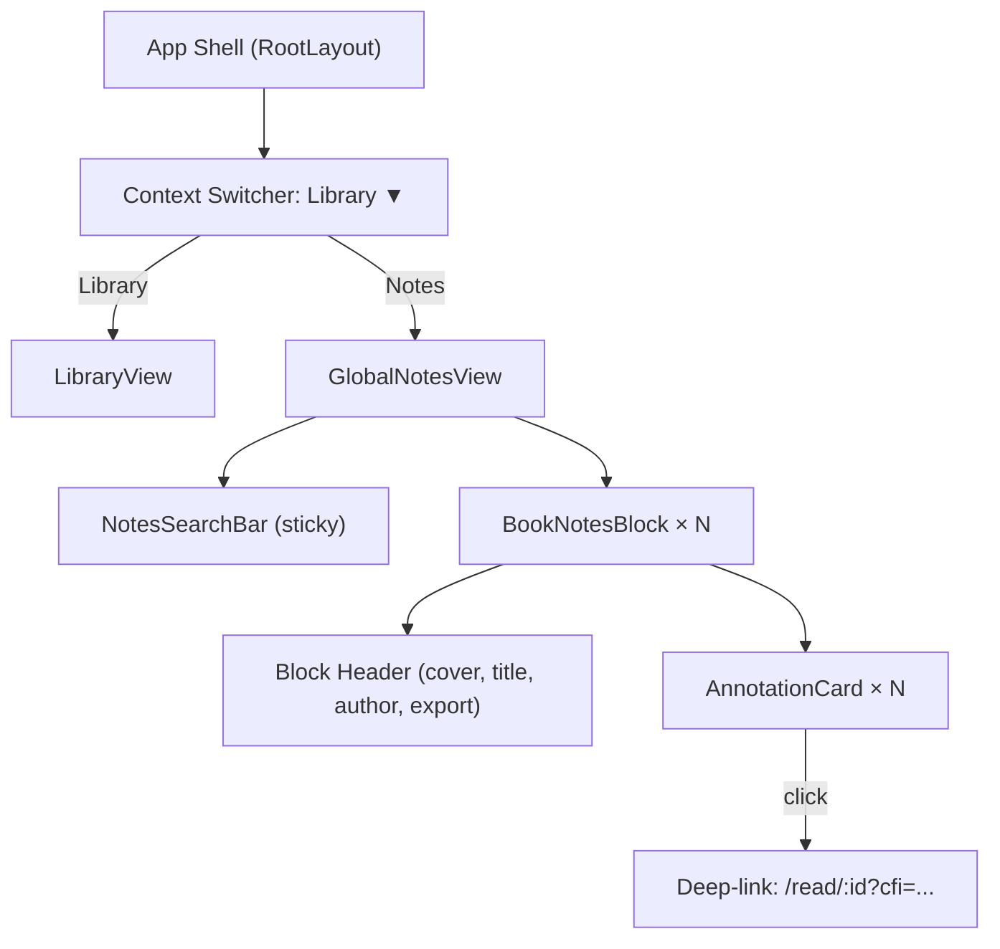

# Global Notes & Annotations — UX Specification

## 1. Information Architecture



---

## 2. Context Switcher

### Design

The static `<h1>My Library</h1>` in the `LibraryView` header is **not** modified. Instead, we introduce a **Context Switcher** at the page level — replacing the index route's content based on the user's selection.

**Pattern:** A `<Select>`-style dropdown rendered in the header area. Uses the existing `Select` / `SelectTrigger` / `SelectContent` UI primitives already in the codebase.

```
┌────────────────────────────────────────────────┐
│  Library ▼            [Grid/List] [⚙] [Import] │  ← Library mode
│  Notes ▼                                       │  ← Notes mode (actions change)
└────────────────────────────────────────────────┘
```

### Behavior
- Default: **Library**
- State stored in `usePreferencesStore` as `activeContext: 'library' | 'notes'` (synced via Yjs so the preference persists across sessions/devices)
- Switching context is instant (no route change, no page reload)
- Library-specific actions (Import, Grid/List, Sort, Filter) **hide** in Notes mode
- Notes-mode-specific actions (none for Phase 1) can be added later

> [!NOTE]
> We are **not** using URL-based routing for the context switch (e.g., `/notes`). The switch is purely component-level within the index route. This avoids complicating the router and keeps the Notes view feeling like a "lens" on the same data layer.

---

## 3. Global Notes View — Layout

### Three-Tier Hierarchy

```
┌─────────────────────────────────────────────────┐
│ 🔍 Search annotations...                    [×] │  Tier 1: Search (sticky)
├─────────────────────────────────────────────────┤
│ ┌─────┐                                        │
│ │cover│  The Great Gatsby — F. Scott Fitzgerald │  Tier 2: Book Block header
│ └─────┘                      [Export ↓]         │
│ ─ ─ ─ ─ ─ ─ ─ ─ ─ ─ ─ ─ ─ ─ ─ ─ ─ ─ ─ ─ ─ ─│
│ ┃ "So we beat on, boats against the current..." │  Tier 3: Annotation Card
│ ┃  📝 My note about this passage                │
│ ┃  Jan 15, 2026                                 │
│ ─ ─ ─ ─ ─ ─ ─ ─ ─ ─ ─ ─ ─ ─ ─ ─ ─ ─ ─ ─ ─ ─│
│ ┃ "In my younger and more vulnerable years..."  │
│ ┃  Dec 20, 2025                                 │
├─────────────────────────────────────────────────┤
│ ┌─────┐                                        │
│ │cover│  1984 — George Orwell                   │  Next Book Block
│ └─────┘                      [Export ↓]         │
│ ...                                             │
└─────────────────────────────────────────────────┘
```

---

## 4. Component Specifications

### 4.1 NotesSearchBar

| Property | Detail |
|----------|--------|
| Position | Sticky, below header, full-width within container |
| Icon | `Search` (lucide) left-aligned |
| Clear | `X` button appears when non-empty |
| Debounce | 300ms on input → drives `searchQuery` state |
| Placeholder | "Search annotations..." |
| Scope | Filters against `UserAnnotation.text` and `UserAnnotation.note` |

### 4.2 BookNotesBlock

| Property | Detail |
|----------|--------|
| Cover | 48×64px thumbnail from `StaticBookManifest.coverBlob` via Service Worker, or gradient from `UserInventoryItem.coverPalette` |
| Title | `UserInventoryItem.title` (or `StaticBookManifest.title` if hydrated) |
| Author | `UserInventoryItem.author` |
| Export | Text button "Export" with download icon. Generates Markdown. |
| Visual | Card-style with subtle border/shadow, `bg-card` background |
| Ghost fallback | If book deleted from inventory: show "Unknown Book" with neutral cover |

### 4.3 AnnotationCard

| Element | Styling |
|---------|---------|
| Highlight text | `text-muted-foreground`, `italic`, `border-l-2` with `borderColor: annotation.color` |
| Note (if present) | Below highlight, `text-foreground`, prefixed with `StickyNote` icon (lucide) |
| Date | `text-xs text-muted-foreground`, formatted as locale date |
| Hover state | Background highlight (`bg-accent/50`), action buttons fade in |
| Click | Navigates to `/read/{bookId}?cfi={encoded cfiRange}` |

### 4.4 Action Buttons (per AnnotationCard)

| Action | Desktop | Mobile |
|--------|---------|--------|
| Copy (Markdown) | Hover icon button | Ellipsis menu item |
| Edit Note | Hover icon button | Ellipsis menu item |
| Delete | Hover icon button (destructive) | Ellipsis menu item |

---

## 5. Empty & Error States

### Empty State (zero annotations)
```
┌─────────────────────────────────────────────────┐
│                                                 │
│         📖                                      │
│                                                 │
│   No annotations yet.                           │
│   Read a book and select text to create         │
│   highlights and notes.                         │
│                                                 │
└─────────────────────────────────────────────────┘
```

### Search — No Results
```
┌─────────────────────────────────────────────────┐
│ 🔍 "quantum mechanics"                      [×] │
│                                                 │
│   No annotations matching "quantum mechanics"   │
│   [Clear search]                                │
│                                                 │
└─────────────────────────────────────────────────┘
```

---

## 6. Responsive Behavior

| Breakpoint | Behavior |
|-----------|----------|
| Desktop (≥768px) | Book Block headers show cover + title on one line. Action buttons on hover. |
| Mobile (<768px) | Cover stacks above title. Actions via ellipsis `⋮` menu (long-press or tap). |

---

## 7. Accessibility

| Concern | Implementation |
|---------|---------------|
| Keyboard nav | Tab through blocks and cards. Enter to deep-link. |
| Screen reader | `aria-label` on search, cards, actions. Live region for search result count. |
| Focus management | After context switch, focus moves to search bar. |
| Color contrast | Left-border colors are decorative; text content meets WCAG AA. |
