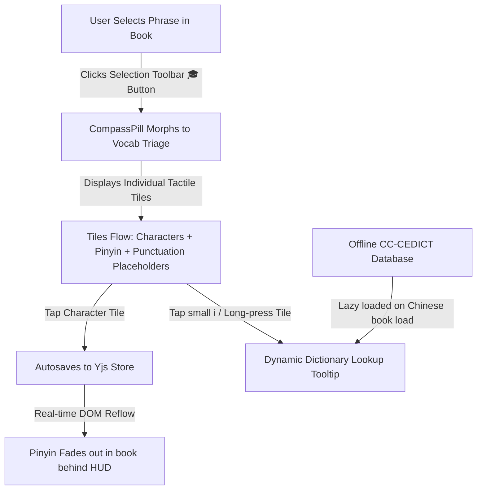

# Design Proposal: Smart Pinyin Filtering (Adaptive Vocabulary)

This design proposal outlines the product concept and technical implementation plan for introducing **Smart Pinyin Filtering (Adaptive Vocabulary)** in Versicle. This feature allows Chinese language learners to specify characters they already know, automatically filtering out redundant Pinyin annotations in the reader to reduce cognitive load and visual clutter.

---

## 1. Product Concept & User Experience (UX)

When learning Chinese, a static "Pinyin for all characters" toggle is helpful at the very beginning but quickly becomes a hindrance. Reading text covered in pinyin is mentally exhausting and prevents the eye from focusing on the actual characters.

**Smart Pinyin** bridges the gap between a complete beginner and a fluent reader by dynamically showing Pinyin *only* for characters the user has not yet learned.

### A. The Selection Toolbar Integration ("Precision Vocab Triage")
Selecting Chinese text on mobile or desktop is notoriously clumsy. Handles often expand to select whole words, phrases, or adjacent punctuation. Instead of forcing pixel-perfect selection handles, the user selects the *approximate* range, and we triage it:

1. **Approximate Selection**: The user highlights a word, phrase, or sentence (e.g. `"我们是朋友！"`).
2. **Toolbar Entry**: A new **"Mark as Known" 🎓** button appears in the standard selection popup. Tapping it morphs the bottom `CompassPill` HUD into the **Vocab Triage** card.
3. **Tactile Tiles**: The selected text is broken down into large, individually tappable character tiles inside the HUD.
4. **Layout Context (Punctuation Placeholders)**: Non-Chinese characters, spaces, and punctuation (like `！`, `。`, or `,`) are kept in the flow to preserve natural visual spacing and phrasing. However, they are rendered as non-clickable, disabled placeholder tiles.
5. **Autosave (Instant Sync)**: Tapping any Chinese character tile instantly toggles its "known" state. It saves to the globally synced CRDT store immediately, and the Pinyin above that character in the book fades out or in in real-time. No "Confirm" click is required.



### B. In-Context CC-CEDICT Dictionary Lookup
To ensure learners don't have to guess or check another tab, they can verify a character's meaning directly in the Vocab Triage card:
*   **On Mobile / Touch**: A small info indicator `[ⓘ]` sits next to or on the top corner of each character tile. Tapping `[ⓘ]` or long-pressing the character tile opens a contextual dictionary tooltip showing the offline translation from the **CC-CEDICT** database.
*   **On Desktop**: Hovering over a tile also triggers the quick contextual dictionary lookup tooltip.
*   **Compound Word Awareness**: When tapping a character tile like `[ 朋 ]` which is adjacent to `[ 友 ]` in the selection, the tooltip intelligently displays both the character's standalone definition and the compound word definition (`朋友` - *friend*) to enhance vocabulary comprehension.

### C. The "Character Vault" (Vocabulary Settings)
A dedicated settings tab where the user has full agency over their personal dictionary:
- **Search & Add**: A search input where users can type characters to manually add them to their known list.
- **Master List**: A grid view of all currently known characters, allowing bulk selection and deletion.
- **Vocabulary Stats**: Interactive graphs showing coverage: *"You know 1,240 characters. You can read 92.4% of this chapter without Pinyin assistance!"*

---

## 2. UI / UX Mockup & Wireframe

### A. Morphing Precision Card (Vocab Triage State)
When selecting `"我们是朋友！"`, the `CompassPill` morphs from a single `h-14` line into a larger interactive card:

```text
┌────────────────────────────────────────────────────────┐
│  SELECT KNOWN CHARACTERS                               [X]
│  Pinyin will be hidden for active selections.           
│                                                        
│  ┌─────────┐ ┌─────────┐ ┌─────────┐ ┌─────────┐ ┌───┐ 
│  │   wǒ  ⓘ │ │  men  ⓘ │ │  shì  ⓘ │ │  péng ⓘ │ │ ！│ 
│  │   我   │ │   们   │ │   是   │ │   朋   │ │   │ 
│  └─────────┘ └─────────┘ └─────────┘ └─────────┘ └───┘ 
│   [Known]     [Known]     (Active)   (Tap to)    (Punc)
│                                       (Know)           
│                                                        
│                                             [ Done ]   
└────────────────────────────────────────────────────────┘
```

### B. Reader Settings Integration
Surfaced inside the existing `VisualSettings.tsx` dialog when reading a Chinese book:
```text
┌──────────────────────────────────────────────┐
│  CHINESE READING ASSISTANCE                  │
│                                              │
│  [x] Show Pinyin                             │
│  Pinyin Size: ───[ 100% ]───                 │
│                                              │
│  SMART FILTERING                             │
│                                              │
│  Known Words: 1,482 characters  [Manage Vault]
└──────────────────────────────────────────────┘
```

---

## 3. Technical Architecture & Implementation Plan

The Versicle codebase already possesses a reactive state management framework (Zustand) and a synchronized CRDT system (Yjs). We can build on top of these to deliver a zero-latency, cross-device experience.

### Step 1: Create the Vocabulary Store (`useVocabularyStore.ts`)
We will create a new Zustand store backed by Yjs so that the user's learned characters sync instantly across their phone, tablet, and desktop:

```typescript
import { create } from 'zustand';
import yjs from 'zustand-middleware-yjs';
import { yDoc, getYjsOptions } from './yjs-provider';

export interface VocabularyState {
  // Key-value store of characters to preserve sync performance
  // Key: Chinese character (string)
  // Value: Timestamp added (number)
  knownCharacters: Record<string, number>;

  // Actions
  toggleKnownCharacter: (char: string) => void;
  markAsKnown: (char: string) => void;
  markAsUnknown: (char: string) => void;
  clearAll: () => void;
}

export const useVocabularyStore = create<VocabularyState>()(
  yjs(
    yDoc,
    'vocabulary',
    (set) => ({
      knownCharacters: {},

      toggleKnownCharacter: (char) => set((state) => {
        if (state.knownCharacters[char]) {
          const { [char]: _, ...remaining } = state.knownCharacters;
          return { knownCharacters: remaining };
        } else {
          return {
            knownCharacters: {
              ...state.knownCharacters,
              [char]: Date.now()
            }
          };
        }
      }),

      markAsKnown: (char) => set((state) => ({
        knownCharacters: { ...state.knownCharacters, [char]: Date.now() }
      })),

      markAsUnknown: (char) => set((state) => {
        const { [char]: _, ...remaining } = state.knownCharacters;
        return { knownCharacters: remaining };
      }),

      clearAll: () => set({ knownCharacters: {} })
    }),
    getYjsOptions()
  )
);
```

### Step 2: Lazy Loaded CC-CEDICT Dictionary Integration
To avoid slowing down initial load or bloating the frontend bundle, the CC-CEDICT dictionary will be dynamically fetched on demand:

1. **Pre-Processing Compilation**: A simple pre-processor script will compile the raw CC-CEDICT text file into a highly optimized, key-value lookup JSON map:
   ```json
   {
     "我": ["wǒ", "I/me"],
     "朋友": ["péng you", "friend/companion"]
   }
   ```
   This drops the raw 9MB file size to under 4MB, which compresses to **~1.3MB** over the wire using gzip/brotli.
2. **Static Asset Hosting**: We place the compiled dictionary at `public/dict/cedict.json`.
3. **On-Demand Loading Hook (`useChineseDictionary`)**:
   We will create a custom React hook that triggers strictly when a Chinese book is opened:
   ```typescript
   export function useChineseDictionary(isChineseBook: boolean) {
     const [dict, setDict] = useState<Record<string, [string, string]> | null>(null);
     const [loading, setLoading] = useState(false);

     useEffect(() => {
       if (!isChineseBook || dict || loading) return;

       setLoading(true);
       fetch('/dict/cedict.json')
         .then(res => res.json())
         .then(data => {
           setDict(data);
           setLoading(false);
         })
         .catch(err => {
           console.error("Failed to load Chinese dictionary", err);
           setLoading(false);
         });
     }, [isChineseBook]);

     return { dict, loading };
   }
   ```
4. **Offline Caching**: The browser will automatically cache the dictionary locally in its network/disk cache, ensuring subsequent lookups are instant and completely offline.

### Step 3: Inject Filtering into the Visual Rendering Pipeline (`useEpubReader.ts`)
The `useEpubReader` hook calculates character geometries dynamically. We will update the layout generator to fetch the vocabulary state and skip generating Pinyin positions for known characters:

```diff
// src/hooks/useEpubReader.ts

+ import { useVocabularyStore } from '../store/useVocabularyStore';

...

         // Process Chinese text without corrupting DOM structure
         const processChineseContent = async (contents: any) => {
           const doc = contents.document;
           if (!doc) return;

           const prefs = usePreferencesStore.getState();
+          const vocab = useVocabularyStore.getState();
           const bookLang = bookId ? useBookStore.getState().books[bookId]?.language || 'en' : 'en';

           if (bookLang !== 'zh') {
             if (optionsRef.current.onPinyinPositionsUpdate) optionsRef.current.onPinyinPositionsUpdate([]);
             return;
           }

...

             // 3. Handle Pinyin (Ephemeral Geometry Collection)
             if (prefs.showPinyin) {
               const currentText = textNode.nodeValue || '';
               const pinyinArray = getPinyin(currentText);

               for (let i = 0; i < currentText.length; i++) {
                 const char = currentText[i];
+                const isKnown = !!vocab.knownCharacters[char];
+
+                if (isKnown) continue; // Skip rendering pinyin for this character!

                 if (/[\u4e00-\u9fff]/.test(char) && pinyinArray[i]) {
                   try {
                     const range = doc.createRange();
                     range.setStart(textNode, i);
                     range.setEnd(textNode, i + 1);
```

### Step 4: Ensure Real-Time Reactive Re-renders
To ensure the reader updates instantly when a word is marked as known, we add `vocab.knownCharacters` to the `useEpubReader` dependencies. This forces a recalculation of active Pinyin coordinates:

```diff
// src/hooks/useEpubReader.ts

  useEffect(() => {
    if (!renditionRef.current || !isReady) return;

    // Trigger overlay re-injection on all currently loaded views
    (renditionRef.current as any).getContents().forEach((contents: any) => {
      processChineseContentRef.current(contents);
    });
- }, [isReady, forceTraditionalChinese, showPinyin, pinyinSize]);
+ }, [
+   isReady, 
+   forceTraditionalChinese, 
+   showPinyin, 
+   pinyinSize,
+   useVocabularyStore(state => state.knownCharacters)
+ ]);
```

---

## 4. Future Scope (Deferred Features)

### A. Bulk Onboarding (HSK & Frequency Presets)
Manually tapping thousands of individual basic characters (like 我, 你, 是, 好) is tedious. In future revisions, we can offer two bulk filtering selectors in the Chinese Reading Settings:
1. **HSK Level Filter**: A slider or selector targeting HSK Levels 1 to 6. Selecting "Hide HSK 1-3" instantly filters out pinyin for the ~600 most basic characters.
2. **Frequency-based Filter**: A slider targeting the Top N Most Frequent Characters (e.g. Hide top 500, 1000, 2000, 3000 characters).

---

## 5. Why This Architecture is Elegant & Premium

1. **Zero DOM Pollution**: We do not inject custom `<ruby>` tags or complex HTML node overlays that corrupt epub.js CFI mapping. The layout is calculated cleanly from the existing text node coordinates, and coordinates for skipped words are simply omitted.
2. **Instant Sync via CRDTs**: Using Yjs maps guarantees that marking "我" as known on an iPad immediately removes its Pinyin annotation on the user's MacBook or Android reader in real-time.
3. **High Performance**: Geometry calculations only run for visible text blocks. The lookup time for known characters is $O(1)$ due to JS object property hashing, ensuring 60fps scrolling and frame rates are untouched.
4. **Gradual Mastery**: Users get a gamified, beautiful reading experience that scales organically with their personal language journey.
